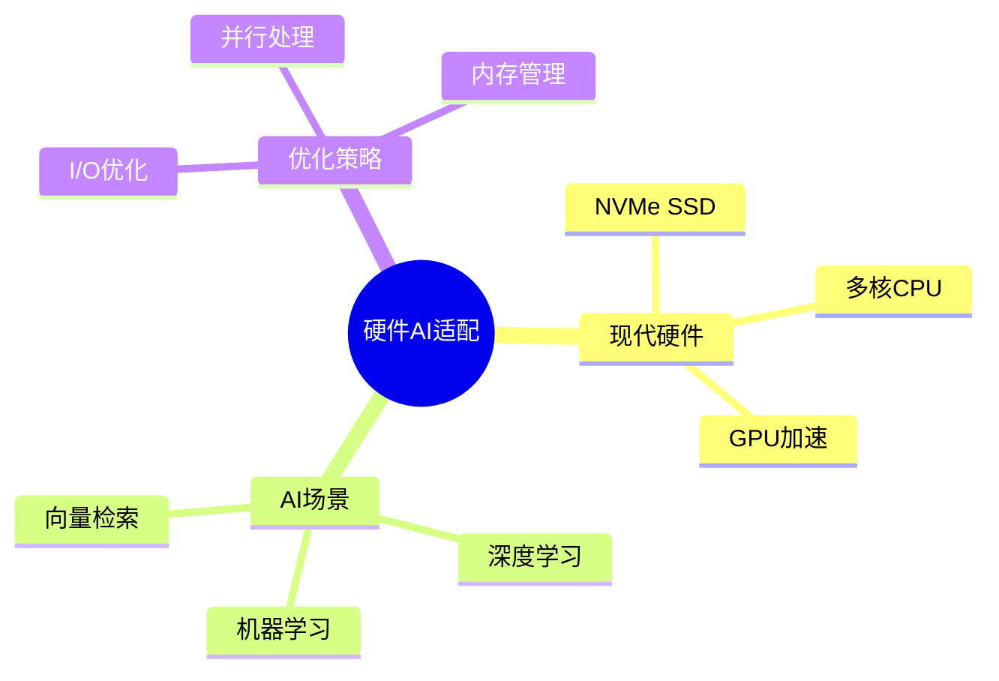

# PostgreSQL系统设计与现代硬件AI场景适配性分析

> **文档版本**: v1.0
> **最后更新**: 2025-01-16
> **版本覆盖**: PostgreSQL 18.x (推荐) ⭐ | 17.x (推荐) | 16.x (兼容)
> **文档状态**: 🟡 框架已创建，内容待完善

---

## 📋 目录

- [PostgreSQL系统设计与现代硬件AI场景适配性分析](#postgresql系统设计与现代硬件ai场景适配性分析)
  - [📋 目录](#-目录)
  - [1. 概述](#1-概述)
    - [1.1 本文档的范围](#11-本文档的范围)
  - [2. 核心内容](#2-核心内容)
  - [3. 形式化定义](#3-形式化定义)
  - [4. 实际应用](#4-实际应用)
  - [5. 相关文档](#5-相关文档)
    - [5.1 理论基础文档](#51-理论基础文档)
  - [6. 参考文献](#6-参考文献)

---

## 1. 概述

### 1.0 PostgreSQL系统设计与现代硬件AI场景适配性工作原理概述

**硬件适配**：

PostgreSQL通过优化适配现代硬件（NVMe SSD、多核CPU）和AI场景（向量检索、ML集成）。

**适配性分析思维导图**：



### 1.1 本文档的范围

本文档涵盖：

- **硬件适配**：NVMe SSD、多核CPU优化
- **AI场景**：向量检索、ML集成
- **实际应用**：PostgreSQL优化实践

---

## 2. 核心内容

### 2.1 硬件适配

**硬件优化**：

| 硬件 | 优化策略 | 效果 |
|------|---------|------|
| **NVMe SSD** | 异步I/O、预读 | 高吞吐 |
| **多核CPU** | 并行查询 | 高性能 |
| **GPU** | 向量计算 | 加速 |

### 2.2 AI场景

**AI集成**：

- **pgvector**：向量检索
- **pgml**：机器学习
- **PostGIS**：空间分析

---

## 3. 形式化定义

### 3.1 适配性形式化

**适配性**：

```haskell
-- 适配性形式化
adaptability(system, hardware, scenario) =
    performance(system, hardware, scenario) / baseline
```

---

## 4. 实际应用

### 4.1 硬件优化

**配置优化**：

```sql
-- NVMe优化
SET effective_io_concurrency = 200;

-- 并行查询
SET max_parallel_workers_per_gather = 4;
```

---

## 5. 相关文档

### 5.1 理论基础文档

- [形式语言与证明：总论](./1.1.25-形式语言与证明-总论.md)
- [理论基础导航](./README.md)

---

## 6. 参考文献

[待补充]

---

**最后更新**: 2025-01-16
**维护者**: Documentation Team
**状态**: 🟡 框架已创建，内容待完善
