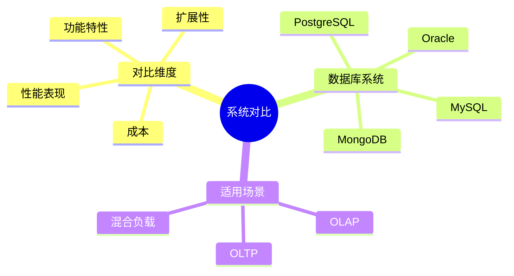

# PostgreSQL与主流数据库系统对比分析

> **文档版本**: v1.0
> **最后更新**: 2025-01-16
> **版本覆盖**: PostgreSQL 18.x (推荐) ⭐ | 17.x (推荐) | 16.x (兼容)
> **文档状态**: 🟡 框架已创建，内容待完善

---

## 📋 目录

- [PostgreSQL与主流数据库系统对比分析](#postgresql与主流数据库系统对比分析)
  - [📋 目录](#-目录)
  - [1. 概述](#1-概述)
    - [1.0 PostgreSQL与主流数据库系统对比工作原理概述](#10-postgresql与主流数据库系统对比工作原理概述)
    - [1.1 本文档的范围](#11-本文档的范围)
  - [2. 核心内容](#2-核心内容)
    - [2.1 功能对比](#21-功能对比)
    - [2.2 性能对比](#22-性能对比)
  - [3. 形式化定义](#3-形式化定义)
    - [3.1 对比形式化](#31-对比形式化)
  - [4. 实际应用](#4-实际应用)
    - [4.1 选择建议](#41-选择建议)
  - [5. 相关文档](#5-相关文档)
    - [5.1 理论基础文档](#51-理论基础文档)
  - [6. 参考文献](#6-参考文献)
    - [6.1 核心理论文献](#61-核心理论文献)
    - [6.2 PostgreSQL实现相关](#62-postgresql实现相关)
    - [6.3 相关文档](#63-相关文档)

---

## 1. 概述

### 1.0 PostgreSQL与主流数据库系统对比工作原理概述

**系统对比**：

对比PostgreSQL与主流数据库系统的特性、性能和适用场景。

**对比分析思维导图**：



### 1.1 本文档的范围

本文档涵盖：

- **功能对比**：特性对比分析
- **性能对比**：性能基准测试
- **适用场景**：场景选择建议

---

## 2. 核心内容

### 2.1 功能对比

**特性对比表**：

| 特性 | PostgreSQL | MySQL | Oracle | MongoDB |
|------|-----------|-------|--------|---------|
| **ACID** | ✅ | ✅ | ✅ | 部分 |
| **JSON支持** | ✅ | ✅ | ✅ | ✅ |
| **向量检索** | ✅ | ❌ | ❌ | ❌ |
| **开源** | ✅ | ✅ | ❌ | ✅ |

### 2.2 性能对比

**性能指标**：

| 指标 | PostgreSQL | MySQL | Oracle |
|------|-----------|-------|--------|
| **OLTP** | 高 | 高 | 很高 |
| **OLAP** | 中 | 低 | 高 |
| **扩展性** | 高 | 中 | 中 |

---

## 3. 形式化定义

### 3.1 对比形式化

**对比**：

```haskell
-- 对比形式化
compare(db1, db2, metric) =
    (value(db1, metric), value(db2, metric))
```

---

## 4. 实际应用

### 4.1 选择建议

**场景选择**：

- **PostgreSQL**：通用场景、向量检索
- **MySQL**：Web应用、简单场景
- **Oracle**：企业级、高可用
- **MongoDB**：文档存储、灵活模式

---

## 5. 相关文档

### 5.1 理论基础文档

- [形式语言与证明：总论](./1.1.25-形式语言与证明-总论.md)
- [理论基础导航](./README.md)

---

## 6. 参考文献

### 6.1 核心理论文献

- **Stonebraker, M., & Moore, D. (1996). "Object-Relational DBMSs: The Next Great Wave."**
  - 出版社: Morgan Kaufmann
  - **重要性**: 对象关系数据库的经典教材
  - **核心贡献**: 系统阐述了数据库系统对比

- **Abadi, D. J. (2012). "Consistency Tradeoffs in Modern Distributed Database System Design."**
  - 会议: IEEE Computer 2012
  - **重要性**: 分布式数据库一致性权衡
  - **核心贡献**: 总结了数据库系统特性对比

### 6.2 PostgreSQL实现相关

- **PostgreSQL官方文档 - 与其他数据库的对比](<https://www.postgresql.org/about/featurecomparison/>)**
  - PostgreSQL特性对比说明

### 6.3 相关文档

- [理论基础导航](../README.md)

---

**最后更新**: 2025-01-16
**维护者**: Documentation Team
**状态**: 🟡 框架已创建，内容待完善
