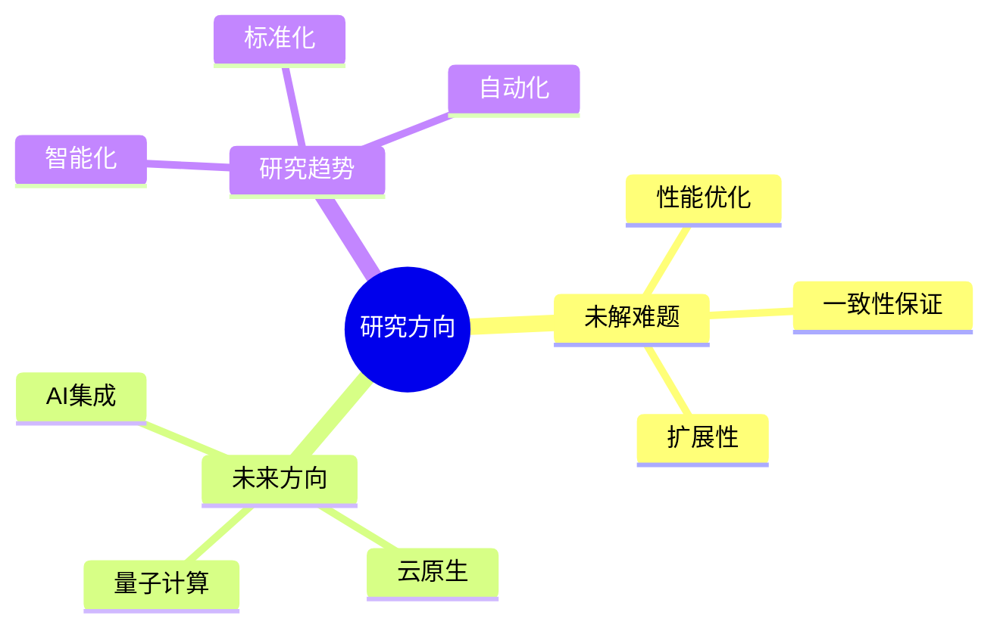

# 未解难题与未来研究方向

> **文档版本**: v1.0
> **最后更新**: 2025-01-16
> **版本覆盖**: PostgreSQL 18.x (推荐) ⭐ | 17.x (推荐) | 16.x (兼容)
> **文档状态**: 🟡 框架已创建，内容待完善

---

## 📋 目录

- [未解难题与未来研究方向](#未解难题与未来研究方向)
  - [📋 目录](#-目录)
  - [1. 概述](#1-概述)
    - [1.0 未解难题与未来研究方向工作原理概述](#10-未解难题与未来研究方向工作原理概述)
    - [1.1 本文档的范围](#11-本文档的范围)
  - [2. 核心内容](#2-核心内容)
    - [2.1 未解难题](#21-未解难题)
    - [2.2 未来方向](#22-未来方向)
  - [3. 形式化定义](#3-形式化定义)
    - [3.1 研究方向形式化](#31-研究方向形式化)
  - [4. 实际应用](#4-实际应用)
    - [4.1 研究实践](#41-研究实践)
  - [5. 相关文档](#5-相关文档)
    - [5.1 理论基础文档](#51-理论基础文档)
  - [6. 参考文献](#6-参考文献)
    - [6.1 核心理论文献](#61-核心理论文献)
    - [6.2 PostgreSQL实现相关](#62-postgresql实现相关)
    - [6.3 相关文档](#63-相关文档)

---

## 1. 概述

### 1.0 未解难题与未来研究方向工作原理概述

**未解难题**：

总结PostgreSQL领域尚未解决的难题和未来研究方向。

**研究方向思维导图**：



### 1.1 本文档的范围

本文档涵盖：

- **未解难题**：当前面临的挑战
- **未来方向**：研究方向和发展趋势
- **研究趋势**：技术发展趋势

---

## 2. 核心内容

### 2.1 未解难题

**主要挑战**：

| 难题 | 描述 | 影响 |
|------|------|------|
| **分布式一致性** | 大规模分布式一致性 | 高 |
| **查询优化** | 复杂查询优化 | 中 |
| **存储效率** | 大数据存储优化 | 中 |

### 2.2 未来方向

**研究方向**：

1. **AI集成**：智能查询优化
2. **云原生**：容器化、微服务
3. **量子计算**：量子数据库

---

## 3. 形式化定义

### 3.1 研究方向形式化

**研究方向**：

```haskell
-- 研究方向形式化
ResearchDirection = (P, T, G)
where
    P = problem set
    T = technology set
    G = goal set
```

---

## 4. 实际应用

### 4.1 研究实践

**研究项目**：

- **智能优化器**：AI驱动的查询优化
- **云原生架构**：Kubernetes集成
- **向量数据库**：pgvector扩展

---

## 5. 相关文档

### 5.1 理论基础文档

- [形式语言与证明：总论](./1.1.25-形式语言与证明-总论.md)
- [理论基础导航](./README.md)

---

## 6. 参考文献

### 6.1 核心理论文献

- **Stonebraker, M., et al. (2010). "The 2010 SIGMOD Record Survey of Database Research."**
  - 会议: SIGMOD Record 2010
  - **重要性**: 数据库研究方向的综述
  - **核心贡献**: 总结了未解难题和研究方向

- **Abadi, D. J., et al. (2016). "The Design and Implementation of Modern Column-Oriented Database Systems."**
  - 会议: Foundations and Trends in Databases 2016
  - **重要性**: 现代数据库系统设计
  - **核心贡献**: 阐述了未来发展方向

### 6.2 PostgreSQL实现相关

- **PostgreSQL开发路线图](<https://wiki.postgresql.org/wiki/Development_Roadmap>)**
  - PostgreSQL开发路线图

### 6.3 相关文档

- [理论基础导航](../README.md)

---

**最后更新**: 2025-01-16
**维护者**: Documentation Team
**状态**: 🟡 框架已创建，内容待完善
