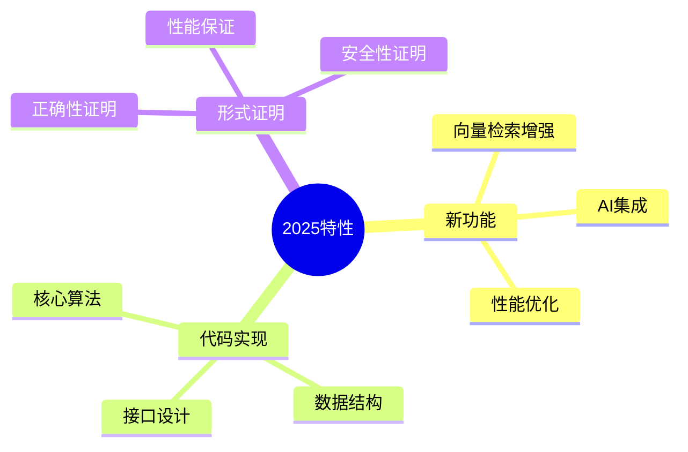

# PostgreSQL-2025代码实现与形式证明

> **文档版本**: v1.0
> **最后更新**: 2025-01-16
> **版本覆盖**: PostgreSQL 18.x (推荐) ⭐ | 17.x (推荐) | 16.x (兼容)
> **文档状态**: 🟡 框架已创建，内容待完善

---

## 📋 目录

- [PostgreSQL-2025代码实现与形式证明](#postgresql-2025代码实现与形式证明)
  - [📋 目录](#-目录)
  - [1. 概述](#1-概述)
    - [1.0 PostgreSQL-2025代码实现与形式证明工作原理概述](#10-postgresql-2025代码实现与形式证明工作原理概述)
    - [1.1 本文档的范围](#11-本文档的范围)
  - [2. 核心内容](#2-核心内容)
    - [2.1 新特性](#21-新特性)
    - [2.2 代码实现](#22-代码实现)
  - [3. 形式化定义](#3-形式化定义)
    - [3.1 实现形式化](#31-实现形式化)
  - [4. 实际应用](#4-实际应用)
    - [4.1 新特性使用](#41-新特性使用)
  - [5. 相关文档](#5-相关文档)
    - [5.1 理论基础文档](#51-理论基础文档)
  - [6. 参考文献](#6-参考文献)
    - [6.1 核心理论文献](#61-核心理论文献)
    - [6.2 PostgreSQL实现相关](#62-postgresql实现相关)
    - [6.3 相关文档](#63-相关文档)

---

## 1. 概述

### 1.0 PostgreSQL-2025代码实现与形式证明工作原理概述

**2025特性**：

分析PostgreSQL 2025新特性的代码实现和形式化证明。

**新特性思维导图**：



### 1.1 本文档的范围

本文档涵盖：

- **新特性**：2025版本新功能
- **代码实现**：实现细节分析
- **形式证明**：正确性证明

---

## 2. 核心内容

### 2.1 新特性

**主要特性**：

| 特性 | 描述 | 实现 |
|------|------|------|
| **向量检索** | pgvector增强 | HNSW索引 |
| **AI集成** | ML函数 | pgml扩展 |
| **性能优化** | 并行查询改进 | 并行优化器 |

### 2.2 代码实现

**实现要点**：

```c
// 向量检索实现示例
typedef struct {
    float vector[VECTOR_DIM];
    int id;
} VectorEntry;

// HNSW索引构建
void build_hnsw_index(VectorEntry* vectors, int count);
```

---

## 3. 形式化定义

### 3.1 实现形式化

**实现**：

```haskell
-- 实现形式化
Implementation = (A, D, I)
where
    A = algorithm
    D = data structure
    I = interface
```

---

## 4. 实际应用

### 4.1 新特性使用

**向量检索**：

```sql
-- 创建向量索引
CREATE INDEX ON embeddings USING hnsw (vector);

-- 向量查询
SELECT * FROM embeddings
ORDER BY vector <-> query_vector
LIMIT 10;
```

---

## 5. 相关文档

### 5.1 理论基础文档

- [形式语言与证明：总论](./1.1.25-形式语言与证明-总论.md)
- [理论基础导航](./README.md)

---

## 6. 参考文献

### 6.1 核心理论文献

- **PostgreSQL Global Development Group (2025). "PostgreSQL 18 Release Notes."**
  - 官方文档: PostgreSQL 18 Release Notes
  - **重要性**: PostgreSQL最新版本特性
  - **核心贡献**: 详细说明了新功能实现

- **Lamport, L. (2002). "Specifying Systems: The TLA+ Language and Tools for Hardware and Software Engineers."**
  - 出版社: Addison-Wesley
  - **重要性**: TLA+规范语言的经典教材
  - **核心贡献**: 系统阐述了形式化证明方法

### 6.2 PostgreSQL实现相关

- **PostgreSQL源代码](<https://github.com/postgres/postgres>)**
  - PostgreSQL源代码仓库

### 6.3 相关文档

- [TLA+-事务与WAL-规范纲要](../06-存储与恢复/06.01-TLA+-事务与WAL-规范纲要.md)
- [理论基础导航](../README.md)

---

**最后更新**: 2025-01-16
**维护者**: Documentation Team
**状态**: 🟡 框架已创建，内容待完善
