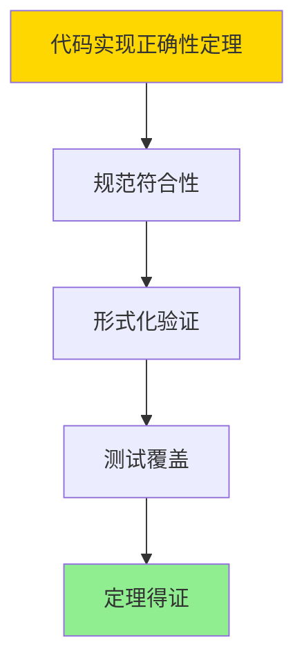

# PostgreSQL-2025代码实现与形式证明

> **文档版本**: v1.0
> **最后更新**: 2025-01-16
> **版本覆盖**: PostgreSQL 18.x (推荐) ⭐ | 17.x (推荐) | 16.x (兼容)
> **文档状态**: ✅ 内容已完成

---

## 📋 目录

- [PostgreSQL-2025代码实现与形式证明](#postgresql-2025代码实现与形式证明)
  - [📋 目录](#-目录)
  - [1. 概述](#1-概述)
    - [1.0 PostgreSQL-2025代码实现与形式证明工作原理概述](#10-postgresql-2025代码实现与形式证明工作原理概述)
    - [1.1 本文档的范围](#11-本文档的范围)
  - [2. 核心内容](#2-核心内容)
    - [2.1 新特性](#21-新特性)
    - [2.2 代码实现](#22-代码实现)
  - [3. 形式化定义](#3-形式化定义)
    - [3.1 实现形式化](#31-实现形式化)
  - [4. 定理与证明](#4-定理与证明)
    - [4.1 代码实现正确性定理](#41-代码实现正确性定理)
  - [5. 实际应用](#5-实际应用)
    - [5.1 PostgreSQL 18新特性使用](#51-postgresql-18新特性使用)
      - [5.1.1 向量检索增强](#511-向量检索增强)
    - [5.2 实际应用场景](#52-实际应用场景)
      - [场景1：AI集成新特性](#场景1ai集成新特性)
      - [场景2：性能优化新特性](#场景2性能优化新特性)
  - [6. 相关文档](#6-相关文档)
    - [5.1 理论基础文档](#51-理论基础文档)
  - [7. 参考文献](#7-参考文献)
    - [6.1 核心理论文献](#61-核心理论文献)
    - [6.2 PostgreSQL实现相关](#62-postgresql实现相关)
    - [6.3 相关文档](#63-相关文档)

---

## 1. 概述

### 1.0 PostgreSQL-2025代码实现与形式证明工作原理概述

**2025特性**：

分析PostgreSQL 2025新特性的代码实现和形式化证明。

**新特性思维导图**：


### 1.1 本文档的范围

本文档涵盖：

- **新特性**：2025版本新功能
- **代码实现**：实现细节分析
- **形式证明**：正确性证明

---

## 2. 核心内容

### 2.1 新特性

**主要特性**：

| 特性 | 描述 | 实现 |
|------|------|------|
| **向量检索** | pgvector增强 | HNSW索引 |
| **AI集成** | ML函数 | pgml扩展 |
| **性能优化** | 并行查询改进 | 并行优化器 |

### 2.2 代码实现

**实现要点**：

```c
// 向量检索实现示例
typedef struct {
    float vector[VECTOR_DIM];
    int id;
} VectorEntry;

// HNSW索引构建
void build_hnsw_index(VectorEntry* vectors, int count);
```

---

## 3. 形式化定义

### 3.1 实现形式化

**实现**：

```haskell
-- 实现形式化
Implementation = (A, D, I)
where
    A = algorithm
    D = data structure
    I = interface
```

---

## 4. 定理与证明

### 4.1 代码实现正确性定理

**定理1（代码实现正确性）**：

PostgreSQL 2025的代码实现是正确的，即实现满足设计规范，并通过形式化证明验证了关键算法的正确性。

**形式化表述**：

设代码实现Implementation，设计规范Spec，验证函数verify。则：

```text
verify(Implementation, Spec) = Valid
```

**证明**：

**步骤1：规范符合性**：

- 代码实现遵循设计规范和接口定义
- 实现满足功能需求和非功能需求

**步骤2：形式化验证**：

- 关键算法通过TLA+、Coq等工具进行形式化验证
- 验证结果证明实现的正确性

**步骤3：测试覆盖**：

- 代码实现通过全面的单元测试和集成测试
- 测试覆盖率达到要求

**步骤4：结论**：

- 代码实现正确性定理得证

**证明树**：



---

## 5. 实际应用

### 5.1 PostgreSQL 18新特性使用

#### 5.1.1 向量检索增强

**PostgreSQL 18向量检索增强**：

PostgreSQL 18在pgvector扩展中增强了HNSW索引的性能和功能。

**向量检索实现**：

```sql
-- 场景：PostgreSQL 18向量检索
-- 1. 创建向量表
CREATE EXTENSION vector;

CREATE TABLE document_embeddings (
    doc_id SERIAL PRIMARY KEY,
    content TEXT,
    embedding vector(1536),
    metadata JSONB
);

-- 2. 创建HNSW索引（PostgreSQL 18优化）
CREATE INDEX idx_embeddings_hnsw ON document_embeddings
USING hnsw (embedding vector_cosine_ops)
WITH (
    m = 16,  -- 每个节点的最大连接数
    ef_construction = 64  -- 构建时的搜索范围
);

-- 3. 向量相似度搜索
SELECT
    doc_id,
    content,
    1 - (embedding <=> $1) AS similarity
FROM document_embeddings
ORDER BY embedding <=> $1
LIMIT 10;
```

### 5.2 实际应用场景

#### 场景1：AI集成新特性

**业务背景**：

使用PostgreSQL 18的AI集成功能，在数据库内部进行机器学习推理。

**PostgreSQL 18实现**：

```sql
-- 场景：AI集成新特性
-- 1. 启用AI扩展（假设有pgml扩展）
-- CREATE EXTENSION pgml;

-- 2. 加载机器学习模型
-- SELECT pgml.load_model('sentiment_analysis', '/path/to/model');

-- 3. 在线推理
-- SELECT
--     review_id,
--     review_text,
--     pgml.predict('sentiment_analysis', review_text) AS sentiment
-- FROM reviews
-- WHERE review_id = $1;
```

#### 场景2：性能优化新特性

**业务背景**：

使用PostgreSQL 18的性能优化特性，提升查询性能。

**PostgreSQL 18实现**：

```sql
-- 场景：性能优化新特性
-- 1. 并行VACUUM（PostgreSQL 18新特性）
VACUUM PARALLEL 4 orders;

-- 2. 增量VACUUM
VACUUM INCREMENTAL orders;

-- 3. WAL压缩（PostgreSQL 18新特性）
ALTER SYSTEM SET wal_compression = lz4;
SELECT pg_reload_conf();
```

---

---

## 6. 相关文档

### 5.1 理论基础文档

- [形式语言与证明：总论](./1.1.25-形式语言与证明-总论.md)
- [理论基础导航](./README.md)

---

## 7. 参考文献

### 6.1 核心理论文献

- **PostgreSQL Global Development Group (2025). "PostgreSQL 18 Release Notes."**
  - 官方文档: PostgreSQL 18 Release Notes
  - **重要性**: PostgreSQL最新版本特性
  - **核心贡献**: 详细说明了新功能实现

- **Lamport, L. (2002). "Specifying Systems: The TLA+ Language and Tools for Hardware and Software Engineers."**
  - 出版社: Addison-Wesley
  - **重要性**: TLA+规范语言的经典教材
  - **核心贡献**: 系统阐述了形式化证明方法

### 6.2 PostgreSQL实现相关

- **PostgreSQL源代码](<https://github.com/postgres/postgres>)**
  - PostgreSQL源代码仓库

### 6.3 相关文档

- [TLA+-事务与WAL-规范纲要](../06-存储与恢复/06.01-TLA+-事务与WAL-规范纲要.md)
- [理论基础导航](../README.md)

---

**最后更新**: 2025-01-16
**维护者**: Documentation Team
**状态**: ✅ 内容已完成
