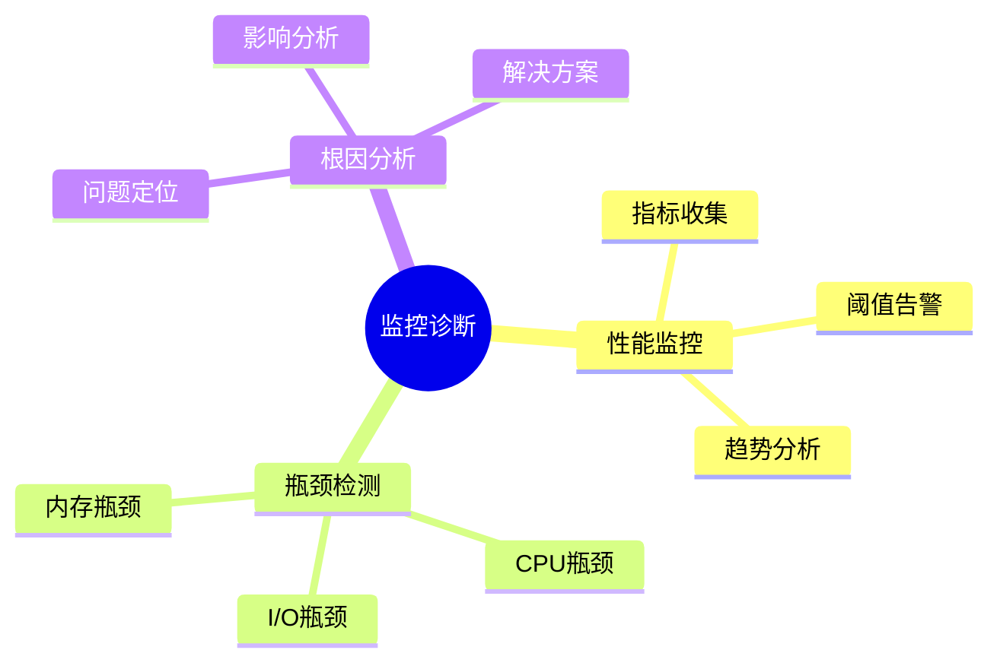

# 数据库监控与诊断-性能瓶颈检测与根因分析

> **文档版本**: v1.0
> **最后更新**: 2025-01-16
> **版本覆盖**: PostgreSQL 18.x (推荐) ⭐ | 17.x (推荐) | 16.x (兼容)
> **文档状态**: 🟡 框架已创建，内容待完善

---

## 📋 目录

- [数据库监控与诊断-性能瓶颈检测与根因分析](#数据库监控与诊断-性能瓶颈检测与根因分析)
  - [📋 目录](#-目录)
  - [1. 概述](#1-概述)
    - [1.0 数据库监控与诊断工作原理概述](#10-数据库监控与诊断工作原理概述)
    - [1.1 本文档的范围](#11-本文档的范围)
  - [2. 核心内容](#2-核心内容)
    - [2.1 性能监控](#21-性能监控)
    - [2.2 瓶颈检测](#22-瓶颈检测)
  - [3. 形式化定义](#3-形式化定义)
    - [3.1 监控形式化](#31-监控形式化)
  - [4. 实际应用](#4-实际应用)
    - [4.1 监控工具](#41-监控工具)
  - [5. 相关文档](#5-相关文档)
    - [5.1 理论基础文档](#51-理论基础文档)
  - [6. 参考文献](#6-参考文献)
    - [6.1 核心理论文献](#61-核心理论文献)
    - [6.2 PostgreSQL实现相关](#62-postgresql实现相关)
    - [6.3 相关文档](#63-相关文档)

---

## 1. 概述

### 1.0 数据库监控与诊断工作原理概述

**监控诊断**：

数据库监控通过性能瓶颈检测和根因分析来诊断系统问题。

**监控诊断思维导图**：



### 1.1 本文档的范围

本文档涵盖：

- **性能监控**：指标收集和分析
- **瓶颈检测**：性能瓶颈识别
- **根因分析**：问题诊断方法

---

## 2. 核心内容

### 2.1 性能监控

**关键指标**：

| 指标 | 定义 | 阈值 |
|------|------|------|
| **CPU使用率** | CPU占用百分比 | >80% |
| **I/O等待** | I/O等待时间 | >100ms |
| **内存使用** | 内存占用 | >90% |

### 2.2 瓶颈检测

**检测算法**：

```haskell
-- 瓶颈检测
detectBottleneck :: Metrics -> Maybe Bottleneck
detectBottleneck metrics
    | cpuUsage metrics > 0.8 = Just CPUBottleneck
    | ioWait metrics > 100 = Just IOBottleneck
    | memoryUsage metrics > 0.9 = Just MemoryBottleneck
    | otherwise = Nothing
```

---

## 3. 形式化定义

### 3.1 监控形式化

**监控**：

```haskell
-- 监控形式化
Monitor = (M, T, A)
where
    M = metrics set
    T = threshold set
    A = alert function
```

---

## 4. 实际应用

### 4.1 监控工具

**PostgreSQL监控**：

```sql
-- 查看慢查询
SELECT * FROM pg_stat_statements
ORDER BY total_exec_time DESC
LIMIT 10;

-- 查看等待事件
SELECT * FROM pg_stat_activity
WHERE wait_event_type IS NOT NULL;
```

---

## 5. 相关文档

### 5.1 理论基础文档

- [形式语言与证明：总论](./1.1.25-形式语言与证明-总论.md)
- [理论基础导航](./README.md)

---

## 6. 参考文献

### 6.1 核心理论文献

- **Charity, M., et al. (2021). "Observability Engineering: Achieving Production Excellence."**
  - 出版社: O'Reilly Media
  - **重要性**: 可观测性工程的经典教材
  - **核心贡献**: 系统阐述了监控和诊断方法

- **Dean, J., & Barroso, L. A. (2013). "The Tail at Scale."**
  - 会议: Communications of the ACM 2013
  - **重要性**: 大规模系统性能分析
  - **核心贡献**: 提出了瓶颈检测方法

### 6.2 PostgreSQL实现相关

- **PostgreSQL官方文档 - 监控](<https://www.postgresql.org/docs/current/monitoring.html>)**
  - PostgreSQL监控说明

### 6.3 相关文档

- [理论基础导航](../README.md)

---

**最后更新**: 2025-01-16
**维护者**: Documentation Team
**状态**: 🟡 框架已创建，内容待完善
