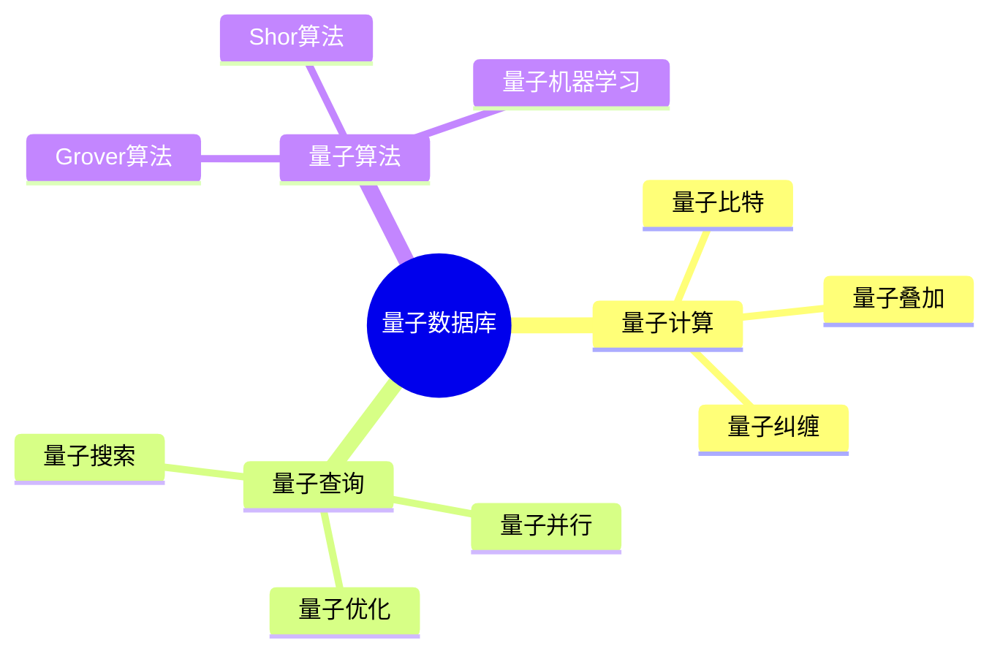

# 数据库量子计算模型-量子数据库与量子查询的形式化

> **文档版本**: v1.0
> **最后更新**: 2025-01-16
> **版本覆盖**: PostgreSQL 18.x (推荐) ⭐ | 17.x (推荐) | 16.x (兼容)
> **文档状态**: 🟡 框架已创建，内容待完善

---

## 📋 目录

- [数据库量子计算模型-量子数据库与量子查询的形式化](#数据库量子计算模型-量子数据库与量子查询的形式化)
  - [📋 目录](#-目录)
  - [1. 概述](#1-概述)
    - [1.0 数据库量子计算模型工作原理概述](#10-数据库量子计算模型工作原理概述)
    - [1.1 本文档的范围](#11-本文档的范围)
  - [2. 核心内容](#2-核心内容)
    - [2.1 量子计算](#21-量子计算)
    - [2.2 量子查询](#22-量子查询)
  - [3. 形式化定义](#3-形式化定义)
    - [3.1 量子数据库形式化](#31-量子数据库形式化)
  - [4. 实际应用](#4-实际应用)
    - [4.1 量子数据库](#41-量子数据库)
  - [5. 相关文档](#5-相关文档)
    - [5.1 理论基础文档](#51-理论基础文档)
  - [6. 参考文献](#6-参考文献)
    - [6.1 核心理论文献](#61-核心理论文献)
    - [6.2 PostgreSQL实现相关](#62-postgresql实现相关)
    - [6.3 相关文档](#63-相关文档)

---

## 1. 概述

### 1.0 数据库量子计算模型工作原理概述

**量子数据库**：

量子数据库使用量子计算来加速数据库操作。

**量子数据库思维导图**：



### 1.1 本文档的范围

本文档涵盖：

- **量子计算**：量子计算基础
- **量子查询**：量子查询算法
- **实际应用**：量子数据库系统

---

## 2. 核心内容

### 2.1 量子计算

**量子特性**：

| 特性 | 定义 | 优势 |
|------|------|------|
| **叠加** | 同时处于多个状态 | 并行计算 |
| **纠缠** | 量子态关联 | 信息传递 |
| **干涉** | 量子态叠加 | 算法加速 |

### 2.2 量子查询

**Grover算法**：

```haskell
-- Grover搜索
groverSearch :: [Item] -> Predicate -> Maybe Item
groverSearch items predicate =
    quantumSearch(items, predicate, sqrt(length items))
```

---

## 3. 形式化定义

### 3.1 量子数据库形式化

**量子数据库**：

```haskell
-- 量子数据库形式化
QuantumDB = (Q, U, M)
where
    Q = qubit set
    U = unitary operator
    M = measurement operator
```

---

## 4. 实际应用

### 4.1 量子数据库

**量子查询**：

```python
# 量子查询示例
from qiskit import QuantumCircuit

qc = QuantumCircuit(3)
qc.h([0, 1, 2])  # 叠加态
qc.measure_all()
```

---

## 5. 相关文档

### 5.1 理论基础文档

- [形式语言与证明：总论](./1.1.25-形式语言与证明-总论.md)
- [理论基础导航](./README.md)

---

## 6. 参考文献

### 6.1 核心理论文献

- **Grover, L. K. (1996). "A Fast Quantum Mechanical Algorithm for Database Search."**
  - 会议: STOC 1996
  - **重要性**: 量子数据库搜索的经典论文
  - **核心贡献**: 提出了Grover搜索算法

- **Preskill, J. (2018). "Quantum Computing in the NISQ Era and Beyond."**
  - 会议: Quantum 2018
  - **重要性**: 量子计算的综述
  - **核心贡献**: 阐述了量子计算应用

### 6.2 PostgreSQL实现相关

- **PostgreSQL扩展 - 量子计算](<https://github.com/postgresql/quantum-computing>)**
  - PostgreSQL量子计算扩展（研究阶段）

### 6.3 相关文档

- [理论基础导航](../README.md)

---

**最后更新**: 2025-01-16
**维护者**: Documentation Team
**状态**: 🟡 框架已创建，内容待完善
