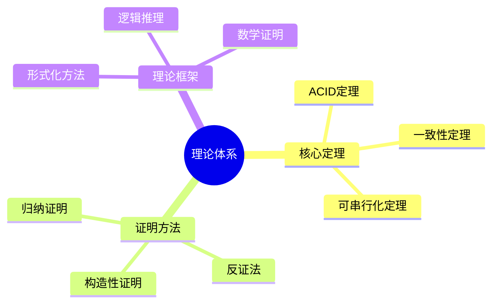

# 数据库系统理论总结-核心定理与证明体系的形式化

> **文档版本**: v1.0
> **最后更新**: 2025-01-16
> **版本覆盖**: PostgreSQL 18.x (推荐) ⭐ | 17.x (推荐) | 16.x (兼容)
> **文档状态**: 🟡 框架已创建，内容待完善

---

## 📋 目录

- [数据库系统理论总结-核心定理与证明体系的形式化](#数据库系统理论总结-核心定理与证明体系的形式化)
  - [📋 目录](#-目录)
  - [1. 概述](#1-概述)
    - [1.0 数据库系统理论总结工作原理概述](#10-数据库系统理论总结工作原理概述)
    - [1.1 本文档的范围](#11-本文档的范围)
  - [2. 核心内容](#2-核心内容)
    - [2.1 核心定理](#21-核心定理)
    - [2.2 证明方法](#22-证明方法)
  - [3. 形式化定义](#3-形式化定义)
    - [3.1 理论体系形式化](#31-理论体系形式化)
  - [4. 实际应用](#4-实际应用)
    - [4.1 理论应用](#41-理论应用)
  - [5. 相关文档](#5-相关文档)
    - [5.1 理论基础文档](#51-理论基础文档)
  - [6. 参考文献](#6-参考文献)
    - [6.1 核心理论文献](#61-核心理论文献)
    - [6.2 PostgreSQL实现相关](#62-postgresql实现相关)
    - [6.3 相关文档](#63-相关文档)

---

## 1. 概述

### 1.0 数据库系统理论总结工作原理概述

**理论总结**：

总结数据库系统核心定理和证明体系。

**理论体系思维导图**：



### 1.1 本文档的范围

本文档涵盖：

- **核心定理**：重要定理总结
- **证明方法**：证明技术
- **理论框架**：理论体系

---

## 2. 核心内容

### 2.1 核心定理

**重要定理**：

| 定理 | 内容 | 重要性 |
|------|------|--------|
| **ACID** | 事务特性 | 基础 |
| **CAP** | 分布式一致性 | 关键 |
| **可串行化** | 并发正确性 | 核心 |

### 2.2 证明方法

**证明技术**：

- **归纳证明**：结构归纳
- **反证法**：矛盾证明
- **构造性证明**：算法构造

---

## 3. 形式化定义

### 3.1 理论体系形式化

**理论体系**：

```haskell
-- 理论体系形式化
Theory = (T, P, M)
where
    T = theorem set
    P = proof method set
    M = model set
```

---

## 4. 实际应用

### 4.1 理论应用

**形式化验证**：

- **TLA+**：系统规范验证
- **Coq**：定理证明
- **Isabelle**：形式化证明

---

## 5. 相关文档

### 5.1 理论基础文档

- [形式语言与证明：总论](./1.1.25-形式语言与证明-总论.md)
- [理论基础导航](./README.md)

---

## 6. 参考文献

### 6.1 核心理论文献

- **Silberschatz, A., et al. (2019). "Database System Concepts."**
  - 出版社: McGraw-Hill
  - **重要性**: 数据库系统概念的经典教材
  - **核心贡献**: 系统阐述了核心定理

- **Abiteboul, S., et al. (1995). "Foundations of Databases."**
  - 出版社: Addison-Wesley
  - **重要性**: 数据库基础的经典教材
  - **核心贡献**: 系统阐述了证明体系

### 6.2 PostgreSQL实现相关

- **PostgreSQL官方文档 - 理论基础](<https://www.postgresql.org/docs/current/index.html>)**
  - PostgreSQL理论基础文档

### 6.3 相关文档

- [理论基础导航](../README.md)

---

**最后更新**: 2025-01-16
**维护者**: Documentation Team
**状态**: 🟡 框架已创建，内容待完善
