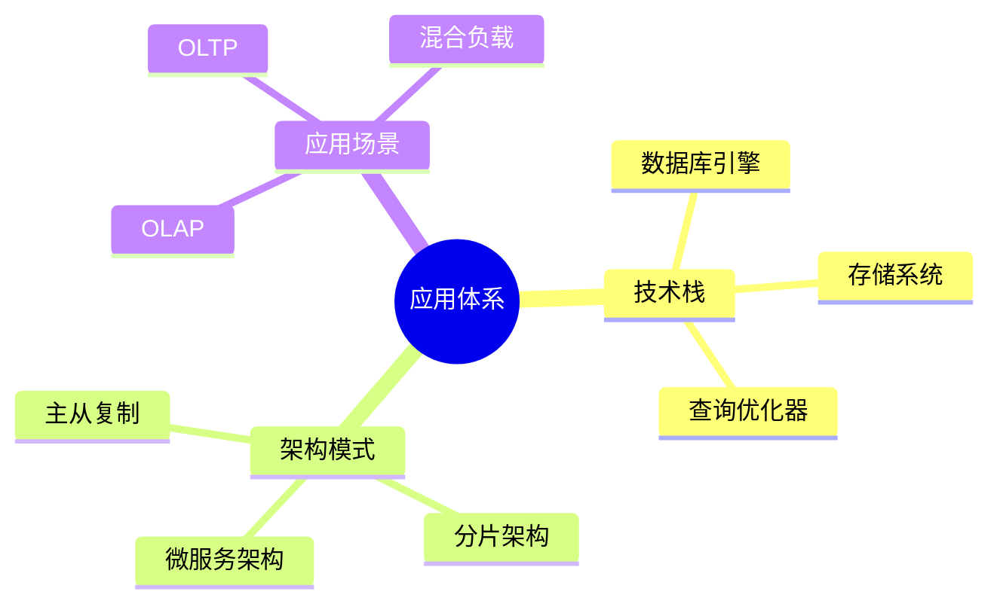

# 数据库系统应用总结-技术栈与架构模式的形式化

> **文档版本**: v1.0
> **最后更新**: 2025-01-16
> **版本覆盖**: PostgreSQL 18.x (推荐) ⭐ | 17.x (推荐) | 16.x (兼容)
> **文档状态**: 🟡 框架已创建，内容待完善

---

## 📋 目录

- [数据库系统应用总结-技术栈与架构模式的形式化](#数据库系统应用总结-技术栈与架构模式的形式化)
  - [📋 目录](#-目录)
  - [1. 概述](#1-概述)
    - [1.0 数据库系统应用总结工作原理概述](#10-数据库系统应用总结工作原理概述)
    - [1.1 本文档的范围](#11-本文档的范围)
  - [2. 核心内容](#2-核心内容)
    - [2.1 技术栈](#21-技术栈)
    - [2.2 架构模式](#22-架构模式)
  - [3. 形式化定义](#3-形式化定义)
    - [3.1 应用体系形式化](#31-应用体系形式化)
  - [4. 实际应用](#4-实际应用)
    - [4.1 架构实践](#41-架构实践)
  - [5. 相关文档](#5-相关文档)
    - [5.1 理论基础文档](#51-理论基础文档)
  - [6. 参考文献](#6-参考文献)
    - [6.1 核心理论文献](#61-核心理论文献)
    - [6.2 PostgreSQL实现相关](#62-postgresql实现相关)
    - [6.3 相关文档](#63-相关文档)

---

## 1. 概述

### 1.0 数据库系统应用总结工作原理概述

**应用总结**：

总结数据库系统技术栈和架构模式。

**应用体系思维导图**：



### 1.1 本文档的范围

本文档涵盖：

- **技术栈**：核心技术组件
- **架构模式**：系统架构
- **应用场景**：使用场景

---

## 2. 核心内容

### 2.1 技术栈

**核心组件**：

| 组件 | 功能 | 技术 |
|------|------|------|
| **存储引擎** | 数据存储 | B-Tree、LSM |
| **查询优化器** | 查询优化 | 代价模型 |
| **事务管理器** | 事务处理 | MVCC、2PL |

### 2.2 架构模式

**架构类型**：

- **主从复制**：读写分离
- **分片架构**：水平扩展
- **微服务架构**：服务化

---

## 3. 形式化定义

### 3.1 应用体系形式化

**应用体系**：

```haskell
-- 应用体系形式化
Application = (S, A, P)
where
    S = technology stack
    A = architecture pattern
    P = application pattern
```

---

## 4. 实际应用

### 4.1 架构实践

**典型架构**：

- **OLTP系统**：主从复制
- **OLAP系统**：列存储
- **混合系统**：读写分离

---

## 5. 相关文档

### 5.1 理论基础文档

- [形式语言与证明：总论](./1.1.25-形式语言与证明-总论.md)
- [理论基础导航](./README.md)

---

## 6. 参考文献

### 6.1 核心理论文献

- **Tanenbaum, A. S., & Van Steen, M. (2017). "Distributed Systems: Principles and Paradigms."**
  - 出版社: Pearson
  - **重要性**: 分布式系统的经典教材
  - **核心贡献**: 系统阐述了架构模式

- **Kleppmann, M. (2017). "Designing Data-Intensive Applications."**
  - 出版社: O'Reilly Media
  - **重要性**: 数据密集型应用设计的经典教材
  - **核心贡献**: 总结了技术栈和架构模式

### 6.2 PostgreSQL实现相关

- **PostgreSQL官方文档 - 架构](<https://www.postgresql.org/docs/current/architecture.html>)**
  - PostgreSQL架构说明

### 6.3 相关文档

- [理论基础导航](../README.md)

---

**最后更新**: 2025-01-16
**维护者**: Documentation Team
**状态**: 🟡 框架已创建，内容待完善
