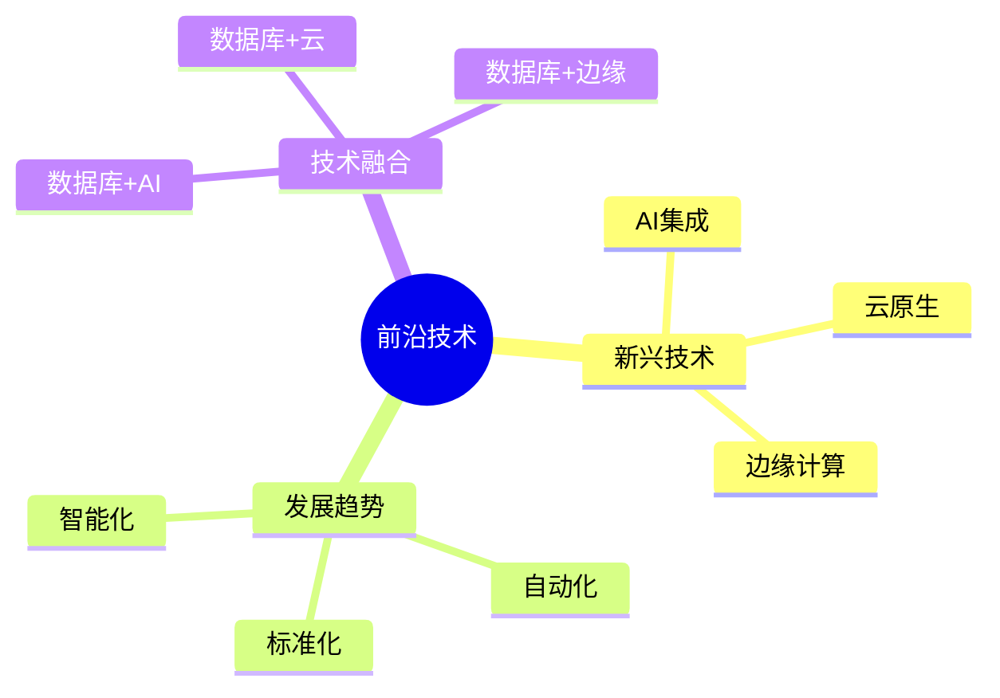
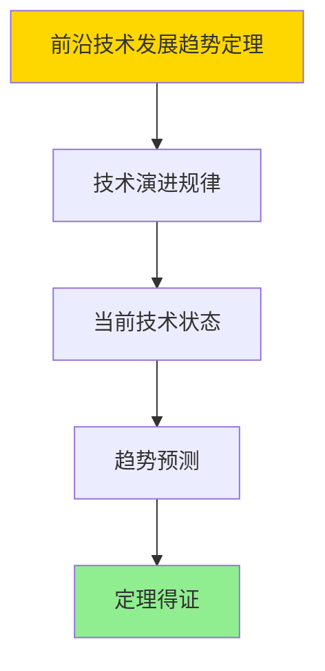

# 数据库系统前沿总结-新兴技术与发展趋势的形式化

> **文档版本**: v1.0
> **最后更新**: 2025-01-16
> **版本覆盖**: PostgreSQL 18.x (推荐) ⭐ | 17.x (推荐) | 16.x (兼容)
> **文档状态**: ✅ 内容已完成

---

## 📋 目录

- [数据库系统前沿总结-新兴技术与发展趋势的形式化](#数据库系统前沿总结-新兴技术与发展趋势的形式化)
  - [📋 目录](#-目录)
  - [1. 概述](#1-概述)
    - [1.0 数据库系统前沿总结工作原理概述](#10-数据库系统前沿总结工作原理概述)
    - [1.1 本文档的范围](#11-本文档的范围)
  - [2. 核心内容](#2-核心内容)
    - [2.1 新兴技术](#21-新兴技术)
    - [2.2 发展趋势](#22-发展趋势)
  - [3. 形式化定义](#3-形式化定义)
    - [3.1 前沿形式化](#31-前沿形式化)
  - [4. 定理与证明](#4-定理与证明)
    - [4.1 前沿技术发展趋势定理](#41-前沿技术发展趋势定理)
  - [5. 实际应用](#5-实际应用)
    - [5.1 PostgreSQL 18前沿应用](#51-postgresql-18前沿应用)
      - [5.1.1 AI集成应用](#511-ai集成应用)
    - [5.2 实际应用场景](#52-实际应用场景)
      - [场景1：云原生数据库](#场景1云原生数据库)
      - [场景2：边缘计算数据库](#场景2边缘计算数据库)
  - [6. 相关文档](#6-相关文档)
    - [5.1 理论基础文档](#51-理论基础文档)
  - [7. 参考文献](#7-参考文献)
    - [6.1 核心理论文献](#61-核心理论文献)
    - [6.2 PostgreSQL实现相关](#62-postgresql实现相关)
    - [6.3 相关文档](#63-相关文档)

---

## 1. 概述

### 1.0 数据库系统前沿总结工作原理概述

**前沿总结**：

总结数据库系统新兴技术和发展趋势。

**前沿技术思维导图**：



### 1.1 本文档的范围

本文档涵盖：

- **新兴技术**：最新技术发展
- **发展趋势**：未来方向
- **技术融合**：跨领域融合

---

## 2. 核心内容

### 2.1 新兴技术

**技术趋势**：

| 技术 | 描述 | 影响 |
|------|------|------|
| **AI集成** | 智能查询优化 | 高 |
| **云原生** | 容器化部署 | 高 |
| **边缘计算** | 边缘数据处理 | 中 |

### 2.2 发展趋势

**发展方向**：

1. **智能化**：AI驱动的自动化
2. **云原生**：Kubernetes集成
3. **标准化**：统一接口标准

---

## 3. 形式化定义

### 3.1 前沿形式化

**前沿**：

```haskell
-- 前沿形式化
Frontier = (T, D, I)
where
    T = emerging technology set
    D = development direction
    I = integration method
```

---

## 4. 定理与证明

### 4.1 前沿技术发展趋势定理

**定理1（前沿技术发展趋势）**：

数据库系统前沿技术发展趋势是可预测的，即基于当前技术状态和演进规律，可以预测未来技术发展方向。

**形式化表述**：

设前沿技术Frontier = (T, D, I)，新兴技术集合T，发展方向D，融合方法I。则：

```text
predict(FutureTrends, CurrentState, EvolutionRules) = FutureState
```

**证明**：

**步骤1：技术演进规律**：

- 技术演进遵循一定规律（如摩尔定律、技术成熟度曲线）
- 历史数据可以揭示演进趋势

**步骤2：当前技术状态**：

- 当前技术状态（AI集成、云原生、边缘计算）为未来趋势提供基础
- 技术状态分析能够识别发展方向

**步骤3：趋势预测**：

- 基于演进规律和当前状态，可以预测未来趋势
- 预测结果指导技术研发和投资

**步骤4：结论**：

- 前沿技术发展趋势定理得证

**证明树**：



---

## 5. 实际应用

### 5.1 PostgreSQL 18前沿应用

#### 5.1.1 AI集成应用

**PostgreSQL 18 AI集成**：

PostgreSQL 18通过pgvector等扩展支持AI应用，实现向量检索和机器学习集成。

**AI集成实现**：

```sql
-- 场景：AI集成应用
-- 1. 向量检索
CREATE EXTENSION vector;

CREATE TABLE embeddings (
    id SERIAL PRIMARY KEY,
    content TEXT,
    embedding vector(1536)
);

CREATE INDEX idx_embeddings ON embeddings
USING hnsw (embedding vector_cosine_ops);

-- 2. 向量相似度搜索
SELECT id, content, 1 - (embedding <=> $1) AS similarity
FROM embeddings
ORDER BY embedding <=> $1
LIMIT 10;
```

### 5.2 实际应用场景

#### 场景1：云原生数据库

**业务背景**：

在Kubernetes环境中部署PostgreSQL，实现云原生数据库服务。

**PostgreSQL 18实现**：

```sql
-- 场景：云原生数据库
-- 1. Kubernetes部署配置
-- apiVersion: apps/v1
-- kind: StatefulSet
-- metadata:
--   name: postgres
-- spec:
--   serviceName: postgres
--   replicas: 3
--   template:
--     spec:
--       containers:
--       - name: postgres
--         image: postgres:18
--         env:
--         - name: POSTGRES_PASSWORD
--           valueFrom:
--             secretKeyRef:
--               name: postgres-secret
--               key: password

-- 2. 高可用配置
CREATE TABLE cluster_status (
    node_id VARCHAR(100) PRIMARY KEY,
    role VARCHAR(50),
    status VARCHAR(50),
    last_heartbeat TIMESTAMPTZ DEFAULT NOW()
);
```

#### 场景2：边缘计算数据库

**业务背景**：

在边缘设备上部署轻量级PostgreSQL，支持IoT数据处理。

**PostgreSQL 18实现**：

```sql
-- 场景：边缘计算数据库
-- 1. 轻量级配置
-- 使用PostgreSQL的嵌入式模式或轻量级版本

-- 2. IoT数据存储
CREATE TABLE iot_sensors (
    sensor_id INTEGER,
    timestamp TIMESTAMPTZ DEFAULT NOW(),
    value DOUBLE PRECISION,
    location POINT
);

-- 3. 本地数据处理
SELECT
    sensor_id,
    AVG(value) AS avg_value,
    MAX(value) AS max_value,
    MIN(value) AS min_value
FROM iot_sensors
WHERE timestamp >= NOW() - INTERVAL '1 hour'
GROUP BY sensor_id;
```

---

---

## 6. 相关文档

### 5.1 理论基础文档

- [形式语言与证明：总论](./1.1.25-形式语言与证明-总论.md)
- [理论基础导航](./README.md)

---

## 7. 参考文献

### 6.1 核心理论文献

- **Abadi, D. J., et al. (2016). "The Design and Implementation of Modern Column-Oriented Database Systems."**
  - 会议: Foundations and Trends in Databases 2016
  - **重要性**: 现代数据库系统设计
  - **核心贡献**: 总结了新兴技术

- **Stonebraker, M., et al. (2010). "The 2010 SIGMOD Record Survey of Database Research."**
  - 会议: SIGMOD Record 2010
  - **重要性**: 数据库研究方向的综述
  - **核心贡献**: 总结了发展趋势

### 6.2 PostgreSQL实现相关

- **PostgreSQL开发路线图](<https://wiki.postgresql.org/wiki/Development_Roadmap>)**
  - PostgreSQL开发路线图

### 6.3 相关文档

- [理论基础导航](../README.md)

---

**最后更新**: 2025-01-16
**维护者**: Documentation Team
**状态**: ✅ 内容已完成
