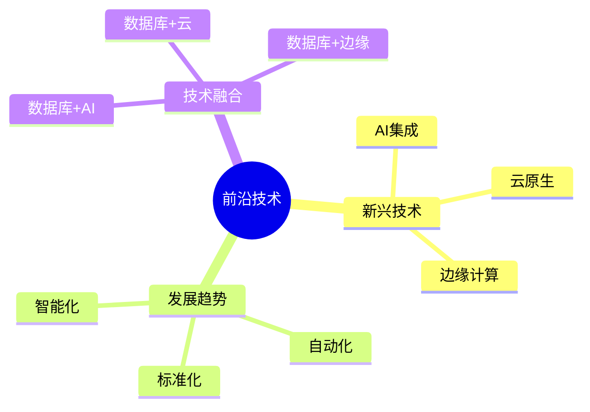

# 数据库系统前沿总结-新兴技术与发展趋势的形式化

> **文档版本**: v1.0
> **最后更新**: 2025-01-16
> **版本覆盖**: PostgreSQL 18.x (推荐) ⭐ | 17.x (推荐) | 16.x (兼容)
> **文档状态**: 🟡 框架已创建，内容待完善

---

## 📋 目录

- [数据库系统前沿总结-新兴技术与发展趋势的形式化](#数据库系统前沿总结-新兴技术与发展趋势的形式化)
  - [📋 目录](#-目录)
  - [1. 概述](#1-概述)
    - [1.0 数据库系统前沿总结工作原理概述](#10-数据库系统前沿总结工作原理概述)
    - [1.1 本文档的范围](#11-本文档的范围)
  - [2. 核心内容](#2-核心内容)
    - [2.1 新兴技术](#21-新兴技术)
    - [2.2 发展趋势](#22-发展趋势)
  - [3. 形式化定义](#3-形式化定义)
    - [3.1 前沿形式化](#31-前沿形式化)
  - [4. 实际应用](#4-实际应用)
    - [4.1 前沿应用](#41-前沿应用)
  - [5. 相关文档](#5-相关文档)
    - [5.1 理论基础文档](#51-理论基础文档)
  - [6. 参考文献](#6-参考文献)
    - [6.1 核心理论文献](#61-核心理论文献)
    - [6.2 PostgreSQL实现相关](#62-postgresql实现相关)
    - [6.3 相关文档](#63-相关文档)

---

## 1. 概述

### 1.0 数据库系统前沿总结工作原理概述

**前沿总结**：

总结数据库系统新兴技术和发展趋势。

**前沿技术思维导图**：



### 1.1 本文档的范围

本文档涵盖：

- **新兴技术**：最新技术发展
- **发展趋势**：未来方向
- **技术融合**：跨领域融合

---

## 2. 核心内容

### 2.1 新兴技术

**技术趋势**：

| 技术 | 描述 | 影响 |
|------|------|------|
| **AI集成** | 智能查询优化 | 高 |
| **云原生** | 容器化部署 | 高 |
| **边缘计算** | 边缘数据处理 | 中 |

### 2.2 发展趋势

**发展方向**：

1. **智能化**：AI驱动的自动化
2. **云原生**：Kubernetes集成
3. **标准化**：统一接口标准

---

## 3. 形式化定义

### 3.1 前沿形式化

**前沿**：

```haskell
-- 前沿形式化
Frontier = (T, D, I)
where
    T = emerging technology set
    D = development direction
    I = integration method
```

---

## 4. 实际应用

### 4.1 前沿应用

**技术应用**：

- **AI优化器**：智能查询优化
- **云数据库**：托管服务
- **边缘数据库**：IoT数据处理

---

## 5. 相关文档

### 5.1 理论基础文档

- [形式语言与证明：总论](./1.1.25-形式语言与证明-总论.md)
- [理论基础导航](./README.md)

---

## 6. 参考文献

### 6.1 核心理论文献

- **Abadi, D. J., et al. (2016). "The Design and Implementation of Modern Column-Oriented Database Systems."**
  - 会议: Foundations and Trends in Databases 2016
  - **重要性**: 现代数据库系统设计
  - **核心贡献**: 总结了新兴技术

- **Stonebraker, M., et al. (2010). "The 2010 SIGMOD Record Survey of Database Research."**
  - 会议: SIGMOD Record 2010
  - **重要性**: 数据库研究方向的综述
  - **核心贡献**: 总结了发展趋势

### 6.2 PostgreSQL实现相关

- **PostgreSQL开发路线图](<https://wiki.postgresql.org/wiki/Development_Roadmap>)**
  - PostgreSQL开发路线图

### 6.3 相关文档

- [理论基础导航](../README.md)

---

**最后更新**: 2025-01-16
**维护者**: Documentation Team
**状态**: 🟡 框架已创建，内容待完善
