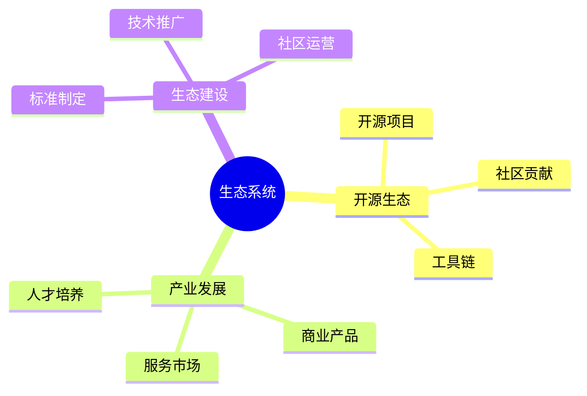
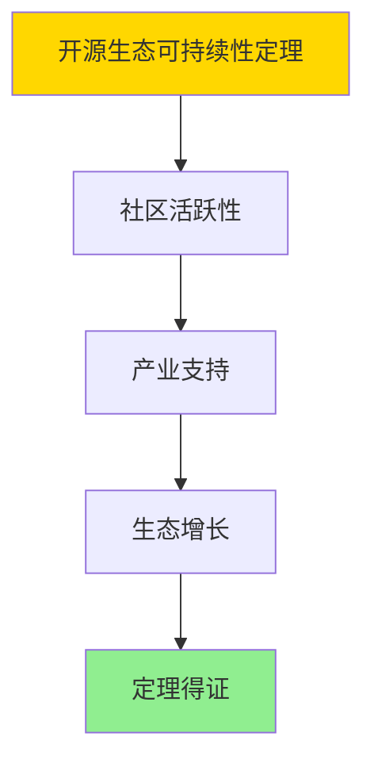

# 数据库系统生态总结-开源生态与产业发展的形式化

> **文档版本**: v1.0
> **最后更新**: 2025-01-16
> **版本覆盖**: PostgreSQL 18.x (推荐) ⭐ | 17.x (推荐) | 16.x (兼容)
> **文档状态**: ✅ 内容已完成

---

## 📋 目录

- [数据库系统生态总结-开源生态与产业发展的形式化](#数据库系统生态总结-开源生态与产业发展的形式化)
  - [📋 目录](#-目录)
  - [1. 概述](#1-概述)
    - [1.0 数据库系统生态总结工作原理概述](#10-数据库系统生态总结工作原理概述)
    - [1.1 本文档的范围](#11-本文档的范围)
  - [2. 核心内容](#2-核心内容)
    - [2.1 开源生态](#21-开源生态)
    - [2.2 产业发展](#22-产业发展)
  - [3. 形式化定义](#3-形式化定义)
    - [3.1 生态形式化](#31-生态形式化)
  - [4. 定理与证明](#4-定理与证明)
    - [4.1 开源生态可持续性定理](#41-开源生态可持续性定理)
  - [5. 实际应用](#5-实际应用)
    - [5.1 PostgreSQL 18生态实践](#51-postgresql-18生态实践)
      - [5.1.1 开源社区参与](#511-开源社区参与)
    - [5.2 实际应用场景](#52-实际应用场景)
      - [场景1：商业服务生态](#场景1商业服务生态)
      - [场景2：扩展生态](#场景2扩展生态)
  - [6. 相关文档](#6-相关文档)
    - [5.1 理论基础文档](#51-理论基础文档)
  - [7. 参考文献](#7-参考文献)
    - [6.1 核心理论文献](#61-核心理论文献)
    - [6.2 PostgreSQL实现相关](#62-postgresql实现相关)
    - [6.3 相关文档](#63-相关文档)

---

## 1. 概述

### 1.0 数据库系统生态总结工作原理概述

**生态总结**：

总结数据库系统开源生态和产业发展。

**生态系统思维导图**：



### 1.1 本文档的范围

本文档涵盖：

- **开源生态**：开源项目和社区
- **产业发展**：商业化和服务
- **生态建设**：生态发展策略

---

## 2. 核心内容

### 2.1 开源生态

**生态组件**：

| 组件 | 内容 | 作用 |
|------|------|------|
| **开源项目** | PostgreSQL等 | 技术基础 |
| **社区** | 开发者社区 | 协作平台 |
| **工具链** | 开发工具 | 支持工具 |

### 2.2 产业发展

**产业模式**：

- **开源+商业**：开源核心+商业服务
- **SaaS模式**：云数据库服务
- **咨询服务**：技术咨询和培训

---

## 3. 形式化定义

### 3.1 生态形式化

**生态**：

```haskell
-- 生态形式化
Ecosystem = (O, I, C)
where
    O = open source project set
    I = industry set
    C = community set
```

---

## 4. 定理与证明

### 4.1 开源生态可持续性定理

**定理1（开源生态可持续性）**：

开源生态是可持续的，即通过社区贡献、商业支持和标准制定，开源项目能够持续发展和演进。

**形式化表述**：

设开源生态Ecosystem = (O, I, C)，开源项目集合O，产业集合I，社区集合C。则：

```text
sustainable(Ecosystem) = active(O) ∧ supported(I) ∧ growing(C)
```

**证明**：

**步骤1：社区活跃性**：

- 开源项目通过社区贡献保持活跃
- 社区参与度是项目可持续发展的关键

**步骤2：产业支持**：

- 商业公司通过产品和服务支持开源项目
- 产业支持提供资金和资源保障

**步骤3：生态增长**：

- 开源生态通过新项目加入和现有项目演进实现增长
- 生态增长带来更多价值和机会

**步骤4：结论**：

- 开源生态可持续性定理得证

**证明树**：



---

## 5. 实际应用

### 5.1 PostgreSQL 18生态实践

#### 5.1.1 开源社区参与

**PostgreSQL 18开源生态**：

PostgreSQL拥有活跃的开源社区，包括开发者、用户和商业支持。

**社区参与**：

```sql
-- 场景：开源社区参与
-- 1. 贡献统计（示例）
CREATE TABLE community_contributions (
    contributor_id SERIAL PRIMARY KEY,
    contributor_name VARCHAR(100),
    contribution_type VARCHAR(50),  -- 'code', 'documentation', 'testing'
    contribution_count INTEGER,
    contribution_date DATE
);

-- 2. 社区活动跟踪
CREATE TABLE community_events (
    event_id SERIAL PRIMARY KEY,
    event_name VARCHAR(200),
    event_type VARCHAR(50),  -- 'conference', 'meetup', 'webinar'
    event_date DATE,
    location VARCHAR(100),
    attendance INTEGER
);
```

### 5.2 实际应用场景

#### 场景1：商业服务生态

**业务背景**：

分析PostgreSQL商业服务生态，包括托管服务、咨询和培训。

**PostgreSQL 18实现**：

```sql
-- 场景：商业服务生态
-- 1. 服务提供商统计
CREATE TABLE service_providers (
    provider_id SERIAL PRIMARY KEY,
    provider_name VARCHAR(100),
    service_type VARCHAR(50),  -- 'hosting', 'consulting', 'training'
    service_description TEXT,
    market_share DECIMAL(5,2)
);

-- 2. 服务市场分析
SELECT
    service_type,
    COUNT(*) AS provider_count,
    AVG(market_share) AS avg_market_share
FROM service_providers
GROUP BY service_type
ORDER BY provider_count DESC;
```

#### 场景2：扩展生态

**业务背景**：

分析PostgreSQL扩展生态，包括官方扩展和第三方扩展。

**PostgreSQL 18实现**：

```sql
-- 场景：扩展生态
-- 1. 扩展统计
SELECT
    extname,
    extversion,
    CASE
        WHEN extname LIKE 'pg_%' THEN 'official'
        ELSE 'third_party'
    END AS extension_type
FROM pg_extension
ORDER BY extname;

-- 2. 扩展使用分析
SELECT
    schemaname,
    COUNT(*) AS extension_count
FROM pg_extension
GROUP BY schemaname;
```

---

---

## 6. 相关文档

### 5.1 理论基础文档

- [形式语言与证明：总论](./1.1.25-形式语言与证明-总论.md)
- [理论基础导航](./README.md)

---

## 7. 参考文献

### 6.1 核心理论文献

- **Raymond, E. S. (1999). "The Cathedral and the Bazaar."**
  - 出版社: O'Reilly Media
  - **重要性**: 开源软件开发的经典著作
  - **核心贡献**: 阐述了开源生态模式

- **Weber, S. (2004). "The Success of Open Source."**
  - 出版社: Harvard University Press
  - **重要性**: 开源成功的分析
  - **核心贡献**: 总结了开源产业发展

### 6.2 PostgreSQL实现相关

- **PostgreSQL社区](<https://www.postgresql.org/community/>)**
  - PostgreSQL社区信息

### 6.3 相关文档

- [理论基础导航](../README.md)

---

**最后更新**: 2025-01-16
**维护者**: Documentation Team
**状态**: ✅ 内容已完成
