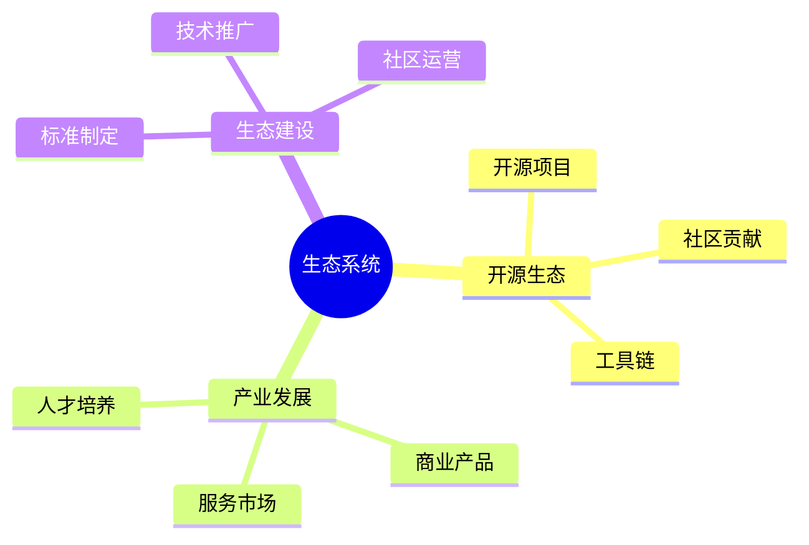

# 数据库系统生态总结-开源生态与产业发展的形式化

> **文档版本**: v1.0
> **最后更新**: 2025-01-16
> **版本覆盖**: PostgreSQL 18.x (推荐) ⭐ | 17.x (推荐) | 16.x (兼容)
> **文档状态**: 🟡 框架已创建，内容待完善

---

## 📋 目录

- [数据库系统生态总结-开源生态与产业发展的形式化](#数据库系统生态总结-开源生态与产业发展的形式化)
  - [📋 目录](#-目录)
  - [1. 概述](#1-概述)
    - [1.0 数据库系统生态总结工作原理概述](#10-数据库系统生态总结工作原理概述)
    - [1.1 本文档的范围](#11-本文档的范围)
  - [2. 核心内容](#2-核心内容)
    - [2.1 开源生态](#21-开源生态)
    - [2.2 产业发展](#22-产业发展)
  - [3. 形式化定义](#3-形式化定义)
    - [3.1 生态形式化](#31-生态形式化)
  - [4. 实际应用](#4-实际应用)
    - [4.1 生态实践](#41-生态实践)
  - [5. 相关文档](#5-相关文档)
    - [5.1 理论基础文档](#51-理论基础文档)
  - [6. 参考文献](#6-参考文献)
    - [6.1 核心理论文献](#61-核心理论文献)
    - [6.2 PostgreSQL实现相关](#62-postgresql实现相关)
    - [6.3 相关文档](#63-相关文档)

---

## 1. 概述

### 1.0 数据库系统生态总结工作原理概述

**生态总结**：

总结数据库系统开源生态和产业发展。

**生态系统思维导图**：



### 1.1 本文档的范围

本文档涵盖：

- **开源生态**：开源项目和社区
- **产业发展**：商业化和服务
- **生态建设**：生态发展策略

---

## 2. 核心内容

### 2.1 开源生态

**生态组件**：

| 组件 | 内容 | 作用 |
|------|------|------|
| **开源项目** | PostgreSQL等 | 技术基础 |
| **社区** | 开发者社区 | 协作平台 |
| **工具链** | 开发工具 | 支持工具 |

### 2.2 产业发展

**产业模式**：

- **开源+商业**：开源核心+商业服务
- **SaaS模式**：云数据库服务
- **咨询服务**：技术咨询和培训

---

## 3. 形式化定义

### 3.1 生态形式化

**生态**：

```haskell
-- 生态形式化
Ecosystem = (O, I, C)
where
    O = open source project set
    I = industry set
    C = community set
```

---

## 4. 实际应用

### 4.1 生态实践

**生态建设**：

- **开源项目**：PostgreSQL、MySQL
- **商业服务**：AWS RDS、Azure Database
- **社区活动**：技术会议、培训

---

## 5. 相关文档

### 5.1 理论基础文档

- [形式语言与证明：总论](./1.1.25-形式语言与证明-总论.md)
- [理论基础导航](./README.md)

---

## 6. 参考文献

### 6.1 核心理论文献

- **Raymond, E. S. (1999). "The Cathedral and the Bazaar."**
  - 出版社: O'Reilly Media
  - **重要性**: 开源软件开发的经典著作
  - **核心贡献**: 阐述了开源生态模式

- **Weber, S. (2004). "The Success of Open Source."**
  - 出版社: Harvard University Press
  - **重要性**: 开源成功的分析
  - **核心贡献**: 总结了开源产业发展

### 6.2 PostgreSQL实现相关

- **PostgreSQL社区](<https://www.postgresql.org/community/>)**
  - PostgreSQL社区信息

### 6.3 相关文档

- [理论基础导航](../README.md)

---

**最后更新**: 2025-01-16
**维护者**: Documentation Team
**状态**: 🟡 框架已创建，内容待完善
