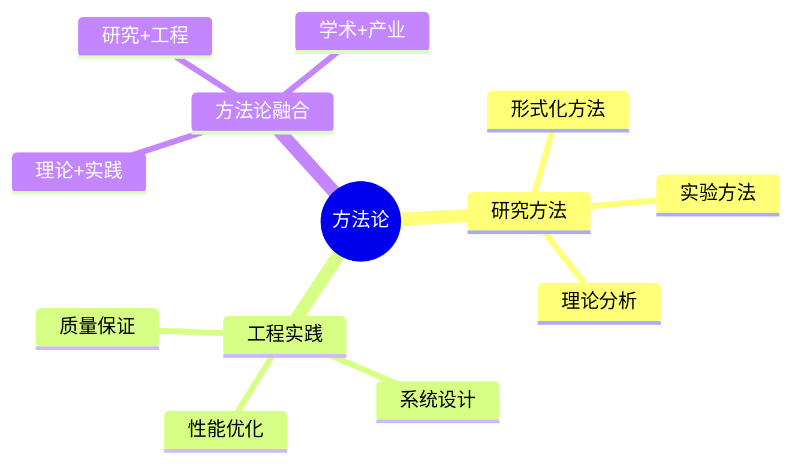

# 数据库系统方法论总结-研究方法与工程实践的形式化

> **文档版本**: v1.0
> **最后更新**: 2025-01-16
> **版本覆盖**: PostgreSQL 18.x (推荐) ⭐ | 17.x (推荐) | 16.x (兼容)
> **文档状态**: 🟡 框架已创建，内容待完善

---

## 📋 目录

- [数据库系统方法论总结-研究方法与工程实践的形式化](#数据库系统方法论总结-研究方法与工程实践的形式化)
  - [📋 目录](#-目录)
  - [1. 概述](#1-概述)
    - [1.0 数据库系统方法论总结工作原理概述](#10-数据库系统方法论总结工作原理概述)
    - [1.1 本文档的范围](#11-本文档的范围)
  - [2. 核心内容](#2-核心内容)
    - [2.1 研究方法](#21-研究方法)
    - [2.2 工程实践](#22-工程实践)
  - [3. 形式化定义](#3-形式化定义)
    - [3.1 方法论形式化](#31-方法论形式化)
  - [4. 实际应用](#4-实际应用)
    - [4.1 方法论应用](#41-方法论应用)
  - [5. 相关文档](#5-相关文档)
    - [5.1 理论基础文档](#51-理论基础文档)
  - [6. 参考文献](#6-参考文献)
    - [6.1 核心理论文献](#61-核心理论文献)
    - [6.2 PostgreSQL实现相关](#62-postgresql实现相关)
    - [6.3 相关文档](#63-相关文档)

---

## 1. 概述

### 1.0 数据库系统方法论总结工作原理概述

**方法论总结**：

总结数据库系统研究方法和工程实践。

**方法论思维导图**：



### 1.1 本文档的范围

本文档涵盖：

- **研究方法**：学术研究方法
- **工程实践**：工程实践方法
- **方法论融合**：理论与实践结合

---

## 2. 核心内容

### 2.1 研究方法

**研究方法类型**：

| 方法 | 描述 | 适用场景 |
|------|------|---------|
| **形式化方法** | 数学证明 | 理论验证 |
| **实验方法** | 性能测试 | 性能评估 |
| **理论分析** | 复杂度分析 | 算法分析 |

### 2.2 工程实践

**实践方法**：

- **系统设计**：架构设计模式
- **性能优化**：优化方法论
- **质量保证**：测试和验证

---

## 3. 形式化定义

### 3.1 方法论形式化

**方法论**：

```haskell
-- 方法论形式化
Methodology = (R, E, I)
where
    R = research method set
    E = engineering practice set
    I = integration method
```

---

## 4. 实际应用

### 4.1 方法论应用

**实践案例**：

- **形式化验证**：TLA+验证系统设计
- **性能测试**：基准测试评估
- **理论指导**：复杂度分析指导优化

---

## 5. 相关文档

### 5.1 理论基础文档

- [形式语言与证明：总论](./1.1.25-形式语言与证明-总论.md)
- [理论基础导航](./README.md)

---

## 6. 参考文献

### 6.1 核心理论文献

- **Lamport, L. (2002). "Specifying Systems: The TLA+ Language and Tools for Hardware and Software Engineers."**
  - 出版社: Addison-Wesley
  - **重要性**: TLA+规范语言的经典教材
  - **核心贡献**: 系统阐述了形式化方法

- **Pressman, R. S., & Maxim, B. R. (2019). "Software Engineering: A Practitioner's Approach."**
  - 出版社: McGraw-Hill
  - **重要性**: 软件工程的经典教材
  - **核心贡献**: 系统阐述了工程实践方法

### 6.2 PostgreSQL实现相关

- **PostgreSQL开发指南](<https://www.postgresql.org/docs/current/contributing.html>)**
  - PostgreSQL开发指南

### 6.3 相关文档

- [理论基础导航](../README.md)

---

**最后更新**: 2025-01-16
**维护者**: Documentation Team
**状态**: 🟡 框架已创建，内容待完善
