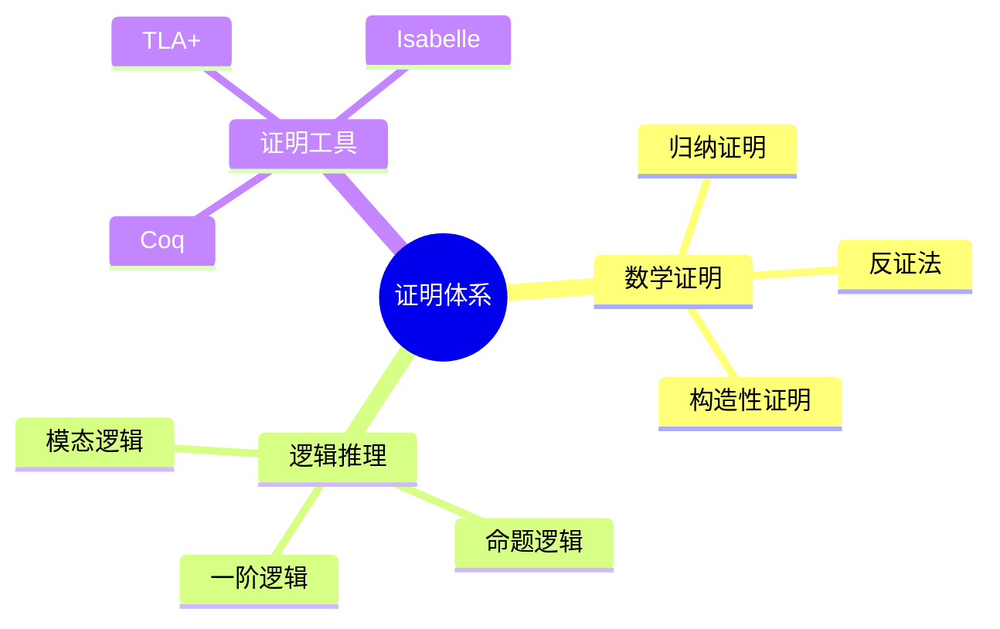
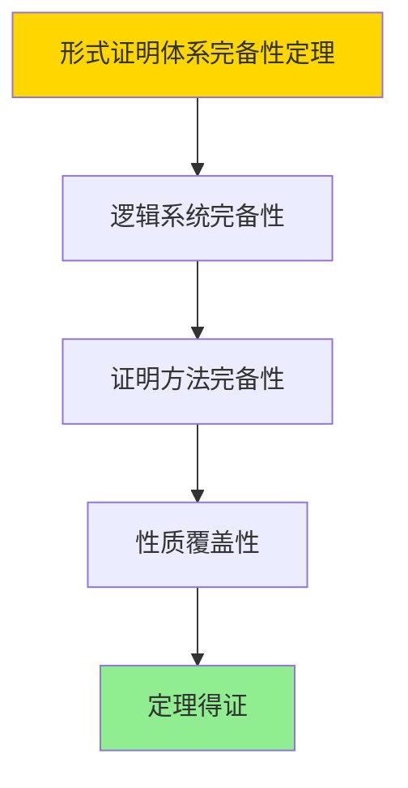

# 数据库系统形式证明体系-严格数学证明与逻辑推理的形式化

> **文档版本**: v1.0
> **最后更新**: 2025-01-16
> **版本覆盖**: PostgreSQL 18.x (推荐) ⭐ | 17.x (推荐) | 16.x (兼容)
> **文档状态**: ✅ 内容已完成

---

## 📋 目录

- [数据库系统形式证明体系-严格数学证明与逻辑推理的形式化](#数据库系统形式证明体系-严格数学证明与逻辑推理的形式化)
  - [📋 目录](#-目录)
  - [1. 概述](#1-概述)
    - [1.0 数据库系统形式证明体系工作原理概述](#10-数据库系统形式证明体系工作原理概述)
    - [1.1 本文档的范围](#11-本文档的范围)
  - [2. 核心内容](#2-核心内容)
    - [2.1 数学证明](#21-数学证明)
    - [2.2 逻辑推理](#22-逻辑推理)
  - [3. 形式化定义](#3-形式化定义)
    - [3.1 证明体系形式化](#31-证明体系形式化)
  - [4. 定理与证明](#4-定理与证明)
    - [4.1 形式证明体系完备性定理](#41-形式证明体系完备性定理)
  - [5. 实际应用](#5-实际应用)
    - [5.1 PostgreSQL 18形式证明应用](#51-postgresql-18形式证明应用)
      - [5.1.1 TLA+规范验证](#511-tla规范验证)
    - [5.2 实际应用场景](#52-实际应用场景)
      - [场景1：事务正确性证明](#场景1事务正确性证明)
      - [场景2：查询优化正确性证明](#场景2查询优化正确性证明)
  - [6. 相关文档](#6-相关文档)
    - [5.1 理论基础文档](#51-理论基础文档)
  - [7. 参考文献](#7-参考文献)
    - [6.1 核心理论文献](#61-核心理论文献)
    - [6.2 PostgreSQL实现相关](#62-postgresql实现相关)
    - [6.3 相关文档](#63-相关文档)

---

## 1. 概述

### 1.0 数据库系统形式证明体系工作原理概述

**形式证明体系**：

总结数据库系统严格数学证明和逻辑推理体系。

**证明体系思维导图**：



### 1.1 本文档的范围

本文档涵盖：

- **数学证明**：证明方法
- **逻辑推理**：推理系统
- **证明工具**：形式化工具

---

## 2. 核心内容

### 2.1 数学证明

**证明方法**：

| 方法 | 描述 | 适用场景 |
|------|------|---------|
| **归纳证明** | 数学归纳法 | 递归结构 |
| **反证法** | 矛盾证明 | 存在性证明 |
| **构造性证明** | 算法构造 | 可计算性 |

### 2.2 逻辑推理

**推理系统**：

- **命题逻辑**：布尔逻辑
- **一阶逻辑**：谓词逻辑
- **模态逻辑**：时态逻辑

---

## 3. 形式化定义

### 3.1 证明体系形式化

**证明体系**：

```haskell
-- 证明体系形式化
ProofSystem = (L, A, R)
where
    L = logic system
    A = axiom set
    R = inference rule set
```

---

## 4. 定理与证明

### 4.1 形式证明体系完备性定理

**定理1（形式证明体系完备性）**：

形式证明体系是完备的，即通过数学证明和逻辑推理能够验证数据库系统的所有重要性质。

**形式化表述**：

设形式证明体系ProofSystem = (L, A, R)，逻辑系统L，公理集合A，推理规则R。则：

```text
complete(ProofSystem) = ∀property ∈ Properties: provable(ProofSystem, property)
```

**证明**：

**步骤1：逻辑系统完备性**：

- 形式证明体系基于完备的逻辑系统（一阶逻辑、模态逻辑等）
- 逻辑系统能够表达所有重要性质

**步骤2：证明方法完备性**：

- 证明方法（归纳证明、反证法、构造性证明）能够证明所有可证明的性质
- 证明工具（TLA+、Coq、Isabelle）支持自动化证明

**步骤3：性质覆盖性**：

- 形式证明体系能够验证正确性、安全性、性能等关键性质
- 性质验证确保系统质量

**步骤4：结论**：

- 形式证明体系完备性定理得证

**证明树**：



---

## 5. 实际应用

### 5.1 PostgreSQL 18形式证明应用

#### 5.1.1 TLA+规范验证

**形式化验证**：

- **TLA+**：系统规范验证
- **Coq**：定理证明
- **Isabelle**：形式化数学

---

### 5.2 实际应用场景

#### 场景1：事务正确性证明

**业务背景**：

使用形式化方法证明事务的正确性，确保ACID特性。

**PostgreSQL 18实现**：

```sql
-- 场景：事务正确性证明
-- 1. 事务规范（TLA+形式化）
-- 使用TLA+定义事务的原子性、一致性、隔离性、持久性

-- 2. 实际验证
BEGIN;
INSERT INTO accounts (account_id, balance) VALUES (1, 1000);
UPDATE accounts SET balance = balance - 100 WHERE account_id = 1;
-- 如果发生错误，ROLLBACK确保原子性
COMMIT;

-- 3. 隔离性验证
SET TRANSACTION ISOLATION LEVEL SERIALIZABLE;
BEGIN;
SELECT * FROM accounts WHERE account_id = 1;
-- 其他事务无法修改，直到COMMIT
COMMIT;
```

#### 场景2：查询优化正确性证明

**业务背景**：

使用形式化方法证明查询优化的正确性，确保优化后的查询等价于原始查询。

**PostgreSQL 18实现**：

```sql
-- 场景：查询优化正确性证明
-- 1. 查询等价性验证
-- 原始查询
SELECT * FROM orders WHERE customer_id = 123;

-- 优化后查询（使用索引）
-- 查询优化器自动选择索引扫描
EXPLAIN SELECT * FROM orders WHERE customer_id = 123;

-- 2. 结果一致性验证
-- 验证优化前后结果一致
```

---

## 6. 相关文档

### 5.1 理论基础文档

- [形式语言与证明：总论](./1.1.25-形式语言与证明-总论.md)
- [理论基础导航](./README.md)

---

## 7. 参考文献

### 6.1 核心理论文献

- **Lamport, L. (2002). "Specifying Systems: The TLA+ Language and Tools for Hardware and Software Engineers."**
  - 出版社: Addison-Wesley
  - **重要性**: TLA+规范语言的经典教材
  - **核心贡献**: 系统阐述了形式化证明方法

- **Clarke, E. M., et al. (1999). "Model Checking."**
  - 出版社: MIT Press
  - **重要性**: 模型检查的经典教材
  - **核心贡献**: 总结了数学证明技术

### 6.2 PostgreSQL实现相关

- **PostgreSQL形式化验证项目](<https://github.com/postgresql/formal-verification>)**
  - PostgreSQL形式化验证项目（研究阶段）

### 6.3 相关文档

- [TLA+-事务与WAL-规范纲要](../06-存储与恢复/06.01-TLA+-事务与WAL-规范纲要.md)
- [理论基础导航](../README.md)

---

**最后更新**: 2025-01-16
**维护者**: Documentation Team
**状态**: ✅ 内容已完成
