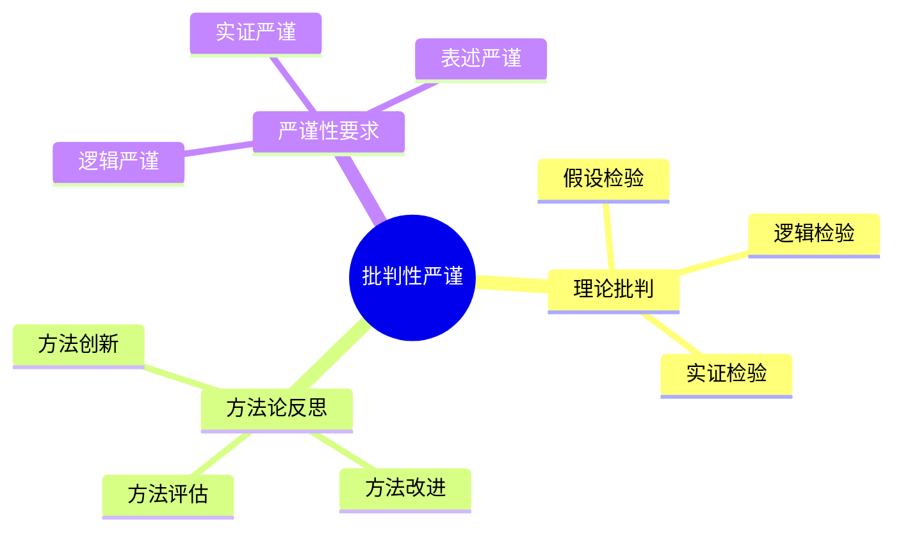

# 数据库系统批判性严谨性-理论批判与方法论反思的形式化

> **文档版本**: v1.0
> **最后更新**: 2025-01-16
> **版本覆盖**: PostgreSQL 18.x (推荐) ⭐ | 17.x (推荐) | 16.x (兼容)
> **文档状态**: 🟡 框架已创建，内容待完善

---

## 📋 目录

- [数据库系统批判性严谨性-理论批判与方法论反思的形式化](#数据库系统批判性严谨性-理论批判与方法论反思的形式化)
  - [📋 目录](#-目录)
  - [1. 概述](#1-概述)
    - [1.0 数据库系统批判性严谨性工作原理概述](#10-数据库系统批判性严谨性工作原理概述)
    - [1.1 本文档的范围](#11-本文档的范围)
  - [2. 核心内容](#2-核心内容)
    - [2.1 理论批判](#21-理论批判)
    - [2.2 方法论反思](#22-方法论反思)
  - [3. 形式化定义](#3-形式化定义)
    - [3.1 严谨性形式化](#31-严谨性形式化)
  - [4. 实际应用](#4-实际应用)
    - [4.1 严谨性实践](#41-严谨性实践)
  - [5. 相关文档](#5-相关文档)
    - [5.1 理论基础文档](#51-理论基础文档)
  - [6. 参考文献](#6-参考文献)
    - [6.1 核心理论文献](#61-核心理论文献)
    - [6.2 PostgreSQL实现相关](#62-postgresql实现相关)
    - [6.3 相关文档](#63-相关文档)

---

## 1. 概述

### 1.0 数据库系统批判性严谨性工作原理概述

**批判性严谨性**：

总结数据库系统理论批判和方法论反思。

**批判性思维导图**：



### 1.1 本文档的范围

本文档涵盖：

- **理论批判**：理论检验方法
- **方法论反思**：方法评估和改进
- **严谨性要求**：严谨性标准

---

## 2. 核心内容

### 2.1 理论批判

**批判方法**：

| 方法 | 内容 | 目的 |
|------|------|------|
| **假设检验** | 验证假设 | 理论验证 |
| **逻辑检验** | 逻辑一致性 | 逻辑严谨 |
| **实证检验** | 实验验证 | 实践验证 |

### 2.2 方法论反思

**反思内容**：

- **方法评估**：评估方法有效性
- **方法改进**：改进方法缺陷
- **方法创新**：创新研究方法

---

## 3. 形式化定义

### 3.1 严谨性形式化

**严谨性**：

```haskell
-- 严谨性形式化
Rigor = (L, E, P)
where
    L = logical rigor
    E = empirical rigor
    P = presentation rigor
```

---

## 4. 实际应用

### 4.1 严谨性实践

**严谨性要求**：

- **逻辑严谨**：严格逻辑推理
- **实证严谨**：充分实验验证
- **表述严谨**：准确清晰表述

---

## 5. 相关文档

### 5.1 理论基础文档

- [形式语言与证明：总论](./1.1.25-形式语言与证明-总论.md)
- [理论基础导航](./README.md)

---

## 6. 参考文献

### 6.1 核心理论文献

- **Popper, K. (2002). "The Logic of Scientific Discovery."**
  - 出版社: Routledge
  - **重要性**: 科学发现的逻辑的经典著作
  - **核心贡献**: 系统阐述了理论批判方法

- **Kuhn, T. S. (2012). "The Structure of Scientific Revolutions."**
  - 出版社: University of Chicago Press
  - **重要性**: 科学革命的结构
  - **核心贡献**: 阐述了方法论反思

### 6.2 PostgreSQL实现相关

- **PostgreSQL设计原则](<https://wiki.postgresql.org/wiki/PostgreSQL_Design_Principles>)**
  - PostgreSQL设计原则

### 6.3 相关文档

- [理论基础导航](../README.md)

---

**最后更新**: 2025-01-16
**维护者**: Documentation Team
**状态**: 🟡 框架已创建，内容待完善
