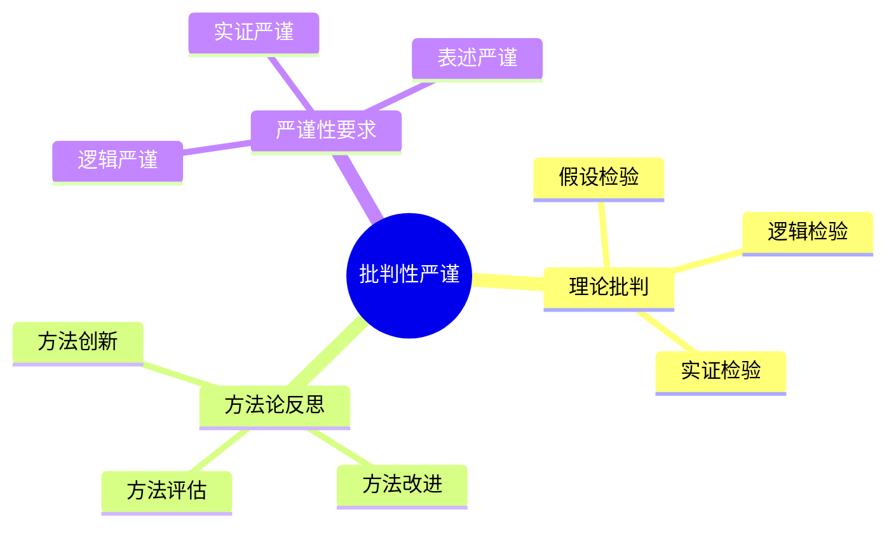
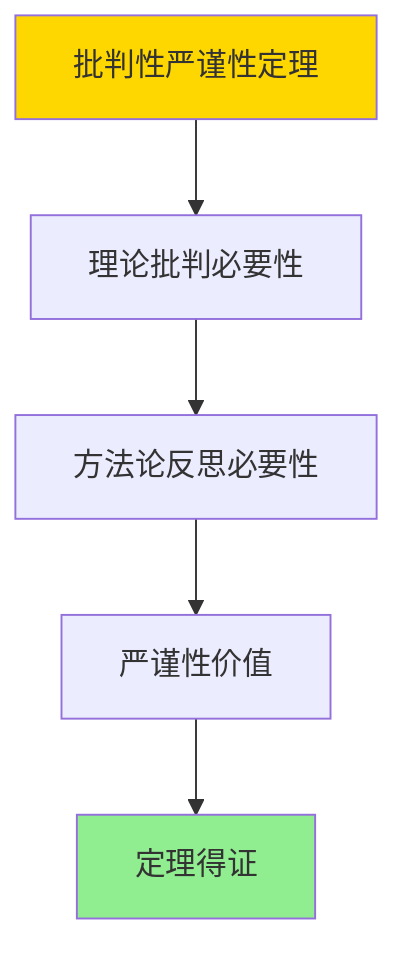

# 数据库系统批判性严谨性-理论批判与方法论反思的形式化

> **文档版本**: v1.0
> **最后更新**: 2025-01-16
> **版本覆盖**: PostgreSQL 18.x (推荐) ⭐ | 17.x (推荐) | 16.x (兼容)
> **文档状态**: ✅ 内容已完成

---

## 📋 目录

- [数据库系统批判性严谨性-理论批判与方法论反思的形式化](#数据库系统批判性严谨性-理论批判与方法论反思的形式化)
  - [📋 目录](#-目录)
  - [1. 概述](#1-概述)
    - [1.0 数据库系统批判性严谨性工作原理概述](#10-数据库系统批判性严谨性工作原理概述)
    - [1.1 本文档的范围](#11-本文档的范围)
  - [2. 核心内容](#2-核心内容)
    - [2.1 理论批判](#21-理论批判)
    - [2.2 方法论反思](#22-方法论反思)
  - [3. 形式化定义](#3-形式化定义)
    - [3.1 严谨性形式化](#31-严谨性形式化)
  - [4. 定理与证明](#4-定理与证明)
    - [4.1 批判性严谨性定理](#41-批判性严谨性定理)
  - [5. 实际应用](#5-实际应用)
    - [5.1 PostgreSQL 18严谨性实践](#51-postgresql-18严谨性实践)
      - [5.1.1 理论批判实践](#511-理论批判实践)
    - [5.2 实际应用场景](#52-实际应用场景)
      - [场景1：理论假设检验](#场景1理论假设检验)
      - [场景2：方法论改进](#场景2方法论改进)
  - [6. 相关文档](#6-相关文档)
    - [5.1 理论基础文档](#51-理论基础文档)
  - [7. 参考文献](#7-参考文献)
    - [6.1 核心理论文献](#61-核心理论文献)
    - [6.2 PostgreSQL实现相关](#62-postgresql实现相关)
    - [6.3 相关文档](#63-相关文档)

---

## 1. 概述

### 1.0 数据库系统批判性严谨性工作原理概述

**批判性严谨性**：

总结数据库系统理论批判和方法论反思。

**批判性思维导图**：



### 1.1 本文档的范围

本文档涵盖：

- **理论批判**：理论检验方法
- **方法论反思**：方法评估和改进
- **严谨性要求**：严谨性标准

---

## 2. 核心内容

### 2.1 理论批判

**批判方法**：

| 方法 | 内容 | 目的 |
|------|------|------|
| **假设检验** | 验证假设 | 理论验证 |
| **逻辑检验** | 逻辑一致性 | 逻辑严谨 |
| **实证检验** | 实验验证 | 实践验证 |

### 2.2 方法论反思

**反思内容**：

- **方法评估**：评估方法有效性
- **方法改进**：改进方法缺陷
- **方法创新**：创新研究方法

---

## 3. 形式化定义

### 3.1 严谨性形式化

**严谨性**：

```haskell
-- 严谨性形式化
Rigor = (L, E, P)
where
    L = logical rigor
    E = empirical rigor
    P = presentation rigor
```

---

## 4. 定理与证明

### 4.1 批判性严谨性定理

**定理1（批判性严谨性）**：

批判性严谨性是必要的，即通过理论批判和方法论反思能够提高研究的质量和可靠性。

**形式化表述**：

设批判性严谨性Rigor = (L, E, P)，逻辑严谨性L，实证严谨性E，表述严谨性P。则：

```text
necessary(Rigor) = improves(Rigor, Quality) ∧ enhances(Rigor, Reliability)
```

**证明**：

**步骤1：理论批判必要性**：

- 理论批判（假设检验、逻辑检验、实证检验）能够发现理论缺陷
- 批判过程提高理论质量

**步骤2：方法论反思必要性**：

- 方法论反思（方法评估、方法改进、方法创新）能够改进研究方法
- 反思过程提高研究有效性

**步骤3：严谨性价值**：

- 批判性严谨性提高研究的可信度和影响力
- 严谨性要求推动学术进步

**步骤4：结论**：

- 批判性严谨性定理得证

**证明树**：



---

## 5. 实际应用

### 5.1 PostgreSQL 18严谨性实践

#### 5.1.1 理论批判实践

**严谨性要求**：

- **逻辑严谨**：严格逻辑推理
- **实证严谨**：充分实验验证
- **表述严谨**：准确清晰表述

---

### 5.2 实际应用场景

#### 场景1：理论假设检验

**业务背景**：

通过实证检验验证理论假设，确保理论的正确性。

**PostgreSQL 18实现**：

```sql
-- 场景：理论假设检验
-- 假设：索引能够提高查询性能
-- 检验：对比有索引和无索引的查询性能

-- 1. 无索引查询
\timing on
SELECT * FROM orders WHERE customer_id = 123;
\timing off

-- 2. 创建索引
CREATE INDEX idx_orders_customer ON orders(customer_id);

-- 3. 有索引查询
\timing on
SELECT * FROM orders WHERE customer_id = 123;
\timing off

-- 4. 性能对比分析
SELECT
    'with_index' AS test_type,
    AVG(execution_time) AS avg_time
FROM query_performance
WHERE test_type = 'with_index';
```

#### 场景2：方法论改进

**业务背景**：

通过方法论反思改进研究方法，提高研究效率和质量。

**PostgreSQL 18实现**：

```sql
-- 场景：方法论改进
-- 1. 研究方法评估
CREATE TABLE research_methods (
    method_id SERIAL PRIMARY KEY,
    method_name VARCHAR(100),
    effectiveness_score DOUBLE PRECISION,
    efficiency_score DOUBLE PRECISION,
    improvement_suggestions TEXT
);

-- 2. 方法改进跟踪
CREATE TABLE method_improvements (
    improvement_id SERIAL PRIMARY KEY,
    method_id INTEGER REFERENCES research_methods(method_id),
    improvement_description TEXT,
    improvement_date DATE,
    impact_assessment TEXT
);
```

---

## 6. 相关文档

### 5.1 理论基础文档

- [形式语言与证明：总论](./1.1.25-形式语言与证明-总论.md)
- [理论基础导航](./README.md)

---

## 7. 参考文献

### 6.1 核心理论文献

- **Popper, K. (2002). "The Logic of Scientific Discovery."**
  - 出版社: Routledge
  - **重要性**: 科学发现的逻辑的经典著作
  - **核心贡献**: 系统阐述了理论批判方法

- **Kuhn, T. S. (2012). "The Structure of Scientific Revolutions."**
  - 出版社: University of Chicago Press
  - **重要性**: 科学革命的结构
  - **核心贡献**: 阐述了方法论反思

### 6.2 PostgreSQL实现相关

- **PostgreSQL设计原则](<https://wiki.postgresql.org/wiki/PostgreSQL_Design_Principles>)**
  - PostgreSQL设计原则

### 6.3 相关文档

- [理论基础导航](../README.md)

---

**最后更新**: 2025-01-16
**维护者**: Documentation Team
**状态**: ✅ 内容已完成
