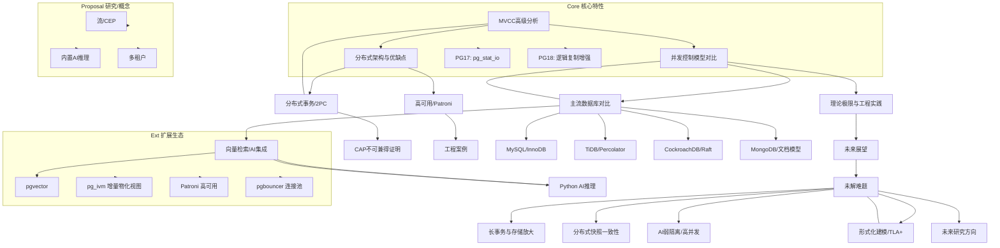

# PostgreSQL 知识图谱（重构版）

```mermaid
graph TD
  A[01 核心基础] --> A1[[系统架构 1.1.2]]
  A --> A2[[事务处理 1.1.5]]
  A --> A3[[隔离理论 1.1.47]]
  A3 --> A3a[[SI异常 1.1.61]]
  A2 --> A2a[[2PL 1.1.69]]
  A2 --> A2b[[死锁 1.1.64]]

  B[02 查询处理] --> B1[[优化器 1.1.4]]
  B --> B2[[等价重写 1.1.80]]
  B --> B3[[统计/误差 1.1.49]]
  B --> B4[[自适应 1.1.83]]
  B --> B5[[索引选择 1.1.82]]
  B --> B6[[分区裁剪 1.1.59]]
  B --> B7[[物化选择 1.1.60]]

  C[03 高级特性] --> C1[[可自维护MV 1.1.74/79]]
  C --> C2[[分区策略 1.1.87]]
  C --> C3[[直方图/分箱 1.1.72/78]]
  C --> C4[[RLS 1.1.70]]
  C --> C5[[Bag/NULL语义 1.1.63/71]]
  C --> C6[[流/网格/湖/仓/联邦/虚拟化 1.1.100-116,108-115,110-114]]
  C --> C7[[向量与AI 1.1.19,1.1.6]]

  D[04 运维] --> D1[[调优 1.1.93]]
  D --> D2[[监控 1.1.89]]
  D --> D3[[备份恢复 1.1.88]]
  D --> D4[[高可用 1.1.92]]
  D --> D5[[安全合规 1.1.17]]

  E[05 前沿] --> E1[[2025特性 1.1.21/144]]

  F[06 形式化] --> F1[[ARIES不变式 1.1.57]]
  F --> F2[[TLA+纲要 1.1.32]]
  F --> F3[[线性化/串行化 1.1.62]]

  A3 -.为B1/C1提供约束.-> B1
  B3 -.支撑B1B5.-> B1
  C7 -.对B1提供提示.-> B1
  D2 -.为B1/D1提供反馈.-> B1
```

注：节点方括号内为主题与对应文档编号，虚线为支撑/反馈关系。
最后更新：自动生成（重构进行中）。

## 链接对照表（查询处理核心）

- 优化器 1.1.4 → [1.1.4-查询优化.md](1.1.4-查询优化.md)
- 等价重写 1.1.80 → [1.1.80-查询重写等价性-基于同构的充分必要条件.md](1.1.80-查询重写等价性-基于同构的充分必要条件.md)
- 分区裁剪 1.1.59 → [1.1.59-表分区与分区裁剪-语义与等价.md](1.1.59-表分区与分区裁剪-语义与等价.md)
- 物化选择 1.1.60 → [1.1.60-物化视图选择-查询重写等价与代价界.md](1.1.60-物化视图选择-查询重写等价与代价界.md)
- 统计/误差 1.1.49 → [1.1.49-选择率估计误差-敏感性与上界.md](1.1.49-选择率估计误差-敏感性与上界.md)
- 自适应 1.1.83 → [1.1.83-查询优化器自适应-反馈学习与代价模型修正.md](1.1.83-查询优化器自适应-反馈学习与代价模型修正.md)

## PostgreSQL 数据库系统全局知识图谱

## 使用说明

- 图谱用于导航与依赖理解：从核心理论（A/B/F）到工程特性（C/D），再到前沿与提案（E/Proposal）。
- 建议阅读顺序：核心基础 → 查询处理 → 部署运维 → 高级特性/前沿；
- 结合目录：`00-项目导航/README.md` 与 `runbook/README.md` 快速到达执行手册与脚本。
