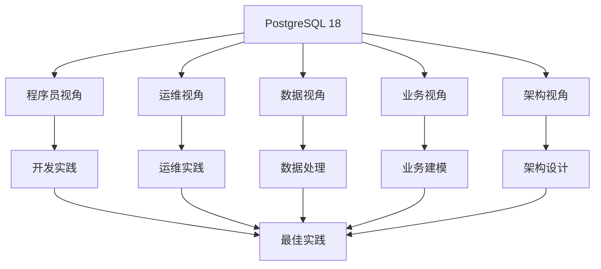
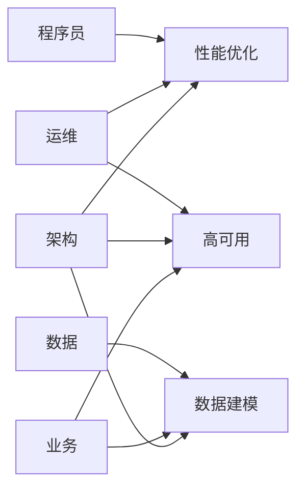

# PostgreSQL 18 多视角导航

> **版本**: v2.0
> **最后更新**: 2025-01-15
> **版本覆盖**: PostgreSQL 18.x (推荐) ⭐
> **状态**: ✅ 已完成（所有核心文档已完成质量改进）

---

## 📋 目录

- [PostgreSQL 18 多视角导航](#postgresql-18-多视角导航)
  - [📋 目录](#-目录)
  - [一、视角概览](#一视角概览)
    - [1.1 视角定义](#11-视角定义)
    - [1.2 视角关系](#12-视角关系)
  - [二、程序员视角](#二程序员视角)
    - [2.1 核心内容](#21-核心内容)
    - [2.2 适用场景](#22-适用场景)
    - [2.3 快速链接](#23-快速链接)
  - [三、运维视角](#三运维视角)
    - [3.1 核心内容](#31-核心内容)
    - [3.2 适用场景](#32-适用场景)
    - [3.3 快速链接](#33-快速链接)
  - [四、数据视角](#四数据视角)
    - [4.1 核心内容](#41-核心内容)
    - [4.2 适用场景](#42-适用场景)
    - [4.3 快速链接](#43-快速链接)
  - [五、业务视角](#五业务视角)
    - [5.1 核心内容](#51-核心内容)
    - [5.2 适用场景](#52-适用场景)
    - [5.3 快速链接](#53-快速链接)
  - [六、架构视角](#六架构视角)
    - [6.1 核心内容](#61-核心内容)
    - [6.2 适用场景](#62-适用场景)
    - [6.3 快速链接](#63-快速链接)
  - [七、视角交叉](#七视角交叉)
    - [7.1 交叉领域](#71-交叉领域)
    - [7.2 协作模式](#72-协作模式)

---

## 一、视角概览

### 1.1 视角定义

| 视角 | 角色 | 关注点 | 核心文档 |
|-----|------|--------|---------|
| **程序员视角** | 开发工程师 | 开发实践、编程范式、代码模式 | [01-程序员视角](../01-程序员视角/) |
| **运维视角** | 运维工程师 | 部署、监控、调优、故障处理 | [02-运维视角](../02-运维视角/) |
| **数据视角** | 数据分析师 | 数据建模、ETL、分析、质量 | [03-数据视角](../03-数据视角/) |
| **业务视角** | 业务分析师 | 业务建模、规则、流程、需求 | [04-业务视角](../04-业务视角/) |
| **架构视角** | 架构师 | 系统设计、分布式、微服务、性能 | [05-架构视角](../05-架构视角/) |

### 1.2 视角关系

---

## 二、程序员视角

### 2.1 核心内容

- **编程范式与模式**：函数式、面向对象、声明式、响应式、事件驱动
- **API使用指南**：连接管理、事务管理、查询执行、异步操作
- **代码模式与最佳实践**：设计模式、代码组织、错误处理、测试策略
- **开发工具与调试**：开发环境、调试工具、性能分析工具
- **性能编程技巧**：查询优化、索引使用、批量操作、连接池
- **错误处理与异常**：异常处理、错误码、日志记录、故障恢复

### 2.2 适用场景

- Web应用开发
- API服务开发
- 数据处理脚本
- 扩展开发
- 性能优化

### 2.3 快速链接

- [编程范式与模式](../01-程序员视角/01.01-编程范式与模式.md)
- [API使用指南](../01-程序员视角/01.02-API使用指南.md)
- [代码模式与最佳实践](../01-程序员视角/01.03-代码模式与最佳实践.md)

---

## 三、运维视角

### 3.1 核心内容

- **部署架构设计**：单机、集群、分布式、云原生、Serverless
- **监控与可观测性**：指标监控、日志管理、链路追踪、告警系统
- **性能调优实践**：查询优化、索引优化、参数调优、硬件优化
- **故障排查与恢复**：故障诊断、问题定位、恢复策略、预防措施
- **容量规划与扩展**：容量评估、扩展策略、资源规划、成本优化
- **安全运维实践**：访问控制、数据加密、审计日志、合规性

### 3.2 适用场景

- 生产环境部署
- 系统监控运维
- 性能问题诊断
- 故障应急处理
- 容量规划管理

### 3.3 快速链接

- [部署架构设计](../02-运维视角/02.01-部署架构设计.md)
- [监控与可观测性](../02-运维视角/02.02-监控与可观测性.md)
- [性能调优实践](../02-运维视角/02.03-性能调优实践.md)

---

## 四、数据视角

### 4.1 核心内容

- **数据建模方法论**：概念建模、逻辑建模、物理建模、维度建模
- **ETL流程设计**：提取策略、转换规则、加载策略、调度管理
- **数据分析与挖掘**：OLAP分析、数据挖掘、机器学习、实时分析
- **数据质量管理**：数据校验、数据清洗、数据标准化、数据监控
- **数据仓库设计**：星型模型、雪花模型、数据分层、ETL流程
- **实时数据处理**：流式处理、CDC、事件流、实时分析

### 4.2 适用场景

- 数据仓库建设
- ETL流程设计
- 数据分析挖掘
- 数据质量管控
- 实时数据处理

### 4.3 快速链接

- [数据建模方法论](../03-数据视角/03.01-数据建模方法论.md)
- [ETL流程设计](../03-数据视角/03.02-ETL流程设计.md)
- [数据分析与挖掘](../03-数据视角/03.03-数据分析与挖掘.md)

---

## 五、业务视角

### 5.1 核心内容

- **业务建模方法论**：领域建模、业务流程建模、业务规则建模
- **领域驱动设计**：DDD实践、聚合设计、领域事件、CQRS
- **业务流程建模**：BPMN、工作流、流程引擎、流程优化
- **业务规则引擎**：规则引擎、决策表、规则管理、规则执行
- **多租户架构设计**：租户隔离、数据共享、资源隔离、计费管理
- **业务场景案例**：电商、金融、IoT、医疗、教育

### 5.2 适用场景

- 业务系统设计
- 领域建模
- 业务流程优化
- 业务规则管理
- 多租户系统

### 5.3 快速链接

- [业务建模方法论](../04-业务视角/04.01-业务建模方法论.md)
- [领域驱动设计](../04-业务视角/04.02-领域驱动设计.md)
- [业务流程建模](../04-业务视角/04.03-业务流程建模.md)

---

## 六、架构视角

### 6.1 核心内容

- **系统架构设计**：分层架构、微服务架构、事件驱动架构、CQRS
- **分布式架构设计**：分片、分布式事务、一致性、CAP理论
- **高可用架构设计**：主从复制、集群、故障切换、容灾
- **高可用架构设计**：主从复制、集群、故障切换、容灾
- **性能架构设计**：缓存、读写分离、分库分表、CDN
- **安全架构设计**：安全模型、访问控制、数据加密、安全审计

### 6.2 适用场景

- 系统架构设计
- 分布式系统设计
- 微服务架构设计
- 高可用架构设计
- 性能架构优化

### 6.3 快速链接

- [系统架构设计](../05-架构视角/05.01-系统架构设计.md)
- [分布式架构设计](../05-架构视角/05.02-分布式架构设计.md)
- [高可用架构设计](../05-架构视角/05.03-高可用架构设计.md)

---

## 七、视角交叉

### 7.1 交叉领域

| 交叉领域 | 涉及视角 | 核心内容 |
|---------|---------|---------|
| **性能优化** | 程序员、运维、架构 | 查询优化、索引优化、架构优化 |
| **数据建模** | 数据、业务、架构 | 概念建模、逻辑建模、物理建模 |
| **高可用** | 运维、架构、业务 | 主从复制、故障切换、业务连续性 |
| **安全** | 运维、架构、业务 | 访问控制、数据加密、合规性 |
| **分布式** | 架构、运维、数据 | 分片、分布式事务、数据一致性 |

### 7.2 协作模式

---

**最后更新**: 2025-01-15
**维护者**: PostgreSQL Documentation Team
