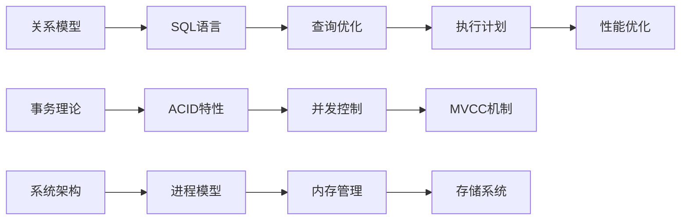
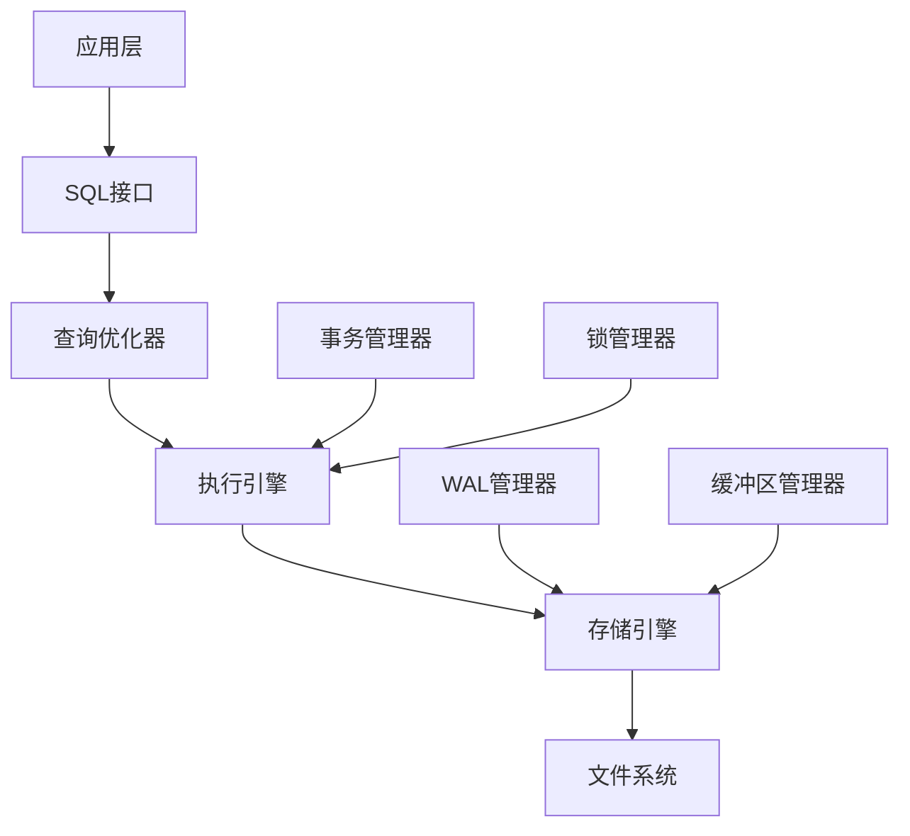

# PostgreSQL 18 知识体系总览

> **版本**: v2.0
> **最后更新**: 2025-01-15
> **版本覆盖**: PostgreSQL 18.x (推荐) ⭐
> **状态**: ✅ 已完成（所有核心文档已完成质量改进）

---

## 📋 目录

- [PostgreSQL 18 知识体系总览](#postgresql-18-知识体系总览)
  - [📋 目录](#-目录)
  - [一、知识体系框架](#一知识体系框架)
    - [1.1 知识体系结构](#11-知识体系结构)
    - [1.2 知识域划分](#12-知识域划分)
  - [二、核心知识域](#二核心知识域)
    - [2.1 基础理论域](#21-基础理论域)
      - [2.1.1 关系数据模型](#211-关系数据模型)
      - [2.1.2 SQL语言](#212-sql语言)
      - [2.1.3 事务理论](#213-事务理论)
    - [2.2 系统架构域](#22-系统架构域)
      - [2.2.1 进程模型](#221-进程模型)
      - [2.2.2 内存管理](#222-内存管理)
      - [2.2.3 存储系统](#223-存储系统)
    - [2.3 查询处理域](#23-查询处理域)
      - [2.3.1 查询优化](#231-查询优化)
      - [2.3.2 索引系统](#232-索引系统)
      - [2.3.3 执行引擎](#233-执行引擎)
    - [2.4 事务管理域](#24-事务管理域)
      - [2.4.1 事务处理](#241-事务处理)
      - [2.4.2 并发控制](#242-并发控制)
      - [2.4.3 分布式事务](#243-分布式事务)
    - [2.5 高可用域](#25-高可用域)
      - [2.5.1 复制机制](#251-复制机制)
      - [2.5.2 集群架构](#252-集群架构)
      - [2.5.3 备份恢复](#253-备份恢复)
  - [三、知识层次结构](#三知识层次结构)
    - [3.1 初级层次](#31-初级层次)
    - [3.2 中级层次](#32-中级层次)
    - [3.3 高级层次](#33-高级层次)
  - [四、知识关联关系](#四知识关联关系)
    - [4.1 概念关联](#41-概念关联)
    - [4.2 技术依赖](#42-技术依赖)
  - [五、学习路径](#五学习路径)
    - [5.1 程序员学习路径](#51-程序员学习路径)
    - [5.2 运维学习路径](#52-运维学习路径)
    - [5.3 数据分析师学习路径](#53-数据分析师学习路径)
    - [5.4 架构师学习路径](#54-架构师学习路径)

---

## 一、知识体系框架

### 1.1 知识体系结构

PostgreSQL 18知识体系分为五个核心视角：

1. **程序员视角**：开发实践、编程范式、代码模式
2. **运维视角**：部署架构、监控、调优、故障处理
3. **数据视角**：数据建模、ETL、分析、质量
4. **业务视角**：业务建模、规则、流程、需求
5. **架构视角**：系统设计、分布式、微服务、性能

### 1.2 知识域划分

| 知识域 | 核心内容 | 相关视角 |
|-------|---------|---------|
| **基础理论** | 关系模型、SQL标准、ACID | 程序员、数据 |
| **系统架构** | 进程模型、内存管理、存储 | 架构、运维 |
| **查询处理** | 优化器、执行计划、索引 | 程序员、数据 |
| **事务管理** | ACID、隔离级别、并发控制 | 程序员、架构 |
| **存储管理** | 缓冲区、WAL、检查点 | 运维、架构 |
| **高可用** | 复制、集群、故障恢复 | 运维、架构 |
| **分布式** | 分片、分布式事务、一致性 | 架构、业务 |
| **性能优化** | 查询优化、索引优化、调优 | 程序员、运维 |
| **安全机制** | 访问控制、加密、审计 | 运维、业务 |
| **扩展开发** | 扩展系统、插件开发 | 程序员、架构 |

---

## 二、核心知识域

### 2.1 基础理论域

#### 2.1.1 关系数据模型

- 关系代数
- 函数依赖理论
- 范式理论
- 完整性约束

#### 2.1.2 SQL语言

- SQL标准
- 数据类型系统
- 查询语言
- DDL/DML/DCL

#### 2.1.3 事务理论

- ACID特性
- 隔离级别
- 并发控制理论
- 分布式事务理论

### 2.2 系统架构域

#### 2.2.1 进程模型

- Postmaster进程
- Backend进程
- Background进程
- 进程通信

#### 2.2.2 内存管理

- 共享内存
- 本地内存
- 缓冲区管理
- 内存优化

#### 2.2.3 存储系统

- 存储引擎
- 文件系统
- 表空间管理
- 存储优化

### 2.3 查询处理域

#### 2.3.1 查询优化

- 查询优化器
- 代价模型
- 统计信息
- 执行计划

#### 2.3.2 索引系统

- B-tree索引
- Hash索引
- GIN/GiST索引
- 索引优化

#### 2.3.3 执行引擎

- 执行计划节点
- 并行查询
- 物化视图
- 查询缓存

### 2.4 事务管理域

#### 2.4.1 事务处理

- 事务生命周期
- 事务隔离
- 锁机制
- 死锁处理

#### 2.4.2 并发控制

- MVCC机制
- 多版本管理
- 快照隔离
- 并发优化

#### 2.4.3 分布式事务

- 两阶段提交
- 分布式一致性
- 最终一致性
- 分布式锁

### 2.5 高可用域

#### 2.5.1 复制机制

- 流复制
- 逻辑复制
- 同步复制
- 异步复制

#### 2.5.2 集群架构

- 主从架构
- 主主架构
- 集群管理
- 故障切换

#### 2.5.3 备份恢复

- 物理备份
- 逻辑备份
- PITR恢复
- 增量备份

---

## 三、知识层次结构

### 3.1 初级层次

**目标**：掌握PostgreSQL基础使用

- SQL基础语法
- 数据类型使用
- 基本查询操作
- 索引基础
- 事务基础

### 3.2 中级层次

**目标**：掌握PostgreSQL高级特性

- 查询优化
- 索引优化
- 性能调优
- 高可用配置
- 安全配置

### 3.3 高级层次

**目标**：掌握PostgreSQL架构设计

- 分布式架构
- 扩展开发
- 内核原理
- 形式化验证
- 性能建模

---

## 四、知识关联关系

### 4.1 概念关联

### 4.2 技术依赖

---

## 五、学习路径

### 5.1 程序员学习路径

1. **SQL基础** → 2. **数据类型** → 3. **查询优化** → 4. **事务管理** → 5. **扩展开发**

### 5.2 运维学习路径

1. **部署配置** → 2. **监控诊断** → 3. **性能调优** → 4. **高可用** → 5. **故障处理**

### 5.3 数据分析师学习路径

1. **数据建模** → 2. **ETL流程** → 3. **数据分析** → 4. **数据质量** → 5. **数据仓库**

### 5.4 架构师学习路径

1. **系统架构** → 2. **分布式架构** → 3. **性能架构** → 4. **安全架构** → 5. **架构权衡**

---

**最后更新**: 2025-01-15
**维护者**: PostgreSQL Documentation Team
