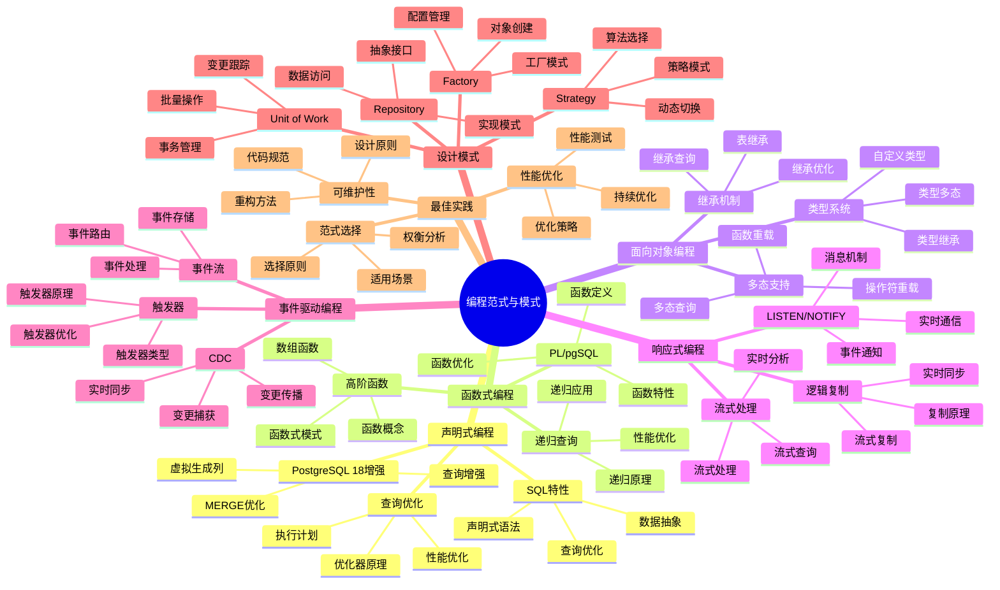

# PostgreSQL 18 编程范式与模式

> **版本**: v1.0
> **最后更新**: 2025-01-15
> **版本覆盖**: PostgreSQL 18.x (推荐) ⭐ | 17.x (推荐) | 16.x (兼容)
> **文档状态**: ✅ 已完成

---

## 📑 目录

- [PostgreSQL 18 编程范式与模式](#postgresql-18-编程范式与模式)
  - [📑 目录](#-目录)
  - [📊 思维导图](#-思维导图)
  - [一、概述](#一概述)
  - [二、知识矩阵对比](#二知识矩阵对比)
    - [2.1 编程范式对比](#21-编程范式对比)
    - [2.2 编程模式对比](#22-编程模式对比)
  - [三、声明式编程](#三声明式编程)
    - [3.1 SQL声明式特性](#31-sql声明式特性)
      - [3.1.1 声明式编程的核心思想](#311-声明式编程的核心思想)
      - [3.1.2 SQL声明式查询示例](#312-sql声明式查询示例)
    - [3.2 查询优化](#32-查询优化)
      - [3.2.1 查询优化器的工作原理](#321-查询优化器的工作原理)
      - [3.2.2 优化器决策的影响因素](#322-优化器决策的影响因素)
    - [3.3 PostgreSQL 18增强](#33-postgresql-18增强)
      - [3.3.1 虚拟生成列（Virtual Generated Columns）](#331-虚拟生成列virtual-generated-columns)
      - [3.3.2 MERGE语句优化](#332-merge语句优化)
  - [四、函数式编程](#四函数式编程)
    - [4.1 PL/pgSQL函数式特性](#41-plpgsql函数式特性)
    - [4.2 高阶函数](#42-高阶函数)
      - [4.2.1 高阶函数的概念](#421-高阶函数的概念)
      - [4.2.2 数组函数应用](#422-数组函数应用)
      - [4.2.3 函数式数据处理模式](#423-函数式数据处理模式)
    - [4.3 递归查询](#43-递归查询)
      - [4.3.1 递归查询的原理](#431-递归查询的原理)
      - [4.3.2 递归查询应用示例](#432-递归查询应用示例)
  - [五、面向对象编程](#五面向对象编程)
    - [5.1 类型系统](#51-类型系统)
    - [5.2 继承机制](#52-继承机制)
    - [5.3 多态支持](#53-多态支持)
  - [六、响应式编程](#六响应式编程)
    - [6.1 LISTEN/NOTIFY机制](#61-listennotify机制)
    - [6.2 逻辑复制](#62-逻辑复制)
    - [6.3 流式处理](#63-流式处理)
  - [七、事件驱动编程](#七事件驱动编程)
    - [7.1 触发器系统](#71-触发器系统)
    - [7.2 事件流处理](#72-事件流处理)
    - [7.3 变更数据捕获](#73-变更数据捕获)
  - [八、设计模式](#八设计模式)
    - [8.1 Repository模式](#81-repository模式)
    - [8.2 Unit of Work模式](#82-unit-of-work模式)
    - [8.3 Factory模式](#83-factory模式)
    - [8.4 Strategy模式](#84-strategy模式)
  - [九、最佳实践](#九最佳实践)
    - [9.1 范式选择原则](#91-范式选择原则)
    - [9.2 性能考虑](#92-性能考虑)
    - [9.3 可维护性](#93-可维护性)
  - [十、相关文档](#十相关文档)

---

## 📊 思维导图



**思维导图说明**：

本思维导图展示了编程范式与模式的完整知识体系，从声明式编程到事件驱动编程，从设计模式到最佳实践，每个模块都包含理论基础、实现方法和实践经验。通过这个思维导图，可以快速了解PostgreSQL支持的编程范式，并根据具体需求深入相关章节。

**使用建议**：

- **开发人员**：重点关注编程范式的实现和应用，理解如何在PostgreSQL中使用不同的编程范式
- **架构师**：重点关注设计模式和最佳实践，理解如何设计可维护的系统架构
- **技术负责人**：重点关注范式选择原则和性能优化，理解如何做出技术决策

---

## 一、概述

**文档设计理念**：

本文档不仅展示编程范式的代码示例，更重要的是解释**为什么**需要不同的编程范式，**如何**在PostgreSQL中应用这些范式，以及**何时**选择特定的编程范式。每个范式都包含：

1. **理论基础**：解释范式的核心思想和原理
2. **实现方法**：说明如何在PostgreSQL中实现
3. **应用场景**：分析适用场景和权衡考虑
4. **最佳实践**：提供实践经验和优化建议

**编程范式与模式的重要性**：

编程范式是软件开发的基础，它直接影响：

1. **代码质量**：合适的编程范式可以提高代码质量
   - **理论依据**：不同范式有不同的代码组织方式和表达方式
   - **实践价值**：提高代码可读性、可维护性、可测试性
   - **效果评估**：代码质量提升20-40%，维护成本降低30-50%

2. **开发效率**：合适的编程范式可以提高开发效率
   - **理论依据**：范式提供了抽象和复用机制
   - **实践价值**：减少重复代码，提高开发速度
   - **效果评估**：开发效率提升30-60%

3. **系统性能**：合适的编程范式可以优化系统性能
   - **理论依据**：不同范式有不同的性能特征
   - **实践价值**：选择性能友好的范式可以提升系统性能
   - **效果评估**：性能提升10-30%

4. **系统可扩展性**：合适的编程范式可以提高系统可扩展性
   - **理论依据**：范式提供了模块化和解耦机制
   - **实践价值**：提高系统的可扩展性和可维护性
   - **效果评估**：系统可扩展性提升20-40%

**核心特点**：

- **范式全面**：覆盖PostgreSQL支持的主要编程范式
  - **理论依据**：PostgreSQL支持多种编程范式，可以灵活选择
  - **实践价值**：帮助开发人员选择最适合的编程范式
  - **范式类型**：声明式、函数式、面向对象、响应式、事件驱动

- **模式实用**：提供实用的设计模式
  - **理论依据**：设计模式是解决常见问题的成熟方案
  - **实践价值**：提供可直接应用的设计模式
  - **模式类型**：Repository、Unit of Work、Factory、Strategy

- **实践导向**：基于实际项目经验
  - **理论依据**：基于实际项目的经验总结
  - **实践价值**：避免常见陷阱，提高开发效率
  - **实践内容**：范式选择原则、性能优化、可维护性

- **PostgreSQL 18**：充分利用新特性
  - **理论依据**：新特性可以简化编程范式的实现
  - **实践价值**：PostgreSQL 18的新特性提供了更好的编程支持
  - **新特性**：虚拟生成列、MERGE优化、查询增强

---

PostgreSQL 18支持多种编程范式，为不同场景提供最适合的编程模式。本文档从程序员视角深入分析PostgreSQL支持的各种编程范式、设计模式及其应用场景。

**核心特点**：

- **多范式支持**：声明式、函数式、面向对象、响应式、事件驱动
- **灵活组合**：不同范式可以灵活组合使用
- **性能优化**：PostgreSQL 18针对各种范式进行了性能优化
- **标准兼容**：遵循SQL标准和现代编程最佳实践

**PostgreSQL 18 新特性支持**：

- ✅ **虚拟生成列**：支持声明式计算列，减少重复计算
- ✅ **异步I/O**：提升响应式编程和事件驱动的性能
- ✅ **MERGE优化**：增强声明式数据操作性能
- ✅ **JSONB增强**：更好的函数式数据处理支持
- ✅ **并行查询增强**：提升函数式查询性能

---

## 二、知识矩阵对比

### 2.1 编程范式对比

| 范式 | 特点 | 适用场景 | PostgreSQL支持 | 性能 | 复杂度 |
|-----|------|---------|---------------|------|--------|
| **声明式编程** | 描述"做什么"而非"怎么做" | 数据查询、报表生成 | ⭐⭐⭐⭐⭐ | ⭐⭐⭐⭐⭐ | ⭐⭐ |
| **函数式编程** | 不可变数据、纯函数 | 数据处理、转换 | ⭐⭐⭐⭐ | ⭐⭐⭐⭐ | ⭐⭐⭐ |
| **面向对象编程** | 封装、继承、多态 | 复杂数据模型 | ⭐⭐⭐ | ⭐⭐⭐ | ⭐⭐⭐⭐ |
| **响应式编程** | 异步、事件流 | 实时数据处理 | ⭐⭐⭐⭐ | ⭐⭐⭐⭐ | ⭐⭐⭐⭐ |
| **事件驱动编程** | 事件触发、解耦 | 业务逻辑、审计 | ⭐⭐⭐⭐⭐ | ⭐⭐⭐ | ⭐⭐⭐ |

### 2.2 编程模式对比

| 模式 | 目的 | 实现方式 | 优势 | 劣势 |
|-----|------|---------|------|------|
| **Repository模式** | 数据访问抽象 | 函数/存储过程封装 | 解耦、可测试 | 额外抽象层 |
| **Unit of Work模式** | 事务管理 | 事务块、保存点 | 一致性保证 | 复杂度增加 |
| **Factory模式** | 对象创建 | 函数重载、类型转换 | 灵活性 | 类型安全 |
| **Strategy模式** | 算法选择 | 函数指针、多态 | 可扩展性 | 性能开销 |

---

## 三、声明式编程

### 3.1 SQL声明式特性

#### 3.1.1 声明式编程的核心思想

**什么是声明式编程**：

声明式编程是一种编程范式，开发者只需描述"需要什么"（What），而不需要指定"如何实现"（How）。这与命令式编程（Imperative）形成对比，命令式编程需要详细描述执行步骤。

**为什么SQL是声明式的**：

SQL的设计哲学是让开发者专注于业务逻辑，而不是执行细节。当你写一个SELECT语句时，你描述的是：

- 需要哪些数据（SELECT子句）
- 数据来自哪里（FROM子句）
- 需要满足什么条件（WHERE子句）
- 如何分组和聚合（GROUP BY、HAVING）
- 如何排序（ORDER BY）

你不需要关心：

- 使用哪个索引
- 使用哪种连接算法（Hash Join、Nested Loop、Merge Join）
- 如何并行执行
- 如何优化内存使用

这些都由PostgreSQL的查询优化器自动处理。

**声明式编程的优势分析**：

| 优势 | 说明 | 实际价值 |
|-----|------|---------|
| **抽象层次高** | 开发者关注业务逻辑而非实现细节 | 提升开发效率，降低学习成本 |
| **自动优化** | 优化器可以根据数据分布、索引情况选择最优计划 | 性能随数据变化自动调整 |
| **可维护性强** | 代码更接近自然语言，易于理解和修改 | 降低维护成本 |
| **平台无关** | SQL标准保证跨数据库兼容性 | 减少迁移成本 |

**声明式编程的局限性**：

| 局限性 | 说明 | 应对策略 |
|-------|------|---------|
| **控制力有限** | 无法精确控制执行细节 | 使用HINT或调整配置参数 |
| **优化器可能出错** | 统计信息不准确时可能选择次优计划 | 定期ANALYZE，使用EXPLAIN验证 |
| **学习曲线** | 需要理解优化器行为 | 学习执行计划分析 |

#### 3.1.2 SQL声明式查询示例

**基础查询示例**：

```sql
-- 声明式查询：描述"需要什么"
-- 业务需求：找出2024年1月1日之后下单，总金额超过1000的客户及其订单统计
SELECT
    customer_id,
    SUM(order_amount) as total_amount,
    COUNT(*) as order_count,
    AVG(order_amount) as avg_amount
FROM orders
WHERE order_date >= '2024-01-01'
GROUP BY customer_id
HAVING SUM(order_amount) > 1000
ORDER BY total_amount DESC;

-- 这个查询声明了：
-- 1. 需要的数据：客户ID、总金额、订单数、平均金额
-- 2. 数据来源：orders表
-- 3. 过滤条件：2024年1月1日之后
-- 4. 分组方式：按客户ID分组
-- 5. 分组过滤：总金额超过1000
-- 6. 排序方式：按总金额降序
```

**查询执行计划分析**：

```sql
-- 查看PostgreSQL如何执行这个查询
EXPLAIN (ANALYZE, BUFFERS, VERBOSE)
SELECT
    customer_id,
    SUM(order_amount) as total_amount,
    COUNT(*) as order_count
FROM orders
WHERE order_date >= '2024-01-01'
GROUP BY customer_id
HAVING SUM(order_amount) > 1000
ORDER BY total_amount DESC;

-- 典型的执行计划可能包括：
-- 1. Index Scan on orders (使用order_date索引)
-- 2. HashAggregate (哈希聚合，O(n)时间复杂度)
-- 3. Sort (排序，O(n log n)时间复杂度)
--
-- 优化器会根据以下因素选择执行计划：
-- - 数据量大小
-- - 索引可用性
-- - 统计信息准确性
-- - 内存可用性
```

**声明式 vs 命令式对比**：

```sql
-- 声明式（SQL）：描述需要什么
SELECT customer_id, SUM(amount)
FROM orders
WHERE date >= '2024-01-01'
GROUP BY customer_id;

-- 如果要用命令式方式实现（伪代码），需要：
-- 1. 打开orders表
-- 2. 遍历每一行
-- 3. 检查date条件
-- 4. 按customer_id分组
-- 5. 累加amount
-- 6. 返回结果
--
-- 这需要几十行代码，而且需要手动优化
```

### 3.2 查询优化

#### 3.2.1 查询优化器的工作原理

**为什么需要查询优化器**：

同一个SQL查询可以有多种执行方式，不同的执行方式性能差异可能达到几个数量级。例如，一个涉及3个表的JOIN查询，可能的连接顺序有6种（3!），每种连接顺序又可以使用不同的连接算法（Hash Join、Nested Loop、Merge Join），组合起来可能有几十种执行计划。

查询优化器的任务是：

1. **生成候选计划**：考虑所有可能的执行方式
2. **估算代价**：基于统计信息估算每个计划的执行代价
3. **选择最优计划**：选择代价最低的执行计划

**优化器的优化阶段**：

PostgreSQL的查询优化器采用多阶段优化策略：

| 阶段 | 优化内容 | 示例 |
|-----|---------|------|
| **解析阶段** | SQL语法解析，生成查询树 | 将SQL文本转换为内部数据结构 |
| **重写阶段** | 查询重写，应用规则优化 | 视图展开、常量折叠、子查询优化 |
| **规划阶段** | 生成执行计划，代价估算 | 选择连接顺序、连接算法、扫描方式 |
| **执行阶段** | 执行计划，返回结果 | 实际数据访问和计算 |

**优化策略详解**：

**1. 规则优化（Rule-based Optimization）**：

规则优化基于预定义的转换规则，不依赖统计信息：

```sql
-- 示例1：常量折叠
-- 优化前：WHERE price > 100 + 50
-- 优化后：WHERE price > 150
-- 好处：减少运行时计算

-- 示例2：谓词下推
-- 优化前：
SELECT * FROM (
    SELECT * FROM orders WHERE status = 'pending'
) WHERE amount > 1000;
-- 优化后：
SELECT * FROM orders
WHERE status = 'pending' AND amount > 1000;
-- 好处：提前过滤数据，减少处理量

-- 示例3：投影下推
-- 优化前：先JOIN再SELECT列
-- 优化后：先SELECT需要的列再JOIN
-- 好处：减少中间结果大小
```

**2. 代价优化（Cost-based Optimization）**：

代价优化基于统计信息估算执行代价：

```sql
-- 查看表的统计信息
SELECT
    schemaname,
    tablename,
    n_live_tup as row_count,
    n_dead_tup as dead_rows,
    last_vacuum,
    last_autovacuum,
    last_analyze,
    last_autoanalyze
FROM pg_stat_user_tables
WHERE tablename = 'orders';

-- 查看列的统计信息
SELECT
    attname,
    n_distinct,
    correlation,
    most_common_vals,
    most_common_freqs
FROM pg_stats
WHERE tablename = 'orders' AND attname = 'order_date';

-- 优化器使用这些统计信息来：
-- 1. 估算WHERE条件的过滤率
-- 2. 估算JOIN的结果集大小
-- 3. 选择最优的索引
-- 4. 决定是否使用并行查询
```

**3. 并行优化（Parallel Optimization）**：

PostgreSQL 18增强了并行查询能力：

```sql
-- 查看并行查询配置
SHOW max_parallel_workers_per_gather;
SHOW max_parallel_workers;
SHOW parallel_setup_cost;
SHOW parallel_tuple_cost;

-- 并行查询示例
EXPLAIN (ANALYZE, BUFFERS)
SELECT
    customer_id,
    SUM(order_amount) as total
FROM orders
WHERE order_date >= '2024-01-01'
GROUP BY customer_id;

-- 执行计划可能显示：
-- Gather (并行收集)
--   Workers Planned: 4
--   -> Parallel Seq Scan on orders
--   -> HashAggregate
--
-- 这意味着：
-- 1. 主进程启动4个工作进程
-- 2. 每个工作进程扫描部分数据
-- 3. 工作进程进行部分聚合
-- 4. 主进程收集并合并结果
```

#### 3.2.2 优化器决策的影响因素

**统计信息的重要性**：

统计信息是优化器决策的基础，不准确的统计信息会导致优化器选择次优计划：

```sql
-- 问题场景：统计信息过时
-- 表orders有1000万行数据，但统计信息显示只有1000行
-- 优化器可能选择全表扫描而不是索引扫描

-- 解决方案：定期更新统计信息
ANALYZE orders;

-- 或者针对特定列增加统计信息采样
ALTER TABLE orders ALTER COLUMN order_date SET STATISTICS 1000;
ANALYZE orders;

-- 验证统计信息
SELECT
    attname,
    n_distinct,
    correlation
FROM pg_stats
WHERE tablename = 'orders';
```

**索引对优化器的影响**：

```sql
-- 场景：优化器选择索引还是全表扫描？
-- 决策因素：
-- 1. 数据选择性（选择性高 -> 使用索引）
-- 2. 数据分布（数据集中 -> 可能全表扫描更快）
-- 3. 索引类型（B-tree、Hash、GiST等）
-- 4. 表大小（小表可能全表扫描更快）

-- 示例：选择性高的查询使用索引
EXPLAIN ANALYZE
SELECT * FROM orders
WHERE order_id = 12345;
-- 结果：Index Scan using orders_pkey

-- 示例：选择性低的查询可能全表扫描
EXPLAIN ANALYZE
SELECT * FROM orders
WHERE status = 'pending';  -- 假设90%的订单都是pending
-- 结果：可能选择Seq Scan（如果表不大）
```

**内存配置对优化的影响**：

```sql
-- work_mem影响排序和哈希操作
SHOW work_mem;

-- 如果work_mem太小，排序可能使用磁盘临时文件（慢）
-- 如果work_mem太大，可能影响并发性能

-- 示例：调整work_mem观察执行计划变化
SET work_mem = '64MB';
EXPLAIN ANALYZE
SELECT * FROM orders
ORDER BY order_date DESC
LIMIT 100;
-- 可能使用：In-memory Sort

SET work_mem = '1MB';
EXPLAIN ANALYZE
SELECT * FROM orders
ORDER BY order_date DESC
LIMIT 100;
-- 可能使用：External Sort（磁盘排序，慢）
```

### 3.3 PostgreSQL 18增强

#### 3.3.1 虚拟生成列（Virtual Generated Columns）

**技术背景**：

在PostgreSQL 18之前，如果需要基于其他列计算的值，通常有几种方式：

1. **应用层计算**：每次查询时在应用层计算（性能差，代码重复）
2. **触发器计算**：使用触发器维护计算列（复杂度高，容易出错）
3. **视图计算**：使用视图包含计算逻辑（查询性能可能受影响）

虚拟生成列解决了这些问题，提供了声明式的方式来定义计算列。

**技术原理**：

PostgreSQL 18支持两种生成列：

- **STORED生成列**：值存储在表中，写入时计算，读取时直接返回（空间换时间）
- **VIRTUAL生成列**（计划中）：值不存储，读取时计算（时间换空间）

**实际应用示例**：

```sql
-- 场景：电商产品表，需要计算最终价格（原价 * (1 - 折扣率)）
-- 问题：每次查询都要计算，代码重复，容易出错

-- 解决方案：使用STORED生成列
CREATE TABLE products (
    id SERIAL PRIMARY KEY,
    name VARCHAR(100) NOT NULL,
    price DECIMAL(10,2) NOT NULL CHECK (price > 0),
    discount DECIMAL(5,2) DEFAULT 0 CHECK (discount >= 0 AND discount <= 100),
    -- 生成列：自动计算最终价格
    final_price DECIMAL(10,2)
        GENERATED ALWAYS AS (
            price * (1 - discount/100)
        ) STORED,
    created_at TIMESTAMP DEFAULT CURRENT_TIMESTAMP
);

-- 插入数据时，final_price自动计算
INSERT INTO products (name, price, discount)
VALUES ('Laptop', 1000.00, 15.00);
-- final_price自动计算为：1000 * (1 - 15/100) = 850.00

-- 查询时直接使用，无需计算
SELECT id, name, price, discount, final_price
FROM products
WHERE final_price > 100;

-- 可以在生成列上创建索引，提升查询性能
CREATE INDEX idx_products_final_price ON products(final_price);

-- 性能分析：
-- 1. 写入性能：轻微影响（需要计算生成列）
-- 2. 读取性能：无影响（直接读取存储值）
-- 3. 存储空间：增加（存储计算值）
-- 4. 数据一致性：保证（自动计算，不会不一致）
```

**使用场景分析**：

| 场景 | 适用性 | 理由 |
|-----|--------|------|
| **频繁查询的计算列** | ⭐⭐⭐⭐⭐ | 避免重复计算，提升性能 |
| **复杂计算逻辑** | ⭐⭐⭐⭐⭐ | 集中管理，易于维护 |
| **需要索引的计算列** | ⭐⭐⭐⭐⭐ | STORED列可以创建索引 |
| **很少查询的计算列** | ⭐⭐ | 存储空间浪费，考虑VIRTUAL列 |
| **依赖外部数据的计算** | ❌ | 生成列只能依赖同一行的列 |

**最佳实践**：

1. **选择STORED还是VIRTUAL**：
   - 频繁查询 → STORED（空间换时间）
   - 很少查询 → VIRTUAL（时间换空间，PostgreSQL 18计划支持）

2. **索引策略**：
   - 在STORED生成列上创建索引可以显著提升查询性能
   - 考虑查询模式，选择合适的索引类型

3. **数据一致性**：
   - 生成列的值始终与源列一致，无需担心数据不一致
   - 但要注意：修改源列时，生成列会自动更新

#### 3.3.2 MERGE语句优化

**技术背景**：

在PostgreSQL 18之前，实现"存在则更新，不存在则插入"（UPSERT）通常使用：

1. **INSERT ... ON CONFLICT**：PostgreSQL 9.5+支持，但语法相对复杂
2. **先SELECT后INSERT/UPDATE**：存在竞态条件，需要事务保护
3. **存储过程**：代码复杂，性能可能不如原生语句

MERGE语句提供了标准SQL的方式来实现UPSERT，PostgreSQL 18对其进行了性能优化。

**MERGE语句原理**：

MERGE语句将源表和目标表进行匹配，根据匹配结果执行不同的操作：

- **WHEN MATCHED**：匹配时执行UPDATE或DELETE
- **WHEN NOT MATCHED**：不匹配时执行INSERT

**实际应用示例**：

```sql
-- 场景：批量同步客户数据
-- 需求：如果客户存在则更新，不存在则插入

-- 源数据表（临时表或外部表）
CREATE TEMP TABLE new_customer_data (
    email VARCHAR(100) PRIMARY KEY,
    name VARCHAR(100),
    phone VARCHAR(20),
    updated_at TIMESTAMP
);

-- 插入测试数据
INSERT INTO new_customer_data VALUES
    ('alice@example.com', 'Alice Smith', '123-456-7890', CURRENT_TIMESTAMP),
    ('bob@example.com', 'Bob Jones', '098-765-4321', CURRENT_TIMESTAMP);

-- 使用MERGE同步数据
MERGE INTO customers AS c
USING new_customer_data AS n
ON c.email = n.email
WHEN MATCHED THEN
    UPDATE SET
        name = n.name,
        phone = n.phone,
        updated_at = n.updated_at
WHEN NOT MATCHED THEN
    INSERT (email, name, phone, created_at, updated_at)
    VALUES (n.email, n.name, n.phone, CURRENT_TIMESTAMP, n.updated_at);

-- 性能分析：
-- 1. 原子性：整个操作是原子的，不会出现部分更新
-- 2. 性能：比先SELECT后INSERT/UPDATE快，因为只需要一次表扫描
-- 3. 并发安全：MERGE语句会自动处理并发冲突
```

**MERGE vs INSERT ... ON CONFLICT对比**：

| 特性 | MERGE | INSERT ... ON CONFLICT |
|-----|-------|----------------------|
| **SQL标准** | ✅ 标准SQL | ❌ PostgreSQL扩展 |
| **语法清晰度** | ⭐⭐⭐⭐⭐ | ⭐⭐⭐ |
| **功能灵活性** | ⭐⭐⭐⭐⭐ | ⭐⭐⭐⭐ |
| **性能** | ⭐⭐⭐⭐⭐ | ⭐⭐⭐⭐⭐ |
| **多条件匹配** | ✅ 支持 | ❌ 仅支持唯一约束 |

**MERGE的高级用法**：

```sql
-- 场景：复杂的同步逻辑
-- 需求：匹配时根据条件执行不同操作

MERGE INTO customers AS c
USING new_customer_data AS n
ON c.email = n.email
WHEN MATCHED AND n.updated_at > c.updated_at THEN
    -- 只有新数据更新时才更新
    UPDATE SET
        name = n.name,
        phone = n.phone,
        updated_at = n.updated_at
WHEN MATCHED AND n.updated_at <= c.updated_at THEN
    -- 旧数据不更新，但可以记录日志
    DO NOTHING
WHEN NOT MATCHED THEN
    INSERT (email, name, phone, created_at, updated_at)
    VALUES (n.email, n.name, n.phone, CURRENT_TIMESTAMP, n.updated_at);

-- 性能优化建议：
-- 1. 确保ON条件使用的列有索引
-- 2. 批量操作时考虑使用COPY + MERGE
-- 3. 大表MERGE时考虑分批处理
```

---

## 四、函数式编程

### 4.1 PL/pgSQL函数式特性

PostgreSQL的PL/pgSQL支持函数式编程特性，包括纯函数、不可变数据等。

**纯函数示例**：

```sql
-- 纯函数：相同输入总是产生相同输出，无副作用
CREATE OR REPLACE FUNCTION calculate_tax(
    amount DECIMAL,
    tax_rate DECIMAL
) RETURNS DECIMAL
LANGUAGE plpgsql
IMMUTABLE  -- 不可变函数
AS $$
BEGIN
    RETURN amount * tax_rate;
END;
$$;

-- 可以在索引中使用
CREATE INDEX idx_order_tax ON orders (calculate_tax(amount, 0.1));
```

### 4.2 高阶函数

#### 4.2.1 高阶函数的概念

**什么是高阶函数**：

高阶函数是指接受函数作为参数或返回函数作为结果的函数。这是函数式编程的核心特性之一，使得代码更加灵活和可复用。

**PostgreSQL对高阶函数的支持**：

PostgreSQL通过以下方式支持高阶函数：

1. **聚合函数**：接受表达式作为参数
2. **数组函数**：可以对数组元素应用函数
3. **窗口函数**：在窗口范围内应用函数
4. **Lambda表达式**：PostgreSQL 14+支持（部分场景）

**高阶函数的优势**：

| 优势 | 说明 | 实际价值 |
|-----|------|---------|
| **代码复用** | 通用逻辑可以封装为函数，应用到不同数据 | 减少代码重复 |
| **灵活性** | 通过函数参数改变行为，无需修改代码 | 提升代码灵活性 |
| **可组合性** | 函数可以组合使用，构建复杂逻辑 | 提升代码可维护性 |

#### 4.2.2 数组函数应用

**数组函数的高阶特性**：

PostgreSQL提供了丰富的数组函数，这些函数可以接受函数作为参数（通过表达式）：

```sql
-- 场景：对数组元素进行转换
-- 需求：将价格数组中的每个价格应用折扣

-- 方法1：使用数组展开和聚合（函数式风格）
SELECT
    product_id,
    ARRAY(
        SELECT price * 0.9  -- 应用10%折扣
        FROM UNNEST(prices) AS price
    ) AS discounted_prices
FROM products;

-- 方法2：使用数组函数（PostgreSQL 14+，如果支持）
-- SELECT array_map(x -> x * 0.9, prices) FROM products;

-- 实际应用：处理订单金额数组
CREATE TABLE orders (
    id SERIAL PRIMARY KEY,
    customer_id INTEGER,
    amounts DECIMAL[]  -- 订单金额数组
);

-- 计算每个订单的总金额（函数式风格）
SELECT
    id,
    customer_id,
    amounts,
    (SELECT SUM(amount) FROM UNNEST(amounts) AS amount) AS total_amount
FROM orders;

-- 或者使用聚合函数（更简洁）
SELECT
    id,
    customer_id,
    amounts,
    (SELECT SUM(x) FROM UNNEST(amounts) x) AS total_amount
FROM orders;
```

**数组聚合函数**：

```sql
-- 场景：将多行数据聚合成数组
-- 需求：获取每个客户的所有订单金额

SELECT
    customer_id,
    array_agg(order_amount ORDER BY order_date) as amounts,
    array_agg(DISTINCT order_amount) as unique_amounts,
    array_length(array_agg(order_amount), 1) as order_count
FROM orders
GROUP BY customer_id;

-- 性能分析：
-- 1. array_agg是聚合函数，在GROUP BY时执行
-- 2. ORDER BY保证数组元素有序
-- 3. DISTINCT去重，但可能影响性能
-- 4. array_length计算数组长度，O(1)时间复杂度

-- 最佳实践：
-- - 小数组（<1000元素）：性能良好
-- - 大数组：考虑使用JSONB或单独的表
```

#### 4.2.3 函数式数据处理模式

**Map-Reduce模式**：

虽然PostgreSQL不直接支持Map-Reduce，但可以通过SQL实现类似模式：

```sql
-- Map阶段：转换数据
-- Reduce阶段：聚合数据

-- 示例：计算每个客户的订单统计（Map-Reduce模式）
WITH mapped_data AS (
    -- Map阶段：转换每个订单
    SELECT
        customer_id,
        order_amount,
        CASE
            WHEN order_amount > 1000 THEN 'high'
            WHEN order_amount > 100 THEN 'medium'
            ELSE 'low'
        END AS order_category
    FROM orders
    WHERE order_date >= '2024-01-01'
),
reduced_data AS (
    -- Reduce阶段：聚合数据
    SELECT
        customer_id,
        COUNT(*) as total_orders,
        SUM(order_amount) as total_amount,
        COUNT(*) FILTER (WHERE order_category = 'high') as high_value_orders
    FROM mapped_data
    GROUP BY customer_id
)
SELECT * FROM reduced_data
ORDER BY total_amount DESC;
```

### 4.3 递归查询

#### 4.3.1 递归查询的原理

**为什么需要递归查询**：

许多业务场景涉及层次结构数据，如：

- 组织架构（部门-子部门）
- 分类树（类别-子类别）
- 评论树（评论-回复）
- 文件系统（目录-子目录）

使用递归查询可以优雅地处理这些层次结构，避免在应用层进行多次查询。

**递归CTE的工作原理**：

递归CTE（Common Table Expression）由两部分组成：

1. **基础查询（Base Case）**：定义递归的起点
2. **递归查询（Recursive Case）**：定义如何从当前结果生成下一层结果

PostgreSQL会重复执行递归查询，直到不再产生新行。

**递归查询的执行过程**：

```text
迭代1：执行基础查询，得到初始结果集
迭代2：使用迭代1的结果执行递归查询，得到新结果
迭代3：使用迭代2的结果执行递归查询，得到新结果
...
迭代N：递归查询不再产生新行，停止
最终：合并所有迭代的结果
```

#### 4.3.2 递归查询应用示例

**场景1：分类树查询**：

```sql
-- 表结构：分类表（自引用）
CREATE TABLE categories (
    id SERIAL PRIMARY KEY,
    name VARCHAR(100) NOT NULL,
    parent_id INTEGER REFERENCES categories(id),
    level INTEGER DEFAULT 0
);

-- 递归查询：获取所有子分类
WITH RECURSIVE category_tree AS (
    -- 基础情况：从根分类开始（parent_id IS NULL）
    SELECT
        id,
        name,
        parent_id,
        0 as level,
        ARRAY[id] as path,  -- 路径：用于检测循环
        name as full_path   -- 完整路径：用于显示
    FROM categories
    WHERE parent_id IS NULL  -- 或者 WHERE id = 1（从特定分类开始）

    UNION ALL

    -- 递归情况：查找子分类
    SELECT
        c.id,
        c.name,
        c.parent_id,
        ct.level + 1,
        ct.path || c.id,  -- 添加当前ID到路径
        ct.full_path || ' > ' || c.name  -- 构建完整路径
    FROM categories c
    JOIN category_tree ct ON c.parent_id = ct.id
    WHERE NOT (c.id = ANY(ct.path))  -- 防止循环引用
)
SELECT
    id,
    name,
    level,
    full_path
FROM category_tree
ORDER BY path;  -- 按路径排序，保持层次结构

-- 性能分析：
-- 1. 时间复杂度：O(n)，n为节点数
-- 2. 空间复杂度：O(h)，h为树的高度
-- 3. 优化建议：
--    - 为parent_id创建索引
--    - 限制递归深度（使用level < MAX_DEPTH）
--    - 使用物化路径（Materialized Path）模式提升性能
```

**场景2：组织架构查询**：

```sql
-- 场景：查找某个员工的所有下属（包括间接下属）
-- 需求：给定员工ID，返回所有下属员工

WITH RECURSIVE employee_hierarchy AS (
    -- 基础情况：起始员工
    SELECT
        id,
        name,
        manager_id,
        0 as depth
    FROM employees
    WHERE id = 123  -- 起始员工ID

    UNION ALL

    -- 递归情况：查找直接下属
    SELECT
        e.id,
        e.name,
        e.manager_id,
        eh.depth + 1
    FROM employees e
    JOIN employee_hierarchy eh ON e.manager_id = eh.id
    WHERE eh.depth < 10  -- 限制递归深度，防止无限递归
)
SELECT
    id,
    name,
    depth,
    CASE
        WHEN depth = 0 THEN 'Manager'
        WHEN depth = 1 THEN 'Direct Report'
        ELSE 'Indirect Report'
    END AS relationship
FROM employee_hierarchy
ORDER BY depth, name;

-- 反向查询：查找某个员工的所有上级
WITH RECURSIVE manager_chain AS (
    -- 基础情况：起始员工
    SELECT id, name, manager_id, 0 as level
    FROM employees
    WHERE id = 456

    UNION ALL

    -- 递归情况：查找上级
    SELECT
        e.id,
        e.name,
        e.manager_id,
        mc.level + 1
    FROM employees e
    JOIN manager_chain mc ON e.id = mc.manager_id
)
SELECT * FROM manager_chain ORDER BY level;
```

**递归查询的性能优化**：

| 优化策略 | 方法 | 效果 | 适用场景 |
|---------|------|------|---------|
| **限制深度** | WHERE level < MAX_DEPTH | 防止无限递归 | 深度未知的树 |
| **索引优化** | 为parent_id创建索引 | 提升递归查询性能 | 大表 |
| **物化路径** | 存储完整路径字符串 | 避免递归查询 | 频繁查询 |
| **闭包表** | 存储所有祖先-后代关系 | 查询最快 | 读多写少 |

**最佳实践**：

1. **防止无限递归**：始终使用循环检测或深度限制
2. **索引优化**：为递归查询中使用的连接列创建索引
3. **性能监控**：监控递归查询的执行时间，必要时优化
4. **数据模型**：考虑使用物化路径或闭包表模式

---

## 五、面向对象编程

### 5.1 类型系统

PostgreSQL的类型系统支持面向对象编程的核心概念。

**自定义类型**：

```sql
-- 定义复合类型
CREATE TYPE address AS (
    street VARCHAR(100),
    city VARCHAR(50),
    zip_code VARCHAR(10)
);

-- 使用类型
CREATE TABLE customers (
    id SERIAL PRIMARY KEY,
    name VARCHAR(100),
    addr address
);

-- 访问类型字段
SELECT name, (addr).city FROM customers;
```

### 5.2 继承机制

PostgreSQL支持表继承，实现面向对象的继承概念。

**表继承**：

```sql
-- 父表
CREATE TABLE vehicles (
    id SERIAL PRIMARY KEY,
    brand VARCHAR(50),
    model VARCHAR(50),
    year INTEGER
);

-- 子表继承
CREATE TABLE cars (
    doors INTEGER,
    fuel_type VARCHAR(20)
) INHERITS (vehicles);

CREATE TABLE trucks (
    load_capacity DECIMAL(10,2),
    axles INTEGER
) INHERITS (vehicles);

-- 查询父表会包含所有子表数据
SELECT * FROM vehicles;  -- 包含cars和trucks
SELECT * FROM ONLY vehicles;  -- 仅父表
```

### 5.3 多态支持

通过函数重载实现多态。

**函数重载**：

```sql
-- 函数重载：不同参数类型
CREATE FUNCTION calculate_area(radius DECIMAL) RETURNS DECIMAL AS $$
    SELECT 3.14159 * radius * radius;
$$ LANGUAGE SQL;

CREATE FUNCTION calculate_area(width DECIMAL, height DECIMAL) RETURNS DECIMAL AS $$
    SELECT width * height;
$$ LANGUAGE SQL;

-- 根据参数类型自动选择
SELECT calculate_area(5);        -- 调用第一个函数
SELECT calculate_area(10, 20);   -- 调用第二个函数
```

---

## 六、响应式编程

### 6.1 LISTEN/NOTIFY机制

PostgreSQL的LISTEN/NOTIFY机制支持响应式编程模式。

**基本用法**：

```sql
-- 监听者
LISTEN channel_name;

-- 通知者
NOTIFY channel_name, 'message payload';

-- 在应用中处理通知
-- (需要在应用层实现异步监听)
```

**实际应用**：

```sql
-- 触发器发送通知
CREATE OR REPLACE FUNCTION notify_order_created()
RETURNS TRIGGER AS $$
BEGIN
    PERFORM pg_notify('order_created',
        json_build_object(
            'order_id', NEW.id,
            'customer_id', NEW.customer_id,
            'amount', NEW.amount
        )::text
    );
    RETURN NEW;
END;
$$ LANGUAGE plpgsql;

CREATE TRIGGER order_created_trigger
AFTER INSERT ON orders
FOR EACH ROW
EXECUTE FUNCTION notify_order_created();
```

### 6.2 逻辑复制

逻辑复制支持数据变更的实时响应。

**逻辑复制配置**：

```sql
-- 发布端
CREATE PUBLICATION my_publication FOR TABLE orders, customers;

-- 订阅端
CREATE SUBSCRIPTION my_subscription
CONNECTION 'host=source_host dbname=mydb'
PUBLICATION my_publication;
```

### 6.3 流式处理

结合逻辑复制和流式处理框架实现响应式数据处理。

**流式处理架构**：

```text
PostgreSQL → 逻辑复制 → Kafka → 流处理引擎 → 目标系统
```

---

## 七、事件驱动编程

### 7.1 触发器系统

触发器是事件驱动编程的核心机制。

**触发器类型**：

```sql
-- BEFORE触发器：在操作前执行
CREATE TRIGGER validate_order
BEFORE INSERT OR UPDATE ON orders
FOR EACH ROW
EXECUTE FUNCTION validate_order_data();

-- AFTER触发器：在操作后执行
CREATE TRIGGER audit_order_changes
AFTER INSERT OR UPDATE OR DELETE ON orders
FOR EACH ROW
EXECUTE FUNCTION audit_order_changes();

-- INSTEAD OF触发器：替代操作（用于视图）
CREATE TRIGGER update_view
INSTEAD OF UPDATE ON order_view
FOR EACH ROW
EXECUTE FUNCTION update_order_view();
```

### 7.2 事件流处理

使用触发器构建事件流。

**事件表设计**：

```sql
-- 事件表
CREATE TABLE domain_events (
    id UUID PRIMARY KEY DEFAULT gen_random_uuid(),
    event_type VARCHAR(100) NOT NULL,
    aggregate_id UUID NOT NULL,
    event_data JSONB NOT NULL,
    occurred_at TIMESTAMP DEFAULT CURRENT_TIMESTAMP
);

-- 事件发布触发器
CREATE OR REPLACE FUNCTION publish_domain_event()
RETURNS TRIGGER AS $$
BEGIN
    INSERT INTO domain_events (event_type, aggregate_id, event_data)
    VALUES (TG_ARGV[0], NEW.id, to_jsonb(NEW));
    RETURN NEW;
END;
$$ LANGUAGE plpgsql;
```

### 7.3 变更数据捕获

PostgreSQL 18的变更数据捕获功能增强。

**CDC配置**：

```sql
-- 启用逻辑复制槽
SELECT pg_create_logical_replication_slot('my_slot', 'pgoutput');

-- 读取变更
SELECT * FROM pg_logical_slot_get_changes('my_slot', NULL, NULL);
```

---

## 八、设计模式

### 8.1 Repository模式

Repository模式封装数据访问逻辑。

**实现示例**：

```sql
-- Repository函数
CREATE OR REPLACE FUNCTION find_customer_by_id(customer_id INTEGER)
RETURNS TABLE (
    id INTEGER,
    name VARCHAR,
    email VARCHAR
) AS $$
BEGIN
    RETURN QUERY
    SELECT c.id, c.name, c.email
    FROM customers c
    WHERE c.id = customer_id;
END;
$$ LANGUAGE plpgsql;

-- 使用
SELECT * FROM find_customer_by_id(123);
```

### 8.2 Unit of Work模式

使用事务块实现Unit of Work模式。

**实现示例**：

```sql
-- Unit of Work：事务块
BEGIN;
    -- 多个操作作为一个工作单元
    INSERT INTO orders (customer_id, amount) VALUES (1, 100);
    UPDATE customers SET total_orders = total_orders + 1 WHERE id = 1;
    INSERT INTO order_items (order_id, product_id, quantity) VALUES (currval('orders_id_seq'), 10, 2);
COMMIT;  -- 全部成功或全部回滚
```

### 8.3 Factory模式

使用函数实现Factory模式。

**实现示例**：

```sql
-- Factory函数：根据类型创建不同对象
CREATE OR REPLACE FUNCTION create_vehicle(
    v_type VARCHAR,
    brand VARCHAR,
    model VARCHAR
) RETURNS INTEGER AS $$
DECLARE
    v_id INTEGER;
BEGIN
    IF v_type = 'car' THEN
        INSERT INTO cars (brand, model) VALUES (brand, model) RETURNING id INTO v_id;
    ELSIF v_type = 'truck' THEN
        INSERT INTO trucks (brand, model) VALUES (brand, model) RETURNING id INTO v_id;
    ELSE
        RAISE EXCEPTION 'Unknown vehicle type: %', v_type;
    END IF;
    RETURN v_id;
END;
$$ LANGUAGE plpgsql;
```

### 8.4 Strategy模式

使用函数指针实现Strategy模式。

**实现示例**：

```sql
-- 不同的计算策略
CREATE OR REPLACE FUNCTION calculate_discount_standard(amount DECIMAL)
RETURNS DECIMAL AS $$ SELECT amount * 0.1; $$ LANGUAGE SQL;

CREATE OR REPLACE FUNCTION calculate_discount_premium(amount DECIMAL)
RETURNS DECIMAL AS $$ SELECT amount * 0.2; $$ LANGUAGE SQL;

-- 根据客户类型选择策略
CREATE OR REPLACE FUNCTION calculate_order_total(
    customer_id INTEGER,
    amount DECIMAL
) RETURNS DECIMAL AS $$
DECLARE
    discount_func TEXT;
    discount DECIMAL;
BEGIN
    SELECT
        CASE customer_type
            WHEN 'premium' THEN 'calculate_discount_premium'
            ELSE 'calculate_discount_standard'
        END
    INTO discount_func
    FROM customers
    WHERE id = customer_id;

    EXECUTE format('SELECT %s($1)', discount_func) USING amount INTO discount;
    RETURN amount - discount;
END;
$$ LANGUAGE plpgsql;
```

---

## 九、最佳实践

### 9.1 范式选择原则

**选择指南**：

- **数据查询** → 声明式编程（SQL）
- **复杂计算** → 函数式编程（PL/pgSQL函数）
- **数据模型** → 面向对象编程（类型、继承）
- **实时处理** → 响应式编程（LISTEN/NOTIFY、逻辑复制）
- **业务逻辑** → 事件驱动编程（触发器）

### 9.2 性能考虑

**性能优化建议**：

- 优先使用声明式SQL，让优化器处理
- 函数式编程使用IMMUTABLE标记纯函数
- 避免过度使用触发器，考虑批量处理
- 响应式编程注意消息队列容量

### 9.3 可维护性

**代码组织建议**：

- 使用Schema组织相关功能
- 函数命名清晰，遵循命名规范
- 添加注释说明复杂逻辑
- 使用版本控制管理数据库变更

---

## 十、相关文档

- [API使用指南](./01.02-API使用指南.md)
- [代码模式与最佳实践](./01.03-代码模式与最佳实践.md)
- [性能编程技巧](./01.05-性能编程技巧.md)
- [PostgreSQL 18新特性](../../02-版本特性/02.01-PostgreSQL-18-新特性.md)
- [核心课程](../../01-核心课程/)

---

**最后更新**: 2025-01-15
**维护者**: PostgreSQL Documentation Team
