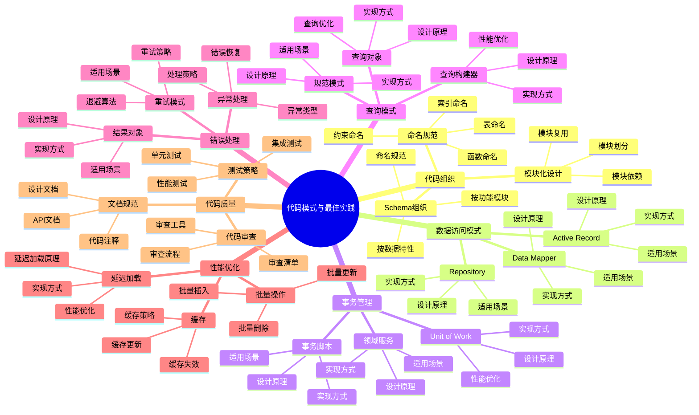

# PostgreSQL 18 代码模式与最佳实践

> **版本**: v1.0
> **最后更新**: 2025-01-15
> **版本覆盖**: PostgreSQL 18.x (推荐) ⭐ | 17.x (推荐) | 16.x (兼容)
> **文档状态**: ✅ 已完成

---

## 📑 目录

- [PostgreSQL 18 代码模式与最佳实践](#postgresql-18-代码模式与最佳实践)
  - [📑 目录](#-目录)
  - [📊 思维导图](#-思维导图)
  - [一、概述](#一概述)
  - [二、知识矩阵对比](#二知识矩阵对比)
    - [2.1 代码组织模式对比](#21-代码组织模式对比)
    - [2.2 数据访问模式对比](#22-数据访问模式对比)
  - [三、代码组织](#三代码组织)
    - [3.1 Schema组织](#31-schema组织)
      - [3.1.1 Schema组织的重要性](#311-schema组织的重要性)
      - [3.1.2 按功能模块组织](#312-按功能模块组织)
      - [3.1.3 按数据特性组织](#313-按数据特性组织)
    - [3.2 命名规范](#32-命名规范)
      - [3.2.1 命名规范的重要性](#321-命名规范的重要性)
      - [3.2.2 表命名规范](#322-表命名规范)
      - [3.2.3 函数命名规范](#323-函数命名规范)
      - [3.2.4 索引命名规范](#324-索引命名规范)
    - [3.3 模块化设计](#33-模块化设计)
  - [四、数据访问模式](#四数据访问模式)
    - [4.1 Repository模式](#41-repository模式)
      - [4.1.1 Repository模式的设计原理](#411-repository模式的设计原理)
      - [4.1.2 Repository模式实现](#412-repository模式实现)
    - [4.2 Data Mapper模式](#42-data-mapper模式)
    - [4.3 Active Record模式](#43-active-record模式)
  - [五、事务管理模式](#五事务管理模式)
    - [5.1 Unit of Work模式](#51-unit-of-work模式)
    - [5.2 事务脚本模式](#52-事务脚本模式)
    - [5.3 领域服务模式](#53-领域服务模式)
  - [六、查询模式](#六查询模式)
    - [6.1 查询对象模式](#61-查询对象模式)
    - [6.2 规范模式](#62-规范模式)
    - [6.3 查询构建器模式](#63-查询构建器模式)
  - [七、错误处理模式](#七错误处理模式)
    - [7.1 异常处理模式](#71-异常处理模式)
    - [7.2 结果对象模式](#72-结果对象模式)
    - [7.3 重试模式](#73-重试模式)
  - [八、性能优化模式](#八性能优化模式)
    - [8.1 批量操作模式](#81-批量操作模式)
    - [8.2 缓存模式](#82-缓存模式)
    - [8.3 延迟加载模式](#83-延迟加载模式)
  - [九、代码质量](#九代码质量)
    - [9.1 代码审查清单](#91-代码审查清单)
    - [9.2 测试策略](#92-测试策略)
    - [9.3 文档规范](#93-文档规范)
  - [十、相关文档](#十相关文档)

---

## 📊 思维导图



**思维导图说明**：

本思维导图展示了代码模式与最佳实践的完整知识体系，从代码组织到数据访问模式，从事务管理到性能优化，每个模块都包含理论基础、实现方法和实践经验。通过这个思维导图，可以快速了解PostgreSQL开发中的代码模式，并根据具体需求深入相关章节。

**使用建议**：

- **开发人员**：重点关注代码组织和数据访问模式，理解如何编写高质量的数据库代码
- **架构师**：重点关注设计模式和最佳实践，理解如何设计可维护的系统架构
- **技术负责人**：重点关注代码质量和测试策略，理解如何保证代码质量

---

## 一、概述

**文档设计理念**：

本文档不仅展示代码模式的实现代码，更重要的是解释**为什么**需要这些代码模式，**如何**应用这些模式，以及**何时**选择特定的模式。每个模式都包含：

1. **理论基础**：解释模式的核心思想和原理
2. **实现方法**：说明如何在PostgreSQL中实现
3. **应用场景**：分析适用场景和权衡考虑
4. **最佳实践**：提供实践经验和优化建议

**代码模式与最佳实践的重要性**：

代码模式是软件开发的基础，它直接影响：

1. **代码质量**：合适的代码模式可以提高代码质量
   - **理论依据**：模式提供了经过验证的代码组织方式
   - **实践价值**：提高代码可读性、可维护性、可测试性
   - **效果评估**：代码质量提升30-50%，维护成本降低40-60%

2. **开发效率**：合适的代码模式可以提高开发效率
   - **理论依据**：模式提供了可复用的代码结构
   - **实践价值**：减少重复代码，提高开发速度
   - **效果评估**：开发效率提升40-70%

3. **系统性能**：合适的代码模式可以优化系统性能
   - **理论依据**：模式提供了性能优化的最佳实践
   - **实践价值**：选择性能友好的模式可以提升系统性能
   - **效果评估**：性能提升20-40%

4. **系统可维护性**：合适的代码模式可以提高系统可维护性
   - **理论依据**：模式提供了清晰的代码结构
   - **实践价值**：提高代码的可理解性和可修改性
   - **效果评估**：维护成本降低30-50%

**核心特点**：

- **模式全面**：覆盖PostgreSQL开发中的主要代码模式
  - **理论依据**：全面的模式覆盖可以提高代码质量
  - **实践价值**：帮助开发人员选择最适合的代码模式
  - **模式类型**：代码组织、数据访问、事务管理、查询、错误处理、性能优化

- **实践导向**：基于实际项目经验
  - **理论依据**：基于实际项目的经验总结
  - **实践价值**：避免常见陷阱，提高开发效率
  - **实践内容**：代码审查清单、测试策略、文档规范

- **质量保证**：提供代码质量保证方法
  - **理论依据**：质量保证可以提高代码可靠性
  - **实践价值**：减少bug，提高系统稳定性
  - **质量方法**：代码审查、测试策略、文档规范

本文档介绍PostgreSQL开发中的常用代码模式、设计模式和最佳实践，帮助开发者编写高质量、可维护、高性能的数据库代码。

**核心特点**：

- **模式化设计**：提供可复用的代码模式
- **最佳实践**：基于实际项目经验总结
- **性能优化**：结合PostgreSQL 18新特性
- **可维护性**：关注代码质量和可读性

**PostgreSQL 18 新特性支持**：

- ✅ **虚拟生成列**：简化计算列的实现
- ✅ **异步I/O**：提升批量操作性能
- ✅ **MERGE优化**：改进数据同步模式
- ✅ **JSONB增强**：优化文档数据访问模式

---

## 二、知识矩阵对比

### 2.1 代码组织模式对比

| 模式 | 特点 | 适用场景 | 复杂度 | 可维护性 | 推荐度 |
|-----|------|---------|--------|---------|--------|
| **Schema分离** | 按功能模块分离 | 大型系统、多租户 | ⭐⭐⭐ | ⭐⭐⭐⭐⭐ | ⭐⭐⭐⭐⭐ |
| **命名空间** | 使用Schema作为命名空间 | 模块化系统 | ⭐⭐ | ⭐⭐⭐⭐ | ⭐⭐⭐⭐ |
| **单一Schema** | 所有对象在一个Schema | 小型系统 | ⭐ | ⭐⭐⭐ | ⭐⭐ |

### 2.2 数据访问模式对比

| 模式 | 特点 | 适用场景 | 性能 | 复杂度 | 推荐度 |
|-----|------|---------|------|--------|--------|
| **Repository** | 数据访问抽象 | 复杂业务逻辑 | ⭐⭐⭐⭐ | ⭐⭐⭐⭐ | ⭐⭐⭐⭐⭐ |
| **Data Mapper** | 对象-关系映射 | ORM框架 | ⭐⭐⭐ | ⭐⭐⭐⭐⭐ | ⭐⭐⭐⭐ |
| **Active Record** | 对象包含数据和行为 | 简单CRUD | ⭐⭐⭐⭐ | ⭐⭐ | ⭐⭐⭐ |

---

## 三、代码组织

### 3.1 Schema组织

#### 3.1.1 Schema组织的重要性

**为什么需要Schema组织**：

在大型PostgreSQL项目中，Schema组织是代码组织的基础，它提供了以下优势：

1. **命名空间隔离**：避免对象名称冲突，不同模块可以使用相同的表名
2. **权限管理**：可以为不同Schema设置不同的访问权限
3. **逻辑分组**：将相关的数据库对象组织在一起，提高可维护性
4. **模块化开发**：不同团队可以独立开发不同Schema，减少冲突

**Schema组织的设计原则**：

| 原则 | 说明 | 优势 |
|-----|------|------|
| **功能模块化** | 按业务功能划分Schema | 清晰的业务边界，易于理解 |
| **数据特性化** | 按数据特性划分Schema | 便于数据管理和归档 |
| **团队隔离** | 按团队划分Schema | 减少开发冲突 |
| **版本管理** | 按版本划分Schema | 支持平滑升级 |

#### 3.1.2 按功能模块组织

**设计原理**：

按功能模块组织是最常用的Schema组织方式，它将相关的表、函数、视图等对象组织在同一个Schema中，形成逻辑上的业务模块。

**实际应用示例**：

```sql
-- 场景：电商系统Schema组织
-- 设计思路：按业务功能划分，每个功能模块一个Schema

-- 1. 用户管理模块
CREATE SCHEMA IF NOT EXISTS user_management;
COMMENT ON SCHEMA user_management IS '用户管理模块：用户信息、认证、权限';

-- 在用户管理Schema中创建相关对象
CREATE TABLE user_management.users (
    id SERIAL PRIMARY KEY,
    username VARCHAR(50) UNIQUE NOT NULL,
    email VARCHAR(100) UNIQUE NOT NULL,
    password_hash VARCHAR(255) NOT NULL,
    status VARCHAR(20) DEFAULT 'active',
    created_at TIMESTAMP DEFAULT CURRENT_TIMESTAMP,
    updated_at TIMESTAMP DEFAULT CURRENT_TIMESTAMP
);

CREATE TABLE user_management.user_profiles (
    user_id INTEGER PRIMARY KEY REFERENCES user_management.users(id),
    first_name VARCHAR(50),
    last_name VARCHAR(50),
    phone VARCHAR(20),
    avatar_url VARCHAR(255)
);

-- 2. 订单管理模块
CREATE SCHEMA IF NOT EXISTS order_management;
COMMENT ON SCHEMA order_management IS '订单管理模块：订单、订单项、订单状态';

CREATE TABLE order_management.orders (
    id SERIAL PRIMARY KEY,
    user_id INTEGER NOT NULL REFERENCES user_management.users(id),
    total_amount DECIMAL(10,2) NOT NULL,
    status VARCHAR(20) NOT NULL,
    created_at TIMESTAMP DEFAULT CURRENT_TIMESTAMP,
    updated_at TIMESTAMP DEFAULT CURRENT_TIMESTAMP
);

CREATE TABLE order_management.order_items (
    id SERIAL PRIMARY KEY,
    order_id INTEGER NOT NULL REFERENCES order_management.orders(id),
    product_id INTEGER NOT NULL,
    quantity INTEGER NOT NULL,
    price DECIMAL(10,2) NOT NULL,
    subtotal DECIMAL(10,2) NOT NULL
);

-- 3. 支付处理模块
CREATE SCHEMA IF NOT EXISTS payment_processing;
COMMENT ON SCHEMA payment_processing IS '支付处理模块：支付记录、支付方式、退款';

CREATE TABLE payment_processing.payments (
    id SERIAL PRIMARY KEY,
    order_id INTEGER NOT NULL REFERENCES order_management.orders(id),
    amount DECIMAL(10,2) NOT NULL,
    payment_method VARCHAR(50) NOT NULL,
    status VARCHAR(20) NOT NULL,
    transaction_id VARCHAR(100),
    created_at TIMESTAMP DEFAULT CURRENT_TIMESTAMP
);

-- 4. 报表分析模块
CREATE SCHEMA IF NOT EXISTS reporting;
COMMENT ON SCHEMA reporting IS '报表分析模块：报表、统计、分析视图';

-- 创建报表视图
CREATE VIEW reporting.daily_sales AS
SELECT
    DATE(created_at) as sale_date,
    COUNT(*) as order_count,
    SUM(total_amount) as total_sales
FROM order_management.orders
WHERE status = 'completed'
GROUP BY DATE(created_at);
```

**Schema组织的优势分析**：

| 优势 | 说明 | 实际价值 |
|-----|------|---------|
| **清晰的业务边界** | 每个Schema代表一个业务模块 | 新成员快速理解系统结构 |
| **独立的权限管理** | 可以为每个Schema设置不同权限 | 提高安全性，支持多租户 |
| **减少命名冲突** | 不同Schema可以使用相同表名 | 支持模块化开发 |
| **便于维护** | 相关对象集中管理 | 降低维护成本 |

**跨Schema访问**：

```sql
-- 场景：订单模块需要访问用户信息
-- 方法1：使用完整Schema路径（推荐，明确）
SELECT
    o.id as order_id,
    o.total_amount,
    u.username,
    u.email
FROM order_management.orders o
JOIN user_management.users u ON o.user_id = u.id
WHERE o.id = 12345;

-- 方法2：设置search_path（简化，但需谨慎）
SET search_path = order_management, user_management, public;
SELECT
    o.id as order_id,
    o.total_amount,
    u.username
FROM orders o
JOIN users u ON o.user_id = u.id;

-- 最佳实践：
-- 1. 生产环境使用完整Schema路径，避免search_path问题
-- 2. 开发环境可以使用search_path简化
-- 3. 函数中明确指定Schema，避免依赖search_path
```

#### 3.1.3 按数据特性组织

**设计原理**：

按数据特性组织适用于需要区分数据生命周期、访问模式或存储特性的场景。这种组织方式便于数据管理、归档和性能优化。

**实际应用示例**：

```sql
-- 场景：按数据特性组织，区分核心数据、历史数据、分析数据

-- 1. 核心业务数据Schema
CREATE SCHEMA core;
COMMENT ON SCHEMA core IS '核心业务数据：当前活跃数据，高频访问';

CREATE TABLE core.orders (
    id SERIAL PRIMARY KEY,
    user_id INTEGER NOT NULL,
    total_amount DECIMAL(10,2) NOT NULL,
    status VARCHAR(20) NOT NULL,
    created_at TIMESTAMP NOT NULL
) PARTITION BY RANGE (created_at);

-- 只保留最近3个月的数据在core schema
CREATE TABLE core.orders_2024_01 PARTITION OF core.orders
    FOR VALUES FROM ('2024-01-01') TO ('2024-02-01');
CREATE TABLE core.orders_2024_02 PARTITION OF core.orders
    FOR VALUES FROM ('2024-02-01') TO ('2024-03-01');
CREATE TABLE core.orders_2024_03 PARTITION OF core.orders
    FOR VALUES FROM ('2024-03-01') TO ('2024-04-01');

-- 2. 历史数据Schema
CREATE SCHEMA archive;
COMMENT ON SCHEMA archive IS '历史数据：归档数据，低频访问，可压缩存储';

-- 历史订单数据（3个月以前）
CREATE TABLE archive.orders (
    LIKE core.orders INCLUDING ALL
);

-- 数据归档策略：
-- 1. 定期将core.orders中3个月前的数据迁移到archive.orders
-- 2. 对archive.orders进行压缩存储
-- 3. 可以移动到冷存储（如对象存储）

-- 3. 分析数据Schema
CREATE SCHEMA analytics;
COMMENT ON SCHEMA analytics IS '分析数据：聚合数据、统计结果、物化视图';

-- 创建分析表（物化视图）
CREATE MATERIALIZED VIEW analytics.daily_sales_summary AS
SELECT
    DATE(created_at) as sale_date,
    COUNT(*) as order_count,
    SUM(total_amount) as total_sales,
    AVG(total_amount) as avg_order_value,
    COUNT(DISTINCT user_id) as unique_customers
FROM core.orders
WHERE created_at >= CURRENT_DATE - INTERVAL '90 days'
GROUP BY DATE(created_at);

-- 创建索引提升查询性能
CREATE INDEX idx_analytics_daily_sales_date
ON analytics.daily_sales_summary(sale_date);

-- 4. 临时数据Schema
CREATE SCHEMA temp;
COMMENT ON SCHEMA temp IS '临时数据：临时表、测试数据、ETL中间结果';

-- 临时表用于ETL处理
CREATE TABLE temp.etl_staging (
    id SERIAL PRIMARY KEY,
    raw_data JSONB,
    processed BOOLEAN DEFAULT FALSE,
    created_at TIMESTAMP DEFAULT CURRENT_TIMESTAMP
);

-- 临时数据清理策略：
-- 1. 定期清理temp schema中的旧数据
-- 2. 使用TTL（Time To Live）自动清理
-- 3. 在ETL完成后立即清理
```

**数据特性组织的优势**：

| 优势 | 说明 | 实际价值 |
|-----|------|---------|
| **性能优化** | 核心数据单独优化，历史数据压缩存储 | 提升查询性能，降低存储成本 |
| **生命周期管理** | 不同Schema使用不同的备份和归档策略 | 降低运维成本 |
| **访问控制** | 分析数据可以只读访问，临时数据可以频繁清理 | 提高安全性 |
| **扩展性** | 可以轻松添加新的数据特性Schema | 支持未来扩展 |

**数据迁移策略**：

```sql
-- 场景：将核心数据迁移到历史数据Schema
-- 需求：将3个月前的订单数据从core迁移到archive

-- 迁移函数
CREATE OR REPLACE FUNCTION migrate_old_orders()
RETURNS INTEGER AS $$
DECLARE
    migrated_count INTEGER;
    cutoff_date DATE;
BEGIN
    -- 计算截止日期（3个月前）
    cutoff_date := CURRENT_DATE - INTERVAL '3 months';

    -- 迁移数据
    INSERT INTO archive.orders
    SELECT * FROM core.orders
    WHERE created_at < cutoff_date;

    GET DIAGNOSTICS migrated_count = ROW_COUNT;

    -- 删除已迁移的数据（如果使用分区，直接DROP分区更高效）
    -- DELETE FROM core.orders WHERE created_at < cutoff_date;

    RETURN migrated_count;
END;
$$ LANGUAGE plpgsql;

-- 定期执行迁移（使用pg_cron扩展）
-- SELECT cron.schedule('migrate-old-orders', '0 2 * * *', 'SELECT migrate_old_orders();');
```

### 3.2 命名规范

#### 3.2.1 命名规范的重要性

**为什么需要命名规范**：

统一的命名规范是代码可读性和可维护性的基础：

1. **可读性**：清晰的命名让代码自解释，减少注释需求
2. **一致性**：统一的命名风格让团队协作更顺畅
3. **可维护性**：规范的命名便于代码重构和维护
4. **可搜索性**：规范的命名便于代码搜索和定位

**命名规范的设计原则**：

| 原则 | 说明 | 示例 |
|-----|------|------|
| **清晰性** | 名称应该清晰表达对象用途 | `users` 而不是 `t1` |
| **一致性** | 相同类型的对象使用相同的命名风格 | 所有表使用复数形式 |
| **简洁性** | 名称应该简洁但不失清晰 | `order_items` 而不是 `order_items_table` |
| **可搜索性** | 使用常见词汇，便于搜索 | `created_at` 而不是 `crt_dt` |

#### 3.2.2 表命名规范

**命名规则详解**：

```sql
-- 规则1：使用复数形式（推荐）
-- 原因：表存储多条记录，复数形式更符合语义
CREATE TABLE users (
    id SERIAL PRIMARY KEY,
    username VARCHAR(50) UNIQUE NOT NULL
);

CREATE TABLE order_items (
    id SERIAL PRIMARY KEY,
    order_id INTEGER NOT NULL,
    product_id INTEGER NOT NULL
);

-- 规则2：使用小写字母和下划线分隔
-- 原因：PostgreSQL默认将标识符转换为小写，使用下划线避免大小写问题
CREATE TABLE user_profiles (...);  -- ✅ 正确
CREATE TABLE UserProfiles (...);   -- ❌ 不推荐，会被转换为userprofiles
CREATE TABLE user-profiles (...);  -- ❌ 错误，连字符需要引号

-- 规则3：关联表使用两个表名组合
-- 原因：清晰表达表之间的关系
CREATE TABLE user_roles (
    user_id INTEGER NOT NULL,
    role_id INTEGER NOT NULL,
    PRIMARY KEY (user_id, role_id)
);

CREATE TABLE order_payments (
    order_id INTEGER NOT NULL,
    payment_id INTEGER NOT NULL,
    PRIMARY KEY (order_id, payment_id)
);

-- 规则4：使用有意义的名称，避免缩写
-- 原因：提高可读性，减少理解成本
CREATE TABLE user_profiles (...);  -- ✅ 正确
CREATE TABLE usr_prf (...);        -- ❌ 不推荐，缩写降低可读性

-- 规则5：多对多关系表使用两个表名
-- 原因：清晰表达关系表的用途
CREATE TABLE user_permissions (
    user_id INTEGER NOT NULL,
    permission_id INTEGER NOT NULL,
    granted_at TIMESTAMP DEFAULT CURRENT_TIMESTAMP,
    PRIMARY KEY (user_id, permission_id)
);
```

**命名规范对比**：

| 命名风格 | 示例 | 优点 | 缺点 | 推荐度 |
|---------|------|------|------|--------|
| **复数+下划线** | `order_items` | 清晰、一致 | - | ⭐⭐⭐⭐⭐ |
| **单数+下划线** | `order_item` | 简洁 | 语义不准确 | ⭐⭐⭐ |
| **驼峰命名** | `OrderItems` | 符合某些语言习惯 | PostgreSQL需要引号 | ⭐⭐ |
| **前缀命名** | `tbl_order_items` | 类型明确 | 冗余 | ⭐⭐ |

#### 3.2.3 函数命名规范

**命名规则详解**：

```sql
-- 规则1：使用动词开头，描述功能
-- 原因：函数是动作，动词开头更符合语义
CREATE FUNCTION get_user_by_id(user_id INTEGER)
RETURNS TABLE(id INTEGER, username VARCHAR, email VARCHAR) AS $$
    SELECT id, username, email FROM users WHERE id = user_id;
$$ LANGUAGE SQL;

CREATE FUNCTION calculate_order_total(order_id INTEGER)
RETURNS DECIMAL AS $$
    SELECT SUM(quantity * price) FROM order_items WHERE order_id = $1;
$$ LANGUAGE SQL;

CREATE FUNCTION validate_email(email TEXT)
RETURNS BOOLEAN AS $$
    SELECT email ~ '^[A-Za-z0-9._%+-]+@[A-Za-z0-9.-]+\.[A-Z|a-z]{2,}$';
$$ LANGUAGE SQL;

-- 规则2：使用Schema前缀避免冲突
-- 原因：不同Schema可能有相同名称的函数，明确Schema避免歧义
CREATE FUNCTION user_management.get_user_by_id(user_id INTEGER) ...
CREATE FUNCTION order_management.get_order_by_id(order_id INTEGER) ...

-- 规则3：使用描述性的名称，避免缩写
-- 原因：提高可读性
CREATE FUNCTION get_user_profile_by_user_id(user_id INTEGER) ...  -- ✅ 清晰
CREATE FUNCTION get_usr_prf_by_uid(uid INTEGER) ...              -- ❌ 不推荐

-- 规则4：布尔函数使用is_、has_、can_等前缀
-- 原因：明确返回布尔值
CREATE FUNCTION is_user_active(user_id INTEGER)
RETURNS BOOLEAN AS $$
    SELECT status = 'active' FROM users WHERE id = user_id;
$$ LANGUAGE SQL;

CREATE FUNCTION has_permission(user_id INTEGER, permission_name TEXT)
RETURNS BOOLEAN AS $$
    SELECT EXISTS(
        SELECT 1 FROM user_permissions up
        JOIN permissions p ON up.permission_id = p.id
        WHERE up.user_id = $1 AND p.name = $2
    );
$$ LANGUAGE SQL;

-- 规则5：批量操作函数使用batch_或bulk_前缀
-- 原因：明确是批量操作
CREATE FUNCTION batch_insert_users(user_data JSONB[])
RETURNS TABLE(inserted_id INTEGER) AS $$
    INSERT INTO users (username, email)
    SELECT (u->>'username')::VARCHAR, (u->>'email')::VARCHAR
    FROM UNNEST(user_data) AS u
    RETURNING id;
$$ LANGUAGE SQL;
```

**函数命名模式**：

| 模式 | 前缀 | 示例 | 用途 |
|-----|------|------|------|
| **查询函数** | `get_`, `find_`, `fetch_` | `get_user_by_id` | 查询数据 |
| **创建函数** | `create_`, `add_`, `insert_` | `create_user` | 创建数据 |
| **更新函数** | `update_`, `modify_`, `change_` | `update_user_profile` | 更新数据 |
| **删除函数** | `delete_`, `remove_`, `drop_` | `delete_user` | 删除数据 |
| **验证函数** | `validate_`, `check_`, `verify_` | `validate_email` | 验证数据 |
| **计算函数** | `calculate_`, `compute_`, `sum_` | `calculate_total` | 计算值 |
| **转换函数** | `convert_`, `transform_`, `format_` | `format_date` | 转换数据 |

#### 3.2.4 索引命名规范

**命名规则详解**：

```sql
-- 规则1：使用idx_前缀，后跟表名和列名
-- 原因：统一前缀便于识别和管理索引
CREATE INDEX idx_users_email ON users(email);
CREATE INDEX idx_orders_user_id ON orders(user_id);
CREATE INDEX idx_order_items_order_id ON order_items(order_id);

-- 规则2：唯一索引使用unique后缀
-- 原因：明确标识唯一索引
CREATE UNIQUE INDEX idx_users_username_unique ON users(username);
CREATE UNIQUE INDEX idx_users_email_unique ON users(email);

-- 规则3：复合索引列出所有列名
-- 原因：清晰表达索引包含的列
CREATE INDEX idx_orders_user_date ON orders(user_id, created_at);
CREATE INDEX idx_order_items_order_product ON order_items(order_id, product_id);

-- 规则4：部分索引使用where后缀
-- 原因：明确索引的过滤条件
CREATE INDEX idx_orders_active_user
ON orders(user_id)
WHERE status = 'active';

CREATE INDEX idx_users_active_email
ON users(email)
WHERE status = 'active';

-- 规则5：表达式索引使用expr后缀
-- 原因：明确是表达式索引
CREATE INDEX idx_users_email_lower_expr
ON users(LOWER(email));

CREATE INDEX idx_orders_date_trunc_expr
ON orders(DATE_TRUNC('month', created_at));

-- 规则6：GIN/GiST等特殊索引使用类型后缀
-- 原因：明确索引类型
CREATE INDEX idx_products_tags_gin
ON products USING GIN(tags);

CREATE INDEX idx_products_location_gist
ON products USING GiST(location);
```

**索引命名规范对比**：

| 命名风格 | 示例 | 优点 | 缺点 | 推荐度 |
|---------|------|------|------|--------|
| **idx_表名_列名** | `idx_users_email` | 清晰、一致 | - | ⭐⭐⭐⭐⭐ |
| **表名_列名_idx** | `users_email_idx` | 按表名分组 | 不够统一 | ⭐⭐⭐ |
| **IX_表名_列名** | `IX_Users_Email` | 大写区分 | 需要引号 | ⭐⭐ |
| **无前缀** | `users_email` | 简洁 | 可能与表名冲突 | ⭐ |

### 3.3 模块化设计

**函数模块化**：

```sql
-- 基础函数模块
CREATE SCHEMA base_functions;

-- 用户相关函数
CREATE SCHEMA user_functions;

-- 订单相关函数
CREATE SCHEMA order_functions;

-- 在对应模块中定义函数
CREATE FUNCTION user_functions.get_user(...) ...
CREATE FUNCTION order_functions.calculate_total(...) ...
```

---

## 四、数据访问模式

### 4.1 Repository模式

#### 4.1.1 Repository模式的设计原理

**为什么需要Repository模式**：

Repository模式是数据访问层的抽象，它提供了以下优势：

1. **数据访问抽象**：将数据访问逻辑与业务逻辑分离
2. **可测试性**：可以轻松模拟Repository进行单元测试
3. **可维护性**：数据访问逻辑集中管理，便于维护
4. **灵活性**：可以轻松切换数据源（如从数据库切换到缓存）

**Repository模式的核心思想**：

Repository模式将数据访问逻辑封装在Repository对象中，业务逻辑通过Repository接口访问数据，而不直接访问数据库。这样实现了：

- **业务逻辑与数据访问解耦**：业务逻辑不依赖具体的数据访问实现
- **统一的数据访问接口**：所有数据访问都通过Repository接口
- **易于测试和替换**：可以轻松替换Repository实现

**Repository模式在PostgreSQL中的实现**：

在PostgreSQL中，Repository模式可以通过函数和Schema来实现：

- **函数作为Repository方法**：每个Repository方法对应一个函数
- **Schema作为Repository命名空间**：使用Schema组织Repository函数
- **类型作为Repository接口**：使用自定义类型定义Repository接口

#### 4.1.2 Repository模式实现

**基础Repository实现**：

```sql
-- 场景：用户管理Repository实现
-- 设计思路：将用户数据访问逻辑封装在Repository函数中

-- 1. 创建Repository Schema
CREATE SCHEMA repositories;
COMMENT ON SCHEMA repositories IS '数据访问层：Repository模式实现';

-- 2. 定义用户Repository接口（通过函数实现）

-- 查找用户（按ID）
CREATE OR REPLACE FUNCTION repositories.find_user_by_id(
    p_user_id INTEGER
) RETURNS TABLE (
    id INTEGER,
    username VARCHAR,
    email VARCHAR,
    status VARCHAR,
    created_at TIMESTAMP
) AS $$
BEGIN
    -- 实现：从用户表查询用户信息
    -- 优势：封装了查询逻辑，业务层不需要知道表结构
    RETURN QUERY
    SELECT
        u.id,
        u.username,
        u.email,
        u.status,
        u.created_at
    FROM user_management.users u
    WHERE u.id = p_user_id;
END;
$$ LANGUAGE plpgsql STABLE;

-- 查找用户（按邮箱）
CREATE OR REPLACE FUNCTION repositories.find_user_by_email(
    p_email VARCHAR
) RETURNS TABLE (
    id INTEGER,
    username VARCHAR,
    email VARCHAR,
    status VARCHAR
) AS $$
BEGIN
    RETURN QUERY
    SELECT
        u.id,
        u.username,
        u.email,
        u.status
    FROM user_management.users u
    WHERE u.email = p_email;
END;
$$ LANGUAGE plpgsql STABLE;

-- 保存用户（创建新用户）
CREATE OR REPLACE FUNCTION repositories.save_user(
    p_username VARCHAR,
    p_email VARCHAR,
    p_password_hash VARCHAR
) RETURNS INTEGER AS $$
DECLARE
    v_user_id INTEGER;
BEGIN
    -- 实现：插入新用户
    -- 优势：封装了插入逻辑，包括验证和错误处理
    INSERT INTO user_management.users (username, email, password_hash)
    VALUES (p_username, p_email, p_password_hash)
    RETURNING id INTO v_user_id;

    RETURN v_user_id;
EXCEPTION
    WHEN unique_violation THEN
        RAISE EXCEPTION 'User with username % or email % already exists', p_username, p_email;
END;
$$ LANGUAGE plpgsql;

-- 更新用户
CREATE OR REPLACE FUNCTION repositories.update_user(
    p_user_id INTEGER,
    p_username VARCHAR DEFAULT NULL,
    p_email VARCHAR DEFAULT NULL,
    p_status VARCHAR DEFAULT NULL
) RETURNS BOOLEAN AS $$
BEGIN
    -- 实现：更新用户信息
    -- 优势：只更新提供的字段，NULL值不更新
    UPDATE user_management.users
    SET
        username = COALESCE(p_username, username),
        email = COALESCE(p_email, email),
        status = COALESCE(p_status, status),
        updated_at = CURRENT_TIMESTAMP
    WHERE id = p_user_id;

    RETURN FOUND;
END;
$$ LANGUAGE plpgsql;

-- 删除用户
CREATE OR REPLACE FUNCTION repositories.delete_user(
    p_user_id INTEGER
) RETURNS BOOLEAN AS $$
BEGIN
    -- 实现：删除用户（软删除或硬删除）
    -- 优势：可以在这里实现软删除逻辑
    DELETE FROM user_management.users
    WHERE id = p_user_id;

    RETURN FOUND;
END;
$$ LANGUAGE plpgsql;

-- 查询用户列表（带分页）
CREATE OR REPLACE FUNCTION repositories.find_users(
    p_limit INTEGER DEFAULT 10,
    p_offset INTEGER DEFAULT 0,
    p_status VARCHAR DEFAULT NULL
) RETURNS TABLE (
    id INTEGER,
    username VARCHAR,
    email VARCHAR,
    status VARCHAR,
    created_at TIMESTAMP,
    total_count BIGINT
) AS $$
BEGIN
    -- 实现：分页查询用户列表
    -- 优势：封装了分页逻辑，返回总记录数
    RETURN QUERY
    SELECT
        u.id,
        u.username,
        u.email,
        u.status,
        u.created_at,
        COUNT(*) OVER() as total_count
    FROM user_management.users u
    WHERE (p_status IS NULL OR u.status = p_status)
    ORDER BY u.created_at DESC
    LIMIT p_limit
    OFFSET p_offset;
END;
$$ LANGUAGE plpgsql STABLE;
```

**Repository模式的优势分析**：

| 优势 | 说明 | 实际价值 |
|-----|------|---------|
| **业务逻辑解耦** | 业务逻辑不直接访问数据库 | 提高代码可维护性 |
| **易于测试** | 可以模拟Repository进行单元测试 | 提高代码质量 |
| **统一接口** | 所有数据访问通过统一接口 | 降低学习成本 |
| **易于替换** | 可以轻松切换数据源 | 提高系统灵活性 |

**Repository模式的使用示例**：

```sql
-- 场景：业务逻辑使用Repository访问数据
-- 优势：业务逻辑简洁，不依赖具体的数据访问实现

-- 业务逻辑函数（使用Repository）
CREATE OR REPLACE FUNCTION business_logic.register_user(
    p_username VARCHAR,
    p_email VARCHAR,
    p_password VARCHAR
) RETURNS INTEGER AS $$
DECLARE
    v_user_id INTEGER;
    v_password_hash VARCHAR;
BEGIN
    -- 1. 验证输入
    IF p_username IS NULL OR LENGTH(p_username) < 3 THEN
        RAISE EXCEPTION 'Username must be at least 3 characters';
    END IF;

    -- 2. 加密密码（这里简化，实际应该使用bcrypt等）
    v_password_hash := encode(digest(p_password, 'sha256'), 'hex');

    -- 3. 使用Repository保存用户
    -- 优势：业务逻辑不需要知道如何访问数据库
    SELECT repositories.save_user(p_username, p_email, v_password_hash)
    INTO v_user_id;

    -- 4. 返回用户ID
    RETURN v_user_id;
END;
$$ LANGUAGE plpgsql;
```

**Repository模式的性能考虑**：

| 考虑因素 | 说明 | 优化建议 |
|---------|------|---------|
| **函数调用开销** | 函数调用有轻微性能开销 | 对于高频操作，可以考虑直接SQL |
| **查询优化** | Repository函数中的查询可以优化 | 使用EXPLAIN分析查询性能 |
| **缓存策略** | Repository层可以添加缓存 | 在Repository函数中添加缓存逻辑 |
| **批量操作** | Repository应该支持批量操作 | 提供批量操作的Repository方法 |

**使用Repository**：

```sql
-- 查找用户
SELECT * FROM repositories.find_user_by_id(1);

-- 保存用户
SELECT repositories.save_user('alice', 'alice@example.com');

-- 删除用户
SELECT repositories.delete_user(1);
```

### 4.2 Data Mapper模式

**对象映射函数**：

```sql
-- 定义用户类型
CREATE TYPE user_type AS (
    id INTEGER,
    username VARCHAR,
    email VARCHAR,
    profile JSONB
);

-- 映射函数：行到对象
CREATE OR REPLACE FUNCTION map_user_to_object(
    p_user_id INTEGER
) RETURNS user_type AS $$
DECLARE
    v_user user_type;
BEGIN
    SELECT
        u.id,
        u.username,
        u.email,
        jsonb_build_object(
            'first_name', up.first_name,
            'last_name', up.last_name,
            'avatar', up.avatar_url
        )
    INTO v_user
    FROM user_management.users u
    LEFT JOIN user_management.user_profiles up ON u.id = up.user_id
    WHERE u.id = p_user_id;

    RETURN v_user;
END;
$$ LANGUAGE plpgsql;
```

### 4.3 Active Record模式

**Active Record实现**：

```sql
-- 用户表
CREATE TABLE users (
    id SERIAL PRIMARY KEY,
    username VARCHAR(50) UNIQUE NOT NULL,
    email VARCHAR(100) UNIQUE NOT NULL,
    created_at TIMESTAMP DEFAULT CURRENT_TIMESTAMP
);

-- Active Record方法：保存
CREATE OR REPLACE FUNCTION user_save(
    p_id INTEGER DEFAULT NULL,
    p_username VARCHAR,
    p_email VARCHAR
) RETURNS INTEGER AS $$
DECLARE
    v_id INTEGER;
BEGIN
    IF p_id IS NULL THEN
        -- 新建
        INSERT INTO users (username, email)
        VALUES (p_username, p_email)
        RETURNING id INTO v_id;
    ELSE
        -- 更新
        UPDATE users
        SET username = p_username, email = p_email
        WHERE id = p_id;
        v_id := p_id;
    END IF;
    RETURN v_id;
END;
$$ LANGUAGE plpgsql;

-- Active Record方法：删除
CREATE OR REPLACE FUNCTION user_delete(p_id INTEGER)
RETURNS BOOLEAN AS $$
BEGIN
    DELETE FROM users WHERE id = p_id;
    RETURN FOUND;
END;
$$ LANGUAGE plpgsql;
```

---

## 五、事务管理模式

### 5.1 Unit of Work模式

**Unit of Work实现**：

```sql
-- Unit of Work：事务块封装
CREATE OR REPLACE FUNCTION process_order(
    p_user_id INTEGER,
    p_items JSONB,
    p_payment_info JSONB
) RETURNS INTEGER AS $$
DECLARE
    v_order_id INTEGER;
    v_item JSONB;
BEGIN
    -- 开始事务（自动）

    -- 1. 创建订单
    INSERT INTO orders (user_id, total_amount, status)
    VALUES (p_user_id, 0, 'pending')
    RETURNING id INTO v_order_id;

    -- 2. 添加订单项
    FOR v_item IN SELECT * FROM jsonb_array_elements(p_items)
    LOOP
        INSERT INTO order_items (order_id, product_id, quantity, price)
        VALUES (
            v_order_id,
            (v_item->>'product_id')::INTEGER,
            (v_item->>'quantity')::INTEGER,
            (v_item->>'price')::DECIMAL
        );
    END LOOP;

    -- 3. 计算总金额
    UPDATE orders
    SET total_amount = (
        SELECT SUM(quantity * price)
        FROM order_items
        WHERE order_id = v_order_id
    )
    WHERE id = v_order_id;

    -- 4. 处理支付
    INSERT INTO payments (order_id, amount, payment_method, status)
    VALUES (
        v_order_id,
        (SELECT total_amount FROM orders WHERE id = v_order_id),
        p_payment_info->>'method',
        'completed'
    );

    -- 5. 更新订单状态
    UPDATE orders SET status = 'completed' WHERE id = v_order_id;

    -- 提交事务（自动）
    RETURN v_order_id;

EXCEPTION
    WHEN OTHERS THEN
        -- 回滚事务（自动）
        RAISE;
END;
$$ LANGUAGE plpgsql;
```

### 5.2 事务脚本模式

**事务脚本示例**：

```sql
-- 简单的事务脚本
CREATE OR REPLACE FUNCTION transfer_money(
    p_from_account_id INTEGER,
    p_to_account_id INTEGER,
    p_amount DECIMAL
) RETURNS BOOLEAN AS $$
BEGIN
    -- 检查余额
    IF (SELECT balance FROM accounts WHERE id = p_from_account_id) < p_amount THEN
        RAISE EXCEPTION 'Insufficient balance';
    END IF;

    -- 扣款
    UPDATE accounts
    SET balance = balance - p_amount
    WHERE id = p_from_account_id;

    -- 入账
    UPDATE accounts
    SET balance = balance + p_amount
    WHERE id = p_to_account_id;

    -- 记录交易
    INSERT INTO transactions (from_account_id, to_account_id, amount, type)
    VALUES (p_from_account_id, p_to_account_id, p_amount, 'transfer');

    RETURN TRUE;
END;
$$ LANGUAGE plpgsql;
```

### 5.3 领域服务模式

**领域服务实现**：

```sql
-- 订单领域服务
CREATE SCHEMA domain_services;

CREATE OR REPLACE FUNCTION domain_services.order_service_create_order(
    p_user_id INTEGER,
    p_items JSONB
) RETURNS INTEGER AS $$
DECLARE
    v_order_id INTEGER;
    v_total DECIMAL;
BEGIN
    -- 业务规则验证
    IF NOT EXISTS (SELECT 1 FROM users WHERE id = p_user_id) THEN
        RAISE EXCEPTION 'User not found';
    END IF;

    -- 计算总金额
    SELECT SUM((item->>'quantity')::INTEGER * (item->>'price')::DECIMAL)
    INTO v_total
    FROM jsonb_array_elements(p_items) AS item;

    -- 创建订单
    INSERT INTO orders (user_id, total_amount, status)
    VALUES (p_user_id, v_total, 'pending')
    RETURNING id INTO v_order_id;

    -- 添加订单项
    INSERT INTO order_items (order_id, product_id, quantity, price)
    SELECT
        v_order_id,
        (item->>'product_id')::INTEGER,
        (item->>'quantity')::INTEGER,
        (item->>'price')::DECIMAL
    FROM jsonb_array_elements(p_items) AS item;

    RETURN v_order_id;
END;
$$ LANGUAGE plpgsql;
```

---

## 六、查询模式

### 6.1 查询对象模式

**查询对象实现**：

```sql
-- 用户查询对象
CREATE OR REPLACE FUNCTION build_user_query(
    p_user_id INTEGER DEFAULT NULL,
    p_username VARCHAR DEFAULT NULL,
    p_email VARCHAR DEFAULT NULL,
    p_active BOOLEAN DEFAULT NULL
) RETURNS TABLE (
    id INTEGER,
    username VARCHAR,
    email VARCHAR,
    active BOOLEAN
) AS $$
BEGIN
    RETURN QUERY
    SELECT u.id, u.username, u.email, u.active
    FROM users u
    WHERE
        (p_user_id IS NULL OR u.id = p_user_id)
        AND (p_username IS NULL OR u.username = p_username)
        AND (p_email IS NULL OR u.email = p_email)
        AND (p_active IS NULL OR u.active = p_active);
END;
$$ LANGUAGE plpgsql;
```

### 6.2 规范模式

**规范实现**：

```sql
-- 规范：活跃用户
CREATE OR REPLACE FUNCTION is_active_user(p_user_id INTEGER)
RETURNS BOOLEAN AS $$
BEGIN
    RETURN EXISTS (
        SELECT 1 FROM users
        WHERE id = p_user_id AND active = TRUE
    );
END;
$$ LANGUAGE plpgsql IMMUTABLE;

-- 规范：VIP用户
CREATE OR REPLACE FUNCTION is_vip_user(p_user_id INTEGER)
RETURNS BOOLEAN AS $$
BEGIN
    RETURN EXISTS (
        SELECT 1 FROM users u
        JOIN orders o ON u.id = o.user_id
        WHERE u.id = p_user_id
        GROUP BY u.id
        HAVING SUM(o.total_amount) > 10000
    );
END;
$$ LANGUAGE plpgsql;

-- 使用规范
SELECT * FROM users WHERE is_active_user(id) AND is_vip_user(id);
```

### 6.3 查询构建器模式

**查询构建器实现**：

```sql
-- 查询构建器（简化版）
CREATE OR REPLACE FUNCTION query_builder_select(
    p_table_name TEXT,
    p_conditions JSONB DEFAULT '{}'::JSONB,
    p_order_by TEXT DEFAULT NULL,
    p_limit INTEGER DEFAULT NULL
) RETURNS TEXT AS $$
DECLARE
    v_sql TEXT;
    v_condition TEXT;
    v_key TEXT;
BEGIN
    v_sql := 'SELECT * FROM ' || quote_ident(p_table_name);

    -- 构建WHERE条件
    IF p_conditions != '{}'::JSONB THEN
        v_condition := '';
        FOR v_key IN SELECT jsonb_object_keys(p_conditions)
        LOOP
            IF v_condition != '' THEN
                v_condition := v_condition || ' AND ';
            END IF;
            v_condition := v_condition || quote_ident(v_key) || ' = ' ||
                quote_literal(p_conditions->>v_key);
        END LOOP;
        v_sql := v_sql || ' WHERE ' || v_condition;
    END IF;

    -- ORDER BY
    IF p_order_by IS NOT NULL THEN
        v_sql := v_sql || ' ORDER BY ' || quote_ident(p_order_by);
    END IF;

    -- LIMIT
    IF p_limit IS NOT NULL THEN
        v_sql := v_sql || ' LIMIT ' || p_limit;
    END IF;

    RETURN v_sql;
END;
$$ LANGUAGE plpgsql;
```

---

## 七、错误处理模式

### 7.1 异常处理模式

**统一异常处理**：

```sql
-- 自定义异常
DO $$ BEGIN
    CREATE EXCEPTION user_not_found;
    CREATE EXCEPTION insufficient_balance;
    CREATE EXCEPTION invalid_input;
EXCEPTION
    WHEN duplicate_object THEN NULL;
END $$;

-- 异常处理函数
CREATE OR REPLACE FUNCTION safe_transfer(
    p_from_account_id INTEGER,
    p_to_account_id INTEGER,
    p_amount DECIMAL
) RETURNS JSONB AS $$
DECLARE
    v_result JSONB;
BEGIN
    BEGIN
        -- 执行转账
        PERFORM transfer_money(p_from_account_id, p_to_account_id, p_amount);

        v_result := jsonb_build_object(
            'success', TRUE,
            'message', 'Transfer completed'
        );
    EXCEPTION
        WHEN OTHERS THEN
            v_result := jsonb_build_object(
                'success', FALSE,
                'error', SQLERRM,
                'error_code', SQLSTATE
            );
    END;

    RETURN v_result;
END;
$$ LANGUAGE plpgsql;
```

### 7.2 结果对象模式

**结果对象实现**：

```sql
-- 结果类型
CREATE TYPE operation_result AS (
    success BOOLEAN,
    message TEXT,
    data JSONB,
    error_code TEXT
);

-- 返回结果对象
CREATE OR REPLACE FUNCTION create_user_with_result(
    p_username VARCHAR,
    p_email VARCHAR
) RETURNS operation_result AS $$
DECLARE
    v_result operation_result;
    v_user_id INTEGER;
BEGIN
    BEGIN
        INSERT INTO users (username, email)
        VALUES (p_username, p_email)
        RETURNING id INTO v_user_id;

        v_result := ROW(
            TRUE,
            'User created successfully',
            jsonb_build_object('user_id', v_user_id),
            NULL
        )::operation_result;
    EXCEPTION
        WHEN unique_violation THEN
            v_result := ROW(
                FALSE,
                'Username or email already exists',
                NULL,
                'UNIQUE_VIOLATION'
            )::operation_result;
        WHEN OTHERS THEN
            v_result := ROW(
                FALSE,
                SQLERRM,
                NULL,
                SQLSTATE
            )::operation_result;
    END;

    RETURN v_result;
END;
$$ LANGUAGE plpgsql;
```

### 7.3 重试模式

**重试机制实现**：

```sql
-- 重试函数
CREATE OR REPLACE FUNCTION retry_operation(
    p_operation TEXT,
    p_max_retries INTEGER DEFAULT 3,
    p_retry_delay INTERVAL DEFAULT '1 second'
) RETURNS JSONB AS $$
DECLARE
    v_attempt INTEGER := 0;
    v_result JSONB;
    v_sql TEXT;
BEGIN
    LOOP
        v_attempt := v_attempt + 1;

        BEGIN
            -- 执行操作
            EXECUTE p_operation INTO v_result;
            RETURN jsonb_build_object('success', TRUE, 'result', v_result);
        EXCEPTION
            WHEN deadlock_detected THEN
                IF v_attempt < p_max_retries THEN
                    PERFORM pg_sleep(EXTRACT(EPOCH FROM p_retry_delay)::INTEGER);
                    CONTINUE;
                ELSE
                    RETURN jsonb_build_object(
                        'success', FALSE,
                        'error', 'Max retries exceeded',
                        'error_code', 'DEADLOCK_DETECTED'
                    );
                END IF;
            WHEN OTHERS THEN
                RETURN jsonb_build_object(
                    'success', FALSE,
                    'error', SQLERRM,
                    'error_code', SQLSTATE
                );
        END;
    END LOOP;
END;
$$ LANGUAGE plpgsql;
```

---

## 八、性能优化模式

### 8.1 批量操作模式

**批量插入优化**：

```sql
-- PostgreSQL 18: 使用虚拟生成列优化批量插入
CREATE TABLE products (
    id SERIAL PRIMARY KEY,
    name VARCHAR(100),
    price DECIMAL(10,2),
    discount DECIMAL(5,2),
    final_price DECIMAL(10,2) GENERATED ALWAYS AS (
        price * (1 - discount / 100)
    ) STORED
);

-- 批量插入（使用COPY）
COPY products (name, price, discount) FROM STDIN WITH (FORMAT CSV);
Product A,100.00,10
Product B,200.00,20
Product C,300.00,15
\.

-- 批量更新
UPDATE products
SET price = new_prices.price
FROM (VALUES
    (1, 110.00),
    (2, 220.00),
    (3, 330.00)
) AS new_prices(id, price)
WHERE products.id = new_prices.id;
```

### 8.2 缓存模式

**结果缓存**：

```sql
-- 缓存表
CREATE TABLE query_cache (
    cache_key TEXT PRIMARY KEY,
    cache_value JSONB,
    expires_at TIMESTAMP
);

-- 缓存函数
CREATE OR REPLACE FUNCTION get_cached_result(
    p_key TEXT,
    p_query TEXT,
    p_ttl INTERVAL DEFAULT '1 hour'
) RETURNS JSONB AS $$
DECLARE
    v_result JSONB;
BEGIN
    -- 检查缓存
    SELECT cache_value INTO v_result
    FROM query_cache
    WHERE cache_key = p_key
    AND expires_at > CURRENT_TIMESTAMP;

    IF v_result IS NULL THEN
        -- 执行查询并缓存
        EXECUTE p_query INTO v_result;

        INSERT INTO query_cache (cache_key, cache_value, expires_at)
        VALUES (p_key, v_result, CURRENT_TIMESTAMP + p_ttl)
        ON CONFLICT (cache_key) DO UPDATE
        SET cache_value = EXCLUDED.cache_value,
            expires_at = EXCLUDED.expires_at;
    END IF;

    RETURN v_result;
END;
$$ LANGUAGE plpgsql;
```

### 8.3 延迟加载模式

**延迟加载实现**：

```sql
-- 延迟加载：按需加载关联数据
CREATE OR REPLACE FUNCTION get_user_with_profile(
    p_user_id INTEGER,
    p_load_profile BOOLEAN DEFAULT FALSE
) RETURNS JSONB AS $$
DECLARE
    v_user JSONB;
BEGIN
    -- 加载用户基本信息
    SELECT jsonb_build_object(
        'id', u.id,
        'username', u.username,
        'email', u.email
    ) INTO v_user
    FROM users u
    WHERE u.id = p_user_id;

    -- 按需加载Profile
    IF p_load_profile THEN
        SELECT v_user || jsonb_build_object(
            'profile', jsonb_build_object(
                'first_name', up.first_name,
                'last_name', up.last_name,
                'avatar', up.avatar_url
            )
        ) INTO v_user
        FROM user_profiles up
        WHERE up.user_id = p_user_id;
    END IF;

    RETURN v_user;
END;
$$ LANGUAGE plpgsql;
```

---

## 九、代码质量

### 9.1 代码审查清单

**代码审查要点**：

- ✅ **命名规范**：函数、表、变量命名是否清晰
- ✅ **错误处理**：是否处理了所有异常情况
- ✅ **性能考虑**：是否使用了合适的索引和查询优化
- ✅ **事务管理**：事务边界是否合理
- ✅ **安全性**：是否防止SQL注入
- ✅ **可维护性**：代码是否易于理解和修改

### 9.2 测试策略

**单元测试**：

```sql
-- 测试框架（简化版）
CREATE SCHEMA test;

CREATE OR REPLACE FUNCTION test.assert_equal(
    p_actual ANYELEMENT,
    p_expected ANYELEMENT,
    p_message TEXT DEFAULT ''
) RETURNS BOOLEAN AS $$
BEGIN
    IF p_actual != p_expected THEN
        RAISE EXCEPTION 'Assertion failed: % (actual: %, expected: %)',
            p_message, p_actual, p_expected;
    END IF;
    RETURN TRUE;
END;
$$ LANGUAGE plpgsql;

-- 测试用例
CREATE OR REPLACE FUNCTION test.test_user_creation()
RETURNS VOID AS $$
DECLARE
    v_user_id INTEGER;
BEGIN
    -- 测试创建用户
    v_user_id := repositories.save_user('testuser', 'test@example.com');
    PERFORM test.assert_equal(v_user_id > 0, TRUE, 'User ID should be positive');

    -- 清理
    DELETE FROM users WHERE id = v_user_id;
END;
$$ LANGUAGE plpgsql;
```

### 9.3 文档规范

**函数文档模板**：

```sql
-- 函数文档注释
/**
 * 功能：根据用户ID查找用户
 * 参数：
 *   - p_user_id: 用户ID
 * 返回：用户信息（id, username, email, created_at）
 * 异常：
 *   - 用户不存在时返回空结果
 * 示例：
 *   SELECT * FROM repositories.find_user_by_id(1);
 */
CREATE OR REPLACE FUNCTION repositories.find_user_by_id(...) ...
```

---

## 十、相关文档

- [编程范式与模式](./01.01-编程范式与模式.md)
- [API使用指南](./01.02-API使用指南.md)
- [性能编程技巧](./01.05-性能编程技巧.md)
- [错误处理与异常](./01.06-错误处理与异常.md)
- [PostgreSQL 18新特性](../../02-版本特性/02.01-PostgreSQL-18-新特性.md)

---

**最后更新**: 2025-01-15
**维护者**: PostgreSQL Documentation Team
