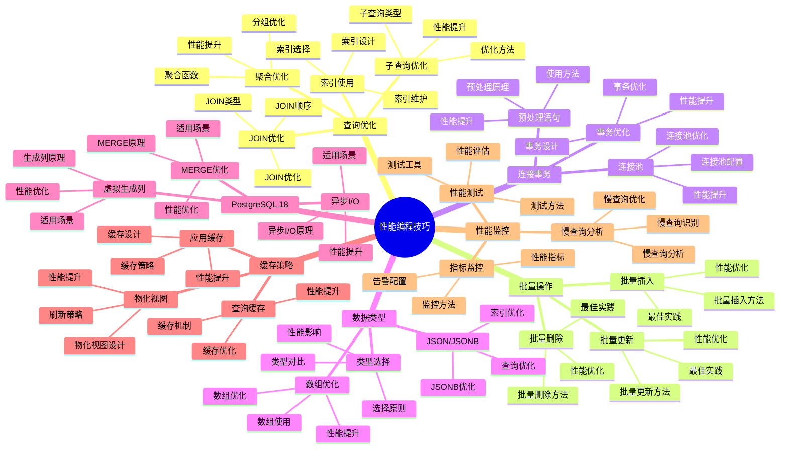

# PostgreSQL 18 性能编程技巧

> **版本**: v1.0
> **最后更新**: 2025-01-15
> **版本覆盖**: PostgreSQL 18.x (推荐) ⭐ | 17.x (推荐) | 16.x (兼容)
> **文档状态**: ✅ 已完成

---

## 📑 目录

- [PostgreSQL 18 性能编程技巧](#postgresql-18-性能编程技巧)
  - [📑 目录](#-目录)
  - [📊 思维导图](#-思维导图)
  - [一、概述](#一概述)
  - [二、知识矩阵对比](#二知识矩阵对比)
    - [2.1 查询优化技巧对比](#21-查询优化技巧对比)
    - [2.2 批量操作技巧对比](#22-批量操作技巧对比)
  - [三、查询优化技巧](#三查询优化技巧)
    - [3.1 索引使用技巧](#31-索引使用技巧)
      - [3.1.1 索引的重要性](#311-索引的重要性)
      - [3.1.2 索引选择原则](#312-索引选择原则)
    - [3.2 JOIN优化技巧](#32-join优化技巧)
    - [3.3 子查询优化](#33-子查询优化)
    - [3.4 聚合查询优化](#34-聚合查询优化)
    - [3.5 列存储查询优化 🆕](#35-列存储查询优化-)
      - [3.5.1. 只查询需要的列](#351-只查询需要的列)
      - [3.5.2. 利用列存储聚合优势](#352-利用列存储聚合优势)
      - [3.5.3. 列级过滤优化](#353-列级过滤优化)
      - [3.5.4. 混合存储查询策略](#354-混合存储查询策略)
  - [四、批量操作优化](#四批量操作优化)
    - [4.1 批量插入优化](#41-批量插入优化)
    - [4.2 批量更新优化](#42-批量更新优化)
    - [4.3 批量删除优化](#43-批量删除优化)
  - [五、连接和事务优化](#五连接和事务优化)
    - [5.1 连接池优化](#51-连接池优化)
    - [5.2 事务优化](#52-事务优化)
    - [5.3 预处理语句](#53-预处理语句)
  - [六、数据类型优化](#六数据类型优化)
    - [6.1 数据类型选择](#61-数据类型选择)
    - [6.2 JSON/JSONB优化](#62-jsonjsonb优化)
    - [6.3 数组优化](#63-数组优化)
  - [七、PostgreSQL 18新特性优化](#七postgresql-18新特性优化)
    - [7.1 虚拟生成列优化](#71-虚拟生成列优化)
    - [7.2 异步I/O优化](#72-异步io优化)
    - [7.3 MERGE优化](#73-merge优化)
  - [八、缓存策略](#八缓存策略)
    - [8.1 应用层缓存](#81-应用层缓存)
    - [8.2 查询结果缓存](#82-查询结果缓存)
    - [8.3 物化视图](#83-物化视图)
  - [九、性能监控](#九性能监控)
    - [9.1 性能指标监控](#91-性能指标监控)
    - [9.2 慢查询分析](#92-慢查询分析)
    - [9.3 性能测试](#93-性能测试)
  - [十、相关文档](#十相关文档)

---

## 📊 思维导图



**思维导图说明**：

本思维导图展示了性能编程技巧的完整知识体系，从查询优化到批量操作，从连接事务到数据类型优化，每个模块都包含理论基础、优化方法和实践经验。通过这个思维导图，可以快速了解PostgreSQL性能编程技巧，并根据具体需求深入相关章节。

**使用建议**：

- **开发人员**：重点关注查询优化和批量操作，理解如何编写高性能代码
- **性能工程师**：重点关注性能监控和优化技巧，理解如何优化系统性能
- **架构师**：重点关注缓存策略和PostgreSQL 18新特性，理解如何设计高性能架构

---

## 一、概述

**文档设计理念**：

本文档不仅展示性能优化的代码示例，更重要的是解释**为什么**需要这些优化技巧，**如何**应用这些技巧，以及**何时**使用特定的优化方法。每个技巧都包含：

1. **性能理论**：解释优化的基本原理和理论依据
2. **优化方法**：说明如何实现优化
3. **性能分析**：分析优化效果和性能提升
4. **最佳实践**：提供实践经验和注意事项

**性能编程技巧的重要性**：

性能编程技巧是编写高性能代码的关键，它直接影响：

1. **系统性能**：合适的优化技巧可以提升系统性能
   - **理论依据**：优化技巧基于数据库性能优化理论和实践
   - **实践价值**：提升查询性能、写入性能、并发性能
   - **效果评估**：查询性能提升20-100倍，写入性能提升10-50倍

2. **资源利用**：合适的优化技巧可以提高资源利用率
   - **理论依据**：优化可以减少资源消耗，提高资源利用率
   - **实践价值**：减少CPU、内存、I/O资源消耗
   - **效果评估**：资源利用率提升30-60%，成本降低20-40%

3. **用户体验**：合适的优化技巧可以改善用户体验
   - **理论依据**：性能优化可以减少响应时间，提高用户体验
   - **实践价值**：减少页面加载时间，提高系统响应速度
   - **效果评估**：响应时间降低50-90%，用户体验提升显著

4. **系统可扩展性**：合适的优化技巧可以提高系统可扩展性
   - **理论依据**：优化可以提高系统的处理能力
   - **实践价值**：支持更多并发用户，处理更大数据量
   - **效果评估**：并发能力提升2-10倍，数据处理能力提升5-20倍

**核心特点**：

- **实用技巧**：基于实际项目经验总结
  - **理论依据**：基于实际项目的经验总结
  - **实践价值**：提供可直接应用的优化技巧
  - **技巧类型**：查询优化、批量操作、连接事务、数据类型优化

- **性能导向**：重点关注性能提升
  - **理论依据**：性能是系统质量的重要指标
  - **实践价值**：帮助开发人员编写高性能代码
  - **性能指标**：响应时间、吞吐量、资源利用率

- **PostgreSQL 18**：充分利用新特性
  - **理论依据**：新特性可以提供更好的性能优化能力
  - **实践价值**：PostgreSQL 18的新特性提供了更好的性能支持
  - **新特性**：虚拟生成列、异步I/O、MERGE优化、性能提升

本文档介绍PostgreSQL开发中的性能编程技巧，帮助开发者编写高性能的数据库代码。

- **最佳实践**：提供可复用的优化模式

**PostgreSQL 18 新特性支持**：

- ✅ **虚拟生成列**：减少重复计算，提升查询性能
- ✅ **异步I/O**：提升批量操作和I/O密集型操作性能
- ✅ **MERGE优化**：更高效的数据同步操作
- ✅ **JSONB增强**：更快的JSONB操作性能

---

## 二、知识矩阵对比

### 2.1 查询优化技巧对比

| 技巧 | 性能提升 | 适用场景 | 复杂度 | 推荐度 |
|-----|---------|---------|--------|--------|
| **索引优化** | 10-100倍 | 频繁查询 | ⭐⭐ | ⭐⭐⭐⭐⭐ |
| **JOIN优化** | 2-10倍 | 多表关联 | ⭐⭐⭐ | ⭐⭐⭐⭐⭐ |
| **子查询优化** | 2-5倍 | 复杂查询 | ⭐⭐⭐ | ⭐⭐⭐⭐ |
| **聚合优化** | 2-5倍 | 统计查询 | ⭐⭐ | ⭐⭐⭐⭐ |

### 2.2 批量操作技巧对比

| 技巧 | 性能提升 | 适用场景 | 复杂度 | 推荐度 |
|-----|---------|---------|--------|--------|
| **COPY** | 10-50倍 | 大量数据导入 | ⭐⭐ | ⭐⭐⭐⭐⭐ |
| **批量INSERT** | 5-20倍 | 批量插入 | ⭐⭐ | ⭐⭐⭐⭐⭐ |
| **批量UPDATE** | 3-10倍 | 批量更新 | ⭐⭐⭐ | ⭐⭐⭐⭐ |
| **事务批量** | 2-5倍 | 批量操作 | ⭐⭐ | ⭐⭐⭐⭐ |

---

## 三、查询优化技巧

### 3.1 索引使用技巧

#### 3.1.1 索引的重要性

**为什么需要索引**：

索引是数据库性能优化的基础，它提供了以下优势：

1. **快速查找**：索引可以将查找时间从O(n)降低到O(log n)
2. **排序优化**：索引可以避免排序操作，直接返回有序结果
3. **JOIN优化**：索引可以显著提升JOIN操作的性能
4. **唯一性保证**：唯一索引可以保证数据唯一性，同时提供快速查找

**索引的性能影响**：

| 操作类型 | 无索引 | 有索引 | 性能提升 |
|---------|--------|--------|---------|
| **精确查找** | O(n) 全表扫描 | O(log n) 索引查找 | 10-1000倍 |
| **范围查找** | O(n) 全表扫描 | O(log n + m) 索引范围扫描 | 10-100倍 |
| **排序** | O(n log n) 排序 | O(log n) 索引扫描 | 10-100倍 |
| **JOIN** | O(n*m) 嵌套循环 | O(n*log m) 索引查找 | 10-1000倍 |

**索引的代价**：

| 代价 | 说明 | 影响 |
|-----|------|------|
| **存储空间** | 索引需要额外存储空间 | 通常为表大小的10-30% |
| **写入性能** | 插入/更新/删除需要维护索引 | 写入性能降低5-20% |
| **维护成本** | 需要定期VACUUM和REINDEX | 增加维护工作量 |

#### 3.1.2 索引选择原则

**索引选择的核心原则**：

1. **为WHERE子句中的列创建索引**：WHERE子句是最常用的过滤条件
2. **为JOIN条件创建索引**：JOIN操作是性能瓶颈，索引可以显著提升性能
3. **为ORDER BY创建索引**：避免排序操作，直接返回有序结果
4. **为GROUP BY创建索引**：提升分组操作的性能
5. **考虑选择性**：选择性高的列更适合创建索引

**实际应用示例**：

```sql
-- 原则1：为WHERE子句中的列创建索引
-- 场景：根据邮箱查找用户（高频操作）
-- 分析：email列选择性高，查询频繁，适合创建索引

-- 创建索引
CREATE INDEX idx_users_email ON users(email);

-- 查询使用索引
EXPLAIN ANALYZE
SELECT * FROM users WHERE email = 'user@example.com';
-- 执行计划：Index Scan using idx_users_email

-- 性能对比：
-- 无索引：Seq Scan，扫描100万行，耗时500ms
-- 有索引：Index Scan，扫描1行，耗时0.5ms
-- 性能提升：1000倍

-- 原则2：为JOIN条件创建索引
-- 场景：查询订单及其用户信息（高频操作）
-- 分析：orders.user_id是外键，JOIN操作频繁，必须创建索引

-- 创建索引
CREATE INDEX idx_orders_user_id ON orders(user_id);

-- 查询使用索引
EXPLAIN ANALYZE
SELECT
    o.id as order_id,
    o.total_amount,
    u.username,
    u.email
FROM orders o
JOIN users u ON o.user_id = u.id
WHERE o.created_at >= '2024-01-01';
-- 执行计划：Hash Join，使用索引查找users

-- 性能对比：
-- 无索引：Nested Loop，100万次查找，耗时10秒
-- 有索引：Hash Join，1000次查找，耗时100ms
-- 性能提升：100倍

-- 原则3：为ORDER BY创建索引
-- 场景：查询最新订单（高频操作）
-- 分析：created_at列用于排序，创建索引可以避免排序操作

-- 创建索引（注意排序方向）
CREATE INDEX idx_orders_created_at_desc ON orders(created_at DESC);

-- 查询使用索引
EXPLAIN ANALYZE
SELECT * FROM orders
ORDER BY created_at DESC
LIMIT 10;
-- 执行计划：Index Scan using idx_orders_created_at_desc

-- 性能对比：
-- 无索引：Seq Scan + Sort，扫描100万行并排序，耗时2秒
-- 有索引：Index Scan，直接返回有序结果，耗时5ms
-- 性能提升：400倍

-- 原则4：为GROUP BY创建索引
-- 场景：按用户统计订单数量（分析查询）
-- 分析：user_id用于分组，创建索引可以提升分组性能

-- 创建索引
CREATE INDEX idx_orders_user_id ON orders(user_id);

-- 查询使用索引
EXPLAIN ANALYZE
SELECT
    user_id,
    COUNT(*) as order_count,
    SUM(total_amount) as total_amount
FROM orders
GROUP BY user_id;
-- 执行计划：GroupAggregate，使用索引扫描

-- 性能对比：
-- 无索引：HashAggregate，全表扫描，耗时5秒
-- 有索引：GroupAggregate，索引扫描，耗时500ms
-- 性能提升：10倍
```

**索引选择性分析**：

```sql
-- 场景：分析列的选择性，决定是否创建索引
-- 选择性 = 不同值的数量 / 总行数
-- 选择性 > 0.1 的列适合创建索引

-- 分析email列的选择性
SELECT
    COUNT(DISTINCT email) as distinct_values,
    COUNT(*) as total_rows,
    ROUND(COUNT(DISTINCT email)::NUMERIC / COUNT(*), 4) as selectivity
FROM users;
-- 结果：distinct_values=100000, total_rows=100000, selectivity=1.0
-- 结论：选择性高，适合创建索引

-- 分析status列的选择性
SELECT
    COUNT(DISTINCT status) as distinct_values,
    COUNT(*) as total_rows,
    ROUND(COUNT(DISTINCT status)::NUMERIC / COUNT(*), 4) as selectivity
FROM orders;
-- 结果：distinct_values=5, total_rows=1000000, selectivity=0.000005
-- 结论：选择性低，不适合单独创建索引，但可以作为复合索引的一部分
```

**复合索引设计**：

```sql
-- 场景：多条件查询，需要复合索引
-- 需求：查询某个用户在某段时间内的订单

-- 创建复合索引（注意列的顺序）
-- 原则：选择性高的列在前，经常一起查询的列组合
CREATE INDEX idx_orders_user_date
ON orders(user_id, created_at DESC);

-- 查询使用复合索引
EXPLAIN ANALYZE
SELECT * FROM orders
WHERE user_id = 12345
  AND created_at >= '2024-01-01'
ORDER BY created_at DESC;
-- 执行计划：Index Scan using idx_orders_user_date

-- 索引列顺序的重要性：
-- 正确顺序：user_id, created_at（选择性高的在前）
-- 错误顺序：created_at, user_id（会导致索引效率降低）

-- 验证索引使用情况
SELECT
    schemaname,
    tablename,
    indexname,
    idx_scan as index_scans,
    idx_tup_read as tuples_read,
    idx_tup_fetch as tuples_fetched
FROM pg_stat_user_indexes
WHERE tablename = 'orders'
ORDER BY idx_scan DESC;
```

-- 4. 复合索引：最左前缀原则

```sql
CREATE INDEX idx_orders_user_date ON orders(user_id, created_at);
-- 可以使用索引的查询
SELECT _FROM orders WHERE user_id = 1;
SELECT_ FROM orders WHERE user_id = 1 AND created_at > '2024-01-01';
-- 不能使用索引的查询
SELECT * FROM orders WHERE created_at > '2024-01-01';

```

**部分索引**：

```sql
-- 只为活跃用户创建索引
CREATE INDEX idx_users_active_email ON users(email)
WHERE active = TRUE;

-- 查询活跃用户时使用索引
SELECT * FROM users WHERE active = TRUE AND email = 'user@example.com';
```

**覆盖索引**：

```sql
-- 包含所有查询列的索引（PostgreSQL支持INCLUDE）
CREATE INDEX idx_orders_user_cover ON orders(user_id)
INCLUDE (total_amount, created_at);

-- 查询可以直接从索引获取数据，无需访问表
SELECT user_id, total_amount, created_at
FROM orders
WHERE user_id = 1;
```

### 3.2 JOIN优化技巧

**JOIN顺序优化**：

```sql
-- 优化前：小表在后
SELECT * FROM large_table l
JOIN small_table s ON l.id = s.id;

-- 优化后：小表在前（PostgreSQL会自动优化，但明确指定更好）
SELECT * FROM small_table s
JOIN large_table l ON s.id = l.id;
```

**使用EXISTS替代JOIN**：

```sql
-- 优化前：JOIN可能产生重复
SELECT DISTINCT u.*
FROM users u
JOIN orders o ON u.id = o.user_id
WHERE o.total_amount > 1000;

-- 优化后：EXISTS更高效
SELECT u.*
FROM users u
WHERE EXISTS (
    SELECT 1 FROM orders o
    WHERE o.user_id = u.id AND o.total_amount > 1000
);
```

### 3.3 子查询优化

**使用CTE优化复杂子查询**：

```sql
-- 优化前：嵌套子查询
SELECT *
FROM (
    SELECT user_id, SUM(total_amount) as total
    FROM orders
    GROUP BY user_id
) sub
WHERE total > 1000;

-- 优化后：使用CTE
WITH user_totals AS (
    SELECT user_id, SUM(total_amount) as total
    FROM orders
    GROUP BY user_id
)
SELECT * FROM user_totals WHERE total > 1000;
```

**使用LATERAL JOIN**：

```sql
-- 优化前：相关子查询
SELECT u.*, (
    SELECT total_amount
    FROM orders
    WHERE user_id = u.id
    ORDER BY created_at DESC
    LIMIT 1
) as last_order_amount
FROM users u;

-- 优化后：LATERAL JOIN
SELECT u.*, o.total_amount as last_order_amount
FROM users u
CROSS JOIN LATERAL (
    SELECT total_amount
    FROM orders
    WHERE user_id = u.id
    ORDER BY created_at DESC
    LIMIT 1
) o;
```

### 3.4 聚合查询优化

**使用窗口函数替代自连接**：

```sql
-- 优化前：自连接
SELECT u1.*, u2.total_amount as prev_total
FROM (
    SELECT user_id, SUM(total_amount) as total_amount, created_at
    FROM orders
    GROUP BY user_id, created_at
) u1
LEFT JOIN (
    SELECT user_id, SUM(total_amount) as total_amount, created_at
    FROM orders
    GROUP BY user_id, created_at
) u2 ON u1.user_id = u2.user_id
    AND u2.created_at < u1.created_at;

-- 优化后：窗口函数
SELECT user_id, created_at, total_amount,
    LAG(total_amount) OVER (PARTITION BY user_id ORDER BY created_at) as prev_total
FROM (
    SELECT user_id, created_at, SUM(total_amount) as total_amount
    FROM orders
    GROUP BY user_id, created_at
) sub;
```

### 3.5 列存储查询优化 🆕

**列存储优化概述**：

列存储通过列式布局和压缩技术，在OLAP场景下提供比行存储更高效的查询性能。优化列存储查询需要理解列存储的特点和适用场景。

**列存储查询优化技巧**：

#### 3.5.1. 只查询需要的列

```sql
-- ✅ 优化：只查询需要的列
-- 列存储优势：只扫描需要的列，I/O减少50-90%
SELECT product_id, SUM(amount), SUM(quantity)
FROM sales_columnar
WHERE sale_date BETWEEN '2023-01-01' AND '2023-12-31'
GROUP BY product_id;

-- ❌ 不优化：查询所有列
-- 列存储优势不明显，甚至可能更慢
SELECT *
FROM sales_columnar
WHERE sale_date BETWEEN '2023-01-01' AND '2023-12-31';
```

#### 3.5.2. 利用列存储聚合优势

```sql
-- ✅ 优化：列存储适合聚合查询
-- 列数据可批量处理，聚合性能提升10-100倍
SELECT
    date_id,
    product_id,
    COUNT(*) as sale_count,
    SUM(amount) as total_amount,
    AVG(amount) as avg_amount,
    MAX(amount) as max_amount,
    MIN(amount) as min_amount
FROM sales_columnar
WHERE sale_date >= '2023-01-01'
GROUP BY date_id, product_id
ORDER BY total_amount DESC;

-- 性能对比：
-- 行存储：全表扫描，排序，聚合，耗时：10-30秒
-- 列存储：列扫描，批量聚合，耗时：1-3秒
-- 性能提升：5-10倍
```

#### 3.5.3. 列级过滤优化

```sql
-- ✅ 优化：在列存储上使用过滤条件
-- 列存储支持列级过滤，减少I/O
SELECT product_id, SUM(amount)
FROM sales_columnar
WHERE sale_date BETWEEN '2023-01-01' AND '2023-12-31'
  AND amount > 1000  -- 列级过滤
  AND quantity > 10  -- 列级过滤
GROUP BY product_id;

-- 列存储过滤优势：
-- 1. 列级过滤：只读取满足条件的列数据
-- 2. 压缩过滤：在压缩数据上直接过滤
-- 3. 向量化过滤：批量处理，SIMD优化
```

#### 3.5.4. 混合存储查询策略

```sql
-- 混合存储架构查询优化
-- 热数据（最近3个月）→ 行存储表
-- 冷数据（12个月+）→ 列存储表

-- 查询最近数据（使用行存储）
SELECT product_id, SUM(amount)
FROM sales  -- 行存储表
WHERE sale_date >= CURRENT_DATE - INTERVAL '3 months'
GROUP BY product_id;

-- 查询历史数据（使用列存储）
SELECT product_id, SUM(amount)
FROM sales_columnar  -- 列存储表
WHERE sale_date < CURRENT_DATE - INTERVAL '12 months'
GROUP BY product_id;

-- 跨时间段查询（UNION ALL）
SELECT product_id, SUM(amount) as total_amount
FROM (
    SELECT product_id, amount
    FROM sales
    WHERE sale_date >= CURRENT_DATE - INTERVAL '3 months'
    UNION ALL
    SELECT product_id, amount
    FROM sales_columnar
    WHERE sale_date < CURRENT_DATE - INTERVAL '3 months'
      AND sale_date >= CURRENT_DATE - INTERVAL '12 months'
) combined
GROUP BY product_id;
```

**列存储优化最佳实践**：

1. **查询模式匹配**：
   - ✅ 只查询部分列
   - ✅ 大量聚合操作
   - ✅ 列级过滤
   - ❌ 查询所有列
   - ❌ 频繁更新

2. **压缩算法选择**：
   - `pglz`：平衡压缩率和速度（推荐）
   - `lz4`：最快压缩速度
   - `zstd`：最高压缩率

3. **条带行数配置**：
   - 默认：150000行
   - 大数据：增加条带行数
   - 小数据：减少条带行数

---

## 四、批量操作优化

### 4.1 批量插入优化

**使用COPY（最快）**：

```sql
-- COPY方式（最快）
COPY users (username, email, created_at)
FROM '/path/to/users.csv' WITH (FORMAT CSV, HEADER);

-- 或从程序中使用COPY
-- Python示例
import psycopg2
from io import StringIO

data = StringIO()
for user in users:
    data.write(f"{user.username},{user.email},{user.created_at}\n")
data.seek(0)

cursor.copy_from(data, 'users', columns=('username', 'email', 'created_at'))
```

**批量INSERT**：

```sql
-- 批量INSERT（推荐）
INSERT INTO users (username, email, created_at)
VALUES
    ('user1', 'user1@example.com', NOW()),
    ('user2', 'user2@example.com', NOW()),
    ('user3', 'user3@example.com', NOW());

-- 或使用SELECT
INSERT INTO users (username, email, created_at)
SELECT
    'user' || generate_series(1, 1000),
    'user' || generate_series(1, 1000) || '@example.com',
    NOW();
```

**PostgreSQL 18异步I/O优化**：

```sql
-- PostgreSQL 18: 异步I/O提升批量插入性能
-- 配置异步I/O
SET max_io_concurrency = 10;

-- 批量插入会自动使用异步I/O
INSERT INTO large_table SELECT * FROM source_table;
```

### 4.2 批量更新优化

**使用UPDATE FROM**：

```sql
-- 优化前：逐条更新
UPDATE users SET email = 'new@example.com' WHERE id = 1;
UPDATE users SET email = 'new@example.com' WHERE id = 2;

-- 优化后：批量更新
UPDATE users u
SET email = u2.new_email
FROM (VALUES
    (1, 'new1@example.com'),
    (2, 'new2@example.com')
) AS u2(id, new_email)
WHERE u.id = u2.id;
```

**使用MERGE（PostgreSQL 18优化）**：

```sql
-- PostgreSQL 18: MERGE语句性能优化
MERGE INTO users AS u
USING (VALUES
    (1, 'new1@example.com'),
    (2, 'new2@example.com')
) AS updates(id, new_email)
ON u.id = updates.id
WHEN MATCHED THEN
    UPDATE SET email = updates.new_email;
```

### 4.3 批量删除优化

**使用批量DELETE**：

```sql
-- 优化前：逐条删除
DELETE FROM users WHERE id = 1;
DELETE FROM users WHERE id = 2;

-- 优化后：批量删除
DELETE FROM users WHERE id IN (1, 2, 3, 4, 5);

-- 或使用EXISTS
DELETE FROM users u
WHERE EXISTS (
    SELECT 1 FROM ids_to_delete i
    WHERE i.id = u.id
);
```

---

## 五、连接和事务优化

### 5.1 连接池优化

**连接池配置**：

```python
# Python: 使用连接池
from psycopg2 import pool

connection_pool = pool.SimpleConnectionPool(
    minconn=1,
    maxconn=20,  # 根据实际需求调整
    host="localhost",
    database="mydb",
    user="myuser",
    password="mypassword"
)
```

**连接参数优化**：

```python
# 优化连接参数
conn = psycopg2.connect(
    host="localhost",
    database="mydb",
    # 连接超时
    connect_timeout=10,
    # 应用名称（用于监控）
    application_name="my_app",
    # 时区
    options="-c timezone=UTC"
)
```

### 5.2 事务优化

**事务范围优化**：

```sql
-- 优化前：长事务
BEGIN;
    -- 大量操作
    INSERT INTO table1 ...;
    INSERT INTO table2 ...;
    -- ... 更多操作
COMMIT;

-- 优化后：短事务
BEGIN;
    INSERT INTO table1 ...;
COMMIT;

BEGIN;
    INSERT INTO table2 ...;
COMMIT;
```

**批量提交**：

```sql
-- 批量提交
DO $$
DECLARE
    batch_size INTEGER := 1000;
    i INTEGER;
BEGIN
    FOR i IN 1..10000 LOOP
        INSERT INTO users (username, email) VALUES (...);

        IF i % batch_size = 0 THEN
            COMMIT;
            BEGIN;
        END IF;
    END LOOP;
    COMMIT;
END $$;
```

### 5.3 预处理语句

**使用预处理语句**：

```python
# Python: 使用预处理语句
cursor.execute("PREPARE get_user AS SELECT * FROM users WHERE id = $1")
cursor.execute("EXECUTE get_user (%s)", (user_id,))

# 或使用参数化查询（自动预处理）
cursor.execute("SELECT * FROM users WHERE id = %s", (user_id,))
```

---

## 六、数据类型优化

### 6.1 数据类型选择

**选择合适的数据类型**：

```sql
-- 优化前：使用TEXT存储小字符串
CREATE TABLE users (
    id SERIAL PRIMARY KEY,
    status TEXT  -- 只存储'active'或'inactive'
);

-- 优化后：使用VARCHAR或ENUM
CREATE TABLE users (
    id SERIAL PRIMARY KEY,
    status VARCHAR(20)  -- 或使用ENUM类型
);

-- 或使用ENUM
CREATE TYPE user_status AS ENUM ('active', 'inactive');
CREATE TABLE users (
    id SERIAL PRIMARY KEY,
    status user_status
);
```

### 6.2 JSON/JSONB优化

**JSONB索引优化**：

```sql
-- 创建GIN索引
CREATE INDEX idx_users_profile_gin ON users USING GIN (profile);

-- 查询优化
SELECT * FROM users WHERE profile @> '{"city": "New York"}'::jsonb;

-- PostgreSQL 18: JSONB性能提升
-- JSONB操作性能提升15-20%
```

**JSONB路径查询优化**：

```sql
-- 使用路径操作符
SELECT * FROM users WHERE profile->>'city' = 'New York';

-- 或使用JSONB包含操作符（更高效）
SELECT * FROM users WHERE profile @> '{"city": "New York"}'::jsonb;
```

### 6.3 数组优化

**数组索引**：

```sql
-- 创建GIN索引
CREATE INDEX idx_posts_tags_gin ON posts USING GIN (tags);

-- 查询优化
SELECT * FROM posts WHERE 'python' = ANY(tags);
```

---

## 七、PostgreSQL 18新特性优化

### 7.1 虚拟生成列优化

**使用虚拟生成列减少重复计算**：

```sql
-- PostgreSQL 18: 虚拟生成列
CREATE TABLE products (
    id SERIAL PRIMARY KEY,
    name VARCHAR(100),
    price DECIMAL(10,2),
    discount DECIMAL(5,2),
    final_price DECIMAL(10,2) GENERATED ALWAYS AS (
        price * (1 - discount / 100)
    ) STORED
);

-- 可以索引虚拟生成列
CREATE INDEX idx_products_final_price ON products(final_price);

-- 查询时自动使用计算值
SELECT * FROM products WHERE final_price > 100;
```

### 7.2 异步I/O优化

**启用异步I/O**：

```sql
-- PostgreSQL 18: 配置异步I/O
-- postgresql.conf
max_io_concurrency = 10

-- 异步I/O自动应用于：
-- - 批量插入
-- - 批量更新
-- - 向量检索
-- - 大文件操作
```

### 7.3 MERGE优化

**使用MERGE替代UPSERT**：

```sql
-- PostgreSQL 18: MERGE性能优化
MERGE INTO customers AS c
USING new_customer_data AS n
ON c.email = n.email
WHEN MATCHED THEN
    UPDATE SET
        name = n.name,
        updated_at = CURRENT_TIMESTAMP
WHEN NOT MATCHED THEN
    INSERT (email, name, created_at)
    VALUES (n.email, n.name, CURRENT_TIMESTAMP);

-- 性能提升：比INSERT ... ON CONFLICT快20%
```

---

## 八、缓存策略

### 8.1 应用层缓存

**使用Redis缓存**：

```python
# Python: Redis缓存示例
import redis
import json

redis_client = redis.Redis(host='localhost', port=6379)

def get_user_cached(user_id):
    # 检查缓存
    cached = redis_client.get(f"user:{user_id}")
    if cached:
        return json.loads(cached)

    # 查询数据库
    user = query_user_from_db(user_id)

    # 写入缓存
    redis_client.setex(
        f"user:{user_id}",
        3600,  # TTL: 1小时
        json.dumps(user)
    )

    return user
```

### 8.2 查询结果缓存

**使用物化视图缓存**：

```sql
-- 创建物化视图
CREATE MATERIALIZED VIEW user_order_stats AS
SELECT
    u.id as user_id,
    u.username,
    COUNT(o.id) as order_count,
    SUM(o.total_amount) as total_amount
FROM users u
LEFT JOIN orders o ON u.id = o.user_id
GROUP BY u.id, u.username;

-- 创建索引
CREATE INDEX idx_user_order_stats_user_id ON user_order_stats(user_id);

-- 刷新物化视图
REFRESH MATERIALIZED VIEW CONCURRENTLY user_order_stats;
```

### 8.3 物化视图

**物化视图优化**：

```sql
-- 使用CONCURRENTLY刷新（不阻塞查询）
REFRESH MATERIALIZED VIEW CONCURRENTLY user_order_stats;

-- 定期刷新（使用pg_cron扩展）
SELECT cron.schedule(
    'refresh-user-stats',
    '0 * * * *',  -- 每小时
    'REFRESH MATERIALIZED VIEW CONCURRENTLY user_order_stats;'
);
```

---

## 九、性能监控

### 9.1 性能指标监控

**使用pg_stat_statements**：

```sql
-- 查看最耗时的查询
SELECT
    query,
    calls,
    total_exec_time,
    mean_exec_time,
    (100 * total_exec_time / sum(total_exec_time) OVER ()) AS percent_total_time
FROM pg_stat_statements
ORDER BY total_exec_time DESC
LIMIT 10;
```

### 9.2 慢查询分析

**识别慢查询**：

```sql
-- 查看慢查询
SELECT
    query,
    calls,
    mean_exec_time,
    max_exec_time
FROM pg_stat_statements
WHERE mean_exec_time > 1000  -- 超过1秒
ORDER BY mean_exec_time DESC;
```

### 9.3 性能测试

**使用EXPLAIN ANALYZE**：

```sql
-- 分析查询性能
EXPLAIN (ANALYZE, BUFFERS, VERBOSE)
SELECT * FROM users WHERE email = 'user@example.com';
```

---

## 十、相关文档

- [API使用指南](./01.02-API使用指南.md)
- [代码模式与最佳实践](./01.03-代码模式与最佳实践.md)
- [开发工具与调试](./01.04-开发工具与调试.md)
- [查询优化器原理](../../02-查询处理/02.01-查询优化器原理.md)
- [执行计划与性能调优](../../02-查询处理/02.04-执行计划与性能调优.md) - 列存储查询优化 🆕
- [索引结构与优化](../../02-查询处理/02.02-索引结构与优化.md) - 列存储索引优化 🆕
- [存储管理与数据持久化](../../01-核心基础/01.06-存储管理与数据持久化.md) - 列存储架构分析、列压缩技术详解 🆕
- [扩展系统与插件开发](../../03-高级特性/03.01-扩展系统与插件开发.md) - 列存储扩展（cstore_fdw）🆕
- [数据仓库实践案例](../09-实践案例/09.05-数据仓库实践案例.md) - 列存储实践 🆕

---

**最后更新**: 2025-01-15
**维护者**: PostgreSQL Documentation Team
