# PostgreSQL 18 部署架构设计

> **版本**: v1.0
> **最后更新**: 2025-01-15
> **版本覆盖**: PostgreSQL 18.x (推荐) ⭐ | 17.x (推荐) | 16.x (兼容)
> **文档状态**: ✅ 已完成

---

## 📑 目录

- [PostgreSQL 18 部署架构设计](#postgresql-18-部署架构设计)
  - [📑 目录](#-目录)
  - [📊 思维导图](#-思维导图)
  - [一、概述](#一概述)
  - [二、知识矩阵对比](#二知识矩阵对比)
    - [2.1 部署架构对比](#21-部署架构对比)
    - [2.2 高可用方案对比](#22-高可用方案对比)
  - [三、单机部署](#三单机部署)
    - [3.1 系统要求](#31-系统要求)
      - [3.1.1 硬件要求详解](#311-硬件要求详解)
      - [3.1.2 操作系统要求](#312-操作系统要求)
    - [3.2 安装配置](#32-安装配置)
    - [3.3 基础配置](#33-基础配置)
  - [四、主从复制架构](#四主从复制架构)
    - [4.1 流复制配置](#41-流复制配置)
    - [4.2 逻辑复制配置](#42-逻辑复制配置)
    - [4.3 复制监控](#43-复制监控)
  - [五、集群架构](#五集群架构)
    - [5.1 读写分离](#51-读写分离)
    - [5.2 负载均衡](#52-负载均衡)
    - [5.3 故障切换](#53-故障切换)
  - [六、分布式架构](#六分布式架构)
    - [6.1 分片架构](#61-分片架构)
    - [6.2 Citus集群](#62-citus集群)
    - [6.3 分布式事务](#63-分布式事务)
  - [七、容器化部署](#七容器化部署)
    - [7.1 Docker部署](#71-docker部署)
    - [7.2 Kubernetes部署](#72-kubernetes部署)
    - [7.3 容器编排](#73-容器编排)
  - [八、云原生部署](#八云原生部署)
    - [8.1 云数据库服务](#81-云数据库服务)
    - [8.2 Serverless部署](#82-serverless部署)
    - [8.3 多云部署](#83-多云部署)
  - [九、PostgreSQL 18新特性](#九postgresql-18新特性)
    - [9.1 异步I/O优化](#91-异步io优化)
    - [9.2 虚拟生成列](#92-虚拟生成列)
    - [9.3 OAuth 2.0认证](#93-oauth-20认证)
  - [十、最佳实践](#十最佳实践)
    - [10.1 架构选择原则](#101-架构选择原则)
    - [10.2 容量规划](#102-容量规划)
    - [10.3 安全配置](#103-安全配置)
  - [十一、相关文档](#十一相关文档)

---

## 📊 思维导图

```mermaid
mindmap
  root((部署架构设计))
    单机部署
      系统要求
        硬件要求
        软件要求
        环境配置
      安装配置
        安装方法
        配置优化
        初始化设置
      基础配置
        参数配置
        安全配置
        性能配置
    主从复制
      流复制
        流复制原理
        配置方法
        监控管理
      逻辑复制
        逻辑复制原理
        配置方法
        应用场景
      复制监控
        复制状态
        延迟监控
        故障检测
    集群架构
      读写分离
        读写分离原理
        配置方法
        负载均衡
      负载均衡
        负载均衡原理
        配置方法
        高可用
      故障切换
        故障检测
        自动切换
        数据一致性
    分布式架构
      分片架构
        分片原理
        分片策略
        分片管理
      Citus集群
        Citus原理
        配置方法
        应用场景
      分布式事务
        分布式事务原理
        事务管理
        一致性保证
    容器化部署
      Docker
        Docker配置
        镜像构建
        容器管理
      Kubernetes
        K8s配置
        部署管理
        扩缩容
      容器编排
        编排工具
        编排策略
        监控管理
    云原生部署
      云数据库
        云服务选择
        配置优化
        成本优化
      Serverless
        Serverless原理
        配置方法
        适用场景
      多云部署
        多云策略
        数据同步
        故障转移
    PostgreSQL 18
      异步I/O
        异步I/O原理
        性能提升
        适用场景
      虚拟生成列
        生成列原理
        应用场景
        性能优化
      OAuth 2.0
        OAuth原理
        配置方法
        安全优势
    最佳实践
      架构选择
        选择原则
        评估方法
        决策流程
      容量规划
        容量评估
        资源规划
        扩展策略
      安全配置
        安全策略
        配置方法
        合规要求
```



**思维导图说明**：

本思维导图展示了部署架构设计的完整知识体系，从单机部署到分布式架构，从容器化部署到云原生部署，每个模块都包含理论基础、配置方法和实践经验。通过这个思维导图，可以快速了解PostgreSQL部署架构的全貌，并根据具体需求深入相关章节。

**使用建议**：

- **运维人员**：重点关注部署架构的配置和管理，理解如何部署和维护PostgreSQL系统
- **架构师**：重点关注架构选择和最佳实践，理解如何选择最适合的部署架构
- **技术负责人**：重点关注容量规划和安全配置，理解如何规划和管理系统资源

---

## 一、概述

**文档设计理念**：

本文档不仅展示部署架构的配置步骤，更重要的是解释**为什么**需要不同的部署架构，**如何**选择和配置部署架构，以及**何时**使用特定的部署方案。每个架构方案都包含：

1. **架构分析**：解释架构的原理和特点
2. **配置方法**：说明如何配置和部署
3. **适用场景**：分析适用场景和权衡考虑
4. **最佳实践**：提供实践经验和优化建议

**部署架构设计的重要性**：

部署架构是系统运行的基础，它直接影响：

1. **系统可用性**：合适的部署架构可以提高系统可用性
   - **理论依据**：高可用架构可以保证系统在故障时继续运行
   - **实践价值**：提高系统可用性，减少服务中断时间
   - **效果评估**：系统可用性提升10-30%，故障恢复时间减少60-90%

2. **系统性能**：合适的部署架构可以优化系统性能
   - **理论依据**：合理的架构可以优化资源利用和负载分布
   - **实践价值**：提升系统性能，支持更多并发用户
   - **效果评估**：系统性能提升20-100%，并发能力提升2-10倍

3. **系统可扩展性**：合适的部署架构可以提高系统可扩展性
   - **理论依据**：可扩展架构可以支持系统水平扩展
   - **实践价值**：支持业务增长，适应数据量增长
   - **效果评估**：系统可扩展性提升50-200%，支持更大规模

4. **系统成本**：合适的部署架构可以优化系统成本
   - **理论依据**：合理的架构可以优化资源利用，降低成本
   - **实践价值**：降低硬件成本、运维成本、开发成本
   - **效果评估**：系统成本降低20-40%，资源利用率提升30-60%

**核心特点**：

- **架构全面**：涵盖单机、主从、集群、分布式等多种架构
  - **理论依据**：不同场景需要不同的部署架构
  - **实践价值**：帮助运维人员选择最适合的部署架构
  - **架构类型**：单机、主从、集群、分布式、容器化、云原生

- **实用性强**：提供详细的配置步骤和最佳实践
  - **理论依据**：详细的配置步骤可以帮助快速部署
  - **实践价值**：提供可直接应用的配置方案
  - **实践内容**：配置步骤、最佳实践、优化建议

- **云原生**：支持容器化和云原生部署
  - **理论依据**：云原生是未来部署的趋势
  - **实践价值**：提供现代化的部署方案
  - **云原生技术**：Docker、Kubernetes、Serverless

- **高可用**：重点关注高可用和容灾方案
  - **理论依据**：高可用是生产环境的基本要求
  - **实践价值**：保证系统在故障时继续运行
  - **高可用方案**：主从复制、集群架构、故障切换

本文档介绍PostgreSQL 18的各种部署架构设计，帮助运维人员选择最适合的部署方案。

**PostgreSQL 18 新特性支持**：

- ✅ **异步I/O**：提升I/O密集型操作性能
- ✅ **OAuth 2.0认证**：支持现代认证方式
- ✅ **改进的复制性能**：逻辑复制性能提升38%

---

## 二、知识矩阵对比

### 2.1 部署架构对比

| 架构 | 特点 | 适用场景 | 复杂度 | 可用性 | 推荐度 |
|-----|------|---------|--------|--------|--------|
| **单机部署** | 简单、低成本 | 开发、测试、小规模应用 | ⭐ | ⭐⭐ | ⭐⭐⭐ |
| **主从复制** | 读写分离、备份 | 中小规模生产环境 | ⭐⭐ | ⭐⭐⭐⭐ | ⭐⭐⭐⭐⭐ |
| **集群架构** | 高可用、负载均衡 | 大规模生产环境 | ⭐⭐⭐ | ⭐⭐⭐⭐⭐ | ⭐⭐⭐⭐⭐ |
| **分布式架构** | 水平扩展 | 超大规模、多租户 | ⭐⭐⭐⭐⭐ | ⭐⭐⭐⭐ | ⭐⭐⭐⭐ |

### 2.2 高可用方案对比

| 方案 | RTO | RPO | 复杂度 | 成本 | 推荐度 |
|-----|-----|-----|--------|------|--------|
| **流复制+手动切换** | 分钟级 | 秒级 | ⭐⭐ | 低 | ⭐⭐⭐ |
| **流复制+自动切换** | 秒级 | 秒级 | ⭐⭐⭐ | 中 | ⭐⭐⭐⭐ |
| **Patroni集群** | 秒级 | 秒级 | ⭐⭐⭐⭐ | 中 | ⭐⭐⭐⭐⭐ |
| **云数据库HA** | 秒级 | 秒级 | ⭐⭐ | 高 | ⭐⭐⭐⭐ |

---

## 三、单机部署

### 3.1 系统要求

#### 3.1.1 硬件要求详解

**为什么需要合理的硬件配置**：

PostgreSQL的性能和稳定性很大程度上取决于硬件配置。合理的硬件配置可以：

1. **提升性能**：CPU和内存直接影响查询性能
2. **保证稳定性**：充足的资源避免系统过载
3. **降低成本**：合理的配置避免资源浪费

**CPU要求分析**：

| CPU核心数 | 适用场景 | 并发连接数 | 推荐度 |
|----------|---------|-----------|--------|
| **2核心** | 开发/测试环境 | <50 | ⭐⭐⭐ |
| **4核心** | 小型生产环境 | 50-200 | ⭐⭐⭐⭐ |
| **8核心** | 中型生产环境 | 200-500 | ⭐⭐⭐⭐⭐ |
| **16核心+** | 大型生产环境 | 500+ | ⭐⭐⭐⭐⭐ |

**CPU选择建议**：

- **开发/测试**：2核心足够，成本低
- **小型生产**：4核心，平衡性能和成本
- **中型生产**：8核心，支持较高并发
- **大型生产**：16核心+，支持高并发和复杂查询

**内存要求分析**：

PostgreSQL使用共享内存缓存数据，内存配置直接影响性能：

| 内存大小 | 适用场景 | 数据量 | 推荐度 |
|---------|---------|--------|--------|
| **4GB** | 开发/测试环境 | <10GB | ⭐⭐⭐ |
| **8GB** | 小型生产环境 | 10-50GB | ⭐⭐⭐⭐ |
| **16GB** | 中型生产环境 | 50-200GB | ⭐⭐⭐⭐⭐ |
| **32GB+** | 大型生产环境 | 200GB+ | ⭐⭐⭐⭐⭐ |

**内存配置原则**：

- **shared_buffers**：通常设置为总内存的25%（Linux）或40%（Windows）
- **work_mem**：每个连接的工作内存，需要根据并发数调整
- **maintenance_work_mem**：维护操作（VACUUM、CREATE INDEX）的内存
- **总内存需求**：shared_buffers + work_mem * max_connections + 系统内存

**内存配置示例**：

```sql
-- 场景：16GB内存的服务器配置
-- 计算：
-- - shared_buffers: 16GB * 25% = 4GB
-- - work_mem: 假设max_connections=100，work_mem=64MB，总需求=6.4GB
-- - maintenance_work_mem: 1GB
-- - 系统内存: 2GB
-- - 总计: 约13.4GB（在16GB范围内）

-- 配置示例
shared_buffers = 4GB
work_mem = 64MB
maintenance_work_mem = 1GB
effective_cache_size = 12GB  -- 告诉优化器可用缓存大小
```

**磁盘要求分析**：

磁盘是数据库性能的关键瓶颈，选择合适的磁盘类型和配置至关重要：

| 磁盘类型 | IOPS | 延迟 | 适用场景 | 推荐度 |
|---------|------|------|---------|--------|
| **HDD** | 100-200 | 5-10ms | 归档、备份 | ⭐⭐ |
| **SATA SSD** | 10,000-50,000 | 0.1-0.5ms | 小型生产 | ⭐⭐⭐⭐ |
| **NVMe SSD** | 100,000-500,000 | 0.01-0.1ms | 中大型生产 | ⭐⭐⭐⭐⭐ |
| **NVMe PCIe 4.0** | 500,000+ | <0.01ms | 高性能场景 | ⭐⭐⭐⭐⭐ |

**磁盘配置建议**：

- **数据目录**：使用SSD，提升I/O性能
- **WAL目录**：使用独立SSD，提升写入性能
- **临时文件**：可以使用较慢的磁盘
- **备份存储**：可以使用HDD，降低成本

**网络要求分析**：

网络性能影响数据库的响应时间和吞吐量：

| 网络速度 | 适用场景 | 并发连接 | 推荐度 |
|---------|---------|---------|--------|
| **百兆** | 开发/测试 | <10 | ⭐⭐ |
| **千兆** | 小型生产 | 10-100 | ⭐⭐⭐⭐ |
| **万兆** | 中大型生产 | 100+ | ⭐⭐⭐⭐⭐ |

#### 3.1.2 操作系统要求

**Linux发行版选择**：

| 发行版 | 版本要求 | 特点 | 推荐度 |
|-------|---------|------|--------|
| **Ubuntu** | 20.04 LTS+ | 易用、社区支持好 | ⭐⭐⭐⭐⭐ |
| **CentOS/RHEL** | 8+ | 企业级、稳定性好 | ⭐⭐⭐⭐⭐ |
| **Debian** | 11+ | 稳定、资源占用少 | ⭐⭐⭐⭐ |
| **SUSE** | 15+ | 企业级、支持好 | ⭐⭐⭐⭐ |

**操作系统配置优化**：

```bash
# 1. 内核参数优化（/etc/sysctl.conf）
# 共享内存配置
kernel.shmmax = 68719476736  # 64GB
kernel.shmall = 16777216     # 16GB pages

# 网络参数优化
net.core.somaxconn = 4096
net.ipv4.tcp_max_syn_backlog = 4096
net.ipv4.tcp_keepalive_time = 600
net.ipv4.tcp_keepalive_probes = 3
net.ipv4.tcp_keepalive_intvl = 15

# 虚拟内存优化
vm.swappiness = 1  # 减少swap使用
vm.dirty_ratio = 15
vm.dirty_background_ratio = 5

# 应用配置
sysctl -p  # 使配置生效

# 2. 文件系统配置
# 推荐使用XFS或ext4文件系统
# 挂载选项优化
# /etc/fstab
/dev/sdb1 /var/lib/postgresql xfs defaults,noatime,nodiratime 0 0

# 3. 用户和权限配置
# 创建postgres用户
useradd -r -s /bin/bash -d /var/lib/postgresql postgres

# 设置ulimit
# /etc/security/limits.conf
postgres soft nofile 65536
postgres hard nofile 65536
postgres soft nproc 32768
postgres hard nproc 32768
```

- macOS：10.15+
- Windows：Windows 10/11, Windows Server 2016+

### 3.2 安装配置

**Ubuntu/Debian安装**：

```bash
# 添加PostgreSQL官方仓库
sudo sh -c 'echo "deb http://apt.postgresql.org/pub/repos/apt $(lsb_release -cs)-pgdg main" > /etc/apt/sources.list.d/pgdg.list'
wget --quiet -O - https://www.postgresql.org/media/keys/ACCC4CF8.asc | sudo apt-key add -
sudo apt-get update

# 安装PostgreSQL 18
sudo apt-get install postgresql-18 postgresql-contrib-18

# 启动服务
sudo systemctl start postgresql
sudo systemctl enable postgresql
```

**CentOS/RHEL安装**：

```bash
# 安装PostgreSQL仓库
sudo yum install -y https://download.postgresql.org/pub/repos/yum/reporpms/EL-8-x86_64/pgdg-redhat-repo-latest.noarch.rpm

# 安装PostgreSQL 18
sudo yum install -y postgresql18-server postgresql18

# 初始化数据库
sudo /usr/pgsql-18/bin/postgresql-18-setup initdb

# 启动服务
sudo systemctl start postgresql-18
sudo systemctl enable postgresql-18
```

### 3.3 基础配置

**postgresql.conf配置**：

```conf
# 连接设置
max_connections = 100
listen_addresses = 'localhost'

# 内存设置
shared_buffers = 256MB
effective_cache_size = 1GB
work_mem = 16MB
maintenance_work_mem = 128MB

# WAL设置
wal_buffers = 16MB
checkpoint_completion_target = 0.9

# 日志设置
logging_collector = on
log_directory = 'log'
log_filename = 'postgresql-%Y-%m-%d_%H%M%S.log'
log_min_duration_statement = 1000

# PostgreSQL 18新特性
max_io_concurrency = 10  # 异步I/O并发数
```

**pg_hba.conf配置**：

```conf
# 本地连接
local   all             all                                     peer

# IPv4本地连接
host    all             all             127.0.0.1/32            scram-sha-256

# IPv4远程连接（生产环境需要更严格的配置）
host    all             all             0.0.0.0/0               scram-sha-256
```

---

## 四、主从复制架构

### 4.1 流复制配置

**主库配置（postgresql.conf）**：

```conf
# 启用WAL归档
wal_level = replica
max_wal_senders = 3
wal_keep_size = 1GB

# 归档配置
archive_mode = on
archive_command = 'cp %p /var/lib/postgresql/archive/%f'
```

**主库配置（pg_hba.conf）**：

```conf
# 允许从库连接
host    replication     replicator      192.168.1.0/24         scram-sha-256
```

**创建复制用户**：

```sql
-- 在主库创建复制用户
CREATE USER replicator WITH REPLICATION PASSWORD 'replicator_password';
```

**从库配置**：

```bash
# 停止PostgreSQL服务
sudo systemctl stop postgresql

# 备份数据目录
sudo mv /var/lib/postgresql/18/main /var/lib/postgresql/18/main.backup

# 使用pg_basebackup创建基础备份
sudo -u postgres pg_basebackup \
    -h primary_host \
    -D /var/lib/postgresql/18/main \
    -U replicator \
    -P \
    -W \
    -R

# 启动PostgreSQL服务
sudo systemctl start postgresql
```

**从库自动配置（PostgreSQL 12+）**：

```conf
# postgresql.auto.conf（由pg_basebackup -R自动生成）
primary_conninfo = 'host=primary_host port=5432 user=replicator password=replicator_password'
primary_slot_name = 'replication_slot'
```

### 4.2 逻辑复制配置

**发布端配置**：

```sql
-- 创建发布
CREATE PUBLICATION my_publication FOR TABLE users, orders;

-- 或发布所有表
CREATE PUBLICATION all_tables FOR ALL TABLES;
```

**订阅端配置**：

```sql
-- 创建订阅
CREATE SUBSCRIPTION my_subscription
CONNECTION 'host=primary_host port=5432 dbname=mydb user=replicator password=replicator_password'
PUBLICATION my_publication;

-- 查看订阅状态
SELECT * FROM pg_subscription;
SELECT * FROM pg_stat_subscription;
```

### 4.3 复制监控

**监控流复制**：

```sql
-- 查看复制状态
SELECT * FROM pg_stat_replication;

-- 查看复制延迟
SELECT
    client_addr,
    state,
    sync_state,
    pg_wal_lsn_diff(pg_current_wal_lsn(), sent_lsn) AS sent_lag,
    pg_wal_lsn_diff(sent_lsn, write_lsn) AS write_lag,
    pg_wal_lsn_diff(write_lsn, flush_lsn) AS flush_lag,
    pg_wal_lsn_diff(flush_lsn, replay_lsn) AS replay_lag
FROM pg_stat_replication;
```

**监控逻辑复制**：

```sql
-- 查看订阅状态
SELECT * FROM pg_stat_subscription;

-- 查看复制槽
SELECT * FROM pg_replication_slots;
```

---

## 五、集群架构

### 5.1 读写分离

**使用pgBouncer实现连接池和读写分离**：

```ini
# pgbouncer.ini
[databases]
mydb = host=primary_host port=5432 dbname=mydb
mydb_ro = host=replica_host port=5432 dbname=mydb

[pgbouncer]
pool_mode = transaction
max_client_conn = 1000
default_pool_size = 25
```

**应用层读写分离**：

```python
# Python示例
from psycopg2 import pool

# 写连接池（主库）
write_pool = pool.SimpleConnectionPool(
    minconn=1, maxconn=10,
    host="primary_host", database="mydb"
)

# 读连接池（从库）
read_pool = pool.SimpleConnectionPool(
    minconn=1, maxconn=20,
    host="replica_host", database="mydb"
)

# 使用
def get_user(user_id):
    conn = read_pool.getconn()
    # 读操作使用从库
    ...

def create_user(user_data):
    conn = write_pool.getconn()
    # 写操作使用主库
    ...
```

### 5.2 负载均衡

**使用HAProxy实现负载均衡**：

```conf
# haproxy.cfg
global
    log /dev/log local0
    maxconn 4096

defaults
    log global
    mode tcp
    timeout connect 5000ms
    timeout client 50000ms
    timeout server 50000ms

# PostgreSQL读负载均衡
frontend pg_read
    bind *:5432
    default_backend pg_read_servers

backend pg_read_servers
    balance roundrobin
    option pgsql-check user postgres
    server pg1 replica1_host:5432 check
    server pg2 replica2_host:5432 check
    server pg3 replica3_host:5432 check

# PostgreSQL写（主库）
frontend pg_write
    bind *:5433
    default_backend pg_write_server

backend pg_write_server
    server pg_primary primary_host:5432 check
```

### 5.3 故障切换

**使用Patroni实现自动故障切换**：

```yaml
# patroni.yml
scope: postgres
namespace: /db/
name: postgresql1

restapi:
  listen: 0.0.0.0:8008
  connect_address: 192.168.1.10:8008

etcd3:
  hosts: 192.168.1.20:2379,192.168.1.21:2379,192.168.1.22:2379

bootstrap:
  dcs:
    ttl: 30
    loop_wait: 10
    retry_timeout: 30
    maximum_lag_on_failover: 1048576
  pg_hba:
    - host replication replicator 0.0.0.0/0 md5
    - host all all 0.0.0.0/0 md5
  users:
    replicator:
      password: replicator_password
      options:
        - replication

postgresql:
  listen: 0.0.0.0:5432
  connect_address: 192.168.1.10:5432
  data_dir: /var/lib/postgresql/18/main
  pgpass: /var/lib/postgresql/.pgpass
  parameters:
    max_connections: 100
    shared_buffers: 256MB
    wal_level: replica
    hot_standby: on
```

---

## 六、分布式架构

### 6.1 分片架构

**应用层分片**：

```python
# 分片策略示例
def get_shard(user_id):
    """根据用户ID获取分片"""
    shard_count = 4
    return user_id % shard_count

def get_connection(user_id):
    """获取对应分片的连接"""
    shard = get_shard(user_id)
    shard_hosts = {
        0: "shard0_host",
        1: "shard1_host",
        2: "shard2_host",
        3: "shard3_host"
    }
    return psycopg2.connect(host=shard_hosts[shard], ...)
```

### 6.2 Citus集群

**Citus安装配置**：

```sql
-- 安装Citus扩展
CREATE EXTENSION citus;

-- 添加工作节点
SELECT citus_add_node('worker1_host', 5432);
SELECT citus_add_node('worker2_host', 5432);
SELECT citus_add_node('worker3_host', 5432);

-- 创建分布式表
SELECT create_distributed_table('users', 'id');
SELECT create_distributed_table('orders', 'user_id');

-- 查看集群状态
SELECT * FROM citus_get_active_worker_nodes();
```

### 6.3 分布式事务

**两阶段提交**：

```sql
-- 准备阶段
PREPARE TRANSACTION 'tx1';
PREPARE TRANSACTION 'tx2';

-- 提交阶段
COMMIT PREPARED 'tx1';
COMMIT PREPARED 'tx2';
```

---

## 七、容器化部署

### 7.1 Docker部署

**Docker Compose配置**：

```yaml
version: '3.8'

services:
  postgres:
    image: postgres:18
    environment:
      POSTGRES_USER: postgres
      POSTGRES_PASSWORD: postgres
      POSTGRES_DB: mydb
    ports:
      - "5432:5432"
    volumes:
      - postgres_data:/var/lib/postgresql/data
      - ./postgresql.conf:/etc/postgresql/postgresql.conf
    command: postgres -c config_file=/etc/postgresql/postgresql.conf
    healthcheck:
      test: ["CMD-SHELL", "pg_isready -U postgres"]
      interval: 10s
      timeout: 5s
      retries: 5

volumes:
  postgres_data:
```

### 7.2 Kubernetes部署

**StatefulSet配置**：

```yaml
apiVersion: apps/v1
kind: StatefulSet
metadata:
  name: postgres
spec:
  serviceName: postgres
  replicas: 3
  selector:
    matchLabels:
      app: postgres
  template:
    metadata:
      labels:
        app: postgres
    spec:
      containers:
      - name: postgres
        image: postgres:18
        env:
        - name: POSTGRES_PASSWORD
          valueFrom:
            secretKeyRef:
              name: postgres-secret
              key: password
        volumeMounts:
        - name: postgres-data
          mountPath: /var/lib/postgresql/data
  volumeClaimTemplates:
  - metadata:
      name: postgres-data
    spec:
      accessModes: [ "ReadWriteOnce" ]
      resources:
        requests:
          storage: 100Gi
```

### 7.3 容器编排

**使用Helm部署**：

```bash
# 添加Bitnami Helm仓库
helm repo add bitnami https://charts.bitnami.com/bitnami

# 安装PostgreSQL
helm install postgres bitnami/postgresql \
  --set auth.postgresPassword=postgres \
  --set auth.database=mydb \
  --set primary.persistence.size=100Gi
```

---

## 八、云原生部署

### 8.1 云数据库服务

**AWS RDS PostgreSQL**：

```bash
# 使用AWS CLI创建RDS实例
aws rds create-db-instance \
    --db-instance-identifier my-postgres \
    --db-instance-class db.t3.medium \
    --engine postgres \
    --engine-version 18.0 \
    --master-username postgres \
    --master-user-password postgres \
    --allocated-storage 100 \
    --storage-type gp3 \
    --multi-az
```

**Azure Database for PostgreSQL**：

```bash
# 使用Azure CLI创建数据库
az postgres flexible-server create \
    --resource-group my-resource-group \
    --name my-postgres-server \
    --location eastus \
    --admin-user postgres \
    --admin-password postgres \
    --sku-name Standard_B2s \
    --version 18 \
    --storage-size 128
```

### 8.2 Serverless部署

**Neon Serverless PostgreSQL**：

```bash
# 使用Neon CLI创建项目
neon projects create my-project

# 获取连接字符串
neon connection-string my-project
```

### 8.3 多云部署

**跨云部署策略**：

- 主库在一个云，从库在另一个云
- 使用逻辑复制同步数据
- 配置DNS实现故障切换

---

## 九、PostgreSQL 18新特性

### 9.1 异步I/O优化

**配置异步I/O**：

```conf
# postgresql.conf
# 需要Linux 5.1+内核支持io_uring
max_io_concurrency = 10

# 检查系统支持
# Linux: uname -r (需要5.1+)
# 检查io_uring: grep io_uring /proc/filesystems
```

**性能提升**：

- 向量检索I/O性能提升2-3倍
- 大文件写入性能提升
- 减少I/O等待时间

### 9.2 虚拟生成列

**使用虚拟生成列**：

```sql
-- 创建带虚拟生成列的表
CREATE TABLE products (
    id SERIAL PRIMARY KEY,
    name VARCHAR(100),
    price DECIMAL(10,2),
    discount DECIMAL(5,2),
    final_price DECIMAL(10,2) GENERATED ALWAYS AS (
        price * (1 - discount / 100)
    ) STORED
);

-- 可以索引虚拟生成列
CREATE INDEX idx_products_final_price ON products(final_price);
```

### 9.3 OAuth 2.0认证

**配置OAuth 2.0**：

```conf
# postgresql.conf
# 启用OAuth 2.0认证
oauth2_provider = 'google'
oauth2_client_id = 'your-client-id'
oauth2_client_secret = 'your-client-secret'
oauth2_redirect_uri = 'https://your-app.com/oauth/callback'
```

---

## 十、最佳实践

### 10.1 架构选择原则

**选择指南**：

- **开发/测试环境**：单机部署
- **中小规模生产**：主从复制
- **大规模生产**：集群架构（Patroni）
- **超大规模/多租户**：分布式架构（Citus）

### 10.2 容量规划

**容量规划考虑因素**：

- 数据量增长趋势
- 并发连接数
- 读写比例
- 性能要求
- 可用性要求

### 10.3 安全配置

**安全配置清单**：

- 使用强密码
- 配置SSL/TLS
- 限制网络访问
- 定期更新补丁
- 启用审计日志
- 配置防火墙规则

---

## 十一、相关文档

- [监控与可观测性](./02.02-监控与可观测性.md)
- [性能调优实践](./02.03-性能调优实践.md)
- [故障排查与恢复](./02.04-故障排查与恢复.md)
- [PostgreSQL 18新特性](../../02-版本特性/02.01-PostgreSQL-18-新特性.md)
- [单机部署与配置](../../05-部署架构/单机部署/05.01-单机部署与配置.md)

---

**最后更新**: 2025-01-15
**维护者**: PostgreSQL Documentation Team
