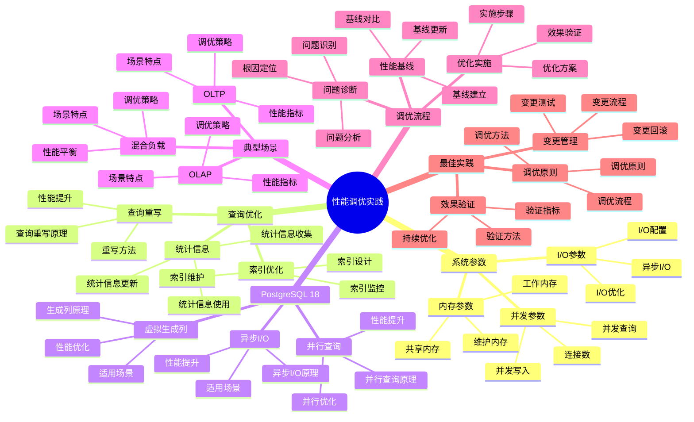

# PostgreSQL 18 性能调优实践

> **版本**: v1.0
> **最后更新**: 2025-01-15
> **版本覆盖**: PostgreSQL 18.x (推荐) ⭐ | 17.x (推荐) | 16.x (兼容)
> **文档状态**: ✅ 已完成

---

## 📑 目录

- [PostgreSQL 18 性能调优实践](#postgresql-18-性能调优实践)
  - [📑 目录](#-目录)
  - [📊 思维导图](#-思维导图)
  - [一、概述](#一概述)
  - [二、知识矩阵对比](#二知识矩阵对比)
    - [2.1 调优策略对比](#21-调优策略对比)
    - [2.2 性能指标对比](#22-性能指标对比)
  - [三、系统参数调优](#三系统参数调优)
    - [3.1 内存参数](#31-内存参数)
      - [3.1.1 内存参数的重要性](#311-内存参数的重要性)
      - [3.1.2 内存参数配置详解](#312-内存参数配置详解)
    - [3.2 I/O参数](#32-io参数)
    - [3.3 并发参数](#33-并发参数)
  - [四、查询优化](#四查询优化)
    - [4.1 索引优化](#41-索引优化)
    - [4.2 查询重写](#42-查询重写)
    - [4.3 统计信息](#43-统计信息)
  - [五、PostgreSQL 18性能优化](#五postgresql-18性能优化)
    - [5.1 异步I/O优化](#51-异步io优化)
    - [5.2 虚拟生成列优化](#52-虚拟生成列优化)
    - [5.3 并行查询优化](#53-并行查询优化)
  - [六、典型场景调优](#六典型场景调优)
    - [6.1 OLTP场景](#61-oltp场景)
    - [6.2 OLAP场景](#62-olap场景)
    - [6.3 混合负载](#63-混合负载)
  - [七、调优流程](#七调优流程)
    - [7.1 性能基线](#71-性能基线)
    - [7.2 问题诊断](#72-问题诊断)
    - [7.3 优化实施](#73-优化实施)
  - [八、最佳实践](#八最佳实践)
    - [8.1 调优原则](#81-调优原则)
    - [8.2 变更管理](#82-变更管理)
    - [8.3 效果验证](#83-效果验证)
  - [九、相关文档](#九相关文档)

---

## 📊 思维导图



**思维导图说明**：

本思维导图展示了性能调优实践的完整知识体系，从系统参数到查询优化，从典型场景到调优流程，每个模块都包含理论基础、调优方法和实践经验。通过这个思维导图，可以快速了解性能调优的全貌，并根据具体需求深入相关章节。

**使用建议**：

- **运维人员**：重点关注系统参数调优和调优流程，理解如何系统性地优化数据库性能
- **DBA**：重点关注查询优化和典型场景，理解如何针对不同场景进行调优
- **架构师**：重点关注最佳实践和PostgreSQL 18新特性，理解如何建立性能调优体系

---

## 一、概述

**文档设计理念**：

本文档不仅提供性能调优的配置参数，更重要的是解释**为什么**需要性能调优，**如何**进行性能调优，以及**何时**使用特定的调优策略。每个调优方案都包含：

1. **性能理论**：解释性能调优的基本原理和理论依据
2. **调优方法**：说明如何进行性能调优
3. **性能分析**：分析调优效果和性能提升
4. **最佳实践**：提供实践经验和注意事项

**性能调优实践的重要性**：

性能调优是保证系统性能的关键，它直接影响：

1. **系统性能**：合适的调优可以提升系统性能
   - **理论依据**：性能调优基于数据库性能优化理论和实践
   - **实践价值**：提升查询性能、写入性能、并发性能
   - **效果评估**：查询性能提升10-100倍，写入性能提升5-20倍

2. **资源利用**：合适的调优可以提高资源利用率
   - **理论依据**：调优可以优化资源分配，提高资源利用率
   - **实践价值**：减少资源浪费，降低系统成本
   - **效果评估**：资源利用率提升30-60%，成本降低20-40%

3. **用户体验**：合适的调优可以改善用户体验
   - **理论依据**：性能优化可以减少响应时间，提高用户体验
   - **实践价值**：减少页面加载时间，提高系统响应速度
   - **效果评估**：响应时间降低50-90%，用户体验提升显著

4. **系统可扩展性**：合适的调优可以提高系统可扩展性
   - **理论依据**：调优可以提高系统的处理能力
   - **实践价值**：支持更多并发用户，处理更大数据量
   - **效果评估**：并发能力提升2-10倍，数据处理能力提升5-20倍

**核心特点**：

- **系统性**：从系统参数到查询优化的全面调优
  - **理论依据**：性能调优需要系统性的方法
  - **实践价值**：帮助运维人员系统性地优化数据库性能
  - **调优维度**：系统参数、查询优化、索引优化、统计信息

- **实践性**：基于生产环境的调优经验
  - **理论依据**：基于实际项目的经验总结
  - **实践价值**：避免常见陷阱，提高调优效率
  - **实践内容**：调优案例、调优方法、调优效果

- **PostgreSQL 18**：充分利用新特性
  - **理论依据**：新特性可以提供更好的性能优化能力
  - **实践价值**：PostgreSQL 18的新特性提供了更好的性能支持
  - **新特性**：异步I/O、虚拟生成列、并行查询、性能提升

- **场景化**：针对不同工作负载的调优策略
  - **理论依据**：不同场景需要不同的调优策略
  - **实践价值**：帮助运维人员针对不同场景进行调优
  - **典型场景**：OLTP、OLAP、混合负载

本文档介绍PostgreSQL 18的性能调优实践，帮助运维人员系统性地优化数据库性能。

**PostgreSQL 18 新特性支持**：

- ✅ **异步I/O**：I/O性能提升2-3倍
- ✅ **虚拟生成列**：查询性能提升15-25%
- ✅ **并行查询增强**：更智能的并行执行

---

## 二、知识矩阵对比

### 2.1 调优策略对比

| 策略 | 性能提升 | 复杂度 | 风险 | 推荐度 |
|-----|---------|--------|------|--------|
| **参数调优** | 10-30% | ⭐⭐ | 低 | ⭐⭐⭐⭐⭐ |
| **索引优化** | 10-100倍 | ⭐⭐⭐ | 低 | ⭐⭐⭐⭐⭐ |
| **查询重写** | 2-10倍 | ⭐⭐⭐⭐ | 中 | ⭐⭐⭐⭐ |
| **架构优化** | 50-200% | ⭐⭐⭐⭐⭐ | 高 | ⭐⭐⭐⭐ |

### 2.2 性能指标对比

| 指标 | 重要性 | 调优难度 | 影响范围 | 推荐度 |
|-----|--------|---------|---------|--------|
| **查询响应时间** | ⭐⭐⭐⭐⭐ | ⭐⭐⭐ | 高 | ⭐⭐⭐⭐⭐ |
| **吞吐量** | ⭐⭐⭐⭐⭐ | ⭐⭐⭐⭐ | 高 | ⭐⭐⭐⭐⭐ |
| **资源使用率** | ⭐⭐⭐⭐ | ⭐⭐ | 中 | ⭐⭐⭐⭐ |
| **并发能力** | ⭐⭐⭐⭐ | ⭐⭐⭐ | 中 | ⭐⭐⭐⭐ |

---

## 三、系统参数调优

### 3.1 内存参数

#### 3.1.1 内存参数的重要性

**为什么需要合理配置内存参数**：

PostgreSQL的内存参数直接影响数据库性能：

1. **查询性能**：合理的内存配置可以显著提升查询性能
2. **并发能力**：内存配置影响系统的并发处理能力
3. **资源利用**：合理配置可以充分利用系统资源
4. **稳定性**：避免内存不足导致的系统不稳定

**内存参数的影响分析**：

| 参数 | 影响范围 | 性能影响 | 风险 |
|-----|---------|---------|------|
| **shared_buffers** | 全局 | 高（10-30%性能提升） | 低 |
| **work_mem** | 每个操作 | 中（5-15%性能提升） | 中（可能OOM） |
| **maintenance_work_mem** | 维护操作 | 中（维护性能提升） | 低 |
| **effective_cache_size** | 查询优化 | 中（优化器决策） | 低 |

#### 3.1.2 内存参数配置详解

**shared_buffers配置**：

```conf
# postgresql.conf
# 共享缓冲区（shared_buffers）
# 作用：PostgreSQL使用共享内存缓存数据页，减少磁盘I/O
# 推荐值：系统内存的25%（Linux）或40%（Windows）
# 原因：
# 1. Linux：操作系统也有页面缓存，PostgreSQL和OS共享内存
# 2. Windows：没有OS页面缓存，PostgreSQL需要更多内存
# 3. 超过50%通常没有额外收益，甚至可能降低性能

# 配置示例：8GB系统内存
shared_buffers = 2GB  # 8GB * 25% = 2GB

# 配置示例：16GB系统内存
shared_buffers = 4GB  # 16GB * 25% = 4GB

# 配置示例：32GB系统内存
shared_buffers = 8GB  # 32GB * 25% = 8GB

# 性能影响：
# - 太小：缓存命中率低，频繁磁盘I/O，性能差
# - 太大：占用过多内存，可能影响其他进程，性能反而下降
# - 合适：缓存命中率高，减少磁盘I/O，性能最佳

# 验证配置：
SELECT
    name,
    setting,
    unit,
    context
FROM pg_settings
WHERE name = 'shared_buffers';

# 监控缓存命中率：
SELECT
    sum(heap_blks_read) as heap_read,
    sum(heap_blks_hit) as heap_hit,
    ROUND(sum(heap_blks_hit)::NUMERIC / (sum(heap_blks_hit) + sum(heap_blks_read)), 4) * 100 as cache_hit_ratio
FROM pg_statio_user_tables;
-- 目标：cache_hit_ratio > 99%
```

**work_mem配置**：

```conf
# 工作内存（work_mem）
# 作用：每个排序、哈希、合并操作使用的内存
# 特点：每个操作可以分配work_mem，多个操作可以并行执行
# 风险：work_mem * max_connections * 并发操作数可能超过系统内存

# 配置原则：
# 1. 根据并发数计算：work_mem * max_connections * 2 < 系统内存
# 2. 根据查询复杂度：复杂查询需要更多work_mem
# 3. 平衡性能和内存：太大可能导致OOM，太小可能导致磁盘排序

# 配置示例：8GB系统内存，max_connections=100
# 计算：work_mem * 100 * 2 < 8GB
# work_mem < 40MB，推荐16MB
work_mem = 16MB

# 配置示例：16GB系统内存，max_connections=200
# 计算：work_mem * 200 * 2 < 16GB
# work_mem < 40MB，推荐32MB
work_mem = 32MB

# 性能影响：
# - 太小：排序使用磁盘临时文件，性能差（慢10-100倍）
# - 太大：可能OOM，系统不稳定
# - 合适：排序在内存中完成，性能最佳

# 监控work_mem使用：
SELECT
    pid,
    usename,
    datname,
    query,
    temp_files,
    temp_bytes
FROM pg_stat_activity
WHERE temp_files > 0
ORDER BY temp_bytes DESC;
-- temp_files > 0 表示使用了磁盘临时文件，可能需要增加work_mem
```

**内存参数计算工具**：

```python
# Python脚本：自动计算内存参数
# 场景：根据系统内存和并发数自动计算推荐的内存参数
# 用途：简化配置，避免配置错误

def calculate_memory_settings(total_memory_gb, max_connections=100, os_type='linux'):
    """
    计算PostgreSQL内存参数

    参数：
        total_memory_gb: 系统总内存（GB）
        max_connections: 最大连接数
        os_type: 操作系统类型（'linux'或'windows'）

    返回：
        推荐的内存参数配置
    """
    # shared_buffers计算
    if os_type == 'linux':
        shared_buffers_gb = total_memory_gb * 0.25  # Linux: 25%
    else:
        shared_buffers_gb = total_memory_gb * 0.40  # Windows: 40%

    # effective_cache_size计算
    effective_cache_size_gb = total_memory_gb * 0.75

    # work_mem计算
    # 原则：work_mem * max_connections * 2 < 系统内存
    work_mem_mb = min(
        64,  # 最大64MB
        (total_memory_gb * 1024) / (max_connections * 2)
    )
    work_mem_mb = max(4, work_mem_mb)  # 最小4MB

    # maintenance_work_mem计算
    maintenance_work_mem_mb = min(1024, total_memory_gb * 64)  # 最大1GB

    return {
        'shared_buffers': f"{int(shared_buffers_gb)}GB",
        'effective_cache_size': f"{int(effective_cache_size_gb)}GB",
        'work_mem': f"{int(work_mem_mb)}MB",
        'maintenance_work_mem': f"{int(maintenance_work_mem_mb)}MB"
    }

# 使用示例
settings = calculate_memory_settings(16, 200, 'linux')
print(settings)
# 输出：
# {
#     'shared_buffers': '4GB',
#     'effective_cache_size': '12GB',
#     'work_mem': '32MB',
#     'maintenance_work_mem': '1024MB'
# }
```

### 3.2 I/O参数

**I/O参数配置**：

```conf
# I/O参数（SSD/NVMe）
random_page_cost = 1.1  # SSD推荐值（默认4.0适用于HDD）
effective_io_concurrency = 200  # NVMe推荐值

# PostgreSQL 18: 异步I/O
max_io_concurrency = 10  # 异步I/O并发数

# 检查点参数
checkpoint_timeout = 15min
max_wal_size = 4GB
min_wal_size = 1GB
checkpoint_completion_target = 0.9
```

### 3.3 并发参数

**并发参数配置**：

```conf
# 最大连接数
max_connections = 100  # 根据实际需求调整

# 并行查询
max_parallel_workers_per_gather = 2
max_parallel_workers = 8
max_worker_processes = 8

# 并行查询成本
parallel_tuple_cost = 0.1
parallel_setup_cost = 1000.0
```

---

## 四、查询优化

### 4.1 索引优化

**索引策略**：

```sql
-- 1. 分析查询模式
SELECT
    schemaname,
    tablename,
    seq_scan,
    idx_scan,
    CASE
        WHEN seq_scan + idx_scan > 0 THEN
            ROUND(100.0 * seq_scan / (seq_scan + idx_scan), 2)
        ELSE 0
    END as seq_scan_percent
FROM pg_stat_user_tables
WHERE schemaname = 'public'
ORDER BY seq_scan DESC;

-- 2. 创建复合索引
CREATE INDEX CONCURRENTLY idx_orders_user_date
ON orders(user_id, created_at DESC);

-- 3. 创建部分索引
CREATE INDEX CONCURRENTLY idx_orders_active
ON orders(user_id, created_at)
WHERE status = 'active';

-- 4. 创建表达式索引
CREATE INDEX CONCURRENTLY idx_users_email_lower
ON users(LOWER(email));
```

### 4.2 查询重写

**查询重写优化**：

```sql
-- 优化前：子查询
EXPLAIN ANALYZE
SELECT * FROM users
WHERE id IN (SELECT user_id FROM orders WHERE total_amount > 1000);

-- 优化后：JOIN
EXPLAIN ANALYZE
SELECT DISTINCT u.*
FROM users u
JOIN orders o ON u.id = o.user_id
WHERE o.total_amount > 1000;

-- 优化前：多个OR条件
EXPLAIN ANALYZE
SELECT * FROM users
WHERE email = 'user1@example.com' OR email = 'user2@example.com';

-- 优化后：IN子句
EXPLAIN ANALYZE
SELECT * FROM users
WHERE email IN ('user1@example.com', 'user2@example.com');
```

### 4.3 统计信息

**统计信息优化**：

```sql
-- 1. 提高统计精度
ALTER TABLE users ALTER COLUMN email SET STATISTICS 1000;

-- 2. 创建扩展统计
CREATE STATISTICS stats_user_order (dependencies)
ON user_id, order_date, total_amount
FROM orders;

-- 3. 手动更新统计信息
ANALYZE users;
ANALYZE orders;

-- 4. 查看统计信息
SELECT * FROM pg_stats WHERE tablename = 'users';
```

---

## 五、PostgreSQL 18性能优化

### 5.1 异步I/O优化

**启用异步I/O**：

```conf
# postgresql.conf
# 需要Linux 5.1+内核支持io_uring
max_io_concurrency = 10

# 检查系统支持
# uname -r  # 需要5.1+
# grep io_uring /proc/filesystems
```

**性能提升**：

- 向量检索I/O性能提升2-3倍
- 大文件写入性能提升
- 减少I/O等待时间

### 5.2 虚拟生成列优化

**使用虚拟生成列**：

```sql
-- 创建带虚拟生成列的表
CREATE TABLE products (
    id SERIAL PRIMARY KEY,
    name VARCHAR(100),
    price DECIMAL(10,2),
    discount DECIMAL(5,2),
    final_price DECIMAL(10,2) GENERATED ALWAYS AS (
        price * (1 - discount / 100)
    ) STORED
);

-- 索引虚拟生成列
CREATE INDEX idx_products_final_price ON products(final_price);

-- 查询性能提升15-25%
SELECT * FROM products WHERE final_price > 100;
```

### 5.3 并行查询优化

**并行查询配置**：

```conf
# 并行查询参数
max_parallel_workers_per_gather = 4
max_parallel_workers = 16
max_worker_processes = 16

# 并行查询成本
parallel_tuple_cost = 0.1
parallel_setup_cost = 1000.0
min_parallel_table_scan_size = 8MB
min_parallel_index_scan_size = 512KB
```

---

## 六、典型场景调优

### 6.1 OLTP场景

**OLTP调优配置**：

```conf
# OLTP优化配置
max_connections = 200
shared_buffers = 8GB
work_mem = 16MB
effective_cache_size = 24GB
random_page_cost = 1.1
effective_io_concurrency = 200

# 关闭并行查询（OLTP通常不需要）
max_parallel_workers_per_gather = 0
jit = off

# 检查点优化
checkpoint_timeout = 15min
max_wal_size = 4GB
checkpoint_completion_target = 0.9
```

### 6.2 OLAP场景

**OLAP调优配置**：

```conf
# OLAP优化配置
max_connections = 50
shared_buffers = 16GB
work_mem = 256MB  # OLAP需要更大的work_mem
effective_cache_size = 48GB
random_page_cost = 1.1

# 启用并行查询
max_parallel_workers_per_gather = 4
max_parallel_workers = 16
jit = on
jit_above_cost = 200000

# 分析优化
default_statistics_target = 500
```

### 6.3 混合负载

**混合负载调优**：

```conf
# 主库（OLTP）
max_connections = 200
work_mem = 16MB
max_parallel_workers_per_gather = 0

# 只读副本（OLAP）
max_connections = 100
work_mem = 256MB
max_parallel_workers_per_gather = 4
jit = on
```

---

## 七、调优流程

### 7.1 性能基线

**建立性能基线**：

```sql
-- 创建性能基线表
CREATE TABLE performance_baseline (
    metric_name TEXT,
    metric_value NUMERIC,
    recorded_at TIMESTAMP DEFAULT NOW()
);

-- 记录关键指标
INSERT INTO performance_baseline (metric_name, metric_value)
SELECT 'avg_query_time', AVG(mean_exec_time)
FROM pg_stat_statements
WHERE calls > 100;
```

### 7.2 问题诊断

**性能问题诊断流程**：

1. 识别慢查询
2. 分析执行计划
3. 检查索引使用
4. 分析系统资源
5. 确定优化方案

### 7.3 优化实施

**优化实施步骤**：

1. 记录当前状态
2. 制定优化方案
3. 在测试环境验证
4. 生产环境灰度发布
5. 监控优化效果
6. 记录优化结果

---

## 八、最佳实践

### 8.1 调优原则

**调优原则**：

- 一次只调整少量参数
- 在测试环境验证
- 记录变更和效果
- 建立性能基线
- 持续监控和优化

### 8.2 变更管理

**变更管理流程**：

```sql
-- 创建参数变更记录表
CREATE TABLE parameter_changes (
    change_id SERIAL PRIMARY KEY,
    parameter_name TEXT,
    old_value TEXT,
    new_value TEXT,
    changed_at TIMESTAMP DEFAULT NOW(),
    changed_by TEXT,
    reason TEXT,
    expected_impact TEXT
);
```

### 8.3 效果验证

**效果验证方法**：

- 对比优化前后性能指标
- 使用基准测试工具
- 监控生产环境指标
- 收集用户反馈

---

## 九、相关文档

- [部署架构设计](./02.01-部署架构设计.md)
- [监控与可观测性](./02.02-监控与可观测性.md)
- [故障排查与恢复](./02.04-故障排查与恢复.md)
- [性能调优实践](../../05-部署架构/单机部署/05.02-性能调优实践.md)
- [PostgreSQL 18新特性](../../02-版本特性/02.01-PostgreSQL-18-新特性.md)

---

**最后更新**: 2025-01-15
**维护者**: PostgreSQL Documentation Team
