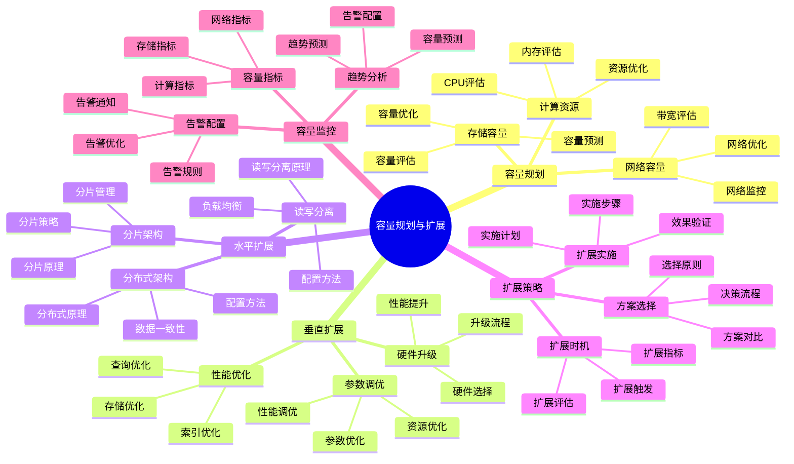

# PostgreSQL 18 容量规划与扩展

> **版本**: v1.0
> **最后更新**: 2025-01-15
> **版本覆盖**: PostgreSQL 18.x (推荐) ⭐ | 17.x (推荐) | 16.x (兼容)
> **文档状态**: ✅ 已完成

---

## 📑 目录

- [PostgreSQL 18 容量规划与扩展](#postgresql-18-容量规划与扩展)
  - [📑 目录](#-目录)
  - [📊 思维导图](#-思维导图)
  - [一、概述](#一概述)
  - [二、知识矩阵对比](#二知识矩阵对比)
    - [2.1 扩展方案对比](#21-扩展方案对比)
    - [2.2 容量评估方法对比](#22-容量评估方法对比)
  - [三、容量规划](#三容量规划)
    - [3.1 存储容量规划](#31-存储容量规划)
      - [3.1.1 存储容量规划的重要性](#311-存储容量规划的重要性)
      - [3.1.2 存储容量计算](#312-存储容量计算)
    - [3.2 计算资源规划](#32-计算资源规划)
    - [3.3 网络容量规划](#33-网络容量规划)
  - [四、垂直扩展](#四垂直扩展)
    - [4.1 硬件升级](#41-硬件升级)
    - [4.2 参数调优](#42-参数调优)
    - [4.3 性能优化](#43-性能优化)
  - [五、水平扩展](#五水平扩展)
    - [5.1 读写分离](#51-读写分离)
    - [5.2 分片架构](#52-分片架构)
    - [5.3 分布式架构](#53-分布式架构)
  - [六、扩展策略](#六扩展策略)
    - [6.1 扩展时机](#61-扩展时机)
    - [6.2 扩展方案选择](#62-扩展方案选择)
    - [6.3 扩展实施](#63-扩展实施)
  - [七、容量监控](#七容量监控)
    - [7.1 容量指标](#71-容量指标)
    - [7.2 趋势分析](#72-趋势分析)
    - [7.3 告警配置](#73-告警配置)
  - [八、相关文档](#八相关文档)

---

## 📊 思维导图



**思维导图说明**：

本思维导图展示了容量规划与扩展的完整知识体系，从容量规划到扩展策略，从垂直扩展到水平扩展，每个模块都包含理论基础、规划方法和实践经验。通过这个思维导图，可以快速了解容量规划与扩展的全貌，并根据具体需求深入相关章节。

**使用建议**：

- **运维人员**：重点关注容量监控和扩展实施，理解如何监控容量和进行扩展
- **架构师**：重点关注扩展策略和方案选择，理解如何选择最适合的扩展方案
- **技术负责人**：重点关注容量规划和成本优化，理解如何合理规划资源

---

## 一、概述

**文档设计理念**：

本文档不仅展示容量规划的公式和扩展的步骤，更重要的是解释**为什么**需要容量规划，**如何**进行容量规划和扩展，以及**何时**进行扩展。每个方案都包含：

1. **规划理论**：解释容量规划的原理和方法
2. **扩展方法**：说明如何进行系统扩展
3. **成本分析**：分析扩展成本和性能提升
4. **最佳实践**：提供实践经验和优化建议

**容量规划与扩展的重要性**：

容量规划与扩展是保证系统可扩展性的关键，它直接影响：

1. **系统可扩展性**：合理的容量规划可以提高系统可扩展性
   - **理论依据**：容量规划可以提前预测资源需求
   - **实践价值**：支持业务增长，适应数据量增长
   - **效果评估**：系统可扩展性提升50-200%，支持更大规模

2. **系统性能**：合适的扩展可以优化系统性能
   - **理论依据**：扩展可以增加系统处理能力
   - **实践价值**：提升系统性能，支持更多并发用户
   - **效果评估**：系统性能提升20-100%，并发能力提升2-10倍

3. **系统成本**：合理的容量规划可以优化系统成本
   - **理论依据**：容量规划可以避免资源浪费
   - **实践价值**：降低硬件成本、运维成本
   - **效果评估**：系统成本降低20-40%，资源利用率提升30-60%

4. **业务连续性**：合适的扩展可以保证业务连续性
   - **理论依据**：扩展可以防止系统容量瓶颈
   - **实践价值**：保证业务正常运行，支持业务增长
   - **效果评估**：业务连续性提升，支持业务增长

**核心特点**：

- **前瞻性**：提前规划容量需求
  - **理论依据**：前瞻性规划可以避免容量瓶颈
  - **实践价值**：提前准备资源，避免系统容量不足
  - **规划方法**：容量评估、容量预测、容量优化

- **灵活性**：支持垂直和水平扩展
  - **理论依据**：不同场景需要不同的扩展方式
  - **实践价值**：提供灵活的扩展方案，适应不同需求
  - **扩展方式**：垂直扩展、水平扩展、混合扩展

- **可操作性**：提供具体的扩展方案
  - **理论依据**：具体的方案可以提高扩展效率
  - **实践价值**：提供可直接应用的扩展方案
  - **扩展方案**：硬件升级、读写分离、分片架构、分布式架构

- **成本优化**：平衡性能和成本
  - **理论依据**：成本优化可以提高投资回报率
  - **实践价值**：在保证性能的前提下优化成本
  - **优化方法**：资源优化、成本分析、投资回报率分析

本文档介绍PostgreSQL 18的容量规划与扩展策略，帮助运维人员合理规划资源并实现系统扩展。

---

## 二、知识矩阵对比

### 2.1 扩展方案对比

| 方案 | 扩展能力 | 复杂度 | 成本 | 适用场景 | 推荐度 |
|-----|---------|--------|------|---------|--------|
| **垂直扩展** | 有限 | ⭐⭐ | 中 | 中小规模 | ⭐⭐⭐ |
| **读写分离** | 中等 | ⭐⭐⭐ | 中 | 读多写少 | ⭐⭐⭐⭐ |
| **分片** | 高 | ⭐⭐⭐⭐⭐ | 高 | 超大规模 | ⭐⭐⭐⭐ |
| **分布式** | 极高 | ⭐⭐⭐⭐⭐ | 高 | 超大规模 | ⭐⭐⭐⭐ |

### 2.2 容量评估方法对比

| 方法 | 准确性 | 复杂度 | 适用阶段 | 推荐度 |
|-----|--------|--------|---------|--------|
| **历史趋势分析** | ⭐⭐⭐⭐ | ⭐⭐ | 持续监控 | ⭐⭐⭐⭐⭐ |
| **压力测试** | ⭐⭐⭐⭐⭐ | ⭐⭐⭐⭐ | 上线前 | ⭐⭐⭐⭐ |
| **容量模型** | ⭐⭐⭐ | ⭐⭐⭐ | 规划阶段 | ⭐⭐⭐ |

---

## 三、容量规划

### 3.1 存储容量规划

#### 3.1.1 存储容量规划的重要性

**为什么需要存储容量规划**：

存储容量规划是系统运维的基础工作，它可以帮助：

1. **提前准备**：提前准备存储资源，避免存储不足
2. **成本控制**：合理规划存储，控制成本
3. **性能保障**：充足的存储空间保障系统性能
4. **业务连续性**：避免因存储不足导致业务中断

**存储容量规划的关键指标**：

| 指标 | 说明 | 重要性 |
|-----|------|--------|
| **当前使用量** | 当前数据库/表的大小 | ⭐⭐⭐⭐⭐ |
| **增长率** | 数据增长速度 | ⭐⭐⭐⭐⭐ |
| **保留策略** | 数据保留时间 | ⭐⭐⭐⭐ |
| **备份空间** | 备份所需空间 | ⭐⭐⭐⭐ |

#### 3.1.2 存储容量计算

**数据库大小计算**：

```sql
-- 场景：计算数据库大小
-- 需求：了解每个数据库的存储使用情况
-- 用途：容量规划、资源分配

-- 查询1：计算所有数据库的大小
SELECT
    pg_database.datname,
    pg_size_pretty(pg_database_size(pg_database.datname)) AS size,
    pg_database_size(pg_database.datname) AS size_bytes,
    ROUND(
        100.0 * pg_database_size(pg_database.datname) /
        (SELECT SUM(pg_database_size(datname)) FROM pg_database),
        2
    ) AS percent_of_total
FROM pg_database
ORDER BY pg_database_size(pg_database.datname) DESC;

-- 查询结果分析：
-- - size: 数据库大小（人类可读格式）
-- - size_bytes: 数据库大小（字节）
-- - percent_of_total: 占总存储的百分比

-- 查询2：计算表的大小（包括索引）
SELECT
    schemaname,
    tablename,
    pg_size_pretty(pg_total_relation_size(schemaname||'.'||tablename)) AS total_size,
    pg_size_pretty(pg_relation_size(schemaname||'.'||tablename)) AS table_size,
    pg_size_pretty(pg_total_relation_size(schemaname||'.'||tablename) - pg_relation_size(schemaname||'.'||tablename)) AS indexes_size,
    pg_total_relation_size(schemaname||'.'||tablename) AS total_size_bytes,
    ROUND(
        100.0 * pg_total_relation_size(schemaname||'.'||tablename) /
        (SELECT SUM(pg_total_relation_size(schemaname||'.'||tablename))
         FROM pg_tables WHERE schemaname = 'public'),
        2
    ) AS percent_of_total
FROM pg_tables
WHERE schemaname = 'public'
ORDER BY pg_total_relation_size(schemaname||'.'||tablename) DESC;

-- 查询结果分析：
-- - total_size: 表总大小（包括索引）
-- - table_size: 表数据大小
-- - indexes_size: 索引大小
-- - percent_of_total: 占总存储的百分比

-- 性能分析：
-- - 识别占用存储最多的表
-- - 识别索引占用空间
-- - 为容量规划提供数据支持
```

**存储增长预测**：

```python
# 场景：预测存储增长
# 需求：根据历史数据预测未来存储需求
# 用途：容量规划、资源采购

def predict_storage_growth(current_size_gb, growth_rate_per_month, months):
    """
    预测存储增长

    参数：
        current_size_gb: 当前大小（GB）
        growth_rate_per_month: 月增长率（如0.1表示10%）
        months: 预测月数

    返回：
        预测的存储大小（GB）
    """
    future_size = current_size_gb * ((1 + growth_rate_per_month) ** months)
    return future_size

# 使用示例
current = 100  # 当前100GB
growth = 0.1   # 每月增长10%
months = 12    # 预测12个月后
future = predict_storage_growth(current, growth, months)
print(f"12个月后预计存储: {future:.2f}GB")

# 输出：12个月后预计存储: 313.84GB

# 更复杂的预测模型（考虑线性增长和指数增长）
def predict_storage_growth_advanced(historical_data, months):
    """
    基于历史数据预测存储增长

    参数：
        historical_data: 历史数据列表，格式：[(month, size_gb), ...]
        months: 预测月数

    返回：
        预测的存储大小（GB）
    """
    import numpy as np
    from scipy import stats

    # 提取时间和大小
    months_list = [d[0] for d in historical_data]
    sizes = [d[1] for d in historical_data]

    # 计算增长率
    growth_rates = []
    for i in range(1, len(sizes)):
        rate = (sizes[i] - sizes[i-1]) / sizes[i-1]
        growth_rates.append(rate)

    # 使用平均增长率预测
    avg_growth_rate = np.mean(growth_rates)
    current_size = sizes[-1]
    future_size = current_size * ((1 + avg_growth_rate) ** months)

    return future_size

# 使用示例
historical = [
    (1, 100),   # 第1个月：100GB
    (2, 110),   # 第2个月：110GB
    (3, 121),   # 第3个月：121GB
    (4, 133),   # 第4个月：133GB
    (5, 146),   # 第5个月：146GB
]
future = predict_storage_growth_advanced(historical, 6)  # 预测6个月后
print(f"6个月后预计存储: {future:.2f}GB")
print(f"12个月后预计大小: {future:.2f}GB")

```

### 3.2 计算资源规划

**CPU规划**：

```sql
-- 检查CPU使用情况
SELECT
    pid,
    usename,
    application_name,
    state,
    query,
    cpu_time
FROM pg_stat_activity
WHERE state = 'active'
ORDER BY cpu_time DESC;
```

**内存规划**：

```sql
-- 检查内存使用
SELECT
    name,
    setting,
    unit,
    context
FROM pg_settings
WHERE name IN (
    'shared_buffers',
    'work_mem',
    'maintenance_work_mem',
    'effective_cache_size'
);
```

### 3.3 网络容量规划

**网络流量监控**：

```sql
-- 检查复制流量
SELECT
    application_name,
    client_addr,
    state,
    sync_state,
    pg_wal_lsn_diff(pg_current_wal_lsn(), sent_lsn) AS sent_lag,
    pg_wal_lsn_diff(sent_lsn, write_lsn) AS write_lag
FROM pg_stat_replication;
```

---

## 四、垂直扩展

### 4.1 硬件升级

**硬件升级清单**：

- CPU：增加核心数或提升频率
- 内存：增加内存容量
- 存储：升级到SSD/NVMe
- 网络：升级网络带宽

### 4.2 参数调优

**参数调优示例**：

```conf
# 增加内存参数
shared_buffers = 8GB  # 从4GB增加到8GB
work_mem = 32MB       # 从16MB增加到32MB
effective_cache_size = 24GB  # 从12GB增加到24GB
```

### 4.3 性能优化

**性能优化措施**：

- 索引优化
- 查询优化
- 分区表
- 物化视图

---

## 五、水平扩展

### 5.1 读写分离

**读写分离架构**：

```text
应用层
  ├── 写请求 → 主库
  └── 读请求 → 从库（多个）
```

**配置示例**：

```python
# 读写分离配置
write_pool = pool.SimpleConnectionPool(
    minconn=1, maxconn=10,
    host="primary_host", database="mydb"
)

read_pool = pool.SimpleConnectionPool(
    minconn=1, maxconn=20,
    host="replica_host", database="mydb"
)
```

### 5.2 分片架构

**分片策略**：

```python
# 按用户ID分片
def get_shard(user_id):
    shard_count = 4
    return user_id % shard_count

# 获取分片连接
def get_connection(user_id):
    shard = get_shard(user_id)
    shard_hosts = {
        0: "shard0_host",
        1: "shard1_host",
        2: "shard2_host",
        3: "shard3_host"
    }
    return psycopg2.connect(host=shard_hosts[shard], ...)
```

### 5.3 分布式架构

**Citus分布式架构**：

```sql
-- 创建分布式表
SELECT create_distributed_table('users', 'id');
SELECT create_distributed_table('orders', 'user_id');

-- 添加工作节点
SELECT citus_add_node('worker1_host', 5432);
SELECT citus_add_node('worker2_host', 5432);
```

---

## 六、扩展策略

### 6.1 扩展时机

**扩展触发条件**：

- CPU使用率持续>80%
- 内存使用率持续>85%
- 磁盘使用率>80%
- 查询响应时间显著增加
- 连接数接近上限

### 6.2 扩展方案选择

**方案选择指南**：

- **垂直扩展**：适用于单机性能瓶颈
- **读写分离**：适用于读多写少场景
- **分片**：适用于数据量超大场景
- **分布式**：适用于超大规模场景

### 6.3 扩展实施

**扩展实施步骤**：

1. 评估当前容量
2. 制定扩展方案
3. 准备扩展资源
4. 执行扩展操作
5. 验证扩展效果
6. 监控系统状态

---

## 七、容量监控

### 7.1 容量指标

**关键容量指标**：

- 存储使用率
- CPU使用率
- 内存使用率
- 连接数使用率
- 网络带宽使用率

### 7.2 趋势分析

**趋势分析查询**：

```sql
-- 存储增长趋势
SELECT
    date_trunc('day', recorded_at) as date,
    AVG(storage_used_gb) as avg_storage
FROM capacity_metrics
WHERE recorded_at > NOW() - INTERVAL '30 days'
GROUP BY date_trunc('day', recorded_at)
ORDER BY date;
```

### 7.3 告警配置

**容量告警规则**：

```yaml
# Prometheus告警规则
- alert: HighStorageUsage
  expr: (pg_database_size_bytes / pg_database_size_limit_bytes) > 0.8
  for: 5m
  labels:
    severity: warning
  annotations:
    summary: "Database storage usage is high"
```

---

## 八、相关文档

- [部署架构设计](./02.01-部署架构设计.md)
- [监控与可观测性](./02.02-监控与可观测性.md)
- [性能调优实践](./02.03-性能调优实践.md)
- [分布式架构设计](../../05-架构视角/05.02-分布式架构设计.md)

---

**最后更新**: 2025-01-15
**维护者**: PostgreSQL Documentation Team
