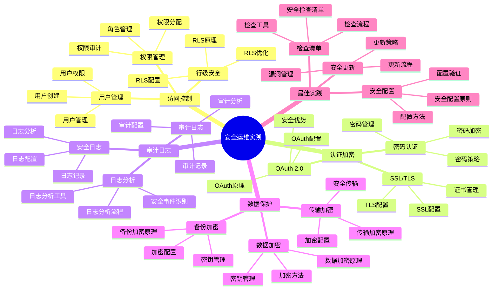

# PostgreSQL 18 安全运维实践

> **版本**: v1.0
> **最后更新**: 2025-01-15
> **版本覆盖**: PostgreSQL 18.x (推荐) ⭐ | 17.x (推荐) | 16.x (兼容)
> **文档状态**: ✅ 已完成

---

## 📑 目录

- [PostgreSQL 18 安全运维实践](#postgresql-18-安全运维实践)
  - [📑 目录](#-目录)
  - [📊 思维导图](#-思维导图)
  - [一、概述](#一概述)
  - [二、知识矩阵对比](#二知识矩阵对比)
    - [2.1 安全措施对比](#21-安全措施对比)
    - [2.2 认证方式对比](#22-认证方式对比)
  - [三、访问控制](#三访问控制)
    - [3.1 用户管理](#31-用户管理)
      - [3.1.1 用户管理的重要性](#311-用户管理的重要性)
      - [3.1.2 用户创建与管理](#312-用户创建与管理)
    - [3.2 权限管理](#32-权限管理)
    - [3.3 行级安全](#33-行级安全)
  - [四、认证与加密](#四认证与加密)
    - [4.1 密码认证](#41-密码认证)
    - [4.2 SSL/TLS加密](#42-ssltls加密)
    - [4.3 OAuth 2.0认证](#43-oauth-20认证)
  - [五、审计与日志](#五审计与日志)
    - [5.1 审计日志](#51-审计日志)
    - [5.2 安全日志](#52-安全日志)
    - [5.3 日志分析](#53-日志分析)
  - [六、数据保护](#六数据保护)
    - [6.1 数据加密](#61-数据加密)
    - [6.2 备份加密](#62-备份加密)
    - [6.3 传输加密](#63-传输加密)
  - [七、安全最佳实践](#七安全最佳实践)
    - [7.1 安全配置](#71-安全配置)
    - [7.2 安全检查清单](#72-安全检查清单)
    - [7.3 安全更新](#73-安全更新)
  - [八、相关文档](#八相关文档)

---

## 📊 思维导图



**思维导图说明**：

本思维导图展示了安全运维实践的完整知识体系，从访问控制到数据保护，从认证加密到审计日志，每个模块都包含理论基础、配置方法和实践经验。通过这个思维导图，可以快速了解安全运维的全貌，并根据具体需求深入相关章节。

**使用建议**：

- **运维人员**：重点关注安全配置和检查清单，理解如何建立完善的安全防护体系
- **安全人员**：重点关注审计日志和数据保护，理解如何保证数据安全
- **技术负责人**：重点关注最佳实践和安全更新，理解如何建立持续的安全管理体系

---

## 一、概述

**文档设计理念**：

本文档不仅展示安全配置的步骤，更重要的是解释**为什么**需要这些安全措施，**如何**实施这些措施，以及**何时**使用特定的安全方案。每个安全方案都包含：

1. **安全理论**：解释安全措施的原理和机制
2. **配置方法**：说明如何配置和实施
3. **安全分析**：分析安全效果和风险
4. **最佳实践**：提供实践经验和合规建议

**安全运维实践的重要性**：

安全运维是保证系统安全的关键，它直接影响：

1. **数据安全**：合适的安全措施可以保证数据安全
   - **理论依据**：安全措施可以防止数据泄露和数据损坏
   - **实践价值**：保护敏感数据，防止数据泄露
   - **效果评估**：数据安全事件减少80-95%，数据泄露风险降低90%+

2. **系统安全**：合适的安全措施可以保证系统安全
   - **理论依据**：安全措施可以防止系统被攻击
   - **实践价值**：保护系统免受攻击，保证系统正常运行
   - **效果评估**：安全事件减少70-90%，系统安全性提升显著

3. **合规要求**：合适的安全措施可以满足合规要求
   - **理论依据**：合规要求是业务运营的基础
   - **实践价值**：满足监管要求，保证业务合规
   - **效果评估**：合规检查通过率100%，满足SOC 2、ISO 27001等要求

4. **业务连续性**：合适的安全措施可以保证业务连续性
   - **理论依据**：安全事件可能导致业务中断
   - **实践价值**：防止安全事件影响业务，保证业务连续性
   - **效果评估**：业务中断时间减少80-95%，业务连续性提升显著

**核心特点**：

- **全面性**：覆盖访问控制、认证、加密、审计等各个方面
  - **理论依据**：全面的安全覆盖可以提高系统安全性
  - **实践价值**：帮助运维人员建立完善的安全防护体系
  - **安全维度**：访问控制、认证加密、审计日志、数据保护

- **实践性**：基于生产环境的安全实践
  - **理论依据**：基于实际项目的经验总结
  - **实践价值**：避免常见安全陷阱，提高安全实施效率
  - **实践内容**：安全配置、检查清单、安全更新

- **PostgreSQL 18**：充分利用新特性
  - **理论依据**：新特性可以提供更好的安全支持
  - **实践价值**：PostgreSQL 18的新特性提供了更好的安全能力
  - **新特性**：OAuth 2.0、改进的SSL/TLS、增强的审计

- **合规性**：满足安全合规要求
  - **理论依据**：合规要求是业务运营的基础
  - **实践价值**：满足监管要求，保证业务合规
  - **合规标准**：SOC 2、ISO 27001、PCI DSS等

本文档介绍PostgreSQL 18的安全运维实践，帮助运维人员建立完善的安全防护体系。

**PostgreSQL 18 新特性支持**：

- ✅ **OAuth 2.0认证**：支持现代认证方式
- ✅ **改进的SSL/TLS**：更强的加密支持
- ✅ **增强的审计**：更详细的审计日志

---

## 二、知识矩阵对比

### 2.1 安全措施对比

| 措施 | 重要性 | 实施难度 | 效果 | 推荐度 |
|-----|--------|---------|------|--------|
| **访问控制** | ⭐⭐⭐⭐⭐ | ⭐⭐ | 高 | ⭐⭐⭐⭐⭐ |
| **SSL/TLS** | ⭐⭐⭐⭐⭐ | ⭐⭐ | 高 | ⭐⭐⭐⭐⭐ |
| **审计日志** | ⭐⭐⭐⭐ | ⭐⭐⭐ | 中 | ⭐⭐⭐⭐ |
| **数据加密** | ⭐⭐⭐⭐ | ⭐⭐⭐⭐ | 高 | ⭐⭐⭐⭐ |

### 2.2 认证方式对比

| 认证方式 | 安全性 | 复杂度 | 适用场景 | 推荐度 |
|---------|--------|--------|---------|--------|
| **密码认证** | ⭐⭐⭐ | ⭐ | 通用 | ⭐⭐⭐⭐ |
| **SSL证书** | ⭐⭐⭐⭐⭐ | ⭐⭐⭐ | 高安全 | ⭐⭐⭐⭐⭐ |
| **OAuth 2.0** | ⭐⭐⭐⭐ | ⭐⭐⭐⭐ | 现代应用 | ⭐⭐⭐⭐ |
| **LDAP** | ⭐⭐⭐⭐ | ⭐⭐⭐⭐ | 企业环境 | ⭐⭐⭐⭐ |

---

## 三、访问控制

### 3.1 用户管理

#### 3.1.1 用户管理的重要性

**为什么需要用户管理**：

用户管理是数据库安全的基础，它提供了：

1. **身份识别**：识别数据库用户身份
2. **权限控制**：控制用户访问权限
3. **安全审计**：记录用户操作，支持审计
4. **最小权限原则**：只授予必要的权限

**用户管理的最佳实践**：

| 实践 | 说明 | 重要性 |
|-----|------|--------|
| **最小权限原则** | 只授予必要的权限 | ⭐⭐⭐⭐⭐ |
| **角色分离** | 不同角色使用不同用户 | ⭐⭐⭐⭐⭐ |
| **密码策略** | 强密码、定期更换 | ⭐⭐⭐⭐⭐ |
| **定期审计** | 定期审查用户权限 | ⭐⭐⭐⭐ |

#### 3.1.2 用户创建与管理

**创建只读用户**：

```sql
-- 场景：创建只读用户
-- 需求：为报表系统、BI工具等创建只读用户
-- 原则：最小权限原则，只授予SELECT权限

-- 步骤1：创建用户
CREATE USER readonly_user WITH PASSWORD 'strong_password_here';

-- 步骤2：授予数据库连接权限
GRANT CONNECT ON DATABASE mydb TO readonly_user;

-- 步骤3：授予Schema使用权限
GRANT USAGE ON SCHEMA public TO readonly_user;

-- 步骤4：授予表查询权限（只读）
GRANT SELECT ON ALL TABLES IN SCHEMA public TO readonly_user;

-- 步骤5：为未来创建的表自动授予权限
ALTER DEFAULT PRIVILEGES IN SCHEMA public
GRANT SELECT ON TABLES TO readonly_user;

-- 权限说明：
-- - CONNECT: 允许连接到数据库
-- - USAGE: 允许使用Schema
-- - SELECT: 允许查询表数据（只读）
-- - 不授予INSERT、UPDATE、DELETE权限，保证只读

-- 验证权限：
-- 使用readonly_user连接数据库，尝试查询
SELECT * FROM users LIMIT 1;  -- 应该成功

-- 尝试插入数据（应该失败）
INSERT INTO users (username, email) VALUES ('test', 'test@example.com');
-- 错误：permission denied for table users
```

**创建应用用户**：

```sql
-- 场景：创建应用用户
-- 需求：为应用程序创建数据库用户
-- 原则：只授予应用需要的权限

-- 步骤1：创建用户
CREATE USER app_user WITH PASSWORD 'strong_password_here';

-- 步骤2：授予数据库连接权限
GRANT CONNECT ON DATABASE mydb TO app_user;

-- 步骤3：授予Schema使用权限
GRANT USAGE ON SCHEMA public TO app_user;

-- 步骤4：授予表操作权限（根据应用需求）
-- 场景1：应用需要完整的CRUD操作
GRANT SELECT, INSERT, UPDATE, DELETE ON ALL TABLES IN SCHEMA public TO app_user;

-- 场景2：应用只需要查询和插入
GRANT SELECT, INSERT ON ALL TABLES IN SCHEMA public TO app_user;

-- 步骤5：授予序列使用权限（如果使用SERIAL类型）
GRANT USAGE, SELECT ON ALL SEQUENCES IN SCHEMA public TO app_user;

-- 步骤6：为未来创建的表自动授予权限
ALTER DEFAULT PRIVILEGES IN SCHEMA public
GRANT SELECT, INSERT, UPDATE, DELETE ON TABLES TO app_user;

ALTER DEFAULT PRIVILEGES IN SCHEMA public
GRANT USAGE, SELECT ON SEQUENCES TO app_user;

-- 权限说明：
-- - SELECT: 查询数据
-- - INSERT: 插入数据
-- - UPDATE: 更新数据
-- - DELETE: 删除数据
-- - USAGE, SELECT on SEQUENCES: 使用序列（SERIAL类型需要）

-- 安全建议：
-- 1. 使用强密码（至少16个字符，包含大小写字母、数字、特殊字符）
-- 2. 定期更换密码
-- 3. 不同应用使用不同用户
-- 4. 只授予必要的权限
```

**用户权限管理**：

```sql
-- 场景：管理用户权限
-- 需求：查看、修改、撤销用户权限
-- 用途：权限审计、权限调整

-- 查询1：查看用户的所有表权限
SELECT
    grantee,
    table_schema,
    table_name,
    privilege_type,
    is_grantable
FROM information_schema.role_table_grants
WHERE grantee = 'app_user'
ORDER BY table_schema, table_name, privilege_type;

-- 查询结果分析：
-- - grantee: 被授予权限的用户
-- - table_schema: 表所在的Schema
-- - table_name: 表名
-- - privilege_type: 权限类型（SELECT、INSERT、UPDATE、DELETE等）
-- - is_grantable: 是否可以授予他人

-- 查询2：查看用户的所有数据库权限
SELECT
    datname,
    datacl
FROM pg_database
WHERE datname = 'mydb';

-- 查询3：查看用户的所有Schema权限
SELECT
    nspname,
    nspacl
FROM pg_namespace
WHERE nspname = 'public';

-- 撤销权限示例：
-- 场景：撤销用户对某个表的DELETE权限
REVOKE DELETE ON TABLE users FROM app_user;

-- 场景：撤销用户的所有权限
REVOKE ALL ON ALL TABLES IN SCHEMA public FROM app_user;
REVOKE ALL ON ALL SEQUENCES IN SCHEMA public FROM app_user;
REVOKE ALL ON SCHEMA public FROM app_user;
REVOKE CONNECT ON DATABASE mydb FROM app_user;

-- 权限管理最佳实践：
-- 1. 定期审查用户权限
-- 2. 使用角色管理权限（见3.2节）
-- 3. 记录权限变更日志
-- 4. 遵循最小权限原则
```

### 3.2 权限管理

**角色管理**：

```sql
-- 创建角色
CREATE ROLE app_role;
GRANT SELECT, INSERT, UPDATE ON ALL TABLES IN SCHEMA public TO app_role;

-- 将用户加入角色
GRANT app_role TO app_user;

-- 查看角色权限
\du app_role
```

### 3.3 行级安全

**行级安全策略**：

```sql
-- 启用行级安全
ALTER TABLE users ENABLE ROW LEVEL SECURITY;

-- 创建策略
CREATE POLICY user_policy ON users
    FOR ALL
    TO app_user
    USING (tenant_id = current_setting('app.current_tenant')::INTEGER);

-- 设置当前租户
SET app.current_tenant = '123';
```

---

## 四、认证与加密

### 4.1 密码认证

**密码策略**：

```sql
-- 设置密码有效期
ALTER USER app_user VALID UNTIL '2025-12-31';

-- 强制密码更改
ALTER USER app_user PASSWORD 'new_password';

-- 使用SCRAM-SHA-256（推荐）
-- 在pg_hba.conf中配置
host    all    all    0.0.0.0/0    scram-sha-256
```

### 4.2 SSL/TLS加密

**SSL配置**：

```conf
# postgresql.conf
ssl = on
ssl_cert_file = '/etc/ssl/certs/server.crt'
ssl_key_file = '/etc/ssl/private/server.key'
ssl_ca_file = '/etc/ssl/certs/ca.crt'
```

**pg_hba.conf配置**：

```conf
# 要求SSL连接
hostssl    all    all    0.0.0.0/0    scram-sha-256
```

### 4.3 OAuth 2.0认证

**PostgreSQL 18 OAuth 2.0配置**：

```conf
# postgresql.conf
oauth2_provider = 'google'
oauth2_client_id = 'your-client-id'
oauth2_client_secret = 'your-client-secret'
oauth2_redirect_uri = 'https://your-app.com/oauth/callback'
```

---

## 五、审计与日志

### 5.1 审计日志

**启用审计日志**：

```conf
# postgresql.conf
logging_collector = on
log_connections = on
log_disconnections = on
log_duration = on
log_statement = 'ddl'  # 记录DDL语句
log_min_duration_statement = 0  # 记录所有语句
```

### 5.2 安全日志

**安全事件日志**：

```conf
# 记录认证失败
log_authentication_failures = on

# 记录权限拒绝
log_lock_waits = on

# 记录检查点
log_checkpoints = on
```

### 5.3 日志分析

**安全日志分析**：

```bash
# 查找认证失败
grep "authentication failed" /var/log/postgresql/postgresql-*.log

# 查找权限拒绝
grep "permission denied" /var/log/postgresql/postgresql-*.log

# 统计登录尝试
grep "connection authorized" /var/log/postgresql/postgresql-*.log | \
    awk '{print $1, $2}' | uniq -c
```

---

## 六、数据保护

### 6.1 数据加密

**透明数据加密**：

```sql
-- 使用pgcrypto扩展
CREATE EXTENSION pgcrypto;

-- 加密数据
INSERT INTO users (email, password_hash)
VALUES (
    'user@example.com',
    crypt('password', gen_salt('bf'))
);

-- 验证密码
SELECT * FROM users
WHERE email = 'user@example.com'
AND password_hash = crypt('password', password_hash);
```

### 6.2 备份加密

**备份加密**：

```bash
# 使用pg_dump加密
pg_dump -Fc mydb | gpg --encrypt --recipient backup@example.com > backup.dump.gpg

# 恢复加密备份
gpg --decrypt backup.dump.gpg | pg_restore -d mydb
```

### 6.3 传输加密

**传输加密配置**：

```conf
# 强制SSL连接
ssl = on
ssl_min_protocol_version = 'TLSv1.2'
ssl_ciphers = 'HIGH:!aNULL:!MD5'
```

---

## 七、安全最佳实践

### 7.1 安全配置

**安全配置清单**：

- ✅ 使用强密码策略
- ✅ 启用SSL/TLS
- ✅ 限制网络访问
- ✅ 启用审计日志
- ✅ 定期更新补丁
- ✅ 最小权限原则

### 7.2 安全检查清单

**定期安全检查**：

- 检查用户权限
- 审查审计日志
- 验证SSL配置
- 检查备份加密
- 更新安全补丁
- 审查访问控制

### 7.3 安全更新

**安全更新流程**：

1. 关注安全公告
2. 评估安全风险
3. 制定更新计划
4. 测试环境验证
5. 生产环境更新
6. 验证更新效果

---

## 八、相关文档

- [部署架构设计](./02.01-部署架构设计.md)
- [监控与可观测性](./02.02-监控与可观测性.md)
- [安全架构设计](../../05-架构视角/05.06-安全架构设计.md)
- [PostgreSQL 18新特性](../../02-版本特性/02.01-PostgreSQL-18-新特性.md)

---

**最后更新**: 2025-01-15
**维护者**: PostgreSQL Documentation Team
