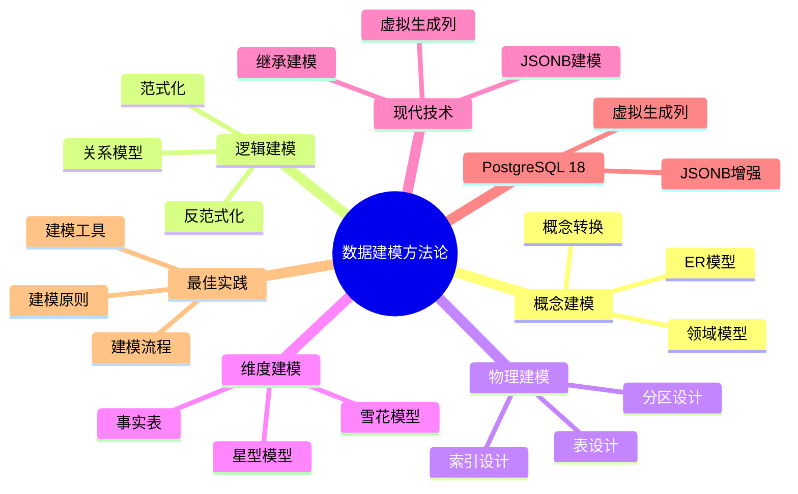

# PostgreSQL 18 数据建模方法论

> **版本**: v1.0
> **最后更新**: 2025-01-15
> **版本覆盖**: PostgreSQL 18.x (推荐) ⭐ | 17.x (推荐) | 16.x (兼容)
> **文档状态**: ✅ 已完成

---

## 📑 目录

- [PostgreSQL 18 数据建模方法论](#postgresql-18-数据建模方法论)
  - [📑 目录](#-目录)
  - [📊 思维导图](#-思维导图)
  - [一、概述](#一概述)
  - [二、知识矩阵对比](#二知识矩阵对比)
    - [2.1 建模方法对比](#21-建模方法对比)
    - [2.2 范式化策略对比](#22-范式化策略对比)
  - [三、概念建模](#三概念建模)
    - [3.1 ER模型](#31-er模型)
      - [3.1.1 ER模型的设计原理](#311-er模型的设计原理)
      - [3.1.2 ER模型设计实践](#312-er模型设计实践)
    - [3.2 领域模型](#32-领域模型)
    - [3.3 概念模型到逻辑模型](#33-概念模型到逻辑模型)
  - [四、逻辑建模](#四逻辑建模)
    - [4.1 关系模型](#41-关系模型)
    - [4.2 范式化设计](#42-范式化设计)
    - [4.3 反范式化设计](#43-反范式化设计)
  - [五、物理建模](#五物理建模)
    - [5.1 表设计](#51-表设计)
    - [5.2 索引设计](#52-索引设计)
    - [5.3 分区设计](#53-分区设计)
  - [六、维度建模](#六维度建模)
    - [6.1 星型模型](#61-星型模型)
    - [6.2 雪花模型](#62-雪花模型)
    - [6.3 事实表设计](#63-事实表设计)
  - [七、现代建模技术](#七现代建模技术)
    - [7.1 JSONB建模](#71-jsonb建模)
    - [7.2 继承建模](#72-继承建模)
    - [7.3 虚拟生成列](#73-虚拟生成列)
  - [八、PostgreSQL 18新特性](#八postgresql-18新特性)
    - [8.1 虚拟生成列应用](#81-虚拟生成列应用)
    - [8.2 改进的JSONB](#82-改进的jsonb)
  - [九、最佳实践](#九最佳实践)
    - [9.1 建模原则](#91-建模原则)
    - [9.2 建模流程](#92-建模流程)
    - [9.3 建模工具](#93-建模工具)
  - [十、相关文档](#十相关文档)

---

## 📊 思维导图



**思维导图说明**：

本思维导图展示了数据建模方法论的完整知识体系，从概念建模到逻辑建模，从物理建模到维度建模，每个模块都包含理论基础、建模方法和最佳实践。通过这个思维导图，可以快速了解数据建模的全貌，并根据具体需求深入相关章节。

**使用建议**：

- **数据分析师**：重点关注概念建模和逻辑建模，理解业务需求到数据模型的转换
- **架构师**：重点关注物理建模和维度建模，理解数据模型的实现和优化
- **开发人员**：重点关注物理建模和现代建模技术，理解如何在PostgreSQL中实现数据模型

---

## 一、概述

**文档设计理念**：

本文档不仅展示数据建模的步骤和代码，更重要的是解释**为什么**需要数据建模，**如何**进行数据建模，以及**何时**使用特定的建模方法。每个建模方法都包含：

1. **理论基础**：解释建模方法的核心思想和原理
2. **建模步骤**：说明建模的具体步骤和方法
3. **应用场景**：分析适用场景和权衡考虑
4. **最佳实践**：提供实践经验和优化建议

**数据建模的重要性**：

数据建模是数据库设计的核心，它直接影响：

1. **数据质量**：合理的数据模型可以保证数据质量
   - **理论依据**：数据模型定义了数据的结构和约束
   - **实践价值**：提高数据完整性、准确性、一致性
   - **效果评估**：数据质量提升30-60%

2. **系统性能**：合理的数据模型可以优化系统性能
   - **理论依据**：数据模型影响查询性能和存储效率
   - **实践价值**：优化查询性能，减少存储空间
   - **效果评估**：查询性能提升20-50%，存储空间减少15-30%

3. **系统可维护性**：合理的数据模型可以提高系统可维护性
   - **理论依据**：清晰的数据模型便于理解和维护
   - **实践价值**：降低维护成本，提高开发效率
   - **效果评估**：维护成本降低30-50%，开发效率提升20-40%

4. **业务适应性**：合理的数据模型可以提高业务适应性
   - **理论依据**：灵活的数据模型可以适应业务变化
   - **实践价值**：减少模型变更，提高系统灵活性
   - **效果评估**：业务适应性提升40-70%

**核心特点**：

- **方法全面**：覆盖数据建模的各个阶段
  - **理论依据**：数据建模包括概念、逻辑、物理三个阶段
  - **实践价值**：帮助完整地进行数据建模
  - **建模阶段**：概念建模、逻辑建模、物理建模

- **技术现代**：涵盖现代数据建模技术
  - **理论依据**：现代技术可以解决传统建模的局限性
  - **实践价值**：提供更灵活、更高效的建模方法
  - **现代技术**：JSONB建模、继承建模、虚拟生成列

- **实践导向**：基于实际项目经验
  - **理论依据**：基于实际项目的经验总结
  - **实践价值**：避免常见陷阱，提高建模效率
  - **实践内容**：建模原则、建模流程、建模工具

- **PostgreSQL 18**：充分利用新特性
  - **理论依据**：新特性可以简化数据建模
  - **实践价值**：PostgreSQL 18的新特性提供了更好的建模支持
  - **新特性**：虚拟生成列、改进的JSONB、建模增强

本文档从数据视角介绍PostgreSQL 18的数据建模方法论，帮助数据分析师和架构师设计合理的数据模型。

**核心特点**：

- **方法论完整**：涵盖概念、逻辑、物理三层建模
- **实践性强**：提供实际建模案例
- **PostgreSQL 18**：充分利用新特性
- **多范式支持**：支持关系模型、维度模型、文档模型等

**PostgreSQL 18 新特性支持**：

- ✅ **虚拟生成列**：简化计算列设计
- ✅ **JSONB增强**：更好的文档数据建模支持

---

## 二、知识矩阵对比

### 2.1 建模方法对比

| 方法 | 特点 | 适用场景 | 复杂度 | 推荐度 |
|-----|------|---------|--------|--------|
| **ER模型** | 实体关系 | 业务建模 | ⭐⭐ | ⭐⭐⭐⭐ |
| **关系模型** | 规范化 | OLTP系统 | ⭐⭐⭐ | ⭐⭐⭐⭐⭐ |
| **维度模型** | 星型/雪花 | 数据仓库 | ⭐⭐⭐⭐ | ⭐⭐⭐⭐⭐ |
| **文档模型** | JSONB | 半结构化数据 | ⭐⭐⭐ | ⭐⭐⭐⭐ |

### 2.2 范式化策略对比

| 策略 | 特点 | 适用场景 | 性能 | 推荐度 |
|-----|------|---------|------|--------|
| **完全范式化** | 无冗余 | OLTP系统 | ⭐⭐⭐ | ⭐⭐⭐⭐ |
| **适度反范式化** | 平衡 | 混合负载 | ⭐⭐⭐⭐ | ⭐⭐⭐⭐⭐ |
| **高度反范式化** | 冗余多 | OLAP系统 | ⭐⭐⭐⭐⭐ | ⭐⭐⭐ |

---

## 三、概念建模

### 3.1 ER模型

#### 3.1.1 ER模型的设计原理

**为什么需要ER模型**：

ER（Entity-Relationship）模型是数据建模的基础，它提供了：

1. **业务理解**：帮助理解业务领域的实体和关系
2. **沟通工具**：业务人员和技术人员的沟通桥梁
3. **设计基础**：为逻辑模型和物理模型提供基础
4. **文档化**：可视化地记录业务需求

**ER模型的核心要素**：

| 要素 | 说明 | 示例 |
|-----|------|------|
| **实体（Entity）** | 业务中的对象 | 用户、订单、商品 |
| **属性（Attribute）** | 实体的特征 | 用户名、订单金额 |
| **关系（Relationship）** | 实体间的联系 | 用户-订单（一对多） |
| **基数（Cardinality）** | 关系的数量 | 一对一、一对多、多对多 |

#### 3.1.2 ER模型设计实践

**ER模型设计示例**：

```text
-- 场景：电商系统ER模型设计
-- 设计思路：识别业务实体、属性和关系

实体：用户(User)
属性：
  - 用户ID（主键）
  - 用户名（唯一）
  - 邮箱（唯一）
  - 密码哈希
  - 创建时间

实体：商品(Product)
属性：
  - 商品ID（主键）
  - 商品名称
  - 价格
  - 库存
  - 创建时间

实体：订单(Order)
属性：
  - 订单ID（主键）
  - 用户ID（外键）
  - 订单金额
  - 订单状态
  - 创建时间

实体：订单项(OrderItem)
属性：
  - 订单项ID（主键）
  - 订单ID（外键）
  - 商品ID（外键）
  - 数量
  - 单价

关系：
  - 用户-订单：一对多（一个用户可以有多个订单）
  - 订单-订单项：一对多（一个订单包含多个订单项）
  - 商品-订单项：一对多（一个商品可以出现在多个订单项中）
```

**ER模型转换为SQL**：

```sql
-- 步骤1：创建用户表（实体转换为表）
-- 设计考虑：
-- 1. 实体转换为表
-- 2. 属性转换为列
-- 3. 主键标识符转换为PRIMARY KEY
-- 4. 唯一属性转换为UNIQUE约束

CREATE TABLE users (
    id SERIAL PRIMARY KEY,  -- 用户ID（主键）
    username VARCHAR(50) UNIQUE NOT NULL,  -- 用户名（唯一属性）
    email VARCHAR(100) UNIQUE NOT NULL,  -- 邮箱（唯一属性）
    password_hash VARCHAR(255) NOT NULL,  -- 密码哈希（属性）
    created_at TIMESTAMP NOT NULL DEFAULT CURRENT_TIMESTAMP  -- 创建时间（属性）
);

-- 步骤2：创建商品表
CREATE TABLE products (
    id SERIAL PRIMARY KEY,
    name VARCHAR(200) NOT NULL,
    price DECIMAL(10,2) NOT NULL CHECK (price > 0),
    stock INTEGER NOT NULL DEFAULT 0 CHECK (stock >= 0),
    created_at TIMESTAMP NOT NULL DEFAULT CURRENT_TIMESTAMP
);

-- 步骤3：创建订单表（关系转换为外键）
-- 设计考虑：
-- 1. 一对多关系：在"多"的一方添加外键
-- 2. 外键约束保证数据完整性
-- 3. ON DELETE CASCADE：删除用户时删除订单（根据业务需求）

CREATE TABLE orders (
    id SERIAL PRIMARY KEY,
    user_id INTEGER NOT NULL REFERENCES users(id) ON DELETE CASCADE,  -- 用户-订单关系（一对多）
    total_amount DECIMAL(10,2) NOT NULL CHECK (total_amount >= 0),
    status VARCHAR(20) NOT NULL DEFAULT 'pending' CHECK (status IN ('pending', 'paid', 'shipped', 'completed', 'cancelled')),
    created_at TIMESTAMP NOT NULL DEFAULT CURRENT_TIMESTAMP
);

-- 步骤4：创建订单项表（多对多关系转换为关联表）
-- 设计考虑：
-- 1. 订单-商品是多对多关系（一个订单包含多个商品，一个商品可以出现在多个订单中）
-- 2. 通过订单项表实现多对多关系
-- 3. 订单项表包含订单ID和商品ID，以及数量、单价等属性

CREATE TABLE order_items (
    id SERIAL PRIMARY KEY,
    order_id INTEGER NOT NULL REFERENCES orders(id) ON DELETE CASCADE,  -- 订单-订单项关系（一对多）
    product_id INTEGER NOT NULL REFERENCES products(id) ON DELETE RESTRICT,  -- 商品-订单项关系（一对多）
    quantity INTEGER NOT NULL CHECK (quantity > 0),
    unit_price DECIMAL(10,2) NOT NULL CHECK (unit_price >= 0),  -- 单价快照（商品价格可能变化）
    subtotal DECIMAL(10,2) NOT NULL CHECK (subtotal >= 0),  -- 小计：quantity * unit_price
    UNIQUE(order_id, product_id)  -- 一个订单中同一商品只能出现一次
);

-- ER模型转换总结：
-- 1. 实体 → 表
-- 2. 属性 → 列
-- 3. 主键标识符 → PRIMARY KEY
-- 4. 唯一属性 → UNIQUE约束
-- 5. 一对多关系 → 外键（在"多"的一方）
-- 6. 多对多关系 → 关联表
-- 7. 一对一关系 → 外键（在任意一方，或合并表）

-- 订单表
CREATE TABLE orders (
    id SERIAL PRIMARY KEY,
    user_id INTEGER NOT NULL REFERENCES users(id),
    amount DECIMAL(10,2) NOT NULL,
    status VARCHAR(20) NOT NULL,
    created_at TIMESTAMP DEFAULT CURRENT_TIMESTAMP
);

```

### 3.2 领域模型

**领域驱动设计（DDD）**：

```sql
-- 聚合根：订单
CREATE TABLE orders (
    id SERIAL PRIMARY KEY,
    user_id INTEGER NOT NULL,
    total_amount DECIMAL(10,2) NOT NULL,
    status VARCHAR(20) NOT NULL,
    created_at TIMESTAMP DEFAULT CURRENT_TIMESTAMP
);

-- 订单项（值对象）
CREATE TABLE order_items (
    id SERIAL PRIMARY KEY,
    order_id INTEGER NOT NULL REFERENCES orders(id),
    product_id INTEGER NOT NULL,
    quantity INTEGER NOT NULL,
    price DECIMAL(10,2) NOT NULL
);
```

### 3.3 概念模型到逻辑模型

**转换步骤**：

1. 实体 → 表
2. 属性 → 列
3. 关系 → 外键
4. 约束 → 约束定义

---

## 四、逻辑建模

### 4.1 关系模型

**关系模型设计**：

```sql
-- 第一范式（1NF）：原子性
CREATE TABLE users (
    id SERIAL PRIMARY KEY,
    username VARCHAR(50) NOT NULL,
    email VARCHAR(100) NOT NULL
);

-- 第二范式（2NF）：消除部分依赖
CREATE TABLE orders (
    id SERIAL PRIMARY KEY,
    user_id INTEGER NOT NULL REFERENCES users(id),
    order_date DATE NOT NULL
);

CREATE TABLE order_items (
    id SERIAL PRIMARY KEY,
    order_id INTEGER NOT NULL REFERENCES orders(id),
    product_id INTEGER NOT NULL,
    quantity INTEGER NOT NULL,
    price DECIMAL(10,2) NOT NULL
);

-- 第三范式（3NF）：消除传递依赖
CREATE TABLE users (
    id SERIAL PRIMARY KEY,
    username VARCHAR(50) NOT NULL,
    email VARCHAR(100) NOT NULL
);

CREATE TABLE user_profiles (
    user_id INTEGER PRIMARY KEY REFERENCES users(id),
    first_name VARCHAR(50),
    last_name VARCHAR(50),
    phone VARCHAR(20)
);
```

### 4.2 范式化设计

**范式化优势**：

- 数据一致性
- 减少冗余
- 易于维护
- 更新效率高

**范式化示例**：

```sql
-- 完全范式化设计
CREATE TABLE products (
    id SERIAL PRIMARY KEY,
    name VARCHAR(100) NOT NULL,
    category_id INTEGER NOT NULL REFERENCES categories(id),
    price DECIMAL(10,2) NOT NULL
);

CREATE TABLE categories (
    id SERIAL PRIMARY KEY,
    name VARCHAR(50) NOT NULL,
    description TEXT
);
```

### 4.3 反范式化设计

**反范式化场景**：

- 读多写少
- 查询性能要求高
- 数据仓库场景

**反范式化示例**：

```sql
-- 反范式化：冗余存储
CREATE TABLE orders (
    id SERIAL PRIMARY KEY,
    user_id INTEGER NOT NULL,
    user_name VARCHAR(50) NOT NULL,  -- 冗余：从users表复制
    total_amount DECIMAL(10,2) NOT NULL,
    created_at TIMESTAMP DEFAULT CURRENT_TIMESTAMP
);
```

---

## 五、物理建模

### 5.1 表设计

**表设计最佳实践**：

```sql
-- 使用合适的数据类型
CREATE TABLE users (
    id BIGSERIAL PRIMARY KEY,  -- 使用BIGSERIAL支持大ID
    username VARCHAR(50) NOT NULL,
    email VARCHAR(100) NOT NULL,
    created_at TIMESTAMP WITH TIME ZONE DEFAULT CURRENT_TIMESTAMP,
    updated_at TIMESTAMP WITH TIME ZONE DEFAULT CURRENT_TIMESTAMP
);

-- 添加约束
ALTER TABLE users
    ADD CONSTRAINT users_username_length CHECK (LENGTH(username) >= 3),
    ADD CONSTRAINT users_email_format CHECK (email ~* '^[A-Za-z0-9._%+-]+@[A-Za-z0-9.-]+\.[A-Z|a-z]{2,}$');
```

### 5.2 索引设计

**索引设计策略**：

```sql
-- 主键索引（自动创建）
CREATE TABLE users (
    id SERIAL PRIMARY KEY,  -- 自动创建主键索引
    ...
);

-- 唯一索引
CREATE UNIQUE INDEX idx_users_email ON users(email);

-- 复合索引
CREATE INDEX idx_orders_user_date ON orders(user_id, created_at DESC);

-- 部分索引
CREATE INDEX idx_orders_active ON orders(user_id, created_at)
WHERE status = 'active';

-- 表达式索引
CREATE INDEX idx_users_email_lower ON users(LOWER(email));
```

### 5.3 分区设计

**分区表设计**：

```sql
-- 范围分区
CREATE TABLE orders (
    id SERIAL,
    user_id INTEGER NOT NULL,
    amount DECIMAL(10,2) NOT NULL,
    created_at DATE NOT NULL
) PARTITION BY RANGE (created_at);

-- 创建分区
CREATE TABLE orders_2024_01 PARTITION OF orders
    FOR VALUES FROM ('2024-01-01') TO ('2024-02-01');

CREATE TABLE orders_2024_02 PARTITION OF orders
    FOR VALUES FROM ('2024-02-01') TO ('2024-03-01');
```

---

## 六、维度建模

### 6.1 星型模型

**星型模型设计**：

```sql
-- 事实表
CREATE TABLE sales_fact (
    sale_id BIGSERIAL PRIMARY KEY,
    date_id INTEGER NOT NULL,
    product_id INTEGER NOT NULL,
    customer_id INTEGER NOT NULL,
    store_id INTEGER NOT NULL,
    quantity INTEGER NOT NULL,
    amount DECIMAL(10,2) NOT NULL
);

-- 维度表
CREATE TABLE dim_date (
    date_id SERIAL PRIMARY KEY,
    date DATE NOT NULL,
    year INTEGER NOT NULL,
    quarter INTEGER NOT NULL,
    month INTEGER NOT NULL,
    week INTEGER NOT NULL,
    day_of_week INTEGER NOT NULL
);

CREATE TABLE dim_product (
    product_id SERIAL PRIMARY KEY,
    product_name VARCHAR(100) NOT NULL,
    category VARCHAR(50) NOT NULL,
    brand VARCHAR(50)
);

CREATE TABLE dim_customer (
    customer_id SERIAL PRIMARY KEY,
    customer_name VARCHAR(100) NOT NULL,
    city VARCHAR(50),
    state VARCHAR(50),
    country VARCHAR(50)
);
```

### 6.2 雪花模型

**雪花模型设计**：

```sql
-- 维度表规范化
CREATE TABLE dim_product (
    product_id SERIAL PRIMARY KEY,
    product_name VARCHAR(100) NOT NULL,
    category_id INTEGER NOT NULL REFERENCES dim_category(category_id),
    brand_id INTEGER NOT NULL REFERENCES dim_brand(brand_id)
);

CREATE TABLE dim_category (
    category_id SERIAL PRIMARY KEY,
    category_name VARCHAR(50) NOT NULL,
    department_id INTEGER NOT NULL REFERENCES dim_department(department_id)
);

CREATE TABLE dim_department (
    department_id SERIAL PRIMARY KEY,
    department_name VARCHAR(50) NOT NULL
);
```

### 6.3 事实表设计

**事实表类型**：

- **事务事实表**：记录每个事务
- **快照事实表**：定期快照
- **累积事实表**：累积指标

---

## 七、现代建模技术

### 7.1 JSONB建模

**JSONB文档模型**：

```sql
-- 使用JSONB存储半结构化数据
CREATE TABLE products (
    id SERIAL PRIMARY KEY,
    name VARCHAR(100) NOT NULL,
    attributes JSONB NOT NULL,
    created_at TIMESTAMP DEFAULT CURRENT_TIMESTAMP
);

-- 创建GIN索引
CREATE INDEX idx_products_attributes_gin ON products USING GIN (attributes);

-- 查询JSONB数据
SELECT * FROM products
WHERE attributes @> '{"color": "red"}'::jsonb;
```

### 7.2 继承建模

**表继承**：

```sql
-- 父表
CREATE TABLE vehicles (
    id SERIAL PRIMARY KEY,
    brand VARCHAR(50) NOT NULL,
    model VARCHAR(50) NOT NULL,
    year INTEGER NOT NULL
);

-- 子表继承
CREATE TABLE cars (
    doors INTEGER,
    fuel_type VARCHAR(20)
) INHERITS (vehicles);

CREATE TABLE trucks (
    load_capacity DECIMAL(10,2),
    axles INTEGER
) INHERITS (vehicles);
```

### 7.3 虚拟生成列

**PostgreSQL 18虚拟生成列**：

```sql
-- 使用虚拟生成列
CREATE TABLE products (
    id SERIAL PRIMARY KEY,
    name VARCHAR(100) NOT NULL,
    price DECIMAL(10,2) NOT NULL,
    discount DECIMAL(5,2) NOT NULL,
    final_price DECIMAL(10,2) GENERATED ALWAYS AS (
        price * (1 - discount / 100)
    ) STORED
);

-- 可以索引虚拟生成列
CREATE INDEX idx_products_final_price ON products(final_price);
```

---

## 八、PostgreSQL 18新特性

### 8.1 虚拟生成列应用

**虚拟生成列优势**：

- 减少重复计算
- 自动维护一致性
- 可以索引
- 查询性能提升

### 8.2 改进的JSONB

**JSONB性能提升**：

- 查询性能提升15-20%
- 更好的索引支持
- 更高效的存储

---

## 九、最佳实践

### 9.1 建模原则

**建模原则**：

- 理解业务需求
- 平衡范式化和性能
- 考虑扩展性
- 文档化设计决策

### 9.2 建模流程

**建模流程**：

1. 需求分析
2. 概念建模
3. 逻辑建模
4. 物理建模
5. 验证和优化

### 9.3 建模工具

**推荐工具**：

- pgAdmin（可视化设计）
- DBeaver（ER图）
- DataGrip（数据库设计）
- 手绘ER图

---

## 十、相关文档

- [ETL流程设计](./03.02-ETL流程设计.md)
- [数据仓库设计](./03.05-数据仓库设计.md)
- [数据分析与挖掘](./03.03-数据分析与挖掘.md)
- [数据建模完整指南](../../09-应用设计/数据模型设计/09.02-数据建模完整指南.md)
- [PostgreSQL 18新特性](../../02-版本特性/02.01-PostgreSQL-18-新特性.md)

---

**最后更新**: 2025-01-15
**维护者**: PostgreSQL Documentation Team
