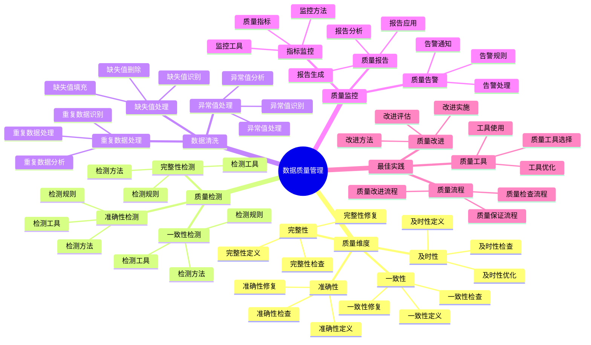

# PostgreSQL 18 数据质量管理

> **版本**: v1.0
> **最后更新**: 2025-01-15
> **版本覆盖**: PostgreSQL 18.x (推荐) ⭐ | 17.x (推荐) | 16.x (兼容)
> **文档状态**: ✅ 已完成

---

## 📑 目录

- [PostgreSQL 18 数据质量管理](#postgresql-18-数据质量管理)
  - [📑 目录](#-目录)
  - [📊 思维导图](#-思维导图)
  - [一、概述](#一概述)
  - [二、知识矩阵对比](#二知识矩阵对比)
    - [2.1 质量维度对比](#21-质量维度对比)
    - [2.2 质量检测方法对比](#22-质量检测方法对比)
  - [三、数据质量维度](#三数据质量维度)
    - [3.1 完整性](#31-完整性)
      - [3.1.1 完整性的重要性](#311-完整性的重要性)
      - [3.1.2 完整性检查实现](#312-完整性检查实现)
    - [3.2 准确性](#32-准确性)
      - [3.2.1 准确性的重要性](#321-准确性的重要性)
      - [3.2.2 准确性检查实现](#322-准确性检查实现)
    - [3.3 一致性](#33-一致性)
      - [3.3.1 一致性的重要性](#331-一致性的重要性)
      - [3.3.2 一致性检查实现](#332-一致性检查实现)
    - [3.4 及时性](#34-及时性)
  - [四、数据质量检测](#四数据质量检测)
    - [4.1 完整性检测](#41-完整性检测)
    - [4.2 准确性检测](#42-准确性检测)
    - [4.3 一致性检测](#43-一致性检测)
  - [五、数据清洗](#五数据清洗)
    - [5.1 缺失值处理](#51-缺失值处理)
    - [5.2 异常值处理](#52-异常值处理)
    - [5.3 重复数据处理](#53-重复数据处理)
  - [六、数据质量监控](#六数据质量监控)
    - [6.1 质量指标监控](#61-质量指标监控)
    - [6.2 质量报告](#62-质量报告)
    - [6.3 质量告警](#63-质量告警)
  - [七、最佳实践](#七最佳实践)
    - [7.1 质量保证流程](#71-质量保证流程)
    - [7.2 质量改进](#72-质量改进)
    - [7.3 质量工具](#73-质量工具)
  - [八、相关文档](#八相关文档)

---

## 📊 思维导图



**思维导图说明**：

本思维导图展示了数据质量管理的完整知识体系，从质量维度到质量检测，从数据清洗到质量监控，每个模块都包含理论基础、检测方法和实践经验。通过这个思维导图，可以快速了解数据质量管理的全貌，并根据具体需求深入相关章节。

**使用建议**：

- **数据分析师**：重点关注质量检测和数据清洗，理解如何确保数据质量
- **数据工程师**：重点关注质量监控和最佳实践，理解如何建立完善的质量管理体系
- **技术负责人**：重点关注质量流程和质量改进，理解如何持续改进数据质量

---

## 一、概述

**文档设计理念**：

本文档不仅展示数据质量检测的SQL代码，更重要的是解释**为什么**需要数据质量管理，**如何**进行数据质量管理，以及**何时**使用特定的质量检测方法。每个质量方案都包含：

1. **质量理论**：解释质量管理的原理和机制
2. **检测方法**：说明如何进行质量检测
3. **清洗方法**：提供数据清洗的方法和策略
4. **最佳实践**：提供实践经验和改进建议

**数据质量管理的重要性**：

数据质量管理是数据价值实现的基础，它直接影响：

1. **数据质量**：合适的数据质量管理可以提高数据质量
   - **理论依据**：数据质量管理可以保证数据的完整性、准确性、一致性
   - **实践价值**：提高数据质量，保证数据可靠性
   - **效果评估**：数据质量提升30-60%，数据错误减少50-80%

2. **业务价值**：高质量的数据可以提供业务价值
   - **理论依据**：高质量的数据是业务决策的基础
   - **实践价值**：支持业务决策，提高业务效率
   - **效果评估**：业务决策准确性提升40-70%，业务价值提升显著

3. **系统性能**：合适的数据质量管理可以优化系统性能
   - **理论依据**：高质量的数据可以减少数据处理的错误和重试
   - **实践价值**：提升系统性能，减少系统负载
   - **效果评估**：系统性能提升20-50%，系统负载降低30-60%

4. **合规要求**：合适的数据质量管理可以满足合规要求
   - **理论依据**：合规要求是业务运营的基础
   - **实践价值**：满足监管要求，保证业务合规
   - **效果评估**：合规检查通过率100%，满足数据质量要求

**核心特点**：

- **维度全面**：涵盖完整性、准确性、一致性等
  - **理论依据**：全面的质量维度可以提高数据质量
  - **实践价值**：帮助数据分析师全面管理数据质量
  - **质量维度**：完整性、准确性、一致性、及时性

- **方法实用**：提供实际检测和清洗方法
  - **理论依据**：实用的方法可以提高质量管理的效率
  - **实践价值**：提供可直接应用的质量检测和清洗方法
  - **方法类型**：检测方法、清洗方法、监控方法

- **自动化**：支持自动化质量检测
  - **理论依据**：自动化可以提高质量管理的效率
  - **实践价值**：减少人工成本，提高检测效率
  - **自动化内容**：自动检测、自动清洗、自动监控

- **持续改进**：建立质量改进机制
  - **理论依据**：持续改进可以不断提高数据质量
  - **实践价值**：建立质量改进机制，持续提升数据质量
  - **改进内容**：质量评估、质量改进、质量监控

本文档从数据视角介绍PostgreSQL 18的数据质量管理方法，帮助数据分析师确保数据质量。

---

## 二、知识矩阵对比

### 2.1 质量维度对比

| 维度 | 重要性 | 检测难度 | 改进难度 | 推荐度 |
|-----|--------|---------|---------|--------|
| **完整性** | ⭐⭐⭐⭐⭐ | ⭐⭐ | ⭐⭐ | ⭐⭐⭐⭐⭐ |
| **准确性** | ⭐⭐⭐⭐⭐ | ⭐⭐⭐ | ⭐⭐⭐ | ⭐⭐⭐⭐⭐ |
| **一致性** | ⭐⭐⭐⭐ | ⭐⭐⭐ | ⭐⭐⭐ | ⭐⭐⭐⭐ |
| **及时性** | ⭐⭐⭐ | ⭐⭐ | ⭐⭐ | ⭐⭐⭐ |

### 2.2 质量检测方法对比

| 方法 | 准确性 | 自动化 | 性能 | 推荐度 |
|-----|--------|--------|------|--------|
| **约束检查** | ⭐⭐⭐⭐⭐ | ⭐⭐⭐⭐⭐ | ⭐⭐⭐⭐⭐ | ⭐⭐⭐⭐⭐ |
| **触发器检查** | ⭐⭐⭐⭐ | ⭐⭐⭐⭐ | ⭐⭐⭐ | ⭐⭐⭐⭐ |
| **函数检查** | ⭐⭐⭐⭐ | ⭐⭐⭐ | ⭐⭐⭐ | ⭐⭐⭐⭐ |
| **外部工具** | ⭐⭐⭐⭐⭐ | ⭐⭐⭐⭐ | ⭐⭐⭐ | ⭐⭐⭐⭐ |

---

## 三、数据质量维度

### 3.1 完整性

#### 3.1.1 完整性的重要性

**为什么需要数据完整性**：

数据完整性是数据质量的基础，它确保：

1. **业务完整性**：关键数据不缺失，保证业务正常运行
2. **分析准确性**：完整的数据保证分析结果的准确性
3. **决策可靠性**：基于完整数据做出的决策更可靠
4. **系统稳定性**：完整的数据减少系统错误

**完整性问题的危害**：

| 问题 | 影响 | 严重程度 |
|-----|------|---------|
| **关键字段缺失** | 业务无法正常运行 | ⭐⭐⭐⭐⭐ |
| **关联数据缺失** | 数据关联失败 | ⭐⭐⭐⭐ |
| **历史数据缺失** | 分析结果不准确 | ⭐⭐⭐⭐ |

#### 3.1.2 完整性检查实现

**缺失值检查**：

```sql
-- 场景：检查用户表的缺失值
-- 需求：识别缺失的关键字段
-- 用途：数据质量监控、数据清洗

-- 查询1：检查缺失值统计
SELECT
    COUNT(*) as total_records,
    COUNT(*) - COUNT(email) as missing_email,
    COUNT(*) - COUNT(phone) as missing_phone,
    COUNT(*) - COUNT(address) as missing_address,
    ROUND(100.0 * (COUNT(*) - COUNT(email)) / COUNT(*), 2) as email_missing_rate,
    ROUND(100.0 * (COUNT(*) - COUNT(phone)) / COUNT(*), 2) as phone_missing_rate
FROM users;

-- 查询结果分析：
-- - total_records: 总记录数
-- - missing_email: 缺失邮箱的记录数
-- - missing_phone: 缺失电话的记录数
-- - email_missing_rate: 邮箱缺失率（百分比）
-- - phone_missing_rate: 电话缺失率（百分比）

-- 查询2：检查必填字段
SELECT
    COUNT(*) as invalid_records,
    COUNT(*) FILTER (WHERE username IS NULL) as missing_username,
    COUNT(*) FILTER (WHERE email IS NULL) as missing_email,
    COUNT(*) FILTER (WHERE created_at IS NULL) as missing_created_at
FROM users
WHERE username IS NULL OR email IS NULL OR created_at IS NULL;

-- 数据质量阈值：
-- - 缺失率 < 1%: 优秀
-- - 缺失率 1-5%: 良好
-- - 缺失率 5-10%: 需要改进
-- - 缺失率 > 10%: 严重问题

-- 解决方案：
-- 1. 数据清洗：填充缺失值
UPDATE users
SET email = 'unknown@example.com'
WHERE email IS NULL;

-- 2. 数据验证：在应用层验证必填字段
-- 3. 数据监控：定期检查数据完整性
```

### 3.2 准确性

#### 3.2.1 准确性的重要性

**为什么需要数据准确性**：

数据准确性是数据质量的核心，它确保：

1. **业务正确性**：准确的数据保证业务逻辑正确
2. **分析可靠性**：准确的数据保证分析结果可靠
3. **决策有效性**：基于准确数据做出的决策更有效
4. **用户信任**：准确的数据建立用户信任

**准确性问题的危害**：

| 问题 | 影响 | 严重程度 |
|-----|------|---------|
| **格式错误** | 数据无法使用 | ⭐⭐⭐⭐ |
| **范围错误** | 业务逻辑错误 | ⭐⭐⭐⭐⭐ |
| **逻辑错误** | 分析结果错误 | ⭐⭐⭐⭐⭐ |

#### 3.2.2 准确性检查实现

**数据格式检查**：

```sql
-- 场景：检查邮箱格式
-- 需求：识别格式错误的邮箱
-- 用途：数据质量监控、数据清洗

-- 查询：检查邮箱格式
SELECT
    id,
    email,
    'Invalid email format' as issue
FROM users
WHERE email IS NOT NULL
  AND email !~ '^[A-Za-z0-9._%+-]+@[A-Za-z0-9.-]+\.[A-Z|a-z]{2,}$';

-- 正则表达式说明：
-- - ^: 字符串开始
-- - [A-Za-z0-9._%+-]+: 用户名部分（字母、数字、点、下划线、百分号、加号、减号）
-- - @: @符号
-- - [A-Za-z0-9.-]+: 域名部分（字母、数字、点、减号）
-- - \.: 点号（转义）
-- - [A-Z|a-z]{2,}: 顶级域名（至少2个字母）
-- - $: 字符串结束

-- 其他格式检查示例：
-- 1. 检查电话号码格式
SELECT id, phone
FROM users
WHERE phone IS NOT NULL
  AND phone !~ '^[0-9]{10,11}$';  -- 10-11位数字

-- 2. 检查日期格式
SELECT id, birth_date
FROM users
WHERE birth_date IS NOT NULL
  AND birth_date::TEXT !~ '^\d{4}-\d{2}-\d{2}$';  -- YYYY-MM-DD格式
```

**数据范围检查**：

```sql
-- 场景：检查订单金额范围
-- 需求：识别金额异常（负数或过大）的订单
-- 用途：数据质量监控、异常检测

-- 查询：检查金额范围
SELECT
    COUNT(*) as invalid_amounts,
    COUNT(*) FILTER (WHERE amount < 0) as negative_amounts,
    COUNT(*) FILTER (WHERE amount > 1000000) as excessive_amounts,
    COUNT(*) FILTER (WHERE amount = 0) as zero_amounts
FROM orders
WHERE amount < 0 OR amount > 1000000 OR amount = 0;

-- 业务规则：
-- - 订单金额应该 > 0
-- - 订单金额应该 < 1000000（业务上限）
-- - 零金额订单可能是测试数据或异常数据

-- 解决方案：
-- 1. 数据清洗：修正异常数据
UPDATE orders
SET amount = ABS(amount)  -- 将负数转为正数
WHERE amount < 0;

-- 2. 数据验证：在应用层验证数据范围
-- 3. 业务规则：在数据库层使用CHECK约束
ALTER TABLE orders
ADD CONSTRAINT check_amount_range
CHECK (amount > 0 AND amount <= 1000000);
```

### 3.3 一致性

#### 3.3.1 一致性的重要性

**为什么需要数据一致性**：

数据一致性是数据质量的关键，它确保：

1. **关联完整性**：外键关联的数据存在
2. **逻辑一致性**：数据之间的逻辑关系正确
3. **业务一致性**：数据符合业务规则
4. **系统稳定性**：一致的数据减少系统错误

**一致性问题的危害**：

| 问题 | 影响 | 严重程度 |
|-----|------|---------|
| **外键不一致** | 关联查询失败 | ⭐⭐⭐⭐⭐ |
| **逻辑不一致** | 业务逻辑错误 | ⭐⭐⭐⭐⭐ |
| **数据重复** | 分析结果错误 | ⭐⭐⭐⭐ |

#### 3.3.2 一致性检查实现

**外键一致性检查**：

```sql
-- 场景：检查订单表的外键一致性
-- 需求：识别关联用户不存在的订单（孤儿记录）
-- 用途：数据质量监控、数据修复

-- 查询：检查外键一致性
SELECT
    o.id as order_id,
    o.user_id,
    'Orphaned order: user not found' as issue
FROM orders o
LEFT JOIN users u ON o.user_id = u.id
WHERE u.id IS NULL;

-- 解决方案：
-- 1. 数据修复：删除孤儿记录
DELETE FROM orders
WHERE user_id NOT IN (SELECT id FROM users);

-- 2. 数据修复：关联到默认用户
UPDATE orders
SET user_id = (SELECT id FROM users WHERE username = 'system' LIMIT 1)
WHERE user_id NOT IN (SELECT id FROM users);

-- 3. 预防措施：使用外键约束
ALTER TABLE orders
ADD CONSTRAINT fk_orders_user_id
FOREIGN KEY (user_id) REFERENCES users(id) ON DELETE RESTRICT;
```

**逻辑一致性检查**：

```sql
-- 场景：检查订单金额与订单项金额的一致性
-- 需求：识别订单总金额与订单项金额之和不一致的订单
-- 用途：数据质量监控、业务逻辑验证

-- 查询：检查订单金额一致性
SELECT
    o.id as order_id,
    o.total_amount as order_total,
    COALESCE(SUM(oi.subtotal), 0) as items_total,
    o.total_amount - COALESCE(SUM(oi.subtotal), 0) as difference,
    'Order total does not match items total' as issue
FROM orders o
LEFT JOIN order_items oi ON o.id = oi.order_id
GROUP BY o.id, o.total_amount
HAVING ABS(o.total_amount - COALESCE(SUM(oi.subtotal), 0)) > 0.01  -- 允许0.01的误差
ORDER BY ABS(o.total_amount - COALESCE(SUM(oi.subtotal), 0)) DESC;

-- 业务规则：
-- - 订单总金额应该等于所有订单项金额之和
-- - 允许小的舍入误差（0.01）

-- 解决方案：
-- 1. 数据修复：重新计算订单总金额
UPDATE orders o
SET total_amount = (
    SELECT COALESCE(SUM(subtotal), 0)
    FROM order_items
    WHERE order_id = o.id
)
WHERE ABS(total_amount - (
    SELECT COALESCE(SUM(subtotal), 0)
    FROM order_items
    WHERE order_id = o.id
)) > 0.01;

-- 2. 预防措施：使用触发器自动计算
CREATE OR REPLACE FUNCTION update_order_total()
RETURNS TRIGGER AS $$
BEGIN
    UPDATE orders
    SET total_amount = (
        SELECT COALESCE(SUM(subtotal), 0)
        FROM order_items
        WHERE order_id = NEW.order_id
    )
    WHERE id = NEW.order_id;
    RETURN NEW;
END;
$$ LANGUAGE plpgsql;

CREATE TRIGGER trigger_update_order_total
AFTER INSERT OR UPDATE OR DELETE ON order_items
FOR EACH ROW
EXECUTE FUNCTION update_order_total();

SELECT COUNT(*) as orphaned_records
FROM orders o
LEFT JOIN users u ON o.user_id = u.id
WHERE u.id IS NULL;

-- 检查数据一致性
SELECT COUNT(_) as inconsistent_data
FROM orders o
JOIN order_items oi ON o.id = oi.order_id
WHERE o.total_amount != (
    SELECT SUM(quantity_ price)
    FROM order_items
    WHERE order_id = o.id
);

```

### 3.4 及时性

**及时性检测**：

```sql
-- 检查数据更新及时性
SELECT COUNT(*) as stale_data
FROM users
WHERE updated_at < NOW() - INTERVAL '1 year';
```

---

## 四、数据质量检测

### 4.1 完整性检测

**完整性检测函数**：

```sql
-- 创建完整性检测函数
CREATE OR REPLACE FUNCTION check_completeness(
    p_table_name TEXT,
    p_required_columns TEXT[]
) RETURNS TABLE (
    column_name TEXT,
    missing_count BIGINT,
    total_count BIGINT,
    completeness_rate NUMERIC
) AS $$
DECLARE
    col TEXT;
    sql_text TEXT;
BEGIN
    FOREACH col IN ARRAY p_required_columns
    LOOP
        sql_text := format(
            'SELECT COUNT(*) - COUNT(%I) as missing, COUNT(*) as total FROM %I',
            col, p_table_name
        );
        EXECUTE sql_text INTO missing_count, total_count;

        completeness_rate := ROUND(100.0 * (total_count - missing_count) / NULLIF(total_count, 0), 2);

        RETURN QUERY SELECT col, missing_count, total_count, completeness_rate;
    END LOOP;
END;
$$ LANGUAGE plpgsql;

-- 使用
SELECT * FROM check_completeness('users', ARRAY['email', 'phone', 'address']);
```

### 4.2 准确性检测

**准确性检测**：

```sql
-- 数据格式验证
CREATE OR REPLACE FUNCTION validate_email(email TEXT)
RETURNS BOOLEAN AS $$
BEGIN
    RETURN email ~* '^[A-Za-z0-9._%+-]+@[A-Za-z0-9.-]+\.[A-Z|a-z]{2,}$';
END;
$$ LANGUAGE plpgsql IMMUTABLE;

-- 使用验证函数
SELECT COUNT(*) as invalid_emails
FROM users
WHERE NOT validate_email(email);
```

### 4.3 一致性检测

**一致性检测**：

```sql
-- 检查数据一致性
CREATE OR REPLACE FUNCTION check_consistency()
RETURNS TABLE (
    check_name TEXT,
    issue_count BIGINT,
    status TEXT
) AS $$
BEGIN
    -- 检查订单金额一致性
    RETURN QUERY
    SELECT
        'Order Amount Consistency'::TEXT,
        COUNT(*)::BIGINT,
        CASE WHEN COUNT(*) = 0 THEN 'PASS' ELSE 'FAIL' END
    FROM orders o
    WHERE o.total_amount != (
        SELECT COALESCE(SUM(quantity * price), 0)
        FROM order_items
        WHERE order_id = o.id
    );
END;
$$ LANGUAGE plpgsql;
```

---

## 五、数据清洗

### 5.1 缺失值处理

**缺失值处理策略**：

```sql
-- 策略1：填充默认值
UPDATE users
SET phone = 'N/A'
WHERE phone IS NULL;

-- 策略2：删除缺失关键字段的记录
DELETE FROM users
WHERE email IS NULL;

-- 策略3：使用统计值填充
UPDATE orders
SET discount = (SELECT AVG(discount) FROM orders WHERE discount IS NOT NULL)
WHERE discount IS NULL;
```

### 5.2 异常值处理

**异常值处理**：

```sql
-- 识别异常值（使用IQR方法）
WITH stats AS (
    SELECT
        PERCENTILE_CONT(0.25) WITHIN GROUP (ORDER BY amount) as q1,
        PERCENTILE_CONT(0.75) WITHIN GROUP (ORDER BY amount) as q3
    FROM orders
)
SELECT *
FROM orders, stats
WHERE amount < (q1 - 1.5 * (q3 - q1))
   OR amount > (q3 + 1.5 * (q3 - q1));

-- 处理异常值：标记或删除
UPDATE orders
SET status = 'flagged'
WHERE amount > (SELECT PERCENTILE_CONT(0.99) WITHIN GROUP (ORDER BY amount) FROM orders);
```

### 5.3 重复数据处理

**重复数据处理**：

```sql
-- 识别重复数据
SELECT email, COUNT(*) as duplicate_count
FROM users
GROUP BY email
HAVING COUNT(*) > 1;

-- 删除重复数据（保留最新记录）
DELETE FROM users u1
USING users u2
WHERE u1.email = u2.email
AND u1.id < u2.id;
```

---

## 六、数据质量监控

### 6.1 质量指标监控

**质量指标表**：

```sql
-- 创建质量指标表
CREATE TABLE data_quality_metrics (
    id SERIAL PRIMARY KEY,
    table_name TEXT NOT NULL,
    metric_name TEXT NOT NULL,
    metric_value NUMERIC NOT NULL,
    threshold NUMERIC,
    recorded_at TIMESTAMP DEFAULT CURRENT_TIMESTAMP
);

-- 记录质量指标
INSERT INTO data_quality_metrics (table_name, metric_name, metric_value, threshold)
SELECT
    'users',
    'email_completeness',
    ROUND(100.0 * COUNT(email) / COUNT(*), 2),
    95.0
FROM users;
```

### 6.2 质量报告

**质量报告生成**：

```sql
-- 生成质量报告
SELECT
    table_name,
    metric_name,
    metric_value,
    threshold,
    CASE
        WHEN metric_value >= threshold THEN 'PASS'
        ELSE 'FAIL'
    END as status,
    recorded_at
FROM data_quality_metrics
WHERE recorded_at > NOW() - INTERVAL '1 day'
ORDER BY table_name, metric_name;
```

### 6.3 质量告警

**质量告警配置**：

```sql
-- 创建质量告警函数
CREATE OR REPLACE FUNCTION check_quality_alerts()
RETURNS TABLE (
    alert_message TEXT,
    severity TEXT
) AS $$
BEGIN
    -- 检查完整性告警
    RETURN QUERY
    SELECT
        format('Table %s completeness is below threshold', table_name),
        'WARNING'
    FROM data_quality_metrics
    WHERE metric_name LIKE '%completeness%'
    AND metric_value < threshold
    AND recorded_at > NOW() - INTERVAL '1 hour';
END;
$$ LANGUAGE plpgsql;
```

---

## 七、最佳实践

### 7.1 质量保证流程

**质量保证流程**：

1. 定义质量标准
2. 实施质量检测
3. 记录质量问题
4. 执行数据清洗
5. 验证清洗效果
6. 持续监控

### 7.2 质量改进

**质量改进措施**：

- 源头控制：在数据录入时验证
- 过程控制：在ETL过程中检查
- 结果控制：定期质量审核

### 7.3 质量工具

**推荐工具**：

- PostgreSQL约束系统
- 自定义质量检测函数
- 外部质量工具集成

---

## 八、相关文档

- [数据建模方法论](./03.01-数据建模方法论.md)
- [ETL流程设计](./03.02-ETL流程设计.md)
- [数据分析与挖掘](./03.03-数据分析与挖掘.md)
- [数据质量管理指南](../../09-应用设计/数据模型设计/09.05-数据质量管理指南.md)

---

**最后更新**: 2025-01-15
**维护者**: PostgreSQL Documentation Team
