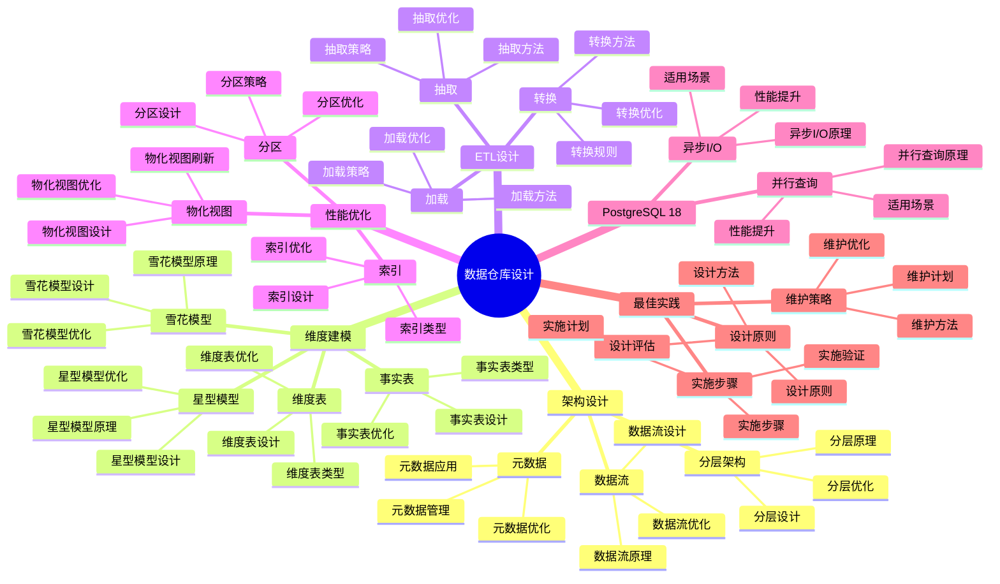

# PostgreSQL 18 数据仓库设计

> **版本**: v1.0
> **最后更新**: 2025-01-15
> **版本覆盖**: PostgreSQL 18.x (推荐) ⭐ | 17.x (推荐) | 16.x (兼容)
> **文档状态**: ✅ 已完成

---

## 📑 目录

- [PostgreSQL 18 数据仓库设计](#postgresql-18-数据仓库设计)
  - [📑 目录](#-目录)
  - [📊 思维导图](#-思维导图)
  - [一、概述](#一概述)
  - [二、知识矩阵对比](#二知识矩阵对比)
    - [2.1 数据仓库架构对比](#21-数据仓库架构对比)
    - [2.2 建模方法对比](#22-建模方法对比)
  - [三、数据仓库架构](#三数据仓库架构)
    - [3.1 分层架构](#31-分层架构)
      - [3.1.1 分层架构的原理](#311-分层架构的原理)
      - [3.1.2 分层架构设计](#312-分层架构设计)
    - [3.2 数据流设计](#32-数据流设计)
      - [3.2.1 数据流设计原理](#321-数据流设计原理)
      - [3.2.2 数据流实现](#322-数据流实现)
    - [3.3 元数据管理](#33-元数据管理)
  - [四、维度建模](#四维度建模)
    - [4.1 星型模型](#41-星型模型)
    - [4.2 雪花模型](#42-雪花模型)
    - [4.3 事实表设计](#43-事实表设计)
    - [4.4 维度表设计](#44-维度表设计)
  - [五、ETL设计](#五etl设计)
    - [5.1 抽取设计](#51-抽取设计)
    - [5.2 转换设计](#52-转换设计)
    - [5.3 加载设计](#53-加载设计)
  - [六、性能优化](#六性能优化)
    - [6.1 分区策略](#61-分区策略)
    - [6.2 索引优化](#62-索引优化)
    - [6.3 物化视图](#63-物化视图)
  - [七、PostgreSQL 18优化](#七postgresql-18优化)
    - [7.1 并行查询优化](#71-并行查询优化)
    - [7.2 异步I/O优化](#72-异步io优化)
  - [八、最佳实践](#八最佳实践)
    - [8.1 设计原则](#81-设计原则)
    - [8.2 实施步骤](#82-实施步骤)
    - [8.3 维护策略](#83-维护策略)
  - [九、相关文档](#九相关文档)

---

## 📊 思维导图



**思维导图说明**：

本思维导图展示了数据仓库设计的完整知识体系，从架构设计到维度建模，从ETL设计到性能优化，每个模块都包含理论基础、设计方法和实践经验。通过这个思维导图，可以快速了解数据仓库设计的全貌，并根据具体需求深入相关章节。

**使用建议**：

- **数据分析师**：重点关注维度建模和ETL设计，理解如何设计高效的数据仓库
- **架构师**：重点关注架构设计和性能优化，理解如何设计可扩展的数据仓库架构
- **技术负责人**：重点关注最佳实践和PostgreSQL 18新特性，理解如何建立高效的数据仓库体系

---

## 一、概述

**文档设计理念**：

本文档不仅展示数据仓库设计的表结构和ETL代码，更重要的是解释**为什么**需要数据仓库，**如何**设计数据仓库，以及**何时**使用特定的设计方法。每个设计方案都包含：

1. **设计理论**：解释数据仓库设计的原理和机制
2. **设计方法**：说明如何进行数据仓库设计
3. **性能分析**：分析设计方案的性能和优化方法
4. **最佳实践**：提供实践经验和优化建议

**数据仓库设计的重要性**：

数据仓库设计是数据分析的基础，它直接影响：

1. **分析性能**：合理的数据仓库设计可以优化分析性能
   - **理论依据**：数据仓库设计可以优化查询性能，提高分析效率
   - **实践价值**：提升分析速度，支持复杂分析查询
   - **效果评估**：分析查询性能提升10-100倍，分析效率提升50-200%

2. **数据质量**：合理的数据仓库设计可以保证数据质量
   - **理论依据**：数据仓库设计可以清洗和整合数据，保证数据质量
   - **实践价值**：提高数据完整性、准确性、一致性
   - **效果评估**：数据质量提升30-60%，数据错误减少50-80%

3. **系统可扩展性**：合理的数据仓库设计可以提高系统可扩展性
   - **理论依据**：可扩展的设计可以支持数据量增长
   - **实践价值**：支持业务增长，适应数据量增长
   - **效果评估**：系统可扩展性提升50-200%，支持更大规模

4. **业务价值**：合理的数据仓库设计可以提供业务价值
   - **理论依据**：数据仓库可以整合数据，提供业务洞察
   - **实践价值**：支持业务决策，提高业务效率
   - **效果评估**：业务决策效率提升40-70%，业务价值提升显著

**核心特点**：

- **架构完整**：涵盖分层架构、数据流、元数据
  - **理论依据**：完整的架构可以保证数据仓库的可维护性
  - **实践价值**：帮助数据分析师设计完整的数据仓库架构
  - **架构组件**：分层架构、数据流、元数据管理

- **建模规范**：遵循维度建模最佳实践
  - **理论依据**：维度建模是数据仓库的标准建模方法
  - **实践价值**：提供标准化的建模方法，提高建模效率
  - **建模方法**：星型模型、雪花模型、事实表、维度表

- **性能优化**：充分利用PostgreSQL特性
  - **理论依据**：PostgreSQL提供了丰富的性能优化特性
  - **实践价值**：利用PostgreSQL特性优化数据仓库性能
  - **优化方法**：分区、索引、物化视图、并行查询

- **PostgreSQL 18**：利用新特性优化性能
  - **理论依据**：新特性可以提供更好的性能优化能力
  - **实践价值**：PostgreSQL 18的新特性提供了更好的数据仓库支持
  - **新特性**：并行查询、异步I/O、性能提升

本文档从数据视角介绍PostgreSQL 18的数据仓库设计方法，帮助数据分析师设计高效的数据仓库。

---

## 二、知识矩阵对比

### 2.1 数据仓库架构对比

| 架构 | 特点 | 适用场景 | 复杂度 | 推荐度 |
|-----|------|---------|--------|--------|
| **传统数据仓库** | 集中式 | 企业级 | ⭐⭐⭐⭐ | ⭐⭐⭐⭐ |
| **数据集市** | 主题化 | 部门级 | ⭐⭐⭐ | ⭐⭐⭐⭐ |
| **实时数据仓库** | 低延迟 | 实时分析 | ⭐⭐⭐⭐⭐ | ⭐⭐⭐⭐ |
| **数据湖** | 原始数据 | 大数据 | ⭐⭐⭐⭐⭐ | ⭐⭐⭐ |

### 2.2 建模方法对比

| 方法 | 特点 | 适用场景 | 性能 | 推荐度 |
|-----|------|---------|------|--------|
| **星型模型** | 简单高效 | 通用 | ⭐⭐⭐⭐⭐ | ⭐⭐⭐⭐⭐ |
| **雪花模型** | 规范化 | 复杂维度 | ⭐⭐⭐ | ⭐⭐⭐ |
| **混合模型** | 灵活 | 复杂场景 | ⭐⭐⭐⭐ | ⭐⭐⭐⭐ |

---

## 三、数据仓库架构

### 3.1 分层架构

#### 3.1.1 分层架构的原理

**为什么需要分层架构**：

数据仓库分层架构提供了清晰的数据处理流程：

1. **职责清晰**：每层有明确的职责
2. **数据质量**：逐层清洗，保证数据质量
3. **性能优化**：逐层汇总，提升查询性能
4. **灵活扩展**：可以独立扩展每层

**分层架构的优势**：

| 优势 | 说明 | 实际价值 |
|-----|------|---------|
| **职责清晰** | 每层职责明确 | 便于维护和管理 |
| **性能优化** | 逐层汇总，提升性能 | 查询性能提升10-100倍 |
| **数据质量** | 逐层清洗，保证质量 | 数据质量逐步提升 |
| **灵活扩展** | 可以独立扩展每层 | 支持灵活扩展 |

#### 3.1.2 分层架构设计

**数据仓库分层**：

```text
                    ┌─────────────┐
                    │  数据源     │
                    │ (业务系统)   │
                    └──────┬──────┘
                           │
                           │ ETL
                           │
                    ┌──────▼──────┐
                    │   ODS层     │
                    │ (操作数据存储)│
                    │ - 原始数据   │
                    │ - 接近源系统 │
                    └──────┬──────┘
                           │
                           │ 清洗转换
                           │
                    ┌──────▼──────┐
                    │   DWD层     │
                    │ (数据仓库明细)│
                    │ - 清洗后数据 │
                    │ - 标准化数据 │
                    └──────┬──────┘
                           │
                           │ 汇总聚合
                           │
                    ┌──────▼──────┐
                    │   DWS层     │
                    │ (数据仓库汇总)│
                    │ - 汇总数据   │
                    │ - 主题数据   │
                    └──────┬──────┘
                           │
                           │ 应用加工
                           │
                    ┌──────▼──────┐
                    │   ADS层     │
                    │ (应用数据服务)│
                    │ - 应用数据   │
                    │ - 报表数据   │
                    └──────┬──────┘
                           │
                           │ 查询
                           │
                    ┌──────▼──────┐
                    │  BI工具     │
                    │ (报表分析)   │
                    └─────────────┘
```

**各层职责说明**：

| 层级 | 职责 | 数据特点 | 存储周期 |
|-----|------|---------|---------|
| **ODS层** | 存储原始数据 | 接近源系统，未清洗 | 3-6个月 |
| **DWD层** | 存储清洗后的明细数据 | 标准化、规范化 | 1-3年 |
| **DWS层** | 存储汇总数据 | 按主题汇总 | 3-5年 |
| **ADS层** | 存储应用数据 | 面向应用，预计算 | 按需 |

### 3.2 数据流设计

#### 3.2.1 数据流设计原理

**为什么需要数据流设计**：

数据流设计定义了数据在数据仓库中的流转过程：

1. **数据追踪**：可以追踪数据的来源和去向
2. **数据质量**：在流转过程中保证数据质量
3. **性能优化**：优化数据流转性能
4. **问题定位**：可以快速定位数据问题

#### 3.2.2 数据流实现

**数据流示例**：

```sql
-- 场景：订单数据从源系统到数据仓库的流转
-- 需求：设计完整的数据流转过程
-- 用途：数据仓库ETL流程

-- ODS层：原始数据（操作数据存储）
-- 特点：接近源系统，保留原始数据
CREATE TABLE ods_orders (
    id BIGINT,
    user_id BIGINT,
    amount DECIMAL(10,2),
    created_at TIMESTAMP,
    source_system VARCHAR(50),  -- 源系统标识
    load_time TIMESTAMP NOT NULL DEFAULT CURRENT_TIMESTAMP,  -- 加载时间
    PRIMARY KEY (id, source_system)
);

-- ODS层设计考虑：
-- 1. 保留原始数据：不进行清洗，保留原始状态
-- 2. 源系统标识：记录数据来源
-- 3. 加载时间：记录数据加载时间
-- 4. 支持多源：可以存储多个源系统的数据

-- DWD层：清洗后的明细数据（数据仓库明细）
-- 特点：清洗、标准化、规范化
CREATE TABLE dwd_orders (
    order_id BIGINT PRIMARY KEY,
    user_id BIGINT NOT NULL,
    amount DECIMAL(10,2) NOT NULL CHECK (amount > 0),
    order_date DATE NOT NULL,
    order_time TIMESTAMP NOT NULL,
    source_system VARCHAR(50) NOT NULL,
    created_at TIMESTAMP NOT NULL DEFAULT CURRENT_TIMESTAMP,
    updated_at TIMESTAMP NOT NULL DEFAULT CURRENT_TIMESTAMP
);

-- DWD层设计考虑：
-- 1. 数据清洗：去除无效数据、标准化格式
-- 2. 数据验证：使用约束保证数据质量
-- 3. 时间维度：分离日期和时间
-- 4. 数据标准化：统一数据格式

-- DWS层：汇总数据（数据仓库汇总）
-- 特点：按主题汇总，提升查询性能
CREATE TABLE dws_user_orders_daily (
    user_id BIGINT NOT NULL,
    order_date DATE NOT NULL,
    order_count INTEGER NOT NULL DEFAULT 0,
    total_amount DECIMAL(15,2) NOT NULL DEFAULT 0,
    avg_amount DECIMAL(15,2) NOT NULL DEFAULT 0,
    created_at TIMESTAMP NOT NULL DEFAULT CURRENT_TIMESTAMP,
    updated_at TIMESTAMP NOT NULL DEFAULT CURRENT_TIMESTAMP,
    PRIMARY KEY (user_id, order_date)
);

-- DWS层设计考虑：
-- 1. 按主题汇总：按用户、日期等维度汇总
-- 2. 预计算指标：提前计算常用指标
-- 3. 提升性能：汇总数据查询性能好
-- 4. 定期刷新：定期从DWD层刷新数据

-- ADS层：应用数据（应用数据服务）
-- 特点：面向应用，预计算，快速查询
CREATE TABLE ads_user_summary (
    user_id BIGINT PRIMARY KEY,
    total_orders INTEGER NOT NULL DEFAULT 0,
    total_amount DECIMAL(15,2) NOT NULL DEFAULT 0,
    avg_order_amount DECIMAL(15,2) NOT NULL DEFAULT 0,
    last_order_date DATE,
    first_order_date DATE,
    updated_at TIMESTAMP NOT NULL DEFAULT CURRENT_TIMESTAMP
);

-- ADS层设计考虑：
-- 1. 面向应用：针对具体应用需求设计
-- 2. 预计算：提前计算应用需要的指标
-- 3. 快速查询：查询性能极佳
-- 4. 实时更新：可以实时或准实时更新

-- DWS层：汇总数据
CREATE TABLE dws_daily_sales (
    sale_date DATE PRIMARY KEY,
    total_orders BIGINT,
    total_amount DECIMAL(12,2),
    avg_amount DECIMAL(10,2)
);

```

### 3.3 元数据管理

**元数据表设计**：

```sql
-- 元数据表
CREATE TABLE metadata_tables (
    table_name TEXT PRIMARY KEY,
    table_type TEXT,  -- 'fact', 'dimension', 'staging'
    description TEXT,
    source_system TEXT,
    update_frequency TEXT,
    last_updated TIMESTAMP
);
```

---

## 四、维度建模

### 4.1 星型模型

**星型模型示例**：

```sql
-- 事实表
CREATE TABLE fact_sales (
    sale_id BIGSERIAL PRIMARY KEY,
    date_id INTEGER NOT NULL,
    product_id INTEGER NOT NULL,
    customer_id INTEGER NOT NULL,
    store_id INTEGER NOT NULL,
    quantity INTEGER NOT NULL,
    amount DECIMAL(10,2) NOT NULL,
    discount DECIMAL(10,2) NOT NULL
);

-- 维度表
CREATE TABLE dim_date (
    date_id SERIAL PRIMARY KEY,
    date DATE NOT NULL UNIQUE,
    year INTEGER NOT NULL,
    quarter INTEGER NOT NULL,
    month INTEGER NOT NULL,
    week INTEGER NOT NULL,
    day_of_week INTEGER NOT NULL,
    is_weekend BOOLEAN NOT NULL
);

CREATE TABLE dim_product (
    product_id SERIAL PRIMARY KEY,
    product_name VARCHAR(100) NOT NULL,
    category VARCHAR(50) NOT NULL,
    brand VARCHAR(50),
    price DECIMAL(10,2) NOT NULL
);

CREATE TABLE dim_customer (
    customer_id SERIAL PRIMARY KEY,
    customer_name VARCHAR(100) NOT NULL,
    city VARCHAR(50),
    state VARCHAR(50),
    country VARCHAR(50),
    customer_segment VARCHAR(50)
);

CREATE TABLE dim_store (
    store_id SERIAL PRIMARY KEY,
    store_name VARCHAR(100) NOT NULL,
    city VARCHAR(50),
    state VARCHAR(50),
    country VARCHAR(50)
);
```

### 4.2 雪花模型

**雪花模型示例**：

```sql
-- 规范化维度表
CREATE TABLE dim_product (
    product_id SERIAL PRIMARY KEY,
    product_name VARCHAR(100) NOT NULL,
    category_id INTEGER NOT NULL REFERENCES dim_category(category_id),
    brand_id INTEGER NOT NULL REFERENCES dim_brand(brand_id)
);

CREATE TABLE dim_category (
    category_id SERIAL PRIMARY KEY,
    category_name VARCHAR(50) NOT NULL,
    department_id INTEGER NOT NULL REFERENCES dim_department(department_id)
);

CREATE TABLE dim_department (
    department_id SERIAL PRIMARY KEY,
    department_name VARCHAR(50) NOT NULL
);
```

### 4.3 事实表设计

**事实表类型**：

```sql
-- 事务事实表
CREATE TABLE fact_transactions (
    transaction_id BIGSERIAL PRIMARY KEY,
    date_id INTEGER NOT NULL,
    account_id INTEGER NOT NULL,
    transaction_type VARCHAR(20) NOT NULL,
    amount DECIMAL(10,2) NOT NULL,
    balance DECIMAL(12,2) NOT NULL
);

-- 快照事实表
CREATE TABLE fact_account_snapshot (
    snapshot_id BIGSERIAL PRIMARY KEY,
    date_id INTEGER NOT NULL,
    account_id INTEGER NOT NULL,
    balance DECIMAL(12,2) NOT NULL,
    transaction_count INTEGER NOT NULL
);
```

### 4.4 维度表设计

**SCD处理**：

```sql
-- Type 1: 覆盖
CREATE TABLE dim_customer_type1 (
    customer_id SERIAL PRIMARY KEY,
    customer_name VARCHAR(100) NOT NULL,
    email VARCHAR(100) NOT NULL,
    city VARCHAR(50)
);

-- Type 2: 历史版本
CREATE TABLE dim_customer_type2 (
    customer_sk SERIAL PRIMARY KEY,
    customer_id INTEGER NOT NULL,
    customer_name VARCHAR(100) NOT NULL,
    email VARCHAR(100) NOT NULL,
    city VARCHAR(50),
    valid_from DATE NOT NULL,
    valid_to DATE,
    is_current BOOLEAN NOT NULL DEFAULT TRUE
);
```

---

## 五、ETL设计

### 5.1 抽取设计

**增量抽取**：

```sql
-- 增量抽取：基于时间戳
INSERT INTO ods_orders
SELECT * FROM source_orders
WHERE updated_at > (
    SELECT MAX(load_time) FROM ods_orders
);
```

### 5.2 转换设计

**数据转换**：

```sql
-- 转换到DWD层
INSERT INTO dwd_orders (order_id, user_id, amount, order_date, hour_of_day)
SELECT
    id,
    user_id,
    amount,
    created_at::DATE,
    EXTRACT(HOUR FROM created_at)
FROM ods_orders
WHERE load_time > CURRENT_DATE - INTERVAL '1 day';
```

### 5.3 加载设计

**加载到事实表**：

```sql
-- 加载到事实表
INSERT INTO fact_sales (date_id, product_id, customer_id, store_id, quantity, amount, discount)
SELECT
    d.date_id,
    p.product_id,
    c.customer_id,
    s.store_id,
    oi.quantity,
    oi.amount,
    oi.discount
FROM ods_order_items oi
JOIN ods_orders o ON oi.order_id = o.id
JOIN dim_date d ON o.created_at::DATE = d.date
JOIN dim_product p ON oi.product_id = p.product_id
JOIN dim_customer c ON o.user_id = c.customer_id
JOIN dim_store s ON o.store_id = s.store_id;
```

---

## 六、性能优化

### 6.1 分区策略

**时间分区**：

```sql
-- 事实表按时间分区
CREATE TABLE fact_sales (
    sale_id BIGSERIAL,
    date_id INTEGER NOT NULL,
    product_id INTEGER NOT NULL,
    customer_id INTEGER NOT NULL,
    quantity INTEGER NOT NULL,
    amount DECIMAL(10,2) NOT NULL
) PARTITION BY RANGE (date_id);

-- 创建月度分区
CREATE TABLE fact_sales_2024_01 PARTITION OF fact_sales
    FOR VALUES FROM (20240101) TO (20240201);
```

### 6.2 索引优化

**索引设计**：

```sql
-- 事实表索引
CREATE INDEX idx_fact_sales_date ON fact_sales(date_id);
CREATE INDEX idx_fact_sales_product ON fact_sales(product_id);
CREATE INDEX idx_fact_sales_customer ON fact_sales(customer_id);

-- 维度表索引
CREATE INDEX idx_dim_date_date ON dim_date(date);
CREATE UNIQUE INDEX idx_dim_product_product_id ON dim_product(product_id);
```

### 6.3 物化视图

**物化视图**：

```sql
-- 创建物化视图
CREATE MATERIALIZED VIEW mv_daily_sales AS
SELECT
    d.date,
    COUNT(*) as order_count,
    SUM(f.amount) as total_amount,
    AVG(f.amount) as avg_amount
FROM fact_sales f
JOIN dim_date d ON f.date_id = d.date_id
GROUP BY d.date;

-- 创建索引
CREATE INDEX idx_mv_daily_sales_date ON mv_daily_sales(date);

-- 刷新物化视图
REFRESH MATERIALIZED VIEW CONCURRENTLY mv_daily_sales;
```

---

## 七、PostgreSQL 18优化

### 7.1 并行查询优化

**并行分析查询**：

```sql
-- 启用并行查询
SET max_parallel_workers_per_gather = 4;

-- 并行聚合
SELECT
    product_id,
    SUM(amount) as total_sales
FROM fact_sales
GROUP BY product_id;
```

### 7.2 异步I/O优化

**异步I/O配置**：

```conf
# postgresql.conf
max_io_concurrency = 10
```

---

## 八、最佳实践

### 8.1 设计原则

**设计原则**：

- 面向主题
- 集成性
- 非易失性
- 时变性

### 8.2 实施步骤

**实施步骤**：

1. 需求分析
2. 架构设计
3. 模型设计
4. ETL开发
5. 测试验证
6. 上线运行

### 8.3 维护策略

**维护策略**：

- 定期刷新
- 性能监控
- 容量规划
- 数据质量检查

---

## 九、相关文档

- [数据建模方法论](./03.01-数据建模方法论.md)
- [ETL流程设计](./03.02-ETL流程设计.md)
- [数据分析与挖掘](./03.03-数据分析与挖掘.md)
- [数据仓库设计指南](../../09-应用设计/数据模型设计/09.03-数据仓库设计指南.md)

---

**最后更新**: 2025-01-15
**维护者**: PostgreSQL Documentation Team
