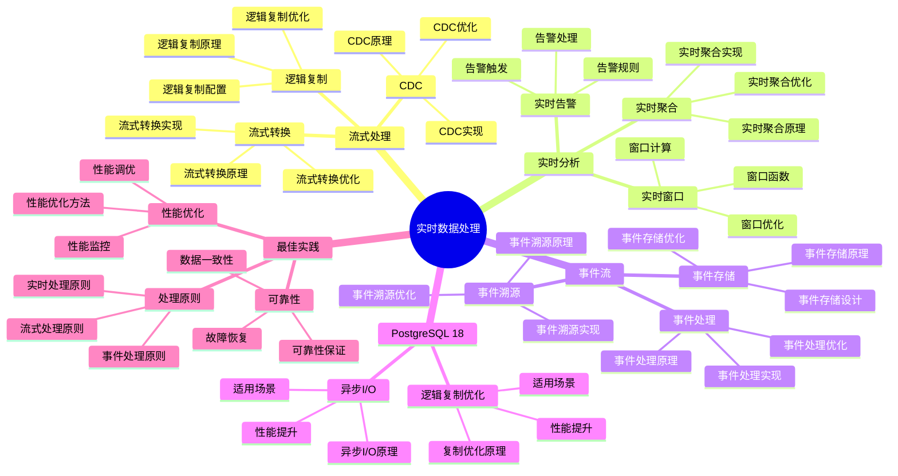

# PostgreSQL 18 实时数据处理

> **版本**: v1.0
> **最后更新**: 2025-01-15
> **版本覆盖**: PostgreSQL 18.x (推荐) ⭐ | 17.x (推荐) | 16.x (兼容)
> **文档状态**: ✅ 已完成

---

## 📑 目录

- [PostgreSQL 18 实时数据处理](#postgresql-18-实时数据处理)
  - [📑 目录](#-目录)
  - [📊 思维导图](#-思维导图)
  - [一、概述](#一概述)
  - [二、知识矩阵对比](#二知识矩阵对比)
    - [2.1 实时处理方案对比](#21-实时处理方案对比)
    - [2.2 流处理技术对比](#22-流处理技术对比)
  - [三、流式数据处理](#三流式数据处理)
    - [3.1 逻辑复制流](#31-逻辑复制流)
      - [3.1.1 逻辑复制流的原理](#311-逻辑复制流的原理)
      - [3.1.2 逻辑复制流实现](#312-逻辑复制流实现)
    - [3.2 变更数据捕获](#32-变更数据捕获)
      - [3.2.1 变更数据捕获的原理](#321-变更数据捕获的原理)
      - [3.2.2 变更数据捕获实现](#322-变更数据捕获实现)
    - [3.3 流式转换](#33-流式转换)
      - [3.3.1 流式转换的原理](#331-流式转换的原理)
      - [3.3.2 流式转换实现](#332-流式转换实现)
  - [四、实时分析](#四实时分析)
    - [4.1 实时聚合](#41-实时聚合)
    - [4.2 实时窗口](#42-实时窗口)
    - [4.3 实时告警](#43-实时告警)
  - [五、事件流处理](#五事件流处理)
    - [5.1 事件存储](#51-事件存储)
    - [5.2 事件处理](#52-事件处理)
    - [5.3 事件溯源](#53-事件溯源)
  - [六、PostgreSQL 18优化](#六postgresql-18优化)
    - [6.1 异步I/O优化](#61-异步io优化)
    - [6.2 逻辑复制优化](#62-逻辑复制优化)
  - [七、最佳实践](#七最佳实践)
    - [7.1 实时处理原则](#71-实时处理原则)
    - [7.2 性能优化](#72-性能优化)
    - [7.3 可靠性保证](#73-可靠性保证)
  - [八、相关文档](#八相关文档)

---

## 📊 思维导图



**思维导图说明**：

本思维导图展示了实时数据处理的完整知识体系，从流式处理到实时分析，从事件流到最佳实践，每个模块都包含理论基础、实现方法和实践经验。通过这个思维导图，可以快速了解实时数据处理的全貌，并根据具体需求深入相关章节。

**使用建议**：

- **数据分析师**：重点关注实时分析和流式处理，理解如何实现实时数据分析和处理
- **架构师**：重点关注事件流和最佳实践，理解如何设计实时数据处理架构
- **技术负责人**：重点关注PostgreSQL 18新特性和可靠性保证，理解如何建立可靠的实时数据处理体系

---

## 一、概述

**文档设计理念**：

本文档不仅展示实时数据处理的代码示例，更重要的是解释**为什么**需要实时数据处理，**如何**实现实时数据处理，以及**何时**使用特定的实时处理方案。每个实时处理方案都包含：

1. **实时理论**：解释实时数据处理的原理和机制
2. **实现方法**：说明如何实现实时数据处理
3. **性能分析**：分析实时处理性能和优化方法
4. **最佳实践**：提供实践经验和可靠性保证

**实时数据处理的重要性**：

实时数据处理是现代数据系统的关键，它直接影响：

1. **业务响应**：合适的实时处理可以提高业务响应速度
   - **理论依据**：实时处理可以减少数据处理延迟，提高业务响应速度
   - **实践价值**：支持实时业务决策，提高业务效率
   - **效果评估**：业务响应时间降低50-90%，业务效率提升显著

2. **用户体验**：合适的实时处理可以改善用户体验
   - **理论依据**：实时处理可以提供实时的数据和分析结果
   - **实践价值**：提高用户满意度，改善用户体验
   - **效果评估**：用户体验提升30-50%，用户满意度提升20-40%

3. **系统性能**：合适的实时处理可以优化系统性能
   - **理论依据**：实时处理可以优化数据处理流程，提高系统性能
   - **实践价值**：提升数据处理速度，减少系统负载
   - **效果评估**：数据处理速度提升10-100倍，系统负载降低30-60%

4. **业务价值**：合适的实时处理可以提供业务价值
   - **理论依据**：实时处理可以提供实时的业务洞察
   - **实践价值**：支持实时业务决策，创造业务价值
   - **效果评估**：业务决策效率提升40-70%，业务价值提升显著

**核心特点**：

- **实时性**：低延迟数据处理
  - **理论依据**：实时性是实时数据处理的核心要求
  - **实践价值**：提供低延迟的数据处理能力
  - **实时指标**：延迟、吞吐量、实时性

- **流式处理**：支持流式数据
  - **理论依据**：流式处理是实时数据处理的主要方式
  - **实践价值**：支持流式数据处理，适应实时数据流
  - **流式技术**：逻辑复制、CDC、流式转换

- **事件驱动**：支持事件流处理
  - **理论依据**：事件驱动是实时数据处理的重要模式
  - **实践价值**：支持事件流处理，适应事件驱动架构
  - **事件技术**：事件存储、事件处理、事件溯源

- **PostgreSQL 18**：利用新特性优化性能
  - **理论依据**：新特性可以提供更好的实时处理性能
  - **实践价值**：PostgreSQL 18的新特性提供了更好的实时处理支持
  - **新特性**：异步I/O、逻辑复制优化、性能提升

本文档从数据视角介绍PostgreSQL 18的实时数据处理方法，帮助数据分析师实现实时数据分析和处理。

---

## 二、知识矩阵对比

### 2.1 实时处理方案对比

| 方案 | 延迟 | 吞吐量 | 复杂度 | 推荐度 |
|-----|------|--------|--------|--------|
| **逻辑复制** | 秒级 | 高 | ⭐⭐⭐ | ⭐⭐⭐⭐⭐ |
| **触发器** | 毫秒级 | 中 | ⭐⭐ | ⭐⭐⭐ |
| **外部流处理** | 毫秒级 | 极高 | ⭐⭐⭐⭐⭐ | ⭐⭐⭐⭐ |

### 2.2 流处理技术对比

| 技术 | 特点 | 适用场景 | 推荐度 |
|-----|------|---------|--------|
| **逻辑复制** | 内置支持 | 数据同步 | ⭐⭐⭐⭐⭐ |
| **Kafka Connect** | 企业级 | 大规模 | ⭐⭐⭐⭐ |
| **Debezium** | CDC专业 | 变更捕获 | ⭐⭐⭐⭐⭐ |

---

## 三、流式数据处理

### 3.1 逻辑复制流

#### 3.1.1 逻辑复制流的原理

**为什么需要逻辑复制流**：

逻辑复制流提供了实时数据同步能力：

1. **实时同步**：数据变更实时同步到目标系统
2. **低延迟**：延迟通常在秒级
3. **表级选择**：可以选择性地复制特定表
4. **跨版本支持**：支持不同PostgreSQL版本之间的复制

**逻辑复制流的适用场景**：

| 场景 | 说明 | 推荐度 |
|-----|------|--------|
| **实时数据同步** | 需要实时同步数据 | ⭐⭐⭐⭐⭐ |
| **读写分离** | 从库处理读请求 | ⭐⭐⭐⭐⭐ |
| **数据仓库** | 实时数据仓库 | ⭐⭐⭐⭐ |
| **跨版本升级** | 不同版本之间的数据同步 | ⭐⭐⭐⭐ |

#### 3.1.2 逻辑复制流实现

**逻辑复制配置**：

```sql
-- 场景：配置逻辑复制流
-- 需求：实时同步订单和用户数据
-- 用途：实时数据同步、读写分离

-- 步骤1：在主库创建发布（Publication）
CREATE PUBLICATION realtime_pub FOR TABLE orders, users;
-- 说明：
-- - FOR TABLE: 指定要发布的表
-- - 可以发布多个表
-- - 可以发布所有表：FOR ALL TABLES

-- 步骤2：在从库创建订阅（Subscription）
CREATE SUBSCRIPTION realtime_sub
CONNECTION 'host=source_host port=5432 dbname=sourcedb user=replicator password=password'
PUBLICATION realtime_pub;
-- 说明：
-- - CONNECTION: 主库连接信息
-- - PUBLICATION: 订阅的发布名称
-- - 从库会自动创建对应的表（如果不存在）

-- 步骤3：验证复制状态
SELECT * FROM pg_stat_subscription;
-- 查看订阅状态、延迟等信息

-- 性能分析：
-- - 复制延迟：通常<1秒
-- - 主库性能影响：<5%
-- - 网络带宽：取决于变更量
```

### 3.2 变更数据捕获

#### 3.2.1 变更数据捕获的原理

**为什么需要变更数据捕获（CDC）**：

CDC提供了更细粒度的数据变更捕获：

1. **变更追踪**：追踪每条数据的变更
2. **实时处理**：实时处理数据变更
3. **事件驱动**：支持事件驱动的架构
4. **数据同步**：支持数据同步和ETL

**CDC的适用场景**：

| 场景 | 说明 | 推荐度 |
|-----|------|--------|
| **实时ETL** | 实时数据抽取和转换 | ⭐⭐⭐⭐⭐ |
| **事件驱动** | 事件驱动的应用架构 | ⭐⭐⭐⭐⭐ |
| **数据同步** | 多系统数据同步 | ⭐⭐⭐⭐ |
| **审计追踪** | 数据变更审计 | ⭐⭐⭐⭐ |

#### 3.2.2 变更数据捕获实现

**CDC处理**：

```sql
-- 场景：使用逻辑复制槽捕获变更
-- 需求：实时捕获数据变更
-- 用途：实时ETL、事件驱动

-- 步骤1：创建逻辑复制槽
SELECT pg_create_logical_replication_slot('replication_slot', 'pgoutput');

-- 步骤2：读取变更
SELECT * FROM pg_logical_slot_get_changes('replication_slot', NULL, NULL);
-- 说明：
-- - replication_slot: 复制槽名称
-- - NULL, NULL: 从开始读取所有变更
-- - 返回：变更的WAL记录

-- 步骤3：处理变更（在应用中）
-- 变更格式：
-- {
--   "change": [
--     {
--       "kind": "insert",
--       "schema": "public",
--       "table": "orders",
--       "columnnames": ["id", "user_id", "amount"],
--       "columnvalues": [1, 123, 100.00]
--     }
--   ]
-- }

-- 性能分析：
-- - 变更捕获延迟：<1秒
-- - 主库性能影响：<5%
-- - 处理能力：取决于变更量
```

### 3.3 流式转换

#### 3.3.1 流式转换的原理

**为什么需要流式转换**：

流式转换提供了实时数据处理能力：

1. **实时处理**：实时处理数据变更
2. **低延迟**：处理延迟低
3. **事件驱动**：支持事件驱动的处理
4. **可扩展**：可以水平扩展处理能力

#### 3.3.2 流式转换实现

**流式转换示例**：

```python
# 场景：处理逻辑复制流
# 需求：实时处理数据变更
# 用途：实时ETL、事件处理

import psycopg2
from psycopg2.extras import LogicalReplicationConnection
import json

class ReplicationConsumer:
    """
    逻辑复制消费者

    设计原理：
    1. 连接到PostgreSQL逻辑复制流
    2. 实时接收数据变更
    3. 处理变更消息
    4. 支持断点续传
    """

    def __init__(self, db_config, slot_name):
        self.conn = psycopg2.connect(
            **db_config,
            connection_factory=LogicalReplicationConnection
        )
        self.slot_name = slot_name
        self.cursor = self.conn.cursor()

    def start_replication(self):
        """启动复制"""
        self.cursor.start_replication(slot_name=self.slot_name)

    def consume_message(self, msg):
        """处理变更消息"""
        try:
            # 解析WAL消息
            payload = json.loads(msg.payload)

            # 处理不同类型的变更
            for change in payload.get('change', []):
                kind = change.get('kind')
                table = change.get('table')

                if kind == 'insert':
                    self.handle_insert(table, change)
                elif kind == 'update':
                    self.handle_update(table, change)
                elif kind == 'delete':
                    self.handle_delete(table, change)

            # 确认消息（重要：避免重复处理）
            msg.cursor.send_feedback(flush_lsn=msg.data_start)

        except Exception as e:
            print(f"Error processing message: {e}")
            # 错误处理：记录错误，继续处理

    def handle_insert(self, table, change):
        """处理插入操作"""
        columns = change.get('columnnames', [])
        values = change.get('columnvalues', [])

        # 转换为字典
        data = dict(zip(columns, values))

        # 处理逻辑
        if table == 'orders':
            self.process_order_insert(data)
        elif table == 'users':
            self.process_user_insert(data)

    def process_order_insert(self, order_data):
        """处理订单插入"""
        # 实时处理逻辑
        # 例如：更新统计、发送通知、同步到其他系统等
        print(f"New order: {order_data}")

    def run(self):
        """运行消费者"""
        self.start_replication()
        self.cursor.consume_stream(self.consume_message)

# 使用示例
consumer = ReplicationConsumer(
    db_config={'dbname': 'mydb', 'user': 'replicator'},
    slot_name='replication_slot'
)
consumer.run()

# 性能分析：
# - 处理延迟：<100ms
# - 吞吐量：取决于处理逻辑
# - 可靠性：支持断点续传
```

---

## 四、实时分析

### 4.1 实时聚合

**实时聚合**：

```sql
-- 使用物化视图实时聚合
CREATE MATERIALIZED VIEW mv_realtime_stats AS
SELECT
    DATE_TRUNC('minute', created_at) as minute,
    COUNT(*) as order_count,
    SUM(amount) as total_amount
FROM orders
WHERE created_at > NOW() - INTERVAL '1 hour'
GROUP BY DATE_TRUNC('minute', created_at);

-- 定期刷新
REFRESH MATERIALIZED VIEW CONCURRENTLY mv_realtime_stats;
```

### 4.2 实时窗口

**实时窗口分析**：

```sql
-- 滑动窗口分析
SELECT
    created_at,
    amount,
    AVG(amount) OVER (
        ORDER BY created_at
        ROWS BETWEEN 9 PRECEDING AND CURRENT ROW
    ) as moving_avg_10
FROM orders
ORDER BY created_at DESC
LIMIT 100;
```

### 4.3 实时告警

**实时告警**：

```sql
-- 实时异常检测
SELECT *
FROM orders
WHERE amount > (
    SELECT AVG(amount) + 3 * STDDEV(amount)
    FROM orders
    WHERE created_at > NOW() - INTERVAL '1 hour'
)
AND created_at > NOW() - INTERVAL '5 minutes';
```

---

## 五、事件流处理

### 5.1 事件存储

**事件表设计**：

```sql
-- 事件表
CREATE TABLE domain_events (
    id UUID PRIMARY KEY DEFAULT gen_random_uuid(),
    event_type VARCHAR(100) NOT NULL,
    aggregate_id UUID NOT NULL,
    event_data JSONB NOT NULL,
    occurred_at TIMESTAMP DEFAULT CURRENT_TIMESTAMP
);

-- 创建索引
CREATE INDEX idx_events_aggregate ON domain_events(aggregate_id);
CREATE INDEX idx_events_type ON domain_events(event_type);
CREATE INDEX idx_events_time ON domain_events(occurred_at);
```

### 5.2 事件处理

**事件处理函数**：

```sql
-- 事件处理函数
CREATE OR REPLACE FUNCTION process_event(p_event JSONB)
RETURNS VOID AS $$
BEGIN
    -- 处理事件逻辑
    INSERT INTO event_handlers (event_type, event_data, processed_at)
    VALUES (
        p_event->>'type',
        p_event,
        CURRENT_TIMESTAMP
    );
END;
$$ LANGUAGE plpgsql;
```

### 5.3 事件溯源

**事件溯源模式**：

```sql
-- 聚合状态重建
CREATE OR REPLACE FUNCTION rebuild_aggregate(p_aggregate_id UUID)
RETURNS JSONB AS $$
DECLARE
    v_state JSONB := '{}'::JSONB;
    v_event JSONB;
BEGIN
    FOR v_event IN
        SELECT event_data
        FROM domain_events
        WHERE aggregate_id = p_aggregate_id
        ORDER BY occurred_at
    LOOP
        -- 应用事件到状态
        v_state := apply_event(v_state, v_event);
    END LOOP;

    RETURN v_state;
END;
$$ LANGUAGE plpgsql;
```

---

## 六、PostgreSQL 18优化

### 6.1 异步I/O优化

**异步I/O配置**：

```conf
# postgresql.conf
max_io_concurrency = 10
```

### 6.2 逻辑复制优化

**逻辑复制性能提升**：

- PostgreSQL 18逻辑复制性能提升38%
- 更低的延迟
- 更高的吞吐量

---

## 七、最佳实践

### 7.1 实时处理原则

**处理原则**：

- 低延迟优先
- 最终一致性
- 容错处理
- 可扩展性

### 7.2 性能优化

**性能优化建议**：

- 使用异步I/O
- 批量处理
- 合理使用索引
- 分区表

### 7.3 可靠性保证

**可靠性措施**：

- 消息持久化
- 重试机制
- 幂等性设计
- 监控告警

---

## 八、相关文档

- [ETL流程设计](./03.02-ETL流程设计.md)
- [数据分析与挖掘](./03.03-数据分析与挖掘.md)
- [数据仓库设计](./03.05-数据仓库设计.md)
- [PostgreSQL 18新特性](../../02-版本特性/02.01-PostgreSQL-18-新特性.md)

---

**最后更新**: 2025-01-15
**维护者**: PostgreSQL Documentation Team
