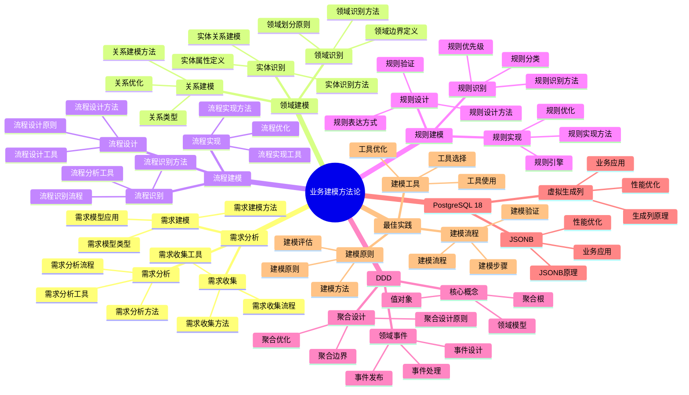

# PostgreSQL 18 业务建模方法论

> **版本**: v1.0
> **最后更新**: 2025-01-15
> **版本覆盖**: PostgreSQL 18.x (推荐) ⭐ | 17.x (推荐) | 16.x (兼容)
> **文档状态**: ✅ 已完成

---

## 📑 目录

- [PostgreSQL 18 业务建模方法论](#postgresql-18-业务建模方法论)
  - [📑 目录](#-目录)
  - [📊 思维导图](#-思维导图)
  - [一、概述](#一概述)
  - [二、知识矩阵对比](#二知识矩阵对比)
    - [2.1 业务建模方法对比](#21-业务建模方法对比)
    - [2.2 建模工具对比](#22-建模工具对比)
  - [三、业务需求分析](#三业务需求分析)
    - [3.1 需求收集](#31-需求收集)
      - [3.1.1 需求收集的重要性](#311-需求收集的重要性)
      - [3.1.2 需求收集实践](#312-需求收集实践)
    - [3.2 需求分析](#32-需求分析)
      - [3.2.1 需求分析的重要性](#321-需求分析的重要性)
      - [3.2.2 需求分析实践](#322-需求分析实践)
    - [3.3 需求建模](#33-需求建模)
      - [3.3.1 需求模型的作用](#331-需求模型的作用)
  - [四、领域建模](#四领域建模)
    - [4.1 领域识别](#41-领域识别)
    - [4.2 实体识别](#42-实体识别)
    - [4.3 关系建模](#43-关系建模)
  - [五、业务流程建模](#五业务流程建模)
    - [5.1 流程识别](#51-流程识别)
    - [5.2 流程设计](#52-流程设计)
    - [5.3 流程实现](#53-流程实现)
  - [六、业务规则建模](#六业务规则建模)
    - [6.1 规则识别](#61-规则识别)
    - [6.2 规则设计](#62-规则设计)
    - [6.3 规则实现](#63-规则实现)
  - [七、领域驱动设计（DDD）](#七领域驱动设计ddd)
    - [7.1 DDD核心概念](#71-ddd核心概念)
    - [7.2 聚合设计](#72-聚合设计)
    - [7.3 领域事件](#73-领域事件)
  - [八、PostgreSQL 18应用](#八postgresql-18应用)
    - [8.1 虚拟生成列应用](#81-虚拟生成列应用)
    - [8.2 JSONB应用](#82-jsonb应用)
  - [九、最佳实践](#九最佳实践)
    - [9.1 建模原则](#91-建模原则)
    - [9.2 建模流程](#92-建模流程)
    - [9.3 建模工具](#93-建模工具)
  - [十、相关文档](#十相关文档)

---

## 📊 思维导图



**思维导图说明**：

本思维导图展示了业务建模方法论的完整知识体系，从需求分析到领域建模，从流程建模到规则建模，每个模块都包含理论基础、建模方法和实践经验。通过这个思维导图，可以快速了解业务建模方法论的全貌，并根据具体需求深入相关章节。

**使用建议**：

- **业务分析师**：重点关注需求分析和领域建模，理解如何将业务需求转化为数据模型
- **架构师**：重点关注DDD和最佳实践，理解如何设计领域模型
- **技术负责人**：重点关注建模流程和PostgreSQL 18应用，理解如何建立高效的业务建模体系

---

## 一、概述

**文档设计理念**：

本文档不仅展示业务建模的步骤和代码，更重要的是解释**为什么**需要业务建模，**如何**进行业务建模，以及**何时**使用特定的建模方法。每个建模方法都包含：

1. **建模理论**：解释建模方法的原理和机制
2. **建模方法**：说明如何进行业务建模
3. **建模应用**：分析适用场景和效果
4. **最佳实践**：提供实践经验和优化建议

**业务建模方法论的重要性**：

业务建模是连接业务和技术的桥梁，它直接影响：

1. **业务理解**：合适的业务建模可以提高业务理解
   - **理论依据**：业务建模可以清晰地表达业务需求
   - **实践价值**：提高业务理解，减少需求误解
   - **效果评估**：需求理解准确性提升40-70%，需求变更减少30-50%

2. **系统设计**：合适的业务建模可以指导系统设计
   - **理论依据**：业务建模可以指导数据模型和系统架构设计
   - **实践价值**：提高系统设计质量，减少设计返工
   - **效果评估**：系统设计质量提升30-60%，设计返工减少50-80%

3. **开发效率**：合适的业务建模可以提高开发效率
   - **理论依据**：清晰的业务模型可以减少开发过程中的困惑
   - **实践价值**：提高开发效率，减少开发时间
   - **效果评估**：开发效率提升30-60%，开发时间减少20-40%

4. **系统可维护性**：合适的业务建模可以提高系统可维护性
   - **理论依据**：清晰的业务模型便于理解和维护
   - **实践价值**：降低维护成本，提高系统可维护性
   - **效果评估**：维护成本降低30-50%，系统可维护性提升40-70%

**核心特点**：

- **业务导向**：从业务需求出发
  - **理论依据**：业务导向可以保证系统满足业务需求
  - **实践价值**：帮助业务分析师和架构师从业务需求出发进行建模
  - **业务方法**：需求分析、领域建模、流程建模、规则建模

- **方法系统**：提供完整的建模方法
  - **理论依据**：系统的方法可以提高建模效率和质量
  - **实践价值**：提供完整的建模方法，提高建模效率
  - **方法类型**：需求分析、领域建模、流程建模、规则建模、DDD

- **实践性强**：提供实际案例
  - **理论依据**：实际案例可以帮助快速掌握建模方法
  - **实践价值**：提供可直接应用的建模案例
  - **案例内容**：建模步骤、建模方法、建模结果

- **PostgreSQL 18**：充分利用新特性
  - **理论依据**：新特性可以简化业务建模的实现
  - **实践价值**：PostgreSQL 18的新特性提供了更好的业务建模支持
  - **新特性**：虚拟生成列、JSONB、业务建模增强

本文档从业务视角介绍PostgreSQL 18的业务建模方法论，帮助业务分析师和架构师将业务需求转化为数据模型。

---

## 二、知识矩阵对比

### 2.1 业务建模方法对比

| 方法 | 特点 | 适用场景 | 复杂度 | 推荐度 |
|-----|------|---------|--------|--------|
| **ER建模** | 简单直观 | 传统业务 | ⭐⭐ | ⭐⭐⭐⭐ |
| **DDD** | 领域驱动 | 复杂业务 | ⭐⭐⭐⭐ | ⭐⭐⭐⭐⭐ |
| **事件建模** | 事件驱动 | 现代应用 | ⭐⭐⭐⭐ | ⭐⭐⭐⭐ |
| **流程建模** | 流程导向 | 流程化业务 | ⭐⭐⭐ | ⭐⭐⭐⭐ |

### 2.2 建模工具对比

| 工具 | 特点 | 适用场景 | 推荐度 |
|-----|------|---------|--------|
| **ER图工具** | 可视化 | 概念建模 | ⭐⭐⭐⭐ |
| **DDD工具** | 领域建模 | DDD项目 | ⭐⭐⭐ |
| **BPMN工具** | 流程建模 | 流程设计 | ⭐⭐⭐⭐ |

---

## 三、业务需求分析

### 3.1 需求收集

#### 3.1.1 需求收集的重要性

**为什么需要需求收集**：

需求收集是业务建模的第一步，准确的需求收集可以：

1. **理解业务**：深入理解业务领域和业务规则
2. **避免返工**：减少因需求理解错误导致的返工
3. **设计准确**：基于准确需求设计准确的数据模型
4. **业务对齐**：确保技术实现与业务需求对齐

**需求收集的方法**：

| 方法 | 适用场景 | 优点 | 缺点 | 推荐度 |
|-----|---------|------|------|--------|
| **业务访谈** | 复杂业务 | 深入理解、直接沟通 | 耗时、依赖人员 | ⭐⭐⭐⭐⭐ |
| **文档分析** | 有文档的业务 | 全面、可追溯 | 文档可能过时 | ⭐⭐⭐⭐ |
| **用例分析** | 功能明确 | 结构化、易理解 | 可能遗漏非功能需求 | ⭐⭐⭐⭐ |
| **原型设计** | 界面相关 | 直观、易验证 | 可能过度关注界面 | ⭐⭐⭐ |

#### 3.1.2 需求收集实践

**业务访谈技巧**：

```text
-- 场景：电商系统需求收集
-- 方法：结构化业务访谈

访谈问题清单：

1. 业务实体识别：
   - 业务中有哪些核心对象？（用户、商品、订单等）
   - 这些对象有哪些属性？
   - 这些对象之间有什么关系？

2. 业务流程识别：
   - 用户下单的流程是什么？
   - 订单处理的流程是什么？
   - 支付处理的流程是什么？

3. 业务规则识别：
   - 订单金额如何计算？
   - 库存如何管理？
   - 退款规则是什么？

4. 业务约束识别：
   - 订单金额有上限吗？
   - 库存可以为负吗？
   - 订单可以修改吗？

访谈记录示例：

业务实体：
  - 用户：ID、用户名、邮箱、密码、注册时间
  - 商品：ID、名称、价格、库存、分类
  - 订单：ID、用户ID、金额、状态、创建时间
  - 订单项：ID、订单ID、商品ID、数量、单价

业务流程：
  - 下单流程：选择商品 → 加入购物车 → 结算 → 创建订单 → 支付
  - 订单处理：待支付 → 已支付 → 已发货 → 已完成

业务规则：
  - 订单金额 = 所有订单项金额之和
  - 库存不能为负
  - 订单创建后不能修改，只能取消

业务约束：
  - 订单金额上限：100,000元
  - 单次购买数量上限：100件
  - 订单30分钟未支付自动取消
```

### 3.2 需求分析

#### 3.2.1 需求分析的重要性

**为什么需要需求分析**：

需求分析是将收集到的需求转化为可设计的需求：

1. **需求结构化**：将非结构化需求转化为结构化需求
2. **需求验证**：验证需求的完整性和一致性
3. **需求优先级**：确定需求的优先级
4. **设计输入**：为数据模型设计提供输入

**需求分析的步骤**：

| 步骤 | 说明 | 输出 |
|-----|------|------|
| **识别业务实体** | 从需求中提取业务实体 | 实体列表 |
| **识别业务流程** | 识别业务流程和流程步骤 | 流程图 |
| **识别业务规则** | 提取业务规则和约束 | 规则列表 |
| **识别业务约束** | 识别业务约束和限制 | 约束列表 |

#### 3.2.2 需求分析实践

**业务实体识别**：

```text
-- 场景：从需求中识别业务实体
-- 方法：名词提取法

需求描述：
"用户可以在系统中浏览商品，选择商品加入购物车，然后下单。
订单创建后，用户需要支付订单。支付成功后，订单状态变为已支付。
系统会检查库存，如果库存充足，订单状态变为已发货。
用户收到商品后，可以确认收货，订单状态变为已完成。"

实体识别：
1. 用户（User）- 名词
2. 商品（Product）- 名词
3. 购物车（Cart）- 名词
4. 订单（Order）- 名词
5. 支付（Payment）- 名词（可能转换为订单属性）
6. 库存（Stock）- 名词（可能转换为商品属性）

实体属性识别：
- 用户：ID、用户名、邮箱、密码
- 商品：ID、名称、价格、库存、分类
- 购物车：ID、用户ID、商品ID、数量
- 订单：ID、用户ID、金额、状态、创建时间
```

**业务流程识别**：

```text
-- 场景：识别业务流程
-- 方法：动词提取法

需求描述中的动词：
- 浏览、选择、加入、下单、支付、检查、发货、确认收货

业务流程识别：
1. 购物流程：
   浏览商品 → 选择商品 → 加入购物车 → 下单

2. 订单处理流程：
   创建订单 → 支付订单 → 检查库存 → 发货 → 确认收货

3. 订单状态流转：
   待支付 → 已支付 → 已发货 → 已完成
```

**业务规则识别**：

```text
-- 场景：识别业务规则
-- 方法：条件语句提取

需求中的规则：
1. "如果库存充足，订单状态变为已发货"
   → 规则：库存 >= 订单数量时才能发货

2. "订单创建后，用户需要支付订单"
   → 规则：订单创建后状态为"待支付"

3. "支付成功后，订单状态变为已支付"
   → 规则：支付成功 → 订单状态 = "已支付"

4. "用户收到商品后，可以确认收货"
   → 规则：订单状态 = "已发货" 时才能确认收货
```

### 3.3 需求建模

#### 3.3.1 需求模型的作用

**为什么需要需求模型**：

需求模型是需求分析的输出，它提供了：

1. **需求文档化**：将需求以结构化方式记录
2. **需求验证**：便于业务人员验证需求
3. **设计输入**：为数据模型设计提供输入
4. **变更管理**：支持需求变更管理

**需求模型的结构**：

```text
业务需求模型
  ├── 功能需求
  │   ├── 用户管理
  │   │   ├── 用户注册
  │   │   ├── 用户登录
  │   │   └── 用户信息管理
  │   ├── 商品管理
  │   │   ├── 商品浏览
  │   │   ├── 商品搜索
  │   │   └── 商品详情
  │   ├── 订单管理
  │   │   ├── 创建订单
  │   │   ├── 订单查询
  │   │   └── 订单状态管理
  │   └── 支付管理
  │       ├── 支付处理
  │       ├── 支付查询
  │       └── 支付回调
  ├── 非功能需求
  │   ├── 性能需求
  │   │   ├── 响应时间 < 100ms
  │   │   ├── QPS > 10,000
  │   │   └── 并发用户 > 10,000
  │   ├── 可用性需求
  │   │   ├── 可用性 > 99.9%
  │   │   ├── RTO < 5分钟
  │   │   └── RPO < 1分钟
  │   └── 安全需求
  │       ├── 数据加密
  │       ├── 访问控制
  │       └── 审计日志
  └── 业务规则
      ├── 订单规则
      │   ├── 订单金额 = 订单项金额之和
      │   ├── 订单创建后不能修改
      │   └── 订单30分钟未支付自动取消
      ├── 库存规则
      │   ├── 库存不能为负
      │   ├── 下单时检查库存
      │   └── 支付成功后扣减库存
      └── 支付规则
          ├── 支付金额 = 订单金额
          ├── 支付成功后更新订单状态
          └── 支付失败订单保持待支付状态

  │   ├── 性能要求
  │   ├── 可用性要求
  │   └── 安全要求
  └── 业务规则
      ├── 业务约束
      └── 业务逻辑

```

---

## 四、领域建模

### 4.1 领域识别

**领域识别**：

```text
电商领域
  ├── 用户子域
  ├── 商品子域
  ├── 订单子域
  ├── 支付子域
  └── 物流子域
```

### 4.2 实体识别

**实体识别示例**：

```sql
-- 用户实体
CREATE TABLE users (
    id SERIAL PRIMARY KEY,
    username VARCHAR(50) UNIQUE NOT NULL,
    email VARCHAR(100) UNIQUE NOT NULL,
    created_at TIMESTAMP DEFAULT CURRENT_TIMESTAMP
);

-- 订单实体
CREATE TABLE orders (
    id SERIAL PRIMARY KEY,
    user_id INTEGER NOT NULL REFERENCES users(id),
    total_amount DECIMAL(10,2) NOT NULL,
    status VARCHAR(20) NOT NULL,
    created_at TIMESTAMP DEFAULT CURRENT_TIMESTAMP
);
```

### 4.3 关系建模

**关系建模**：

```sql
-- 一对多关系
CREATE TABLE orders (
    id SERIAL PRIMARY KEY,
    user_id INTEGER NOT NULL REFERENCES users(id)  -- 多对一
);

-- 多对多关系
CREATE TABLE user_roles (
    user_id INTEGER NOT NULL REFERENCES users(id),
    role_id INTEGER NOT NULL REFERENCES roles(id),
    PRIMARY KEY (user_id, role_id)
);
```

---

## 五、业务流程建模

### 5.1 流程识别

**业务流程识别**：

```text
订单流程
  1. 创建订单
  2. 支付订单
  3. 发货
  4. 确认收货
  5. 完成订单
```

### 5.2 流程设计

**流程状态设计**：

```sql
-- 订单状态表
CREATE TYPE order_status AS ENUM (
    'pending',
    'paid',
    'shipped',
    'delivered',
    'completed',
    'cancelled'
);

CREATE TABLE orders (
    id SERIAL PRIMARY KEY,
    user_id INTEGER NOT NULL,
    status order_status NOT NULL DEFAULT 'pending',
    created_at TIMESTAMP DEFAULT CURRENT_TIMESTAMP,
    updated_at TIMESTAMP DEFAULT CURRENT_TIMESTAMP
);
```

### 5.3 流程实现

**流程实现**：

```sql
-- 订单状态转换函数
CREATE OR REPLACE FUNCTION update_order_status(
    p_order_id INTEGER,
    p_new_status order_status
) RETURNS BOOLEAN AS $$
DECLARE
    v_current_status order_status;
BEGIN
    SELECT status INTO v_current_status
    FROM orders
    WHERE id = p_order_id;

    -- 状态转换验证
    IF NOT is_valid_transition(v_current_status, p_new_status) THEN
        RAISE EXCEPTION 'Invalid status transition from % to %', v_current_status, p_new_status;
    END IF;

    UPDATE orders
    SET status = p_new_status, updated_at = CURRENT_TIMESTAMP
    WHERE id = p_order_id;

    RETURN TRUE;
END;
$$ LANGUAGE plpgsql;
```

---

## 六、业务规则建模

### 6.1 规则识别

**业务规则识别**：

- 数据约束规则
- 业务逻辑规则
- 工作流规则
- 计算规则

### 6.2 规则设计

**规则设计示例**：

```sql
-- 业务规则：订单金额必须大于0
ALTER TABLE orders
ADD CONSTRAINT orders_amount_positive CHECK (total_amount > 0);

-- 业务规则：订单状态转换
CREATE OR REPLACE FUNCTION is_valid_transition(
    p_from_status order_status,
    p_to_status order_status
) RETURNS BOOLEAN AS $$
BEGIN
    RETURN CASE
        WHEN p_from_status = 'pending' AND p_to_status = 'paid' THEN TRUE
        WHEN p_from_status = 'paid' AND p_to_status = 'shipped' THEN TRUE
        WHEN p_from_status = 'shipped' AND p_to_status = 'delivered' THEN TRUE
        WHEN p_from_status = 'delivered' AND p_to_status = 'completed' THEN TRUE
        WHEN p_to_status = 'cancelled' THEN TRUE
        ELSE FALSE
    END;
END;
$$ LANGUAGE plpgsql IMMUTABLE;
```

### 6.3 规则实现

**规则实现方式**：

- 数据库约束
- 触发器
- 存储过程
- 应用层验证

---

## 七、领域驱动设计（DDD）

### 7.1 DDD核心概念

**DDD概念**：

- **聚合根**：业务实体的根
- **实体**：有唯一标识的对象
- **值对象**：无标识的对象
- **领域服务**：跨聚合的业务逻辑
- **仓储**：数据访问抽象

### 7.2 聚合设计

**聚合设计示例**：

```sql
-- 聚合根：订单
CREATE TABLE orders (
    id SERIAL PRIMARY KEY,  -- 聚合根ID
    user_id INTEGER NOT NULL,
    total_amount DECIMAL(10,2) NOT NULL,
    status VARCHAR(20) NOT NULL,
    version INTEGER NOT NULL DEFAULT 1  -- 乐观锁
);

-- 聚合内实体：订单项
CREATE TABLE order_items (
    id SERIAL PRIMARY KEY,
    order_id INTEGER NOT NULL REFERENCES orders(id),  -- 聚合内引用
    product_id INTEGER NOT NULL,
    quantity INTEGER NOT NULL,
    price DECIMAL(10,2) NOT NULL
);
```

### 7.3 领域事件

**领域事件设计**：

```sql
-- 领域事件表
CREATE TABLE domain_events (
    id UUID PRIMARY KEY DEFAULT gen_random_uuid(),
    aggregate_id INTEGER NOT NULL,
    event_type VARCHAR(100) NOT NULL,
    event_data JSONB NOT NULL,
    occurred_at TIMESTAMP DEFAULT CURRENT_TIMESTAMP
);

-- 订单创建事件
CREATE OR REPLACE FUNCTION publish_order_created_event()
RETURNS TRIGGER AS $$
BEGIN
    INSERT INTO domain_events (aggregate_id, event_type, event_data)
    VALUES (
        NEW.id,
        'OrderCreated',
        jsonb_build_object(
            'order_id', NEW.id,
            'user_id', NEW.user_id,
            'total_amount', NEW.total_amount
        )
    );
    RETURN NEW;
END;
$$ LANGUAGE plpgsql;

CREATE TRIGGER order_created_event_trigger
AFTER INSERT ON orders
FOR EACH ROW
EXECUTE FUNCTION publish_order_created_event();
```

---

## 八、PostgreSQL 18应用

### 8.1 虚拟生成列应用

**业务计算列**：

```sql
-- 使用虚拟生成列实现业务计算
CREATE TABLE orders (
    id SERIAL PRIMARY KEY,
    user_id INTEGER NOT NULL,
    subtotal DECIMAL(10,2) NOT NULL,
    tax_rate DECIMAL(5,2) NOT NULL,
    discount DECIMAL(10,2) NOT NULL,
    total_amount DECIMAL(10,2) GENERATED ALWAYS AS (
        (subtotal * (1 + tax_rate / 100)) - discount
    ) STORED
);
```

### 8.2 JSONB应用

**灵活业务属性**：

```sql
-- 使用JSONB存储灵活的业务属性
CREATE TABLE products (
    id SERIAL PRIMARY KEY,
    name VARCHAR(100) NOT NULL,
    base_price DECIMAL(10,2) NOT NULL,
    attributes JSONB,  -- 灵活的业务属性
    business_rules JSONB  -- 业务规则配置
);
```

---

## 九、最佳实践

### 9.1 建模原则

**建模原则**：

- 业务驱动
- 领域聚焦
- 持续演进
- 文档完善

### 9.2 建模流程

**建模流程**：

1. 需求分析
2. 领域建模
3. 数据建模
4. 验证优化

### 9.3 建模工具

**推荐工具**：

- ER图工具
- DDD建模工具
- 数据库设计工具

---

## 十、相关文档

- [领域驱动设计](./04.02-领域驱动设计.md)
- [业务流程建模](./04.03-业务流程建模.md)
- [业务规则引擎](./04.04-业务规则引擎.md)
- [数据建模方法论](../03-数据视角/03.01-数据建模方法论.md)

---

**最后更新**: 2025-01-15
**维护者**: PostgreSQL Documentation Team
