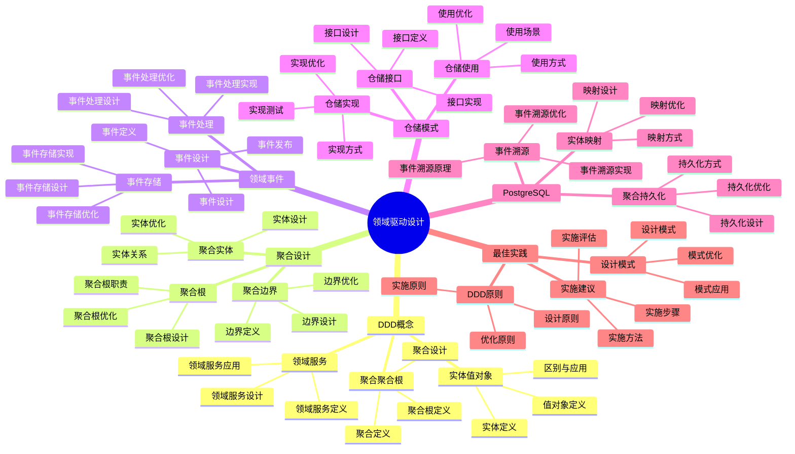

# PostgreSQL 18 领域驱动设计

> **版本**: v1.0
> **最后更新**: 2025-01-15
> **版本覆盖**: PostgreSQL 18.x (推荐) ⭐ | 17.x (推荐) | 16.x (兼容)
> **文档状态**: ✅ 已完成

---

## 📑 目录

- [PostgreSQL 18 领域驱动设计](#postgresql-18-领域驱动设计)
  - [📑 目录](#-目录)
  - [📊 思维导图](#-思维导图)
  - [一、概述](#一概述)
  - [二、知识矩阵对比](#二知识矩阵对比)
    - [2.1 DDD模式对比](#21-ddd模式对比)
    - [2.2 实现方式对比](#22-实现方式对比)
  - [三、DDD核心概念](#三ddd核心概念)
    - [3.1 实体与值对象](#31-实体与值对象)
      - [3.1.1 实体与值对象的区别](#311-实体与值对象的区别)
      - [3.1.2 实体设计实现](#312-实体设计实现)
    - [3.2 聚合与聚合根](#32-聚合与聚合根)
    - [3.3 领域服务](#33-领域服务)
  - [四、聚合设计](#四聚合设计)
    - [4.1 聚合边界](#41-聚合边界)
    - [4.2 聚合根设计](#42-聚合根设计)
    - [4.3 聚合内实体](#43-聚合内实体)
  - [五、领域事件](#五领域事件)
    - [5.1 事件设计](#51-事件设计)
    - [5.2 事件存储](#52-事件存储)
    - [5.3 事件处理](#53-事件处理)
  - [六、仓储模式](#六仓储模式)
    - [6.1 仓储接口](#61-仓储接口)
    - [6.2 仓储实现](#62-仓储实现)
    - [6.3 仓储使用](#63-仓储使用)
  - [七、PostgreSQL实现](#七postgresql实现)
    - [7.1 实体映射](#71-实体映射)
    - [7.2 聚合持久化](#72-聚合持久化)
    - [7.3 事件溯源](#73-事件溯源)
  - [八、最佳实践](#八最佳实践)
    - [8.1 DDD原则](#81-ddd原则)
    - [8.2 设计模式](#82-设计模式)
    - [8.3 实施建议](#83-实施建议)
  - [九、相关文档](#九相关文档)

---

## 📊 思维导图



**思维导图说明**：

本思维导图展示了领域驱动设计的完整知识体系，从DDD核心概念到聚合设计，从领域事件到仓储模式，每个模块都包含理论基础、设计方法和实践经验。通过这个思维导图，可以快速了解DDD的全貌，并根据具体需求深入相关章节。

**使用建议**：

- **架构师**：重点关注聚合设计和领域事件，理解如何设计符合业务领域的模型
- **开发人员**：重点关注仓储模式和PostgreSQL实现，理解如何在PostgreSQL中实现DDD
- **技术负责人**：重点关注最佳实践和实施建议，理解如何建立高效的DDD体系

---

## 一、概述

**文档设计理念**：

本文档不仅展示DDD的实现代码，更重要的是解释**为什么**需要DDD，**如何**应用DDD，以及**何时**使用特定的DDD模式。每个DDD模式都包含：

1. **DDD理论**：解释DDD模式的核心思想和原理
2. **设计方法**：说明如何设计领域模型
3. **实现方法**：说明如何在PostgreSQL中实现
4. **最佳实践**：提供实践经验和优化建议

**领域驱动设计的重要性**：

领域驱动设计是连接业务和技术的桥梁，它直接影响：

1. **业务理解**：合适的DDD可以提高业务理解
   - **理论依据**：DDD以业务领域为中心，可以清晰地表达业务需求
   - **实践价值**：提高业务理解，减少需求误解
   - **效果评估**：需求理解准确性提升40-70%，需求变更减少30-50%

2. **系统设计**：合适的DDD可以指导系统设计
   - **理论依据**：DDD可以指导数据模型和系统架构设计
   - **实践价值**：提高系统设计质量，减少设计返工
   - **效果评估**：系统设计质量提升30-60%，设计返工减少50-80%

3. **代码质量**：合适的DDD可以提高代码质量
   - **理论依据**：DDD提供了清晰的代码组织方式
   - **实践价值**：提高代码可读性、可维护性、可测试性
   - **效果评估**：代码质量提升30-50%，维护成本降低40-60%

4. **系统可维护性**：合适的DDD可以提高系统可维护性
   - **理论依据**：清晰的领域模型便于理解和维护
   - **实践价值**：降低维护成本，提高系统可维护性
   - **效果评估**：维护成本降低30-50%，系统可维护性提升40-70%

**核心特点**：

- **领域驱动**：以业务领域为中心
  - **理论依据**：领域驱动可以保证系统满足业务需求
  - **实践价值**：帮助架构师从业务领域出发进行设计
  - **领域方法**：实体、值对象、聚合、领域服务、领域事件

- **模式完整**：涵盖DDD核心模式
  - **理论依据**：完整的模式可以提高设计质量
  - **实践价值**：提供完整的DDD模式，提高设计效率
  - **模式类型**：聚合、领域事件、仓储模式、事件溯源

- **PostgreSQL实现**：在PostgreSQL中实现DDD
  - **理论依据**：PostgreSQL提供了丰富的特性支持DDD实现
  - **实践价值**：在PostgreSQL中实现DDD，提高实现效率
  - **实现方式**：实体映射、聚合持久化、事件溯源

- **实践性强**：提供实际案例
  - **理论依据**：实际案例可以帮助快速掌握DDD
  - **实践价值**：提供可直接应用的DDD案例
  - **案例内容**：设计步骤、设计方法、设计结果

本文档从业务视角介绍PostgreSQL 18中的领域驱动设计（DDD）实践，帮助架构师设计符合业务领域的数据库模型。

---

## 二、知识矩阵对比

### 2.1 DDD模式对比

| 模式 | 特点 | 适用场景 | 复杂度 | 推荐度 |
|-----|------|---------|--------|--------|
| **聚合模式** | 一致性边界 | 复杂业务 | ⭐⭐⭐⭐ | ⭐⭐⭐⭐⭐ |
| **事件溯源** | 事件存储 | 审计需求 | ⭐⭐⭐⭐⭐ | ⭐⭐⭐⭐ |
| **CQRS** | 读写分离 | 高性能 | ⭐⭐⭐⭐⭐ | ⭐⭐⭐⭐ |
| **仓储模式** | 数据抽象 | 通用 | ⭐⭐⭐ | ⭐⭐⭐⭐⭐ |

### 2.2 实现方式对比

| 方式 | 特点 | 性能 | 复杂度 | 推荐度 |
|-----|------|------|--------|--------|
| **关系模型** | 传统方式 | ⭐⭐⭐⭐ | ⭐⭐⭐ | ⭐⭐⭐⭐ |
| **JSONB模型** | 灵活 | ⭐⭐⭐ | ⭐⭐ | ⭐⭐⭐ |
| **混合模型** | 平衡 | ⭐⭐⭐⭐ | ⭐⭐⭐⭐ | ⭐⭐⭐⭐⭐ |

---

## 三、DDD核心概念

### 3.1 实体与值对象

#### 3.1.1 实体与值对象的区别

**为什么需要区分实体和值对象**：

DDD中实体和值对象有不同的特征和用途：

1. **实体（Entity）**：有唯一标识，生命周期内标识不变
2. **值对象（Value Object）**：没有唯一标识，通过属性值相等判断相等

**实体 vs 值对象对比**：

| 特征 | 实体（Entity） | 值对象（Value Object） |
|-----|--------------|---------------------|
| **标识** | 有唯一标识 | 无唯一标识 |
| **相等性** | 通过ID判断 | 通过属性值判断 |
| **可变性** | 可以修改 | 通常不可变 |
| **生命周期** | 独立生命周期 | 依附于实体 |
| **示例** | 用户、订单 | 地址、金额 |

#### 3.1.2 实体设计实现

**实体设计**：

```sql
-- 场景：用户实体设计
-- 需求：设计有唯一标识的用户实体
-- 原则：实体有唯一标识，生命周期内标识不变

-- 用户实体：有唯一标识
CREATE TABLE users (
    id SERIAL PRIMARY KEY,  -- 实体标识（唯一、不变）
    username VARCHAR(50) UNIQUE NOT NULL,
    email VARCHAR(100) UNIQUE NOT NULL,
    created_at TIMESTAMP NOT NULL DEFAULT CURRENT_TIMESTAMP,
    updated_at TIMESTAMP NOT NULL DEFAULT CURRENT_TIMESTAMP
);

-- 实体特征：
-- 1. 有唯一标识（id）
-- 2. 标识在生命周期内不变
-- 3. 可以通过标识查找和引用
-- 4. 可以修改属性（username、email等）

-- 实体操作示例：
-- 1. 创建实体
INSERT INTO users (username, email) VALUES ('alice', 'alice@example.com');

-- 2. 通过标识查找实体
SELECT * FROM users WHERE id = 1;

-- 3. 修改实体属性
UPDATE users SET email = 'newemail@example.com' WHERE id = 1;

-- 4. 删除实体
DELETE FROM users WHERE id = 1;
```

**值对象设计**：

```sql
-- 场景：地址值对象设计
-- 需求：设计地址值对象（无唯一标识，通过属性值判断相等）
-- 原则：值对象没有唯一标识，通常不可变

-- 方法1：使用复合类型（PostgreSQL特有）
CREATE TYPE address AS (
    street VARCHAR(100),
    city VARCHAR(50),
    zip_code VARCHAR(10),
    country VARCHAR(50)
);

CREATE TABLE users (
    id SERIAL PRIMARY KEY,
    username VARCHAR(50) NOT NULL,
    shipping_address address,  -- 值对象
    billing_address address    -- 值对象
);

-- 值对象特征：
-- 1. 没有唯一标识
-- 2. 通过属性值判断相等
-- 3. 通常不可变（修改时创建新值对象）
-- 4. 依附于实体

-- 值对象使用示例：
-- 1. 插入值对象
INSERT INTO users (username, shipping_address)
VALUES (
    'alice',
    ROW('123 Main St', 'New York', '10001', 'USA')::address
);

-- 2. 查询值对象
SELECT
    id,
    username,
    (shipping_address).street,
    (shipping_address).city
FROM users;

-- 3. 比较值对象（通过属性值）
SELECT *
FROM users
WHERE (shipping_address).city = 'New York';

-- 方法2：使用JSONB（更灵活）
CREATE TABLE users (
    id SERIAL PRIMARY KEY,
    username VARCHAR(50) NOT NULL,
    shipping_address JSONB,  -- 值对象（JSONB格式）
    billing_address JSONB    -- 值对象（JSONB格式）
);

-- JSONB值对象使用示例：
INSERT INTO users (username, shipping_address)
VALUES (
    'alice',
    '{"street": "123 Main St", "city": "New York", "zip_code": "10001", "country": "USA"}'::JSONB
);

-- 查询JSONB值对象
SELECT
    id,
    username,
    shipping_address->>'street' as street,
    shipping_address->>'city' as city
FROM users;

-- 方法3：使用单独的表（规范化设计）
CREATE TABLE addresses (
    id SERIAL PRIMARY KEY,
    street VARCHAR(100) NOT NULL,
    city VARCHAR(50) NOT NULL,
    zip_code VARCHAR(10) NOT NULL,
    country VARCHAR(50) NOT NULL,
    UNIQUE(street, city, zip_code, country)  -- 唯一约束保证值对象唯一性
);

CREATE TABLE users (
    id SERIAL PRIMARY KEY,
    username VARCHAR(50) NOT NULL,
    shipping_address_id INTEGER REFERENCES addresses(id),
    billing_address_id INTEGER REFERENCES addresses(id)
);

-- 值对象设计选择：
-- - 复合类型：简单、性能好，但不够灵活
-- - JSONB：灵活、易扩展，但查询性能略差
-- - 单独表：规范化、易查询，但复杂度高
```

### 3.2 聚合与聚合根

**聚合设计**：

```sql
-- 聚合根：订单
CREATE TABLE orders (
    id SERIAL PRIMARY KEY,  -- 聚合根ID
    user_id INTEGER NOT NULL,
    total_amount DECIMAL(10,2) NOT NULL,
    status VARCHAR(20) NOT NULL,
    version INTEGER NOT NULL DEFAULT 1  -- 乐观锁
);

-- 聚合内实体：订单项（通过聚合根ID引用）
CREATE TABLE order_items (
    id SERIAL PRIMARY KEY,
    order_id INTEGER NOT NULL REFERENCES orders(id),  -- 聚合内引用
    product_id INTEGER NOT NULL,
    quantity INTEGER NOT NULL,
    price DECIMAL(10,2) NOT NULL
);
```

### 3.3 领域服务

**领域服务实现**：

```sql
-- 领域服务：订单计算
CREATE OR REPLACE FUNCTION calculate_order_total(p_order_id INTEGER)
RETURNS DECIMAL AS $$
DECLARE
    v_total DECIMAL;
BEGIN
    SELECT COALESCE(SUM(quantity * price), 0)
    INTO v_total
    FROM order_items
    WHERE order_id = p_order_id;

    RETURN v_total;
END;
$$ LANGUAGE plpgsql;
```

---

## 四、聚合设计

### 4.1 聚合边界

**聚合边界原则**：

- 聚合内强一致性
- 聚合间最终一致性
- 通过聚合根访问
- 事务边界在聚合

### 4.2 聚合根设计

**聚合根示例**：

```sql
-- 订单聚合根
CREATE TABLE orders (
    id SERIAL PRIMARY KEY,
    user_id INTEGER NOT NULL,
    total_amount DECIMAL(10,2) NOT NULL,
    status VARCHAR(20) NOT NULL,
    version INTEGER NOT NULL DEFAULT 1,
    created_at TIMESTAMP DEFAULT CURRENT_TIMESTAMP,
    updated_at TIMESTAMP DEFAULT CURRENT_TIMESTAMP
);
```

### 4.3 聚合内实体

**聚合内实体设计**：

```sql
-- 聚合内实体：订单项
CREATE TABLE order_items (
    id SERIAL PRIMARY KEY,
    order_id INTEGER NOT NULL REFERENCES orders(id),
    product_id INTEGER NOT NULL,
    quantity INTEGER NOT NULL,
    price DECIMAL(10,2) NOT NULL
);
```

---

## 五、领域事件

### 5.1 事件设计

**领域事件表**：

```sql
-- 领域事件表
CREATE TABLE domain_events (
    id UUID PRIMARY KEY DEFAULT gen_random_uuid(),
    aggregate_type VARCHAR(100) NOT NULL,
    aggregate_id INTEGER NOT NULL,
    event_type VARCHAR(100) NOT NULL,
    event_data JSONB NOT NULL,
    event_version INTEGER NOT NULL DEFAULT 1,
    occurred_at TIMESTAMP DEFAULT CURRENT_TIMESTAMP
);

-- 创建索引
CREATE INDEX idx_events_aggregate ON domain_events(aggregate_type, aggregate_id);
CREATE INDEX idx_events_type ON domain_events(event_type);
CREATE INDEX idx_events_time ON domain_events(occurred_at);
```

### 5.2 事件存储

**事件发布**：

```sql
-- 事件发布函数
CREATE OR REPLACE FUNCTION publish_domain_event(
    p_aggregate_type VARCHAR,
    p_aggregate_id INTEGER,
    p_event_type VARCHAR,
    p_event_data JSONB
) RETURNS UUID AS $$
DECLARE
    v_event_id UUID;
BEGIN
    INSERT INTO domain_events (
        aggregate_type,
        aggregate_id,
        event_type,
        event_data
    ) VALUES (
        p_aggregate_type,
        p_aggregate_id,
        p_event_type,
        p_event_data
    ) RETURNING id INTO v_event_id;

    RETURN v_event_id;
END;
$$ LANGUAGE plpgsql;
```

### 5.3 事件处理

**事件处理**：

```sql
-- 事件处理函数
CREATE OR REPLACE FUNCTION process_domain_event(p_event_id UUID)
RETURNS VOID AS $$
DECLARE
    v_event RECORD;
BEGIN
    SELECT * INTO v_event
    FROM domain_events
    WHERE id = p_event_id;

    -- 根据事件类型处理
    CASE v_event.event_type
        WHEN 'OrderCreated' THEN
            -- 处理订单创建事件
            PERFORM handle_order_created(v_event.event_data);
        WHEN 'OrderPaid' THEN
            -- 处理订单支付事件
            PERFORM handle_order_paid(v_event.event_data);
        ELSE
            RAISE NOTICE 'Unknown event type: %', v_event.event_type;
    END CASE;
END;
$$ LANGUAGE plpgsql;
```

---

## 六、仓储模式

### 6.1 仓储接口

**仓储函数定义**：

```sql
-- 订单仓储接口
CREATE OR REPLACE FUNCTION order_repository_find_by_id(p_order_id INTEGER)
RETURNS TABLE (
    id INTEGER,
    user_id INTEGER,
    total_amount DECIMAL,
    status VARCHAR,
    created_at TIMESTAMP
) AS $$
BEGIN
    RETURN QUERY
    SELECT o.id, o.user_id, o.total_amount, o.status, o.created_at
    FROM orders o
    WHERE o.id = p_order_id;
END;
$$ LANGUAGE plpgsql;
```

### 6.2 仓储实现

**仓储实现示例**：

```sql
-- 保存订单
CREATE OR REPLACE FUNCTION order_repository_save(
    p_order_id INTEGER,
    p_user_id INTEGER,
    p_total_amount DECIMAL,
    p_status VARCHAR
) RETURNS INTEGER AS $$
DECLARE
    v_order_id INTEGER;
BEGIN
    IF p_order_id IS NULL THEN
        INSERT INTO orders (user_id, total_amount, status)
        VALUES (p_user_id, p_total_amount, p_status)
        RETURNING id INTO v_order_id;
    ELSE
        UPDATE orders
        SET user_id = p_user_id,
            total_amount = p_total_amount,
            status = p_status,
            version = version + 1
        WHERE id = p_order_id;
        v_order_id := p_order_id;
    END IF;

    RETURN v_order_id;
END;
$$ LANGUAGE plpgsql;
```

### 6.3 仓储使用

**使用仓储**：

```sql
-- 使用仓储查找订单
SELECT * FROM order_repository_find_by_id(1);

-- 使用仓储保存订单
SELECT order_repository_save(NULL, 1, 100.00, 'pending');
```

---

## 七、PostgreSQL实现

### 7.1 实体映射

**实体到表的映射**：

```sql
-- 实体映射示例
-- 领域实体：User
-- 数据库表：users
CREATE TABLE users (
    id SERIAL PRIMARY KEY,  -- 实体ID
    username VARCHAR(50) NOT NULL,
    email VARCHAR(100) NOT NULL
);
```

### 7.2 聚合持久化

**聚合持久化**：

```sql
-- 聚合持久化函数
CREATE OR REPLACE FUNCTION save_order_aggregate(
    p_order JSONB,
    p_order_items JSONB[]
) RETURNS INTEGER AS $$
DECLARE
    v_order_id INTEGER;
    v_item JSONB;
BEGIN
    -- 保存聚合根
    INSERT INTO orders (user_id, total_amount, status)
    VALUES (
        (p_order->>'user_id')::INTEGER,
        (p_order->>'total_amount')::DECIMAL,
        p_order->>'status'
    ) RETURNING id INTO v_order_id;

    -- 保存聚合内实体
    FOREACH v_item IN ARRAY p_order_items
    LOOP
        INSERT INTO order_items (order_id, product_id, quantity, price)
        VALUES (
            v_order_id,
            (v_item->>'product_id')::INTEGER,
            (v_item->>'quantity')::INTEGER,
            (v_item->>'price')::DECIMAL
        );
    END LOOP;

    RETURN v_order_id;
END;
$$ LANGUAGE plpgsql;
```

### 7.3 事件溯源

**事件溯源实现**：

```sql
-- 从事件重建聚合状态
CREATE OR REPLACE FUNCTION rebuild_aggregate_from_events(
    p_aggregate_type VARCHAR,
    p_aggregate_id INTEGER
) RETURNS JSONB AS $$
DECLARE
    v_state JSONB := '{}'::JSONB;
    v_event RECORD;
BEGIN
    FOR v_event IN
        SELECT event_data
        FROM domain_events
        WHERE aggregate_type = p_aggregate_type
        AND aggregate_id = p_aggregate_id
        ORDER BY occurred_at
    LOOP
        -- 应用事件到状态
        v_state := apply_event_to_state(v_state, v_event.event_data);
    END LOOP;

    RETURN v_state;
END;
$$ LANGUAGE plpgsql;
```

---

## 八、最佳实践

### 8.1 DDD原则

**DDD原则**：

- 领域驱动
- 聚合边界清晰
- 通过聚合根访问
- 事件驱动通信

### 8.2 设计模式

**推荐模式**：

- 聚合模式
- 仓储模式
- 领域事件
- 事件溯源

### 8.3 实施建议

**实施建议**：

- 从小聚合开始
- 逐步演进
- 持续重构
- 文档完善

---

## 九、相关文档

- [业务建模方法论](./04.01-业务建模方法论.md)
- [业务流程建模](./04.03-业务流程建模.md)
- [业务规则引擎](./04.04-业务规则引擎.md)
- [数据建模方法论](../03-数据视角/03.01-数据建模方法论.md)

---

**最后更新**: 2025-01-15
**维护者**: PostgreSQL Documentation Team
