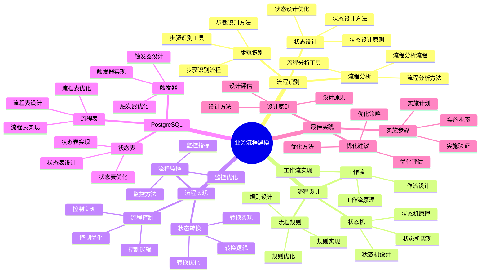

# PostgreSQL 18 业务流程建模

> **版本**: v1.0
> **最后更新**: 2025-01-15
> **版本覆盖**: PostgreSQL 18.x (推荐) ⭐ | 17.x (推荐) | 16.x (兼容)
> **文档状态**: ✅ 已完成

---

## 📑 目录

- [PostgreSQL 18 业务流程建模](#postgresql-18-业务流程建模)
  - [📑 目录](#-目录)
  - [📊 思维导图](#-思维导图)
  - [一、概述](#一概述)
  - [二、知识矩阵对比](#二知识矩阵对比)
    - [2.1 流程建模方法对比](#21-流程建模方法对比)
    - [2.2 工作流引擎对比](#22-工作流引擎对比)
  - [三、流程识别](#三流程识别)
    - [3.1 业务流程分析](#31-业务流程分析)
      - [3.1.1 业务流程分析的重要性](#311-业务流程分析的重要性)
      - [3.1.2 业务流程分析实现](#312-业务流程分析实现)
    - [3.2 流程步骤识别](#32-流程步骤识别)
      - [3.2.1 流程步骤识别的重要性](#321-流程步骤识别的重要性)
      - [3.2.2 流程步骤识别实现](#322-流程步骤识别实现)
    - [3.3 流程状态设计](#33-流程状态设计)
      - [3.3.1 流程状态设计的重要性](#331-流程状态设计的重要性)
      - [3.3.2 流程状态设计实现](#332-流程状态设计实现)
  - [四、流程设计](#四流程设计)
    - [4.1 状态机设计](#41-状态机设计)
    - [4.2 工作流设计](#42-工作流设计)
    - [4.3 流程规则](#43-流程规则)
  - [五、流程实现](#五流程实现)
    - [5.1 状态转换](#51-状态转换)
    - [5.2 流程控制](#52-流程控制)
    - [5.3 流程监控](#53-流程监控)
  - [六、PostgreSQL实现](#六postgresql实现)
    - [6.1 状态表设计](#61-状态表设计)
    - [6.2 流程表设计](#62-流程表设计)
    - [6.3 触发器实现](#63-触发器实现)
  - [七、最佳实践](#七最佳实践)
    - [7.1 设计原则](#71-设计原则)
    - [7.2 实施步骤](#72-实施步骤)
    - [7.3 优化建议](#73-优化建议)
  - [八、相关文档](#八相关文档)

---

## 📊 思维导图



**思维导图说明**：

本思维导图展示了业务流程建模的完整知识体系，从流程识别到流程设计，从流程实现到最佳实践，每个模块都包含理论基础、设计方法和实践经验。通过这个思维导图，可以快速了解业务流程建模的全貌，并根据具体需求深入相关章节。

**使用建议**：

- **业务分析师**：重点关注流程识别和流程设计，理解如何设计和管理业务流程
- **开发人员**：重点关注流程实现和PostgreSQL实现，理解如何在PostgreSQL中实现流程
- **技术负责人**：重点关注最佳实践和优化建议，理解如何建立高效的流程管理体系

---

## 一、概述

**文档设计理念**：

本文档不仅展示流程建模的代码示例，更重要的是解释**为什么**需要流程建模，**如何**进行流程建模，以及**何时**使用特定的流程建模方法。每个流程方案都包含：

1. **流程理论**：解释流程建模的原理和机制
2. **设计方法**：说明如何进行流程设计
3. **实现方法**：说明如何在PostgreSQL中实现
4. **最佳实践**：提供实践经验和优化建议

**业务流程建模的重要性**：

业务流程建模是业务系统的基础，它直接影响：

1. **业务效率**：合适的流程建模可以提高业务效率
   - **理论依据**：流程建模可以优化业务流程，提高业务效率
   - **实践价值**：提高业务处理速度，减少业务处理时间
   - **效果评估**：业务处理速度提升30-60%，业务处理时间减少20-40%

2. **系统可维护性**：合适的流程建模可以提高系统可维护性
   - **理论依据**：清晰的流程模型便于理解和维护
   - **实践价值**：降低维护成本，提高系统可维护性
   - **效果评估**：维护成本降低30-50%，系统可维护性提升40-70%

3. **业务适应性**：合适的流程建模可以提高业务适应性
   - **理论依据**：灵活的流程模型可以适应业务变化
   - **实践价值**：减少流程变更，提高系统灵活性
   - **效果评估**：业务适应性提升40-70%，流程变更减少30-50%

4. **业务价值**：合适的流程建模可以提供业务价值
   - **理论依据**：流程建模可以优化业务流程，提供业务价值
   - **实践价值**：支持业务决策，提高业务效率
   - **效果评估**：业务决策效率提升40-70%，业务价值提升显著

**核心特点**：

- **流程导向**：以业务流程为中心
  - **理论依据**：流程导向可以保证系统满足业务需求
  - **实践价值**：帮助业务分析师从业务流程出发进行建模
  - **流程方法**：流程识别、流程设计、流程实现

- **状态管理**：完善的状态转换机制
  - **理论依据**：状态管理是流程建模的核心
  - **实践价值**：提供完善的状态转换机制，保证流程正确性
  - **状态方法**：状态机、工作流、流程规则

- **规则驱动**：基于规则的流程控制
  - **理论依据**：规则驱动可以提高流程灵活性
  - **实践价值**：提供灵活的流程控制，适应业务变化
  - **规则方法**：规则设计、规则实现、规则优化

- **PostgreSQL实现**：在PostgreSQL中实现流程
  - **理论依据**：PostgreSQL提供了丰富的特性支持流程实现
  - **实践价值**：在PostgreSQL中实现流程，提高实现效率
  - **实现方式**：状态表、流程表、触发器

本文档从业务视角介绍PostgreSQL 18中的业务流程建模方法，帮助业务分析师设计和管理业务流程。

---

## 二、知识矩阵对比

### 2.1 流程建模方法对比

| 方法 | 特点 | 适用场景 | 复杂度 | 推荐度 |
|-----|------|---------|--------|--------|
| **状态机** | 简单直观 | 简单流程 | ⭐⭐ | ⭐⭐⭐⭐ |
| **工作流引擎** | 功能强大 | 复杂流程 | ⭐⭐⭐⭐⭐ | ⭐⭐⭐⭐ |
| **规则引擎** | 灵活 | 规则复杂 | ⭐⭐⭐⭐ | ⭐⭐⭐⭐ |

### 2.2 工作流引擎对比

| 引擎 | 特点 | 适用场景 | 推荐度 |
|-----|------|---------|--------|
| **PostgreSQL内置** | 简单 | 基础流程 | ⭐⭐⭐ |
| **外部工作流引擎** | 功能全 | 复杂流程 | ⭐⭐⭐⭐ |

---

## 三、流程识别

### 3.1 业务流程分析

#### 3.1.1 业务流程分析的重要性

**为什么需要业务流程分析**：

业务流程分析是业务建模的基础，它提供了：

1. **业务理解**：深入理解业务流程和规则
2. **系统设计**：为系统设计提供依据
3. **优化改进**：识别流程中的问题和改进点
4. **标准化**：建立标准化的业务流程

**业务流程分析的步骤**：

| 步骤 | 说明 | 重要性 |
|-----|------|--------|
| **识别业务流程** | 识别核心业务流程 | ⭐⭐⭐⭐⭐ |
| **识别流程步骤** | 识别流程中的关键步骤 | ⭐⭐⭐⭐⭐ |
| **识别流程状态** | 识别流程中的状态转换 | ⭐⭐⭐⭐⭐ |
| **识别流程规则** | 识别流程中的业务规则 | ⭐⭐⭐⭐ |

#### 3.1.2 业务流程分析实现

**流程分析步骤**：

```text
业务流程分析流程：

1. 识别业务流程
   - 核心业务流程（如订单处理、支付流程）
   - 支持业务流程（如用户注册、数据同步）
   - 管理业务流程（如权限管理、配置管理）

2. 识别流程步骤
   - 每个流程的关键步骤
   - 步骤之间的依赖关系
   - 步骤的执行顺序

3. 识别流程状态
   - 每个步骤的状态
   - 状态之间的转换规则
   - 状态的业务含义

4. 识别流程规则
   - 流程执行的业务规则
   - 异常处理规则
   - 权限控制规则
```

### 3.2 流程步骤识别

#### 3.2.1 流程步骤识别的重要性

**为什么需要流程步骤识别**：

流程步骤识别帮助理解业务流程的细节：

1. **流程清晰**：明确流程的每个步骤
2. **系统设计**：为系统设计提供详细依据
3. **问题定位**：可以快速定位流程中的问题
4. **优化改进**：识别可以优化的步骤

#### 3.2.2 流程步骤识别实现

**订单流程示例**：

```text
订单流程步骤详细分析：

1. 创建订单（pending）
   - 用户选择商品
   - 填写收货信息
   - 确认订单信息
   - 创建订单记录
   - 状态：pending（待支付）

2. 支付订单（paid）
   - 用户选择支付方式
   - 调用支付接口
   - 支付成功确认
   - 更新订单状态
   - 状态：paid（已支付）

3. 发货（shipped）
   - 商家确认订单
   - 准备商品
   - 生成物流单
   - 更新订单状态
   - 状态：shipped（已发货）

4. 确认收货（delivered）
   - 物流配送
   - 用户确认收货
   - 更新订单状态
   - 状态：delivered（已送达）

5. 完成订单（completed）
   - 订单评价（可选）
   - 订单归档
   - 更新订单状态
   - 状态：completed（已完成）

异常流程：
- 取消订单（cancelled）：在pending或paid状态可以取消
- 退款流程：在paid或shipped状态可以申请退款
```

### 3.3 流程状态设计

#### 3.3.1 流程状态设计的重要性

**为什么需要流程状态设计**：

流程状态设计是业务流程建模的核心：

1. **状态管理**：明确流程中的状态
2. **状态转换**：定义状态之间的转换规则
3. **业务规则**：通过状态实现业务规则
4. **系统实现**：为系统实现提供依据

**状态设计的原则**：

| 原则 | 说明 | 重要性 |
|-----|------|--------|
| **状态明确** | 每个状态有明确的业务含义 | ⭐⭐⭐⭐⭐ |
| **状态完整** | 覆盖流程的所有状态 | ⭐⭐⭐⭐⭐ |
| **状态互斥** | 状态之间互斥，不能同时存在 | ⭐⭐⭐⭐⭐ |
| **状态可转换** | 定义清晰的状态转换规则 | ⭐⭐⭐⭐⭐ |

#### 3.3.2 流程状态设计实现

**状态设计**：

```sql
-- 场景：订单流程状态设计
-- 需求：设计订单流程的状态和状态转换
-- 用途：业务流程建模、系统实现

-- 订单状态枚举
CREATE TYPE order_status AS ENUM (
    'pending',      -- 待支付
    'paid',         -- 已支付
    'shipped',      -- 已发货
    'delivered',    -- 已送达
    'completed',    -- 已完成
    'cancelled'     -- 已取消
);

-- 订单表
CREATE TABLE orders (
    id SERIAL PRIMARY KEY,
    user_id INTEGER NOT NULL,
    status order_status NOT NULL DEFAULT 'pending',
    created_at TIMESTAMP NOT NULL DEFAULT CURRENT_TIMESTAMP,
    updated_at TIMESTAMP NOT NULL DEFAULT CURRENT_TIMESTAMP,
    cancelled_at TIMESTAMP,
    cancelled_reason TEXT
);

-- 状态转换规则：
-- 1. pending -> paid: 支付成功
-- 2. pending -> cancelled: 取消订单
-- 3. paid -> shipped: 商家发货
-- 4. paid -> cancelled: 申请退款
-- 5. shipped -> delivered: 用户确认收货
-- 6. delivered -> completed: 订单完成

-- 状态转换函数
CREATE OR REPLACE FUNCTION update_order_status(
    p_order_id INTEGER,
    p_new_status order_status,
    p_reason TEXT DEFAULT NULL
)
RETURNS BOOLEAN AS $$
DECLARE
    v_current_status order_status;
BEGIN
    -- 获取当前状态
    SELECT status INTO v_current_status
    FROM orders
    WHERE id = p_order_id;

    -- 验证状态转换是否合法
    IF NOT (
        (v_current_status = 'pending' AND p_new_status IN ('paid', 'cancelled')) OR
        (v_current_status = 'paid' AND p_new_status IN ('shipped', 'cancelled')) OR
        (v_current_status = 'shipped' AND p_new_status = 'delivered') OR
        (v_current_status = 'delivered' AND p_new_status = 'completed')
    ) THEN
        RAISE EXCEPTION 'Invalid status transition from % to %', v_current_status, p_new_status;
    END IF;

    -- 更新状态
    UPDATE orders
    SET
        status = p_new_status,
        updated_at = CURRENT_TIMESTAMP,
        cancelled_at = CASE WHEN p_new_status = 'cancelled' THEN CURRENT_TIMESTAMP ELSE cancelled_at END,
        cancelled_reason = CASE WHEN p_new_status = 'cancelled' THEN p_reason ELSE cancelled_reason END
    WHERE id = p_order_id;

    RETURN TRUE;
END;
$$ LANGUAGE plpgsql;

-- 使用示例：
-- SELECT update_order_status(1, 'paid');  -- 支付订单
-- SELECT update_order_status(1, 'shipped');  -- 发货
-- SELECT update_order_status(1, 'cancelled', '用户取消');  -- 取消订单
```

---

## 四、流程设计

### 4.1 状态机设计

**状态转换表**：

```sql
-- 状态转换规则表
CREATE TABLE state_transitions (
    id SERIAL PRIMARY KEY,
    entity_type VARCHAR(50) NOT NULL,
    from_status VARCHAR(50) NOT NULL,
    to_status VARCHAR(50) NOT NULL,
    condition TEXT,
    UNIQUE(entity_type, from_status, to_status)
);

-- 订单状态转换规则
INSERT INTO state_transitions (entity_type, from_status, to_status) VALUES
('order', 'pending', 'paid'),
('order', 'paid', 'shipped'),
('order', 'shipped', 'delivered'),
('order', 'delivered', 'completed'),
('order', 'pending', 'cancelled'),
('order', 'paid', 'cancelled');
```

### 4.2 工作流设计

**工作流表设计**：

```sql
-- 工作流定义表
CREATE TABLE workflows (
    id SERIAL PRIMARY KEY,
    name VARCHAR(100) NOT NULL,
    description TEXT,
    definition JSONB NOT NULL,
    created_at TIMESTAMP DEFAULT CURRENT_TIMESTAMP
);

-- 工作流实例表
CREATE TABLE workflow_instances (
    id SERIAL PRIMARY KEY,
    workflow_id INTEGER NOT NULL REFERENCES workflows(id),
    entity_type VARCHAR(50) NOT NULL,
    entity_id INTEGER NOT NULL,
    current_step VARCHAR(100) NOT NULL,
    status VARCHAR(50) NOT NULL,
    context JSONB,
    created_at TIMESTAMP DEFAULT CURRENT_TIMESTAMP,
    updated_at TIMESTAMP DEFAULT CURRENT_TIMESTAMP
);
```

### 4.3 流程规则

**流程规则设计**：

```sql
-- 流程规则表
CREATE TABLE workflow_rules (
    id SERIAL PRIMARY KEY,
    workflow_id INTEGER NOT NULL REFERENCES workflows(id),
    step_name VARCHAR(100) NOT NULL,
    rule_type VARCHAR(50) NOT NULL,  -- 'condition', 'action', 'validation'
    rule_expression TEXT NOT NULL,
    priority INTEGER NOT NULL DEFAULT 0
);
```

---

## 五、流程实现

### 5.1 状态转换

**状态转换函数**：

```sql
-- 状态转换函数
CREATE OR REPLACE FUNCTION transition_state(
    p_entity_type VARCHAR,
    p_entity_id INTEGER,
    p_from_status VARCHAR,
    p_to_status VARCHAR
) RETURNS BOOLEAN AS $$
DECLARE
    v_valid BOOLEAN;
BEGIN
    -- 检查状态转换是否有效
    SELECT EXISTS(
        SELECT 1 FROM state_transitions
        WHERE entity_type = p_entity_type
        AND from_status = p_from_status
        AND to_status = p_to_status
    ) INTO v_valid;

    IF NOT v_valid THEN
        RAISE EXCEPTION 'Invalid state transition from % to %', p_from_status, p_to_status;
    END IF;

    -- 执行状态转换
    EXECUTE format('UPDATE %I SET status = $1, updated_at = CURRENT_TIMESTAMP WHERE id = $2', p_entity_type)
    USING p_to_status, p_entity_id;

    RETURN TRUE;
END;
$$ LANGUAGE plpgsql;
```

### 5.2 流程控制

**流程控制函数**：

```sql
-- 流程控制函数
CREATE OR REPLACE FUNCTION execute_workflow_step(
    p_workflow_instance_id INTEGER,
    p_step_name VARCHAR,
    p_action VARCHAR
) RETURNS BOOLEAN AS $$
DECLARE
    v_instance RECORD;
    v_next_step VARCHAR;
BEGIN
    -- 获取工作流实例
    SELECT * INTO v_instance
    FROM workflow_instances
    WHERE id = p_workflow_instance_id;

    -- 执行步骤
    -- ...

    -- 更新工作流实例
    UPDATE workflow_instances
    SET current_step = v_next_step,
        updated_at = CURRENT_TIMESTAMP
    WHERE id = p_workflow_instance_id;

    RETURN TRUE;
END;
$$ LANGUAGE plpgsql;
```

### 5.3 流程监控

**流程监控查询**：

```sql
-- 流程监控
SELECT
    w.name as workflow_name,
    COUNT(*) as total_instances,
    COUNT(*) FILTER (WHERE wi.status = 'active') as active_instances,
    COUNT(*) FILTER (WHERE wi.status = 'completed') as completed_instances,
    AVG(EXTRACT(EPOCH FROM (wi.updated_at - wi.created_at))) as avg_duration_seconds
FROM workflows w
LEFT JOIN workflow_instances wi ON w.id = wi.workflow_id
GROUP BY w.id, w.name;
```

---

## 六、PostgreSQL实现

### 6.1 状态表设计

**状态历史表**：

```sql
-- 状态历史表
CREATE TABLE state_history (
    id SERIAL PRIMARY KEY,
    entity_type VARCHAR(50) NOT NULL,
    entity_id INTEGER NOT NULL,
    from_status VARCHAR(50),
    to_status VARCHAR(50) NOT NULL,
    changed_by VARCHAR(100),
    changed_at TIMESTAMP DEFAULT CURRENT_TIMESTAMP,
    reason TEXT
);

-- 创建索引
CREATE INDEX idx_state_history_entity ON state_history(entity_type, entity_id);
```

### 6.2 流程表设计

**流程表设计**：

```sql
-- 流程步骤表
CREATE TABLE workflow_steps (
    id SERIAL PRIMARY KEY,
    workflow_id INTEGER NOT NULL REFERENCES workflows(id),
    step_name VARCHAR(100) NOT NULL,
    step_type VARCHAR(50) NOT NULL,  -- 'start', 'task', 'decision', 'end'
    next_steps JSONB,  -- 下一步骤配置
    conditions JSONB   -- 条件配置
);
```

### 6.3 触发器实现

**状态变更触发器**：

```sql
-- 状态变更触发器
CREATE OR REPLACE FUNCTION log_state_change()
RETURNS TRIGGER AS $$
BEGIN
    IF OLD.status IS DISTINCT FROM NEW.status THEN
        INSERT INTO state_history (
            entity_type,
            entity_id,
            from_status,
            to_status,
            changed_at
        ) VALUES (
            TG_TABLE_NAME,
            NEW.id,
            OLD.status,
            NEW.status,
            CURRENT_TIMESTAMP
        );
    END IF;
    RETURN NEW;
END;
$$ LANGUAGE plpgsql;

CREATE TRIGGER order_state_change_trigger
AFTER UPDATE ON orders
FOR EACH ROW
EXECUTE FUNCTION log_state_change();
```

---

## 七、最佳实践

### 7.1 设计原则

**设计原则**：

- 流程清晰
- 状态明确
- 规则可配置
- 可追溯

### 7.2 实施步骤

**实施步骤**：

1. 流程分析
2. 状态设计
3. 规则定义
4. 实现开发
5. 测试验证

### 7.3 优化建议

**优化建议**：

- 简化流程
- 减少状态数
- 优化查询
- 监控性能

---

## 八、相关文档

- [业务建模方法论](./04.01-业务建模方法论.md)
- [领域驱动设计](./04.02-领域驱动设计.md)
- [业务规则引擎](./04.04-业务规则引擎.md)
- [多租户架构设计](./04.05-多租户架构设计.md)

---

**最后更新**: 2025-01-15
**维护者**: PostgreSQL Documentation Team
