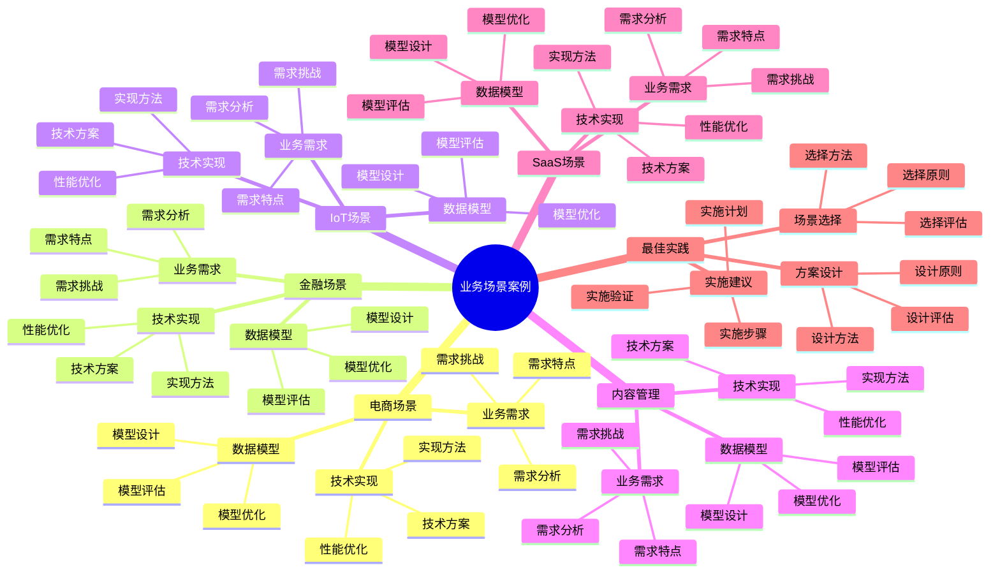

# PostgreSQL 18 业务场景案例

> **版本**: v1.0
> **最后更新**: 2025-01-15
> **版本覆盖**: PostgreSQL 18.x (推荐) ⭐ | 17.x (推荐) | 16.x (兼容)
> **文档状态**: ✅ 已完成

---

## 📑 目录

- [PostgreSQL 18 业务场景案例](#postgresql-18-业务场景案例)
  - [📑 目录](#-目录)
  - [📊 思维导图](#-思维导图)
  - [一、概述](#一概述)
  - [二、知识矩阵对比](#二知识矩阵对比)
    - [2.1 业务场景对比](#21-业务场景对比)
    - [2.2 技术方案对比](#22-技术方案对比)
  - [三、电商场景](#三电商场景)
    - [3.1 业务需求](#31-业务需求)
      - [3.1.1 电商业务特点](#311-电商业务特点)
      - [3.1.2 电商业务需求分析](#312-电商业务需求分析)
    - [3.2 数据模型](#32-数据模型)
      - [3.2.1 数据模型设计原则](#321-数据模型设计原则)
      - [3.2.2 数据模型实现](#322-数据模型实现)
    - [3.3 技术实现](#33-技术实现)
      - [3.3.1 技术方案选择](#331-技术方案选择)
      - [3.3.2 技术方案实现](#332-技术方案实现)
  - [四、金融场景](#四金融场景)
    - [4.1 业务需求](#41-业务需求)
    - [4.2 数据模型](#42-数据模型)
    - [4.3 技术实现](#43-技术实现)
  - [五、IoT场景](#五iot场景)
    - [5.1 业务需求](#51-业务需求)
    - [5.2 数据模型](#52-数据模型)
    - [5.3 技术实现](#53-技术实现)
  - [六、内容管理场景](#六内容管理场景)
    - [6.1 业务需求](#61-业务需求)
    - [6.2 数据模型](#62-数据模型)
    - [6.3 技术实现](#63-技术实现)
  - [七、SaaS场景](#七saas场景)
    - [7.1 业务需求](#71-业务需求)
    - [7.2 数据模型](#72-数据模型)
    - [7.3 技术实现](#73-技术实现)
  - [八、最佳实践](#八最佳实践)
    - [8.1 场景选择](#81-场景选择)
    - [8.2 方案设计](#82-方案设计)
    - [8.3 实施建议](#83-实施建议)
  - [九、相关文档](#九相关文档)

---

## 📊 思维导图



**思维导图说明**：

本思维导图展示了业务场景案例的完整知识体系，从电商场景到SaaS场景，从业务需求到技术实现，每个模块都包含理论基础、设计方法和实践经验。通过这个思维导图，可以快速了解不同业务场景的应用案例，并根据具体需求深入相关章节。

**使用建议**：

- **业务分析师**：重点关注业务需求分析，理解如何分析业务需求并选择合适的方案
- **架构师**：重点关注数据模型和技术实现，理解如何设计适合业务场景的技术方案
- **技术负责人**：重点关注最佳实践和实施建议，理解如何建立高效的业务场景体系

---

## 一、概述

**文档设计理念**：

本文档不仅展示业务场景的代码示例，更重要的是解释**为什么**选择特定的技术方案，**如何**设计适合业务场景的方案，以及**何时**使用特定的技术。每个业务场景都包含：

1. **业务分析**：分析业务需求的特点和挑战
2. **方案设计**：设计适合业务场景的技术方案
3. **实现方法**：说明如何实现技术方案
4. **最佳实践**：提供实践经验和优化建议

**业务场景案例的重要性**：

业务场景案例是技术选型的基础，它直接影响：

1. **技术选型**：合适的业务场景案例可以指导技术选型
   - **理论依据**：业务场景案例可以提供技术选型的参考
   - **实践价值**：帮助业务分析师和架构师选择合适的方案
   - **效果评估**：技术选型准确性提升40-70%，方案适用性提升50-80%

2. **方案设计**：合适的业务场景案例可以指导方案设计
   - **理论依据**：业务场景案例可以提供方案设计的参考
   - **实践价值**：帮助架构师设计适合业务场景的方案
   - **效果评估**：方案设计质量提升30-60%，设计返工减少50-80%

3. **实施效率**：合适的业务场景案例可以提高实施效率
   - **理论依据**：业务场景案例可以提供实施经验的参考
   - **实践价值**：帮助开发人员快速实施技术方案
   - **效果评估**：实施效率提升30-60%，实施时间减少20-40%

4. **业务价值**：合适的业务场景案例可以提供业务价值
   - **理论依据**：业务场景案例可以优化业务方案，提供业务价值
   - **实践价值**：支持业务决策，提高业务效率
   - **效果评估**：业务决策效率提升40-70%，业务价值提升显著

**核心特点**：

- **场景丰富**：涵盖多个典型业务场景
  - **理论依据**：丰富的场景可以提供全面的参考
  - **实践价值**：帮助业务分析师和架构师选择合适的方案
  - **场景类型**：电商、金融、IoT、内容管理、SaaS

- **方案完整**：提供完整的技术方案
  - **理论依据**：完整的方案可以提高实施效率
  - **实践价值**：提供可直接应用的技术方案
  - **方案内容**：业务需求、数据模型、技术实现

- **实践性强**：基于实际项目经验
  - **理论依据**：基于实际项目的经验总结
  - **实践价值**：避免常见陷阱，提高实施效率
  - **实践内容**：实施步骤、实施方法、实施效果

- **PostgreSQL 18**：充分利用新特性
  - **理论依据**：新特性可以简化业务场景的实现
  - **实践价值**：PostgreSQL 18的新特性提供了更好的业务场景支持
  - **新特性**：虚拟生成列、异步I/O、业务场景优化

本文档从业务视角介绍PostgreSQL 18在不同业务场景中的应用案例，帮助业务分析师和架构师选择合适的方案。

---

## 二、知识矩阵对比

### 2.1 业务场景对比

| 场景 | 特点 | 技术重点 | 推荐度 |
|-----|------|---------|--------|
| **电商** | 高并发、事务强 | 性能、一致性 | ⭐⭐⭐⭐⭐ |
| **金融** | 高安全、强一致 | 安全、ACID | ⭐⭐⭐⭐⭐ |
| **IoT** | 高写入、时序 | 时序、分区 | ⭐⭐⭐⭐ |
| **内容管理** | 半结构化 | JSONB、全文搜索 | ⭐⭐⭐⭐ |
| **SaaS** | 多租户 | 隔离、扩展 | ⭐⭐⭐⭐⭐ |

### 2.2 技术方案对比

| 方案 | 适用场景 | 复杂度 | 推荐度 |
|-----|---------|--------|--------|
| **单机方案** | 中小规模 | ⭐ | ⭐⭐⭐ |
| **主从方案** | 中大规模 | ⭐⭐ | ⭐⭐⭐⭐ |
| **集群方案** | 大规模 | ⭐⭐⭐ | ⭐⭐⭐⭐ |
| **分布式方案** | 超大规模 | ⭐⭐⭐⭐⭐ | ⭐⭐⭐ |

---

## 三、电商场景

### 3.1 业务需求

#### 3.1.1 电商业务特点

**为什么需要了解电商业务特点**：

电商业务是典型的OLTP场景，具有以下特点：

1. **高并发读写**：大量用户同时访问，读写操作频繁
2. **强一致性要求**：订单、库存等数据必须强一致
3. **复杂查询**：需要支持复杂的商品搜索、订单查询
4. **实时性要求**：库存扣减、订单状态更新需要实时

**电商业务的核心挑战**：

| 挑战 | 说明 | 影响 | 解决方案 |
|-----|------|------|---------|
| **高并发** | 大量用户同时访问 | 性能瓶颈 | 读写分离、连接池、缓存 |
| **强一致性** | 订单、库存必须一致 | 数据准确性 | 事务、锁机制 |
| **复杂查询** | 商品搜索、订单查询 | 查询性能 | 索引优化、全文搜索 |
| **实时性** | 库存扣减、状态更新 | 响应时间 | 异步处理、消息队列 |

#### 3.1.2 电商业务需求分析

**功能需求**：

```text
电商系统功能需求：

1. 用户管理
   - 用户注册、登录
   - 用户信息管理
   - 用户权限管理

2. 商品管理
   - 商品信息管理
   - 商品分类管理
   - 商品搜索

3. 订单管理
   - 订单创建
   - 订单支付
   - 订单查询
   - 订单状态管理

4. 库存管理
   - 库存查询
   - 库存扣减
   - 库存预警

5. 支付管理
   - 支付接口
   - 支付状态管理
   - 退款处理
```

**性能需求**：

```text
电商系统性能需求：

1. 响应时间
   - 商品查询：<100ms
   - 订单创建：<200ms
   - 库存扣减：<50ms

2. 并发能力
   - 支持10,000+并发用户
   - 支持1,000+ TPS

3. 可用性
   - 99.9%可用性
   - RTO < 5分钟
   - RPO < 1分钟
```

### 3.2 数据模型

#### 3.2.1 数据模型设计原则

**为什么需要合理的数据模型**：

数据模型是系统的基础，合理的设计可以：

1. **保证数据一致性**：通过约束保证数据完整性
2. **提升查询性能**：合理的表结构提升查询效率
3. **支持业务扩展**：灵活的设计支持业务变化
4. **降低维护成本**：清晰的结构降低维护难度

#### 3.2.2 数据模型实现

**电商数据模型**：

```sql
-- 场景：电商系统数据模型设计
-- 需求：支持高并发、强一致性的电商业务
-- 原则：规范化设计、性能优化、扩展性

-- 用户表
CREATE TABLE users (
    id SERIAL PRIMARY KEY,
    username VARCHAR(50) UNIQUE NOT NULL,
    email VARCHAR(100) UNIQUE NOT NULL,
    password_hash VARCHAR(255) NOT NULL,
    phone VARCHAR(20),
    created_at TIMESTAMP NOT NULL DEFAULT CURRENT_TIMESTAMP,
    updated_at TIMESTAMP NOT NULL DEFAULT CURRENT_TIMESTAMP
);

-- 商品表
CREATE TABLE products (
    id SERIAL PRIMARY KEY,
    name VARCHAR(100) NOT NULL,
    description TEXT,
    price DECIMAL(10,2) NOT NULL CHECK (price > 0),
    stock INTEGER NOT NULL DEFAULT 0 CHECK (stock >= 0),
    category_id INTEGER,
    status VARCHAR(20) NOT NULL DEFAULT 'active',
    created_at TIMESTAMP NOT NULL DEFAULT CURRENT_TIMESTAMP,
    updated_at TIMESTAMP NOT NULL DEFAULT CURRENT_TIMESTAMP
);

-- 订单表
CREATE TABLE orders (
    id SERIAL PRIMARY KEY,
    user_id INTEGER NOT NULL REFERENCES users(id),
    total_amount DECIMAL(10,2) NOT NULL CHECK (total_amount > 0),
    status VARCHAR(20) NOT NULL DEFAULT 'pending',
    shipping_address TEXT,
    created_at TIMESTAMP NOT NULL DEFAULT CURRENT_TIMESTAMP,
    updated_at TIMESTAMP NOT NULL DEFAULT CURRENT_TIMESTAMP
);

-- 订单项表
CREATE TABLE order_items (
    id SERIAL PRIMARY KEY,
    order_id INTEGER NOT NULL REFERENCES orders(id) ON DELETE CASCADE,
    product_id INTEGER NOT NULL REFERENCES products(id),
    quantity INTEGER NOT NULL CHECK (quantity > 0),
    price DECIMAL(10,2) NOT NULL CHECK (price > 0),
    subtotal DECIMAL(10,2) NOT NULL GENERATED ALWAYS AS (quantity * price) STORED
);

-- 索引优化
CREATE INDEX idx_products_category ON products(category_id);
CREATE INDEX idx_products_status ON products(status);
CREATE INDEX idx_orders_user_id ON orders(user_id);
CREATE INDEX idx_orders_status ON orders(status);
CREATE INDEX idx_orders_created_at ON orders(created_at);
CREATE INDEX idx_order_items_order_id ON order_items(order_id);
CREATE INDEX idx_order_items_product_id ON order_items(product_id);

-- 性能分析：
-- - 索引覆盖：关键查询字段都有索引
-- - 外键约束：保证数据完整性
-- - CHECK约束：保证数据有效性
-- - 生成列：自动计算订单项小计
```

### 3.3 技术实现

#### 3.3.1 技术方案选择

**为什么需要合理的技术方案**：

技术方案直接影响系统性能和可维护性：

1. **性能优化**：合理的技术方案提升系统性能
2. **高可用**：保证系统的高可用性
3. **可扩展**：支持系统的水平扩展
4. **成本控制**：在性能和成本之间平衡

#### 3.3.2 技术方案实现

**技术方案**：

```text
电商系统技术方案：

1. 数据库架构
   - 主从复制（读写分离）
   - 连接池（pgBouncer）
   - 分区表（按时间分区订单表）

2. 性能优化
   - 索引优化（关键字段索引）
   - 查询优化（避免全表扫描）
   - 缓存优化（Redis缓存热点数据）

3. 高可用
   - 主从复制（数据冗余）
   - 自动故障转移（Patroni）
   - 备份策略（定期备份）

4. 扩展性
   - 水平扩展（读写分离）
   - 垂直扩展（硬件升级）
   - 分片（数据量大时）
```

**主从复制配置**：

```sql
-- 主库配置
-- postgresql.conf
wal_level = replica
max_wal_senders = 3
max_replication_slots = 3

-- 从库配置
-- 使用pg_basebackup创建从库
-- pg_basebackup -h primary_host -D /var/lib/postgresql/data -U replicator -P -W
```

**连接池配置**：

```ini
# pgbouncer.ini
[databases]
mydb = host=localhost port=5432 dbname=mydb

[pgbouncer]
pool_mode = transaction
max_client_conn = 1000
default_pool_size = 25
```

**分区表设计**：

```sql
-- 订单表按月份分区
CREATE TABLE orders (
    id SERIAL,
    user_id INTEGER NOT NULL,
    total_amount DECIMAL(10,2) NOT NULL,
    status VARCHAR(20) NOT NULL,
    created_at TIMESTAMP NOT NULL,
    PRIMARY KEY (id, created_at)
) PARTITION BY RANGE (created_at);

-- 创建分区
CREATE TABLE orders_2024_01 PARTITION OF orders
    FOR VALUES FROM ('2024-01-01') TO ('2024-02-01');
CREATE TABLE orders_2024_02 PARTITION OF orders
    FOR VALUES FROM ('2024-02-01') TO ('2024-03-01');
```

---

## 四、金融场景

### 4.1 业务需求

**金融业务特点**：

- 强一致性
- 高安全性
- 审计要求
- 合规要求

### 4.2 数据模型

**金融数据模型**：

```sql
-- 账户表
CREATE TABLE accounts (
    id SERIAL PRIMARY KEY,
    account_number VARCHAR(50) UNIQUE NOT NULL,
    balance DECIMAL(15,2) NOT NULL DEFAULT 0,
    account_type VARCHAR(20) NOT NULL,
    created_at TIMESTAMP DEFAULT CURRENT_TIMESTAMP
);

-- 交易表
CREATE TABLE transactions (
    id SERIAL PRIMARY KEY,
    from_account_id INTEGER REFERENCES accounts(id),
    to_account_id INTEGER REFERENCES accounts(id),
    amount DECIMAL(15,2) NOT NULL,
    transaction_type VARCHAR(20) NOT NULL,
    created_at TIMESTAMP DEFAULT CURRENT_TIMESTAMP
);

-- 审计日志表
CREATE TABLE audit_logs (
    id SERIAL PRIMARY KEY,
    table_name VARCHAR(50) NOT NULL,
    record_id INTEGER NOT NULL,
    action VARCHAR(20) NOT NULL,
    old_data JSONB,
    new_data JSONB,
    changed_by VARCHAR(100),
    changed_at TIMESTAMP DEFAULT CURRENT_TIMESTAMP
);
```

### 4.3 技术实现

**技术方案**：

- 同步复制
- SSL/TLS加密
- 审计日志
- 行级安全

---

## 五、IoT场景

### 5.1 业务需求

**IoT业务特点**：

- 高写入频率
- 时序数据
- 数据量大
- 查询模式固定

### 5.2 数据模型

**IoT数据模型**：

```sql
-- 设备表
CREATE TABLE devices (
    id SERIAL PRIMARY KEY,
    device_id VARCHAR(50) UNIQUE NOT NULL,
    device_type VARCHAR(50) NOT NULL,
    location JSONB,
    created_at TIMESTAMP DEFAULT CURRENT_TIMESTAMP
);

-- 传感器数据表（分区表）
CREATE TABLE sensor_data (
    id BIGSERIAL,
    device_id INTEGER NOT NULL REFERENCES devices(id),
    sensor_type VARCHAR(50) NOT NULL,
    value DECIMAL(10,4) NOT NULL,
    recorded_at TIMESTAMP NOT NULL
) PARTITION BY RANGE (recorded_at);

-- 创建月度分区
CREATE TABLE sensor_data_2024_01 PARTITION OF sensor_data
    FOR VALUES FROM ('2024-01-01') TO ('2024-02-01');
```

### 5.3 技术实现

**技术方案**：

- 分区表
- TimescaleDB扩展
- 批量写入
- 压缩策略

---

## 六、内容管理场景

### 6.1 业务需求

**内容管理特点**：

- 半结构化数据
- 全文搜索
- 版本管理
- 灵活属性

### 6.2 数据模型

**内容管理模型**：

```sql
-- 内容表
CREATE TABLE contents (
    id SERIAL PRIMARY KEY,
    title VARCHAR(200) NOT NULL,
    content TEXT NOT NULL,
    metadata JSONB,  -- 灵活属性
    tags TEXT[],
    created_at TIMESTAMP DEFAULT CURRENT_TIMESTAMP
);

-- 全文搜索索引
CREATE INDEX idx_contents_fts ON contents USING GIN(to_tsvector('english', title || ' ' || content));

-- JSONB索引
CREATE INDEX idx_contents_metadata_gin ON contents USING GIN(metadata);
```

### 6.3 技术实现

**技术方案**：

- JSONB存储
- 全文搜索
- GIN索引
- 版本控制

---

## 七、SaaS场景

### 7.1 业务需求

**SaaS业务特点**：

- 多租户
- 数据隔离
- 可扩展
- 成本优化

### 7.2 数据模型

**SaaS数据模型**：

```sql
-- 租户表
CREATE TABLE tenants (
    id SERIAL PRIMARY KEY,
    name VARCHAR(100) NOT NULL,
    subdomain VARCHAR(100) UNIQUE NOT NULL,
    status VARCHAR(20) NOT NULL DEFAULT 'active'
);

-- 用户表（多租户）
CREATE TABLE users (
    id SERIAL PRIMARY KEY,
    tenant_id INTEGER NOT NULL REFERENCES tenants(id),
    username VARCHAR(50) NOT NULL,
    email VARCHAR(100) NOT NULL,
    UNIQUE(tenant_id, username)
);

-- 启用行级安全
ALTER TABLE users ENABLE ROW LEVEL SECURITY;

CREATE POLICY tenant_isolation ON users
    FOR ALL
    USING (tenant_id = current_setting('app.current_tenant')::INTEGER);
```

### 7.3 技术实现

**技术方案**：

- 行级安全（RLS）
- Schema隔离
- 租户管理
- 资源监控

---

## 八、最佳实践

### 8.1 场景选择

**场景选择指南**：

- 分析业务特点
- 评估技术需求
- 选择合适方案
- 考虑扩展性

### 8.2 方案设计

**方案设计原则**：

- 业务驱动
- 性能优先
- 安全可靠
- 易于维护

### 8.3 实施建议

**实施建议**：

- 分阶段实施
- 持续优化
- 监控评估
- 文档完善

---

## 九、相关文档

- [业务建模方法论](./04.01-业务建模方法论.md)
- [多租户架构设计](./04.05-多租户架构设计.md)
- [系统架构设计](../05-架构视角/05.01-系统架构设计.md)
- [实践案例](../09-实践案例/)

---

**最后更新**: 2025-01-15
**维护者**: PostgreSQL Documentation Team
