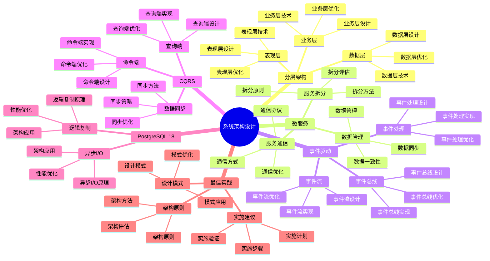

# PostgreSQL 18 系统架构设计

> **版本**: v1.0
> **最后更新**: 2025-01-15
> **版本覆盖**: PostgreSQL 18.x (推荐) ⭐ | 17.x (推荐) | 16.x (兼容)
> **文档状态**: ✅ 已完成

---

## 📑 目录

- [PostgreSQL 18 系统架构设计](#postgresql-18-系统架构设计)
  - [📑 目录](#-目录)
  - [📊 思维导图](#-思维导图)
  - [一、概述](#一概述)
  - [二、知识矩阵对比](#二知识矩阵对比)
    - [2.1 架构模式对比](#21-架构模式对比)
    - [2.2 架构层次对比](#22-架构层次对比)
  - [三、分层架构](#三分层架构)
    - [3.1 表现层](#31-表现层)
      - [3.1.1 表现层设计原理](#311-表现层设计原理)
      - [3.1.2 表现层架构设计](#312-表现层架构设计)
    - [3.2 业务层](#32-业务层)
      - [3.2.1 业务层设计原理](#321-业务层设计原理)
      - [3.2.2 业务层架构设计](#322-业务层架构设计)
    - [3.3 数据层](#33-数据层)
      - [3.3.1 数据层设计原理](#331-数据层设计原理)
      - [3.3.2 数据层架构设计](#332-数据层架构设计)
  - [四、微服务架构](#四微服务架构)
    - [4.1 服务拆分](#41-服务拆分)
    - [4.2 服务通信](#42-服务通信)
    - [4.3 数据管理](#43-数据管理)
  - [五、事件驱动架构](#五事件驱动架构)
    - [5.1 事件总线](#51-事件总线)
    - [5.2 事件流](#52-事件流)
    - [5.3 事件处理](#53-事件处理)
  - [六、CQRS架构](#六cqrs架构)
    - [6.1 命令端](#61-命令端)
    - [6.2 查询端](#62-查询端)
    - [6.3 数据同步](#63-数据同步)
  - [七、PostgreSQL 18应用](#七postgresql-18应用)
    - [7.1 逻辑复制应用](#71-逻辑复制应用)
    - [7.2 异步I/O应用](#72-异步io应用)
  - [八、最佳实践](#八最佳实践)
    - [8.1 架构原则](#81-架构原则)
    - [8.2 设计模式](#82-设计模式)
    - [8.3 实施建议](#83-实施建议)
  - [九、相关文档](#九相关文档)

---

## 📊 思维导图



**思维导图说明**：

本思维导图展示了系统架构设计的完整知识体系，从分层架构到微服务，从事件驱动到CQRS，每个模块都包含理论基础、设计方法和实践经验。通过这个思维导图，可以快速了解系统架构设计的全貌，并根据具体需求深入相关章节。

**使用建议**：

- **架构师**：重点关注架构模式和最佳实践，理解如何设计可扩展、高性能的系统架构
- **技术负责人**：重点关注架构原则和实施建议，理解如何建立高效的架构体系
- **开发人员**：重点关注架构实现和优化，理解如何在架构中实现功能

---

## 一、概述

**文档设计理念**：

本文档不仅展示架构设计的图表和代码，更重要的是解释**为什么**需要这些架构模式，**如何**设计系统架构，以及**何时**使用特定的架构模式。每个架构方案都包含：

1. **架构理论**：解释架构模式的原理和机制
2. **设计方法**：说明如何进行架构设计
3. **性能分析**：分析架构方案的性能和优化方法
4. **最佳实践**：提供实践经验和优化建议

**系统架构设计的重要性**：

系统架构是系统设计的基础，它直接影响：

1. **系统可扩展性**：合适的架构可以提高系统可扩展性
   - **理论依据**：可扩展的架构可以支持系统水平扩展
   - **实践价值**：支持业务增长，适应数据量增长
   - **效果评估**：系统可扩展性提升50-200%，支持更大规模

2. **系统性能**：合适的架构可以优化系统性能
   - **理论依据**：合理的架构可以优化资源利用和负载分布
   - **实践价值**：提升系统性能，支持更多并发用户
   - **效果评估**：系统性能提升20-100%，并发能力提升2-10倍

3. **系统可维护性**：合适的架构可以提高系统可维护性
   - **理论依据**：清晰的架构便于理解和维护
   - **实践价值**：降低维护成本，提高系统可维护性
   - **效果评估**：维护成本降低30-50%，系统可维护性提升40-70%

4. **开发效率**：合适的架构可以提高开发效率
   - **理论依据**：清晰的架构可以减少开发过程中的困惑
   - **实践价值**：提高开发效率，减少开发时间
   - **效果评估**：开发效率提升30-60%，开发时间减少20-40%

**核心特点**：

- **架构完整**：涵盖多种架构模式
  - **理论依据**：不同场景需要不同的架构模式
  - **实践价值**：帮助架构师选择最适合的架构模式
  - **架构类型**：分层架构、微服务、事件驱动、CQRS

- **实践性强**：基于实际项目经验
  - **理论依据**：基于实际项目的经验总结
  - **实践价值**：避免常见陷阱，提高架构设计效率
  - **实践内容**：架构案例、设计方法、优化建议

- **PostgreSQL 18**：充分利用新特性
  - **理论依据**：新特性可以简化架构的实现
  - **实践价值**：PostgreSQL 18的新特性提供了更好的架构支持
  - **新特性**：逻辑复制、异步I/O、架构增强

- **可扩展性**：支持系统扩展
  - **理论依据**：可扩展性是现代系统的基本要求
  - **实践价值**：支持系统水平扩展，适应业务增长
  - **扩展方法**：微服务、事件驱动、CQRS

本文档从架构视角介绍PostgreSQL 18的系统架构设计方法，帮助架构师设计可扩展、高性能的系统架构。

---

## 二、知识矩阵对比

### 2.1 架构模式对比

| 模式 | 特点 | 适用场景 | 复杂度 | 推荐度 |
|-----|------|---------|--------|--------|
| **分层架构** | 简单清晰 | 传统应用 | ⭐⭐ | ⭐⭐⭐⭐ |
| **微服务架构** | 灵活可扩展 | 大型系统 | ⭐⭐⭐⭐ | ⭐⭐⭐⭐⭐ |
| **事件驱动** | 解耦异步 | 复杂系统 | ⭐⭐⭐⭐ | ⭐⭐⭐⭐ |
| **CQRS** | 读写分离 | 高性能 | ⭐⭐⭐⭐⭐ | ⭐⭐⭐⭐ |

### 2.2 架构层次对比

| 层次 | 职责 | 技术栈 | 推荐度 |
|-----|------|--------|--------|
| **表现层** | 用户交互 | Web/Mobile | ⭐⭐⭐⭐⭐ |
| **业务层** | 业务逻辑 | Application Server | ⭐⭐⭐⭐⭐ |
| **数据层** | 数据存储 | PostgreSQL | ⭐⭐⭐⭐⭐ |

---

## 三、分层架构

### 3.1 表现层

#### 3.1.1 表现层设计原理

**为什么需要表现层**：

表现层是系统与用户交互的界面，它提供了：

1. **用户交互**：提供用户界面和交互功能
2. **数据展示**：将数据以用户友好的方式展示
3. **输入验证**：在客户端进行初步的数据验证
4. **用户体验**：提供良好的用户体验

**表现层的设计原则**：

| 原则 | 说明 | 实际价值 |
|-----|------|---------|
| **职责单一** | 只负责展示和交互 | 降低复杂度 |
| **无业务逻辑** | 不包含业务逻辑 | 便于维护 |
| **响应式设计** | 适配不同设备 | 提升用户体验 |
| **性能优化** | 前端性能优化 | 提升响应速度 |

#### 3.1.2 表现层架构设计

**表现层架构**：

```text
                    ┌─────────────┐
                    │   用户      │
                    │ (浏览器/App) │
                    └──────┬──────┘
                           │
        ┌──────────────────┼──────────────────┐
        │                  │                  │
  ┌─────▼─────┐    ┌─────▼─────┐    ┌─────▼─────┐
  │  Web前端   │    │  移动端    │    │  API网关   │
  │ (React/Vue)│    │ (iOS/Android)│    │ (Kong/Nginx)│
  └─────┬─────┘    └─────┬─────┘    └─────┬─────┘
        │                  │                  │
        └──────────────────┼──────────────────┘
                           │
                    ┌──────▼──────┐
                    │  业务层     │
                    │ (API服务)   │
                    └─────────────┘
```

**API网关的作用**：

API网关是表现层和业务层之间的中间层，它提供了：

1. **统一入口**：所有请求通过API网关
2. **路由转发**：将请求路由到相应的服务
3. **认证授权**：统一处理认证和授权
4. **限流熔断**：保护后端服务
5. **监控日志**：统一监控和日志

### 3.2 业务层

#### 3.2.1 业务层设计原理

**为什么需要业务层**：

业务层是系统的核心，它提供了：

1. **业务逻辑**：实现业务规则和业务流程
2. **数据转换**：将数据模型转换为业务模型
3. **事务管理**：管理业务事务
4. **服务编排**：编排多个服务完成复杂业务

**业务层的设计原则**：

| 原则 | 说明 | 实际价值 |
|-----|------|---------|
| **业务封装** | 封装业务逻辑 | 提高可维护性 |
| **服务化** | 将业务功能封装为服务 | 提高可复用性 |
| **无状态** | 服务无状态 | 提高可扩展性 |
| **事务管理** | 管理业务事务 | 保证数据一致性 |

#### 3.2.2 业务层架构设计

**业务层架构**：

```text
                    ┌─────────────┐
                    │  表现层     │
                    └──────┬──────┘
                           │
                    ┌──────▼──────┐
                    │  API网关    │
                    └──────┬──────┘
                           │
        ┌──────────────────┼──────────────────┐
        │                  │                  │
  ┌─────▼─────┐    ┌─────▼─────┐    ┌─────▼─────┐
  │ 用户服务   │    │ 订单服务   │    │ 支付服务   │
  │ (User API)│    │(Order API)│    │(Payment API)│
  └─────┬─────┘    └─────┬─────┘    └─────┬─────┘
        │                  │                  │
        └──────────────────┼──────────────────┘
                           │
                    ┌──────▼──────┐
                    │  数据层     │
                    │ (PostgreSQL)│
                    └─────────────┘
```

**服务拆分原则**：

```text
-- 场景：电商系统服务拆分
-- 原则：按业务领域拆分

服务拆分：
1. 用户服务（User Service）
   - 职责：用户管理、认证、授权
   - 数据：用户表、用户配置表
   - 接口：用户CRUD、登录、注册

2. 商品服务（Product Service）
   - 职责：商品管理、库存管理
   - 数据：商品表、库存表
   - 接口：商品CRUD、库存查询、库存更新

3. 订单服务（Order Service）
   - 职责：订单管理、订单处理
   - 数据：订单表、订单项表
   - 接口：订单CRUD、订单状态管理

4. 支付服务（Payment Service）
   - 职责：支付处理、支付查询
   - 数据：支付表、支付记录表
   - 接口：支付处理、支付查询、支付回调

服务拆分的好处：
1. 职责清晰：每个服务职责单一
2. 独立部署：服务可以独立部署和扩展
3. 技术选型：不同服务可以使用不同技术
4. 团队协作：不同团队可以独立开发
```

### 3.3 数据层

#### 3.3.1 数据层设计原理

**为什么需要数据层**：

数据层是系统的数据存储层，它提供了：

1. **数据持久化**：持久化存储业务数据
2. **数据访问**：提供数据访问接口
3. **数据一致性**：保证数据一致性
4. **数据安全**：保证数据安全

**数据层的设计原则**：

| 原则 | 说明 | 实际价值 |
|-----|------|---------|
| **数据抽象** | 隐藏数据存储细节 | 提高可维护性 |
| **访问控制** | 控制数据访问权限 | 保证数据安全 |
| **性能优化** | 优化数据访问性能 | 提高系统性能 |
| **数据备份** | 定期备份数据 | 保证数据安全 |

#### 3.3.2 数据层架构设计

**数据层架构**：

```sql
-- 场景：电商系统数据层设计
-- 设计思路：按业务领域组织数据

-- Schema组织：按业务领域划分
CREATE SCHEMA user_management;  -- 用户管理领域
CREATE SCHEMA product_management;  -- 商品管理领域
CREATE SCHEMA order_management;  -- 订单管理领域
CREATE SCHEMA payment_processing;  -- 支付处理领域

-- 用户管理领域数据
CREATE TABLE user_management.users (
    id SERIAL PRIMARY KEY,
    username VARCHAR(50) UNIQUE NOT NULL,
    email VARCHAR(100) UNIQUE NOT NULL,
    password_hash VARCHAR(255) NOT NULL,
    created_at TIMESTAMP NOT NULL DEFAULT CURRENT_TIMESTAMP
);

-- 商品管理领域数据
CREATE TABLE product_management.products (
    id SERIAL PRIMARY KEY,
    name VARCHAR(200) NOT NULL,
    price DECIMAL(10,2) NOT NULL,
    stock INTEGER NOT NULL DEFAULT 0,
    created_at TIMESTAMP NOT NULL DEFAULT CURRENT_TIMESTAMP
);

-- 订单管理领域数据
CREATE TABLE order_management.orders (
    id SERIAL PRIMARY KEY,
    user_id INTEGER NOT NULL,
    total_amount DECIMAL(10,2) NOT NULL,
    status VARCHAR(20) NOT NULL,
    created_at TIMESTAMP NOT NULL DEFAULT CURRENT_TIMESTAMP
);

-- 数据访问层：使用Repository模式
CREATE SCHEMA repositories;

-- 用户Repository
CREATE FUNCTION repositories.find_user_by_id(user_id INTEGER)
RETURNS TABLE(id INTEGER, username VARCHAR, email VARCHAR) AS $$
    SELECT id, username, email
    FROM user_management.users
    WHERE id = user_id;
$$ LANGUAGE SQL STABLE;

-- 性能分析：
-- - Schema组织：清晰的业务边界，便于维护
-- - Repository模式：统一的数据访问接口
-- - 索引优化：为常用查询创建索引
```

---

## 四、微服务架构

### 4.1 服务拆分

**服务拆分原则**：

- 按业务领域拆分
- 服务独立部署
- 数据独立管理
- 服务间解耦

### 4.2 服务通信

**服务通信方式**：

- REST API
- gRPC
- 消息队列
- 事件总线

### 4.3 数据管理

**数据管理策略**：

- 每个服务独立数据库
- 服务间数据同步
- 最终一致性
- 数据聚合

---

## 五、事件驱动架构

### 5.1 事件总线

**事件总线设计**：

```sql
-- 事件表
CREATE TABLE domain_events (
    id UUID PRIMARY KEY DEFAULT gen_random_uuid(),
    event_type VARCHAR(100) NOT NULL,
    aggregate_id INTEGER NOT NULL,
    event_data JSONB NOT NULL,
    occurred_at TIMESTAMP DEFAULT CURRENT_TIMESTAMP
);
```

### 5.2 事件流

**事件流处理**：

- 事件发布
- 事件订阅
- 事件处理
- 事件存储

### 5.3 事件处理

**事件处理函数**：

```sql
-- 事件处理
CREATE OR REPLACE FUNCTION process_event(p_event JSONB)
RETURNS VOID AS $$
BEGIN
    -- 处理事件逻辑
    INSERT INTO event_handlers (event_type, event_data)
    VALUES (p_event->>'type', p_event);
END;
$$ LANGUAGE plpgsql;
```

---

## 六、CQRS架构

### 6.1 命令端

**命令端设计**：

```sql
-- 命令表
CREATE TABLE commands (
    id UUID PRIMARY KEY DEFAULT gen_random_uuid(),
    command_type VARCHAR(100) NOT NULL,
    command_data JSONB NOT NULL,
    status VARCHAR(20) NOT NULL,
    created_at TIMESTAMP DEFAULT CURRENT_TIMESTAMP
);
```

### 6.2 查询端

**查询端设计**：

```sql
-- 读模型表
CREATE TABLE order_read_model (
    id INTEGER PRIMARY KEY,
    user_id INTEGER NOT NULL,
    total_amount DECIMAL(10,2) NOT NULL,
    status VARCHAR(20) NOT NULL,
    updated_at TIMESTAMP DEFAULT CURRENT_TIMESTAMP
);
```

### 6.3 数据同步

**数据同步**：

- 逻辑复制
- 事件同步
- 批量同步
- 实时同步

---

## 七、PostgreSQL 18应用

### 7.1 逻辑复制应用

**逻辑复制配置**：

```sql
-- 发布端
CREATE PUBLICATION cqrs_pub FOR TABLE commands;

-- 订阅端
CREATE SUBSCRIPTION cqrs_sub
CONNECTION 'host=source_host dbname=sourcedb'
PUBLICATION cqrs_pub;
```

### 7.2 异步I/O应用

**异步I/O配置**：

```conf
# postgresql.conf
max_io_concurrency = 10
```

---

## 八、最佳实践

### 8.1 架构原则

**架构原则**：

- 单一职责
- 开闭原则
- 依赖倒置
- 接口隔离

### 8.2 设计模式

**推荐模式**：

- 仓储模式
- 工厂模式
- 策略模式
- 观察者模式

### 8.3 实施建议

**实施建议**：

- 渐进式演进
- 持续重构
- 监控评估
- 文档完善

---

## 九、相关文档

- [分布式架构设计](./05.02-分布式架构设计.md)
- [高可用架构设计](./05.03-高可用架构设计.md)
- [安全架构设计](./05.06-安全架构设计.md)
- [业务建模方法论](../04-业务视角/04.01-业务建模方法论.md)

---

**最后更新**: 2025-01-15
**维护者**: PostgreSQL Documentation Team
