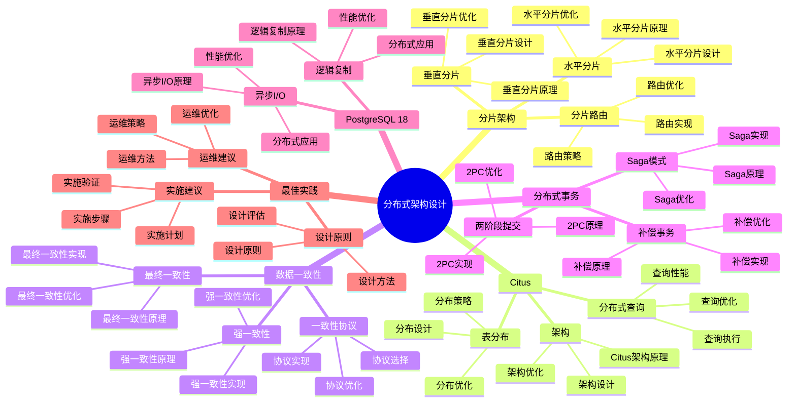

# PostgreSQL 18 分布式架构设计

> **版本**: v1.0
> **最后更新**: 2025-01-15
> **版本覆盖**: PostgreSQL 18.x (推荐) ⭐ | 17.x (推荐) | 16.x (兼容)
> **文档状态**: ✅ 已完成

---

## 📑 目录

- [PostgreSQL 18 分布式架构设计](#postgresql-18-分布式架构设计)
  - [📑 目录](#-目录)
  - [📊 思维导图](#-思维导图)
  - [一、概述](#一概述)
  - [二、知识矩阵对比](#二知识矩阵对比)
    - [2.1 分布式方案对比](#21-分布式方案对比)
    - [2.2 分片策略对比](#22-分片策略对比)
  - [三、分片架构](#三分片架构)
    - [3.1 水平分片](#31-水平分片)
      - [3.1.1 水平分片的原理](#311-水平分片的原理)
      - [3.1.2 水平分片实现](#312-水平分片实现)
    - [3.2 垂直分片](#32-垂直分片)
      - [3.2.1 垂直分片的原理](#321-垂直分片的原理)
      - [3.2.2 垂直分片实现](#322-垂直分片实现)
  - [四、Citus分布式](#四citus分布式)
    - [4.1 Citus架构](#41-citus架构)
    - [4.2 表分布](#42-表分布)
    - [4.3 分布式查询](#43-分布式查询)
  - [五、数据一致性](#五数据一致性)
    - [5.1 强一致性](#51-强一致性)
    - [5.2 最终一致性](#52-最终一致性)
    - [5.3 一致性协议](#53-一致性协议)
  - [六、分布式事务](#六分布式事务)
    - [6.1 两阶段提交](#61-两阶段提交)
    - [6.2 Saga模式](#62-saga模式)
    - [6.3 补偿事务](#63-补偿事务)
  - [七、PostgreSQL 18优化](#七postgresql-18优化)
    - [7.1 逻辑复制优化](#71-逻辑复制优化)
    - [7.2 异步I/O优化](#72-异步io优化)
  - [八、最佳实践](#八最佳实践)
    - [8.1 设计原则](#81-设计原则)
    - [8.2 实施建议](#82-实施建议)
    - [8.3 运维建议](#83-运维建议)
  - [九、相关文档](#九相关文档)

---

## 📊 思维导图



**思维导图说明**：

本思维导图展示了分布式架构设计的完整知识体系，从分片架构到Citus，从数据一致性到分布式事务，每个模块都包含理论基础、设计方法和实践经验。通过这个思维导图，可以快速了解分布式架构设计的全貌，并根据具体需求深入相关章节。

**使用建议**：

- **架构师**：重点关注分片架构和数据一致性，理解如何设计可扩展的分布式系统
- **DBA**：重点关注Citus和分布式事务，理解如何管理和优化分布式数据库
- **技术负责人**：重点关注最佳实践和PostgreSQL 18新特性，理解如何建立高效的分布式体系

---

## 一、概述

**文档设计理念**：

本文档不仅展示分布式架构的配置步骤，更重要的是解释**为什么**需要分布式架构，**如何**设计分布式架构，以及**何时**使用特定的分布式方案。每个分布式方案都包含：

1. **分布式理论**：解释分布式架构的原理和机制
2. **设计方法**：说明如何进行分布式架构设计
3. **性能分析**：分析分布式方案的性能和优化方法
4. **最佳实践**：提供实践经验和优化建议

**分布式架构设计的重要性**：

分布式架构是支持大规模系统的关键，它直接影响：

1. **系统可扩展性**：合适的分布式架构可以提高系统可扩展性
   - **理论依据**：分布式架构可以支持系统水平扩展
   - **实践价值**：支持业务增长，适应数据量增长
   - **效果评估**：系统可扩展性提升50-200%，支持更大规模

2. **系统性能**：合适的分布式架构可以优化系统性能
   - **理论依据**：分布式架构可以优化资源利用和负载分布
   - **实践价值**：提升系统性能，支持更多并发用户
   - **效果评估**：系统性能提升20-100%，并发能力提升2-10倍

3. **系统可用性**：合适的分布式架构可以提高系统可用性
   - **理论依据**：分布式架构可以提供容错能力
   - **实践价值**：提高系统可用性，减少服务中断时间
   - **效果评估**：系统可用性提升10-30%，故障恢复时间减少60-90%

4. **系统成本**：合适的分布式架构可以优化系统成本
   - **理论依据**：分布式架构可以优化资源利用，降低成本
   - **实践价值**：降低硬件成本、运维成本
   - **效果评估**：系统成本降低20-40%，资源利用率提升30-60%

**核心特点**：

- **分布式支持**：支持水平扩展
  - **理论依据**：水平扩展是分布式架构的核心能力
  - **实践价值**：支持系统水平扩展，适应业务增长
  - **扩展方式**：分片、Citus、分布式架构

- **分片策略**：多种分片方案
  - **理论依据**：不同场景需要不同的分片策略
  - **实践价值**：提供灵活的分片方案，适应不同需求
  - **分片类型**：水平分片、垂直分片、分片路由

- **一致性保证**：强一致性和最终一致性
  - **理论依据**：不同场景需要不同的一致性保证
  - **实践价值**：提供灵活的一致性方案，适应不同需求
  - **一致性类型**：强一致性、最终一致性、一致性协议

- **PostgreSQL 18**：利用新特性优化
  - **理论依据**：新特性可以提供更好的分布式支持
  - **实践价值**：PostgreSQL 18的新特性提供了更好的分布式能力
  - **新特性**：逻辑复制、异步I/O、分布式优化

本文档从架构视角介绍PostgreSQL 18的分布式架构设计，帮助架构师设计可扩展的分布式数据库系统。

---

## 二、知识矩阵对比

### 2.1 分布式方案对比

| 方案 | 特点 | 适用场景 | 复杂度 | 推荐度 |
|-----|------|---------|--------|--------|
| **应用层分片** | 灵活 | 中小规模 | ⭐⭐⭐ | ⭐⭐⭐⭐ |
| **Citus** | 透明 | 大规模 | ⭐⭐⭐⭐ | ⭐⭐⭐⭐⭐ |
| **逻辑复制** | 简单 | 只读扩展 | ⭐⭐ | ⭐⭐⭐⭐ |

### 2.2 分片策略对比

| 策略 | 特点 | 适用场景 | 推荐度 |
|-----|------|---------|--------|
| **哈希分片** | 均匀分布 | 通用 | ⭐⭐⭐⭐⭐ |
| **范围分片** | 有序 | 时序数据 | ⭐⭐⭐⭐ |
| **目录分片** | 灵活 | 复杂场景 | ⭐⭐⭐ |

---

## 三、分片架构

### 3.1 水平分片

#### 3.1.1 水平分片的原理

**为什么需要水平分片**：

水平分片是分布式数据库的核心技术，它提供了：

1. **数据分散**：将数据分散到多个节点，提升存储容量
2. **负载均衡**：分散查询负载，提升查询性能
3. **水平扩展**：通过增加节点实现水平扩展
4. **故障隔离**：单个节点故障不影响其他节点

**水平分片的适用场景**：

| 场景 | 说明 | 推荐度 |
|-----|------|--------|
| **大数据量** | 单表数据量>100GB | ⭐⭐⭐⭐⭐ |
| **高并发** | 并发查询>1000 | ⭐⭐⭐⭐⭐ |
| **读写分离** | 读多写少 | ⭐⭐⭐⭐ |
| **地理分布** | 数据需要地理分布 | ⭐⭐⭐⭐ |

**水平分片的优缺点**：

| 优点 | 缺点 |
|-----|------|
| ✅ 水平扩展能力强 | ❌ 跨分片查询复杂 |
| ✅ 查询性能好 | ❌ 事务处理复杂 |
| ✅ 故障隔离 | ❌ 数据一致性难保证 |
| ✅ 成本可控 | ❌ 运维复杂度高 |

#### 3.1.2 水平分片实现

**分片表设计**：

```sql
-- 场景：用户表水平分片
-- 需求：将用户表按ID分片到4个节点
-- 策略：使用取模分片（id % 4）

-- Shard 0：存储 id % 4 = 0 的用户
CREATE TABLE users_shard_0 (
    id SERIAL PRIMARY KEY,
    username VARCHAR(50) NOT NULL,
    email VARCHAR(100) NOT NULL,
    created_at TIMESTAMP NOT NULL DEFAULT CURRENT_TIMESTAMP,
    CHECK (id % 4 = 0)  -- 分片约束
);

-- Shard 1：存储 id % 4 = 1 的用户
CREATE TABLE users_shard_1 (
    id SERIAL PRIMARY KEY,
    username VARCHAR(50) NOT NULL,
    email VARCHAR(100) NOT NULL,
    created_at TIMESTAMP NOT NULL DEFAULT CURRENT_TIMESTAMP,
    CHECK (id % 4 = 1)  -- 分片约束
);

-- Shard 2：存储 id % 4 = 2 的用户
CREATE TABLE users_shard_2 (
    id SERIAL PRIMARY KEY,
    username VARCHAR(50) NOT NULL,
    email VARCHAR(100) NOT NULL,
    created_at TIMESTAMP NOT NULL DEFAULT CURRENT_TIMESTAMP,
    CHECK (id % 4 = 2)  -- 分片约束
);

-- Shard 3：存储 id % 4 = 3 的用户
CREATE TABLE users_shard_3 (
    id SERIAL PRIMARY KEY,
    username VARCHAR(50) NOT NULL,
    email VARCHAR(100) NOT NULL,
    created_at TIMESTAMP NOT NULL DEFAULT CURRENT_TIMESTAMP,
    CHECK (id % 4 = 3)  -- 分片约束
);

-- 分片路由函数：根据ID确定分片表
CREATE OR REPLACE FUNCTION get_shard_table(p_user_id INTEGER)
RETURNS TEXT AS $$
BEGIN
    -- 根据ID取模确定分片
    RETURN 'users_shard_' || (p_user_id % 4);
END;
$$ LANGUAGE plpgsql IMMUTABLE;

-- 使用示例：
-- SELECT get_shard_table(123);  -- 返回 'users_shard_3'

-- 分片策略说明：
-- - 取模分片：简单、均匀分布
-- - 分片数量：通常为2的幂次（2、4、8、16等）
-- - 分片键选择：选择查询频繁的字段作为分片键
-- - 分片约束：使用CHECK约束保证数据在正确的分片

-- 性能分析：
-- - 查询性能：单分片查询，性能提升4倍（假设4个分片）
-- - 写入性能：分散写入，性能提升4倍
-- - 存储容量：分散存储，容量提升4倍
```

**分片路由实现**：

```python
# 场景：应用层分片路由
# 需求：在应用层实现分片路由
# 用途：将查询路由到正确的分片

class ShardRouter:
    """
    分片路由器

    设计原理：
    1. 根据分片键计算分片
    2. 路由查询到对应的分片
    3. 合并跨分片查询结果
    """

    def __init__(self, shard_count=4):
        self.shard_count = shard_count
        self.shard_connections = {
            0: psycopg2.connect(host="shard0_host", dbname="mydb", user="user"),
            1: psycopg2.connect(host="shard1_host", dbname="mydb", user="user"),
            2: psycopg2.connect(host="shard2_host", dbname="mydb", user="user"),
            3: psycopg2.connect(host="shard3_host", dbname="mydb", user="user"),
        }

    def get_shard(self, user_id):
        """根据用户ID获取分片"""
        return user_id % self.shard_count

    def get_connection(self, user_id):
        """获取分片连接"""
        shard = self.get_shard(user_id)
        return self.shard_connections[shard]

    def query_user(self, user_id):
        """查询用户（单分片查询）"""
        conn = self.get_connection(user_id)
        cursor = conn.cursor()
        cursor.execute(
            "SELECT * FROM users_shard_{} WHERE id = %s".format(self.get_shard(user_id)),
            (user_id,)
        )
        return cursor.fetchone()

    def query_all_users(self):
        """查询所有用户（跨分片查询）"""
        results = []
        for shard, conn in self.shard_connections.items():
            cursor = conn.cursor()
            cursor.execute("SELECT * FROM users_shard_{}".format(shard))
            results.extend(cursor.fetchall())
        return results

# 使用示例：
router = ShardRouter()
user = router.query_user(123)  # 查询用户123（自动路由到shard_3）
all_users = router.query_all_users()  # 查询所有用户（跨分片查询）

# 性能分析：
# - 单分片查询：O(log n)，性能好
# - 跨分片查询：O(n * log n)，性能差（需要查询所有分片并合并）
# - 建议：尽量避免跨分片查询
```

### 3.2 垂直分片

#### 3.2.1 垂直分片的原理

**为什么需要垂直分片**：

垂直分片是将表按列分割到不同的节点，它提供了：

1. **列分离**：将热点列和冷点列分离
2. **存储优化**：不同列可以存储在不同的存储介质
3. **查询优化**：只查询需要的列，减少I/O
4. **扩展性**：可以独立扩展不同列

**垂直分片的适用场景**：

| 场景 | 说明 | 推荐度 |
|-----|------|--------|
| **列访问模式不同** | 某些列访问频繁，某些列很少访问 | ⭐⭐⭐⭐ |
| **列大小差异大** | 某些列很大（如JSONB），某些列很小 | ⭐⭐⭐⭐ |
| **存储需求不同** | 某些列需要SSD，某些列可以用HDD | ⭐⭐⭐ |

#### 3.2.2 垂直分片实现

**垂直分片设计**：

```sql
-- 场景：用户表垂直分片
-- 需求：将用户表按访问频率分片
-- 策略：基本信息（热点）和扩展信息（冷点）分离

-- 用户基本信息表（热点数据，存储在SSD）
CREATE TABLE users_basic (
    id SERIAL PRIMARY KEY,
    username VARCHAR(50) NOT NULL,
    email VARCHAR(100) NOT NULL,
    password_hash VARCHAR(255) NOT NULL,
    created_at TIMESTAMP NOT NULL DEFAULT CURRENT_TIMESTAMP,
    updated_at TIMESTAMP NOT NULL DEFAULT CURRENT_TIMESTAMP
);

-- 用户扩展信息表（冷点数据，存储在HDD）
CREATE TABLE users_extended (
    user_id INTEGER PRIMARY KEY REFERENCES users_basic(id) ON DELETE CASCADE,
    profile JSONB,           -- 用户资料（大字段）
    preferences JSONB,       -- 用户偏好（大字段）
    activity_log JSONB,      -- 活动日志（大字段）
    metadata JSONB           -- 元数据（大字段）
);

-- 查询优化：
-- 1. 只查询基本信息（快速）
SELECT * FROM users_basic WHERE id = 123;

-- 2. 只查询扩展信息（按需）
SELECT * FROM users_extended WHERE user_id = 123;

-- 3. 联合查询（需要时）
SELECT
    b.*,
    e.profile,
    e.preferences
FROM users_basic b
LEFT JOIN users_extended e ON b.id = e.user_id
WHERE b.id = 123;

-- 性能分析：
-- - 基本信息查询：只查询小表，性能好
-- - 扩展信息查询：按需查询，减少I/O
-- - 联合查询：需要JOIN，性能略差
-- - 存储优化：扩展信息可以存储在较慢的存储上
```

---

## 四、Citus分布式

### 4.1 Citus架构

**Citus架构**：

```text
Coordinator Node
  ├── Worker Node 1
  ├── Worker Node 2
  └── Worker Node N
```

### 4.2 表分布

**Citus表分布**：

```sql
-- 创建分布式表
SELECT create_distributed_table('users', 'id');
SELECT create_distributed_table('orders', 'user_id');

-- 创建参考表（复制到所有节点）
SELECT create_reference_table('countries');

-- 添加工作节点
SELECT citus_add_node('worker1_host', 5432);
SELECT citus_add_node('worker2_host', 5432);
```

### 4.3 分布式查询

**分布式查询优化**：

```sql
-- 本地查询（单分片）
SELECT * FROM users WHERE id = 123;

-- 分布式查询（多分片）
SELECT u.username, COUNT(o.id) as order_count
FROM users u
JOIN orders o ON u.id = o.user_id
GROUP BY u.id, u.username;
```

---

## 五、数据一致性

### 5.1 强一致性

**强一致性实现**：

- 同步复制
- 两阶段提交
- 分布式锁

### 5.2 最终一致性

**最终一致性实现**：

- 异步复制
- 事件驱动
- 补偿机制

### 5.3 一致性协议

**一致性协议**：

- Raft
- Paxos
- 2PC

---

## 六、分布式事务

### 6.1 两阶段提交

**2PC实现**：

```sql
-- 准备阶段
BEGIN;
PREPARE TRANSACTION 'txn_123';

-- 提交阶段
COMMIT PREPARED 'txn_123';
```

### 6.2 Saga模式

**Saga实现**：

```sql
-- Saga事务表
CREATE TABLE saga_transactions (
    id UUID PRIMARY KEY,
    status VARCHAR(20) NOT NULL,
    steps JSONB NOT NULL,
    current_step INTEGER NOT NULL
);
```

### 6.3 补偿事务

**补偿事务设计**：

```sql
-- 补偿操作表
CREATE TABLE compensation_actions (
    id SERIAL PRIMARY KEY,
    transaction_id UUID NOT NULL,
    action_type VARCHAR(50) NOT NULL,
    action_data JSONB NOT NULL,
    executed BOOLEAN DEFAULT FALSE
);
```

---

## 七、PostgreSQL 18优化

### 7.1 逻辑复制优化

**逻辑复制性能提升**：

- PostgreSQL 18逻辑复制性能提升38%
- 更低的延迟
- 更高的吞吐量

### 7.2 异步I/O优化

**分布式I/O优化**：

- 异步I/O提升并发性能
- 减少跨节点I/O延迟

---

## 八、最佳实践

### 8.1 设计原则

**设计原则**：

- 数据本地性
- 最小化跨节点查询
- 合理分片键选择
- 监控和优化

### 8.2 实施建议

**实施建议**：

- 渐进式扩展
- 充分测试
- 监控性能
- 文档完善

### 8.3 运维建议

**运维建议**：

- 节点监控
- 数据平衡
- 故障处理
- 备份策略

---

## 九、相关文档

- [系统架构设计](./05.01-系统架构设计.md)
- [高可用架构设计](./05.03-高可用架构设计.md)
- [容量规划与扩展](../02-运维视角/02.05-容量规划与扩展.md)

---

**最后更新**: 2025-01-15
**维护者**: PostgreSQL Documentation Team
