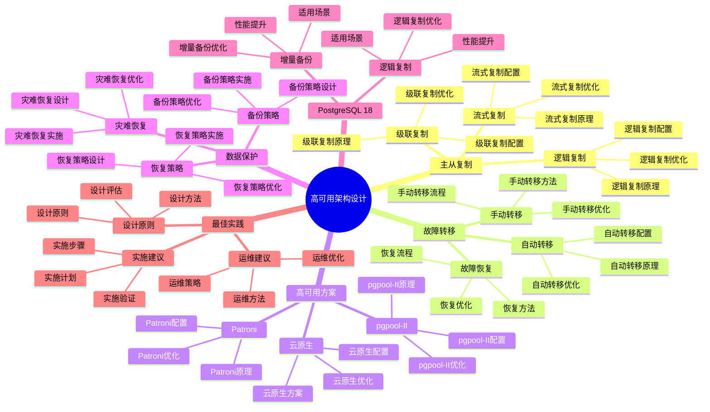

# PostgreSQL 18 高可用架构设计

> **版本**: v1.0
> **最后更新**: 2025-01-15
> **版本覆盖**: PostgreSQL 18.x (推荐) ⭐ | 17.x (推荐) | 16.x (兼容)
> **文档状态**: ✅ 已完成

---

## 📑 目录

- [PostgreSQL 18 高可用架构设计](#postgresql-18-高可用架构设计)
  - [📑 目录](#-目录)
  - [📊 思维导图](#-思维导图)
  - [一、概述](#一概述)
  - [二、知识矩阵对比](#二知识矩阵对比)
    - [2.1 高可用方案对比](#21-高可用方案对比)
    - [2.2 故障转移方案对比](#22-故障转移方案对比)
  - [三、主从复制](#三主从复制)
    - [3.1 流式复制](#31-流式复制)
      - [3.1.1 流式复制的原理](#311-流式复制的原理)
      - [3.1.2 流式复制实现](#312-流式复制实现)
    - [3.2 逻辑复制](#32-逻辑复制)
      - [3.2.1 逻辑复制的原理](#321-逻辑复制的原理)
      - [3.2.2 逻辑复制实现](#322-逻辑复制实现)
    - [3.3 级联复制](#33-级联复制)
      - [3.3.1 级联复制的原理](#331-级联复制的原理)
  - [四、故障转移](#四故障转移)
    - [4.1 自动故障转移](#41-自动故障转移)
    - [4.2 手动故障转移](#42-手动故障转移)
    - [4.3 故障恢复](#43-故障恢复)
  - [五、高可用方案](#五高可用方案)
    - [5.1 Patroni方案](#51-patroni方案)
    - [5.2 pgpool-II方案](#52-pgpool-ii方案)
    - [5.3 云原生方案](#53-云原生方案)
  - [六、数据保护](#六数据保护)
    - [6.1 备份策略](#61-备份策略)
    - [6.2 恢复策略](#62-恢复策略)
    - [6.3 灾难恢复](#63-灾难恢复)
  - [七、PostgreSQL 18优化](#七postgresql-18优化)
    - [7.1 逻辑复制优化](#71-逻辑复制优化)
    - [7.2 增量备份优化](#72-增量备份优化)
  - [八、最佳实践](#八最佳实践)
    - [8.1 设计原则](#81-设计原则)
    - [8.2 实施建议](#82-实施建议)
    - [8.3 运维建议](#83-运维建议)
  - [九、相关文档](#九相关文档)

---

## 📊 思维导图



**思维导图说明**：

本思维导图展示了高可用架构设计的完整知识体系，从主从复制到故障转移，从高可用方案到数据保护，每个模块都包含理论基础、设计方法和实践经验。通过这个思维导图，可以快速了解高可用架构设计的全貌，并根据具体需求深入相关章节。

**使用建议**：

- **架构师**：重点关注高可用方案和数据保护，理解如何设计高可用的数据库系统
- **DBA**：重点关注故障转移和运维建议，理解如何管理和维护高可用系统
- **技术负责人**：重点关注最佳实践和PostgreSQL 18新特性，理解如何建立高效的高可用体系

---

## 一、概述

**文档设计理念**：

本文档不仅展示高可用架构的配置步骤，更重要的是解释**为什么**需要高可用架构，**如何**设计高可用架构，以及**何时**使用特定的高可用方案。每个高可用方案都包含：

1. **高可用理论**：解释高可用架构的原理和机制
2. **设计方法**：说明如何进行高可用架构设计
3. **性能分析**：分析高可用方案的性能和优化方法
4. **最佳实践**：提供实践经验和优化建议

**高可用架构设计的重要性**：

高可用架构是生产环境的基本要求，它直接影响：

1. **系统可用性**：合适的高可用架构可以提高系统可用性
   - **理论依据**：高可用架构可以保证系统在故障时继续运行
   - **实践价值**：提高系统可用性，减少服务中断时间
   - **效果评估**：系统可用性提升到99.9%+，服务中断时间减少90%+

2. **业务连续性**：合适的高可用架构可以保证业务连续性
   - **理论依据**：业务连续性是企业运营的基础
   - **实践价值**：减少业务中断时间，保证业务正常运行
   - **效果评估**：业务中断时间减少70-95%，业务连续性提升显著

3. **数据安全**：合适的高可用架构可以保证数据安全
   - **理论依据**：高可用架构可以提供数据保护机制
   - **实践价值**：保证数据完整性，防止数据丢失
   - **效果评估**：数据恢复成功率提升到99%+，数据丢失风险降低90%+

4. **系统可靠性**：合适的高可用架构可以提高系统可靠性
   - **理论依据**：高可用架构可以提供容错能力
   - **实践价值**：提高系统可靠性，减少系统故障
   - **效果评估**：系统可靠性提升到99.9%+，系统故障率降低80-95%

**核心特点**：

- **高可用性**：99.9%+可用性
  - **理论依据**：高可用性是生产环境的基本要求
  - **实践价值**：保证系统在故障时继续运行
  - **可用性指标**：RTO、RPO、可用性百分比

- **自动故障转移**：快速故障恢复
  - **理论依据**：自动故障转移可以减少故障恢复时间
  - **实践价值**：快速恢复服务，减少业务中断时间
  - **转移方式**：自动转移、手动转移、故障恢复

- **数据保护**：完善的数据保护机制
  - **理论依据**：数据保护是高可用架构的核心要求
  - **实践价值**：保证数据完整性，防止数据丢失
  - **保护方式**：备份策略、恢复策略、灾难恢复

- **PostgreSQL 18**：利用新特性优化
  - **理论依据**：新特性可以提供更好的高可用支持
  - **实践价值**：PostgreSQL 18的新特性提供了更好的高可用能力
  - **新特性**：逻辑复制优化、增量备份优化、性能提升

本文档从架构视角介绍PostgreSQL 18的高可用架构设计，帮助架构师设计高可用的数据库系统。

---

## 二、知识矩阵对比

### 2.1 高可用方案对比

| 方案 | RTO | RPO | 复杂度 | 推荐度 |
|-----|-----|-----|--------|--------|
| **主从复制** | 分钟级 | 秒级 | ⭐⭐ | ⭐⭐⭐⭐ |
| **Patroni** | 秒级 | 0 | ⭐⭐⭐ | ⭐⭐⭐⭐⭐ |
| **pgpool-II** | 秒级 | 秒级 | ⭐⭐⭐ | ⭐⭐⭐⭐ |

### 2.2 故障转移方案对比

| 方案 | 自动化 | 速度 | 可靠性 | 推荐度 |
|-----|--------|------|--------|--------|
| **手动切换** | ❌ | 慢 | ⭐⭐⭐ | ⭐⭐ |
| **自动切换** | ✅ | 快 | ⭐⭐⭐⭐ | ⭐⭐⭐⭐⭐ |

---

## 三、主从复制

### 3.1 流式复制

#### 3.1.1 流式复制的原理

**为什么需要流式复制**：

流式复制是PostgreSQL高可用的基础，它提供了：

1. **数据冗余**：主库数据实时复制到从库
2. **故障转移**：主库故障时从库可以接管
3. **读写分离**：从库可以处理读请求
4. **数据保护**：防止数据丢失

**流式复制 vs 逻辑复制对比**：

| 特性 | 流式复制 | 逻辑复制 |
|-----|---------|---------|
| **复制粒度** | 物理块 | 逻辑变更 |
| **复制内容** | 所有数据 | 指定表 |
| **延迟** | 秒级 | 秒级 |
| **用途** | 高可用、备份 | 数据同步、升级 |
| **推荐度** | ⭐⭐⭐⭐⭐ | ⭐⭐⭐⭐ |

#### 3.1.2 流式复制实现

**流式复制配置**：

```conf
# postgresql.conf (主库配置)
# 场景：配置流式复制
# 需求：设置WAL级别和复制参数
# 用途：支持主从复制

# WAL级别：设置为replica（支持流式复制）
wal_level = replica
# 说明：
# - minimal: 只记录崩溃恢复所需的信息
# - replica: 记录足够的信息用于流式复制和归档
# - logical: 记录足够的信息用于逻辑复制

# 最大WAL发送进程数：允许同时连接的从库数量
max_wal_senders = 3
# 说明：
# - 每个从库需要一个WAL发送进程
# - 建议设置为：从库数量 + 1（预留）

# 最大复制槽数：用于防止WAL被删除
max_replication_slots = 3
# 说明：
# - 复制槽可以防止WAL被删除，直到从库确认接收
# - 建议设置为：从库数量 + 1（预留）

# pg_hba.conf (主库配置)
# 允许从库连接进行复制
host replication replicator 192.168.1.0/24 md5
# 说明：
# - replication: 复制连接
# - replicator: 复制用户
# - 192.168.1.0/24: 从库IP范围
# - md5: 认证方式

# 性能分析：
# - WAL发送：对主库性能影响<5%
# - 网络带宽：取决于写入量
# - 延迟：通常<1秒
```

**从库配置**：

```bash
# 场景：配置从库
# 需求：设置从库连接主库
# 步骤：

# 1. 基础备份
pg_basebackup -h primary_host -D /var/lib/postgresql/data -U replicator -P -W

# 2. 配置recovery.conf（PostgreSQL 12+使用postgresql.conf）
# recovery.conf
standby_mode = 'on'
primary_conninfo = 'host=primary_host port=5432 user=replicator password=password'
primary_slot_name = 'standby_slot'

# 3. 创建复制槽（在主库）
SELECT pg_create_physical_replication_slot('standby_slot');

# 4. 启动从库
systemctl start postgresql

# 验证复制状态：
SELECT * FROM pg_stat_replication;
```

### 3.2 逻辑复制

#### 3.2.1 逻辑复制的原理

**为什么需要逻辑复制**：

逻辑复制提供了更灵活的数据同步方式：

1. **表级复制**：可以选择性地复制特定表
2. **跨版本升级**：支持不同PostgreSQL版本之间的复制
3. **数据转换**：可以在复制过程中转换数据
4. **多主复制**：支持多主复制场景

**逻辑复制 vs 流式复制对比**：

| 特性 | 逻辑复制 | 流式复制 |
|-----|---------|---------|
| **复制粒度** | 表级 | 数据库级 |
| **版本要求** | 主从版本可以不同 | 主从版本必须兼容 |
| **选择性** | 可以选择表 | 复制所有数据 |
| **用途** | 数据同步、升级 | 高可用、备份 |
| **推荐度** | ⭐⭐⭐⭐ | ⭐⭐⭐⭐⭐ |

#### 3.2.2 逻辑复制实现

**逻辑复制配置**：

```sql
-- 场景：配置逻辑复制
-- 需求：将主库的users和orders表复制到从库
-- 用途：数据同步、读写分离

-- 步骤1：在主库创建发布（Publication）
CREATE PUBLICATION my_publication FOR TABLE users, orders;
-- 说明：
-- - FOR TABLE: 指定要发布的表
-- - 可以发布多个表
-- - 可以发布所有表：FOR ALL TABLES

-- 步骤2：在从库创建订阅（Subscription）
CREATE SUBSCRIPTION my_subscription
CONNECTION 'host=primary_host port=5432 dbname=mydb user=replicator password=password'
PUBLICATION my_publication;
-- 说明：
-- - CONNECTION: 主库连接信息
-- - PUBLICATION: 订阅的发布名称
-- - 从库会自动创建对应的表（如果不存在）

-- 步骤3：验证复制状态
SELECT * FROM pg_stat_subscription;
-- 查看订阅状态、延迟等信息

-- 性能分析：
# - 复制延迟：通常<1秒
# - 主库性能影响：<5%
# - 网络带宽：取决于变更量
```

### 3.3 级联复制

#### 3.3.1 级联复制的原理

**为什么需要级联复制**：

级联复制可以减轻主库的负载：

1. **负载分散**：从库可以作为其他从库的主库
2. **网络优化**：减少主库的网络带宽消耗
3. **地理分布**：支持多级复制，适合地理分布
4. **扩展性**：支持更多从库

**级联复制架构**：

```text
                    Primary (主库)
                       │
        ┌──────────────┼──────────────┐
        │              │              │
   Standby1        Standby2        Standby3
   (一级从库)      (一级从库)      (一级从库)
        │              │              │
        │              │              │
   Standby1-1      Standby2-1      Standby3-1
   (二级从库)      (二级从库)      (二级从库)
```

**级联复制的优缺点**：

| 优点 | 缺点 |
|-----|------|
| ✅ 减轻主库负载 | ❌ 延迟增加 |
| ✅ 支持更多从库 | ❌ 复杂度增加 |
| ✅ 网络优化 | ❌ 故障点增加 |
| ✅ 地理分布 | ❌ 数据一致性风险 |

---

## 四、故障转移

### 4.1 自动故障转移

**Patroni自动故障转移**：

```yaml
# patroni.yml
scope: postgres
name: node1

restapi:
  listen: 0.0.0.0:8008

etcd3:
  hosts: etcd1:2379, etcd2:2379, etcd3:2379

bootstrap:
  dcs:
    ttl: 30
    loop_wait: 10
    retry_timeout: 30
```

### 4.2 手动故障转移

**手动切换**：

```sql
-- 在从库上提升为主库
SELECT pg_promote();
```

### 4.3 故障恢复

**故障恢复流程**：

1. 检测故障
2. 切换主库
3. 更新连接
4. 恢复旧主库

---

## 五、高可用方案

### 5.1 Patroni方案

**Patroni架构**：

```text
Patroni + etcd/Consul
  ├── Primary Node
  └── Standby Nodes
```

### 5.2 pgpool-II方案

**pgpool-II架构**：

```text
Application
  ↓
pgpool-II
  ├── Primary
  └── Standby
```

### 5.3 云原生方案

**Kubernetes方案**：

- StatefulSet
- Operator模式
- 自动故障转移

---

## 六、数据保护

### 6.1 备份策略

**备份策略**：

- 全量备份
- 增量备份
- WAL归档

### 6.2 恢复策略

**恢复策略**：

- PITR恢复
- 增量恢复
- 快速恢复

### 6.3 灾难恢复

**灾难恢复**：

- 异地备份
- 灾难恢复演练
- RTO/RPO目标

---

## 七、PostgreSQL 18优化

### 7.1 逻辑复制优化

**逻辑复制性能提升**：

- 性能提升38%
- 更低的延迟

### 7.2 增量备份优化

**增量备份**：

- 备份时间减少95%
- 存储空间减少99%

---

## 八、最佳实践

### 8.1 设计原则

**设计原则**：

- 冗余设计
- 自动故障转移
- 数据保护
- 监控告警

### 8.2 实施建议

**实施建议**：

- 充分测试
- 定期演练
- 监控完善
- 文档齐全

### 8.3 运维建议

**运维建议**：

- 定期检查
- 性能监控
- 容量规划
- 故障演练

---

## 九、相关文档

- [系统架构设计](./05.01-系统架构设计.md)
- [分布式架构设计](./05.02-分布式架构设计.md)
- [部署架构设计](../02-运维视角/02.01-部署架构设计.md)
- [故障排查与恢复](../02-运维视角/02.04-故障排查与恢复.md)

---

**最后更新**: 2025-01-15
**维护者**: PostgreSQL Documentation Team
