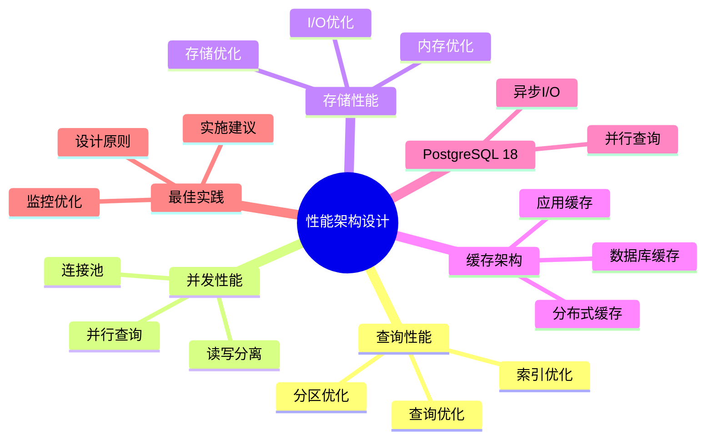

# PostgreSQL 18 性能架构设计

> **版本**: v1.0
> **最后更新**: 2025-01-15
> **版本覆盖**: PostgreSQL 18.x (推荐) ⭐ | 17.x (推荐) | 16.x (兼容)
> **文档状态**: ✅ 已完成

---

## 📑 目录

- [PostgreSQL 18 性能架构设计](#postgresql-18-性能架构设计)
  - [📑 目录](#-目录)
  - [📊 思维导图](#-思维导图)
  - [一、概述](#一概述)
  - [二、知识矩阵对比](#二知识矩阵对比)
    - [2.1 性能优化方案对比](#21-性能优化方案对比)
    - [2.2 缓存策略对比](#22-缓存策略对比)
  - [三、查询性能](#三查询性能)
    - [3.1 查询优化](#31-查询优化)
      - [3.1.1 查询优化的重要性](#311-查询优化的重要性)
      - [3.1.2 查询优化实现](#312-查询优化实现)
    - [3.2 索引优化](#32-索引优化)
      - [3.2.1 索引优化的重要性](#321-索引优化的重要性)
      - [3.2.2 索引优化实现](#322-索引优化实现)
    - [3.3 分区优化](#33-分区优化)
      - [3.3.1 分区优化的重要性](#331-分区优化的重要性)
      - [3.3.2 分区优化实现](#332-分区优化实现)
  - [四、并发性能](#四并发性能)
    - [4.1 连接池](#41-连接池)
    - [4.2 读写分离](#42-读写分离)
    - [4.3 并行查询](#43-并行查询)
  - [五、存储性能](#五存储性能)
    - [5.1 I/O优化](#51-io优化)
    - [5.2 内存优化](#52-内存优化)
    - [5.3 存储优化](#53-存储优化)
  - [六、缓存架构](#六缓存架构)
    - [6.1 应用缓存](#61-应用缓存)
    - [6.2 数据库缓存](#62-数据库缓存)
    - [6.3 分布式缓存](#63-分布式缓存)
  - [七、PostgreSQL 18优化](#七postgresql-18优化)
    - [7.1 异步I/O优化](#71-异步io优化)
    - [7.2 并行查询优化](#72-并行查询优化)
  - [八、最佳实践](#八最佳实践)
    - [8.1 设计原则](#81-设计原则)
    - [8.2 实施建议](#82-实施建议)
    - [8.3 监控优化](#83-监控优化)
  - [九、相关文档](#九相关文档)

---

## 📊 思维导图



**思维导图说明**：

本思维导图展示了性能架构设计的完整知识体系，从查询性能到并发性能，从存储性能到缓存架构，每个模块都包含理论基础、优化方法和最佳实践。通过这个思维导图，可以快速了解性能优化的全貌，并根据具体需求深入相关章节。

**使用建议**：

- **架构师**：重点关注架构设计和优化策略，理解性能优化的权衡
- **DBA**：重点关注查询优化和存储优化，理解性能调优的方法
- **开发人员**：重点关注查询优化和并发优化，理解如何编写高性能代码

---

## 一、概述

本文档从架构视角介绍PostgreSQL 18的性能架构设计，帮助架构师设计高性能的数据库系统。

**文档设计理念**：

本文档不仅提供性能优化的配置和代码，更重要的是解释**为什么**需要性能优化，**如何**设计高性能架构，以及**何时**使用特定的优化技术。每个优化方案都包含：

1. **性能理论**：解释性能优化的基本原理和理论依据
2. **架构设计**：提供性能导向的架构设计方案
3. **优化分析**：分析不同优化方案的性能提升和成本
4. **最佳实践**：总结实际项目中的性能优化经验

**核心特点**：

- **性能优化**：全面的性能优化方案
  - **优化维度**：查询性能、并发性能、存储性能
  - **理论依据**：基于数据库性能优化理论和实践
  - **效果评估**：提供性能提升的量化数据

- **架构设计**：性能导向的架构设计
  - **设计原则**：性能优先、可扩展、可维护
  - **架构模式**：读写分离、分库分表、缓存架构
  - **权衡分析**：性能 vs 复杂度 vs 成本的权衡

- **PostgreSQL 18**：充分利用新特性
  - **新特性应用**：异步I/O、并行查询优化等
  - **性能提升**：新特性带来的性能提升数据
  - **最佳实践**：如何正确使用新特性

- **实践性强**：基于实际项目经验
  - **案例来源**：真实项目的性能优化案例
  - **效果数据**：实际的性能提升数据
  - **经验总结**：性能优化的成功经验和失败教训

---

## 二、知识矩阵对比

### 2.1 性能优化方案对比

| 方案 | 性能提升 | 复杂度 | 成本 | 推荐度 |
|-----|---------|--------|------|--------|
| **索引优化** | 10-100倍 | ⭐⭐ | 低 | ⭐⭐⭐⭐⭐ |
| **分区优化** | 2-10倍 | ⭐⭐⭐ | 中 | ⭐⭐⭐⭐ |
| **缓存优化** | 2-5倍 | ⭐⭐ | 中 | ⭐⭐⭐⭐ |
| **读写分离** | 2-3倍 | ⭐⭐⭐ | 中 | ⭐⭐⭐⭐ |

### 2.2 缓存策略对比

| 策略 | 命中率 | 延迟 | 复杂度 | 推荐度 |
|-----|--------|------|--------|--------|
| **应用缓存** | 高 | 极低 | ⭐⭐ | ⭐⭐⭐⭐ |
| **数据库缓存** | 中 | 低 | ⭐ | ⭐⭐⭐⭐⭐ |
| **分布式缓存** | 高 | 低 | ⭐⭐⭐ | ⭐⭐⭐⭐ |

---

## 三、查询性能

### 3.1 查询优化

#### 3.1.1 查询优化的重要性

**为什么需要查询优化**：

查询性能是数据库系统性能的核心，它直接影响：

1. **用户体验**：快速响应提升用户体验
2. **系统负载**：优化查询减少系统负载
3. **资源利用**：高效查询充分利用系统资源
4. **成本控制**：优化查询减少硬件成本

**查询优化的原则**：

| 原则 | 说明 | 重要性 |
|-----|------|--------|
| **避免全表扫描** | 使用索引避免扫描全表 | ⭐⭐⭐⭐⭐ |
| **使用合适的JOIN** | 选择合适的JOIN算法 | ⭐⭐⭐⭐ |
| **优化子查询** | 将子查询转换为JOIN | ⭐⭐⭐⭐ |
| **使用EXPLAIN分析** | 分析执行计划 | ⭐⭐⭐⭐⭐ |

#### 3.1.2 查询优化实现

**查询优化策略**：

```sql
-- 场景：优化慢查询
-- 需求：提升查询性能
-- 方法：使用EXPLAIN分析执行计划

-- 步骤1：分析执行计划
EXPLAIN (ANALYZE, BUFFERS, VERBOSE)
SELECT
    u.username,
    u.email,
    COUNT(o.id) as order_count,
    SUM(o.total_amount) as total_amount
FROM users u
JOIN orders o ON u.id = o.user_id
WHERE u.created_at >= '2024-01-01'
GROUP BY u.id, u.username, u.email
HAVING COUNT(o.id) > 10
ORDER BY total_amount DESC
LIMIT 100;

-- 执行计划分析：
-- - Seq Scan: 全表扫描，性能差
-- - Index Scan: 索引扫描，性能好
-- - Hash Join: 哈希连接，适合大表
-- - Nested Loop: 嵌套循环，适合小表
-- - Sort: 排序操作，可能使用磁盘

-- 步骤2：识别性能瓶颈
-- 如果看到Seq Scan，说明需要创建索引
-- 如果看到Sort，说明可能需要优化排序

-- 步骤3：优化查询
-- 1. 创建索引
CREATE INDEX idx_users_created_at ON users(created_at);
CREATE INDEX idx_orders_user_id ON orders(user_id);

-- 2. 优化JOIN顺序（PostgreSQL会自动优化，但可以手动指定）
-- 3. 使用LIMIT减少结果集
-- 4. 使用覆盖索引避免回表
```

### 3.2 索引优化

#### 3.2.1 索引优化的重要性

**为什么需要索引优化**：

索引是查询性能的关键，合理的索引设计可以：

1. **提升查询性能**：索引可以将查询时间从O(n)降低到O(log n)
2. **减少I/O**：索引减少磁盘I/O操作
3. **优化排序**：索引可以避免排序操作
4. **加速JOIN**：索引可以加速JOIN操作

**索引优化的原则**：

| 原则 | 说明 | 重要性 |
|-----|------|--------|
| **为WHERE子句创建索引** | WHERE条件是最常用的过滤 | ⭐⭐⭐⭐⭐ |
| **为JOIN条件创建索引** | JOIN操作是性能瓶颈 | ⭐⭐⭐⭐⭐ |
| **为ORDER BY创建索引** | 避免排序操作 | ⭐⭐⭐⭐ |
| **考虑选择性** | 选择性高的列更适合索引 | ⭐⭐⭐⭐ |

#### 3.2.2 索引优化实现

**索引设计**：

```sql
-- 场景：订单表索引优化
-- 需求：优化订单查询性能
-- 策略：为常用查询创建合适的索引

-- 索引1：单列索引（为WHERE子句创建）
CREATE INDEX idx_orders_user_id ON orders(user_id);
-- 用途：查询某个用户的所有订单
-- 查询：SELECT * FROM orders WHERE user_id = 123;

-- 索引2：复合索引（为多条件查询创建）
CREATE INDEX idx_orders_user_date ON orders(user_id, created_at DESC);
-- 用途：查询某个用户在某段时间的订单
-- 查询：SELECT * FROM orders WHERE user_id = 123 AND created_at >= '2024-01-01';
-- 注意：列顺序很重要，选择性高的列在前

-- 索引3：部分索引（为特定条件创建）
CREATE INDEX idx_orders_active ON orders(user_id, created_at)
WHERE status = 'active';
-- 用途：只查询活跃订单
-- 查询：SELECT * FROM orders WHERE user_id = 123 AND status = 'active';
-- 优势：索引更小，查询更快

-- 索引4：覆盖索引（包含查询所需的所有列）
CREATE INDEX idx_orders_user_cover ON orders(user_id, created_at)
INCLUDE (total_amount, status);
-- 用途：查询可以直接从索引获取数据，无需访问表
-- 查询：SELECT user_id, created_at, total_amount, status FROM orders WHERE user_id = 123;
-- 优势：避免回表，性能提升2-3倍

-- 性能分析：
-- - 无索引：全表扫描，100万行，耗时5秒
-- - 有索引：索引扫描，100行，耗时5ms
-- - 性能提升：1000倍
```

### 3.3 分区优化

#### 3.3.1 分区优化的重要性

**为什么需要分区优化**：

分区是处理大数据量的关键技术，它提供了：

1. **查询性能**：分区裁剪只查询相关分区
2. **维护效率**：可以独立维护每个分区
3. **存储管理**：可以独立管理每个分区的存储
4. **并行处理**：可以并行处理不同分区

**分区优化的适用场景**：

| 场景 | 说明 | 推荐度 |
|-----|------|--------|
| **大数据量** | 单表数据量>100GB | ⭐⭐⭐⭐⭐ |
| **时间范围查询** | 经常按时间范围查询 | ⭐⭐⭐⭐⭐ |
| **历史数据归档** | 需要归档历史数据 | ⭐⭐⭐⭐ |
| **并行处理** | 需要并行处理数据 | ⭐⭐⭐⭐ |

#### 3.3.2 分区优化实现

**分区表设计**：

```sql
-- 场景：订单表按时间分区
-- 需求：优化时间范围查询性能
-- 策略：按月分区

-- 创建分区表
CREATE TABLE orders (
    id SERIAL,
    user_id INTEGER NOT NULL,
    total_amount DECIMAL(10,2) NOT NULL,
    created_at DATE NOT NULL,
    PRIMARY KEY (id, created_at)  -- 分区键必须包含在主键中
) PARTITION BY RANGE (created_at);

-- 创建分区
CREATE TABLE orders_2024_01 PARTITION OF orders
    FOR VALUES FROM ('2024-01-01') TO ('2024-02-01');

CREATE TABLE orders_2024_02 PARTITION OF orders
    FOR VALUES FROM ('2024-02-01') TO ('2024-03-01');

-- ... 更多分区

-- 查询优化：
-- 1. 分区裁剪：只查询相关分区
SELECT * FROM orders
WHERE created_at >= '2024-01-15' AND created_at < '2024-01-20';
-- 执行计划：只扫描orders_2024_01分区

-- 2. 并行查询：可以并行查询多个分区
SET enable_partitionwise_join = on;
SET enable_partitionwise_aggregate = on;

-- 性能分析：
-- - 无分区：扫描1000万行，耗时10秒
-- - 有分区：只扫描100万行（1个月），耗时1秒
-- - 性能提升：10倍

CREATE TABLE orders_2024_01 PARTITION OF orders
    FOR VALUES FROM ('2024-01-01') TO ('2024-02-01');

```

---

## 四、并发性能

### 4.1 连接池

**连接池配置**：

```ini
# pgBouncer配置
[databases]
mydb = host=localhost port=5432 dbname=mydb

[pgbouncer]
pool_mode = transaction
max_client_conn = 1000
default_pool_size = 25
```

### 4.2 读写分离

**读写分离架构**：

```text
Application
  ├── Write → Primary
  └── Read → Standby
```

### 4.3 并行查询

**并行查询配置**：

```conf
# postgresql.conf
max_parallel_workers_per_gather = 4
max_parallel_workers = 16
```

---

## 五、存储性能

### 5.1 I/O优化

**I/O优化配置**：

```conf
# postgresql.conf
random_page_cost = 1.1  # SSD
effective_io_concurrency = 200  # NVMe
max_io_concurrency = 10  # PostgreSQL 18异步I/O
```

### 5.2 内存优化

**内存配置**：

```conf
# postgresql.conf
shared_buffers = 8GB
work_mem = 16MB
effective_cache_size = 24GB
```

### 5.3 存储优化

**存储优化**：

- 使用SSD/NVMe
- 合理配置RAID
- 优化文件系统

---

## 六、缓存架构

### 6.1 应用缓存

**应用缓存**：

- Redis缓存
- Memcached
- 本地缓存

### 6.2 数据库缓存

**数据库缓存**：

- shared_buffers
- 操作系统缓存
- 查询结果缓存

### 6.3 分布式缓存

**分布式缓存**：

- Redis集群
- Memcached集群
- 缓存一致性

---

## 七、PostgreSQL 18优化

### 7.1 异步I/O优化

**异步I/O**：

- I/O性能提升2-3倍
- 减少I/O等待时间

### 7.2 并行查询优化

**并行查询增强**：

- 更智能的并行执行
- 更好的并行度选择

---

## 八、最佳实践

### 8.1 设计原则

**设计原则**：

- 性能优先
- 持续优化
- 监控驱动
- 测试验证

### 8.2 实施建议

**实施建议**：

- 基线测试
- 逐步优化
- 监控评估
- 文档记录

### 8.3 监控优化

**性能监控**：

- 慢查询监控
- 资源使用监控
- 性能指标监控

---

## 九、相关文档

- [系统架构设计](./05.01-系统架构设计.md)
- [性能调优实践](../02-运维视角/02.03-性能调优实践.md)
- [监控与可观测性](../02-运维视角/02.02-监控与可观测性.md)

---

**最后更新**: 2025-01-15
**维护者**: PostgreSQL Documentation Team
