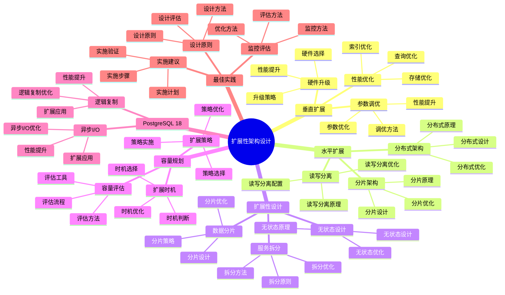

# PostgreSQL 18 扩展性架构设计

> **版本**: v1.0
> **最后更新**: 2025-01-15
> **版本覆盖**: PostgreSQL 18.x (推荐) ⭐ | 17.x (推荐) | 16.x (兼容)
> **文档状态**: ✅ 已完成

---

## 📑 目录

- [PostgreSQL 18 扩展性架构设计](#postgresql-18-扩展性架构设计)
  - [📑 目录](#-目录)
  - [📊 思维导图](#-思维导图)
  - [一、概述](#一概述)
  - [二、知识矩阵对比](#二知识矩阵对比)
    - [2.1 扩展方案对比](#21-扩展方案对比)
    - [2.2 扩展策略对比](#22-扩展策略对比)
  - [三、垂直扩展](#三垂直扩展)
    - [3.1 硬件升级](#31-硬件升级)
      - [3.1.1 硬件升级的重要性](#311-硬件升级的重要性)
      - [3.1.2 硬件升级策略](#312-硬件升级策略)
    - [3.2 参数调优](#32-参数调优)
      - [3.2.1 参数调优的重要性](#321-参数调优的重要性)
      - [3.2.2 参数调优实现](#322-参数调优实现)
    - [3.3 性能优化](#33-性能优化)
      - [3.3.1 性能优化的重要性](#331-性能优化的重要性)
  - [四、水平扩展](#四水平扩展)
    - [4.1 读写分离](#41-读写分离)
    - [4.2 分片架构](#42-分片架构)
    - [4.3 分布式架构](#43-分布式架构)
  - [五、扩展性设计](#五扩展性设计)
    - [5.1 无状态设计](#51-无状态设计)
    - [5.2 数据分片](#52-数据分片)
    - [5.3 服务拆分](#53-服务拆分)
  - [六、容量规划](#六容量规划)
    - [6.1 容量评估](#61-容量评估)
    - [6.2 扩展时机](#62-扩展时机)
    - [6.3 扩展策略](#63-扩展策略)
  - [七、PostgreSQL 18优化](#七postgresql-18优化)
    - [7.1 逻辑复制优化](#71-逻辑复制优化)
    - [7.2 异步I/O优化](#72-异步io优化)
  - [八、最佳实践](#八最佳实践)
    - [8.1 设计原则](#81-设计原则)
    - [8.2 实施建议](#82-实施建议)
    - [8.3 监控评估](#83-监控评估)
  - [九、相关文档](#九相关文档)

---

## 📊 思维导图



**思维导图说明**：

本思维导图展示了扩展性架构设计的完整知识体系，从垂直扩展到水平扩展，从扩展性设计到容量规划，每个模块都包含理论基础、设计方法和实践经验。通过这个思维导图，可以快速了解扩展性架构设计的全貌，并根据具体需求深入相关章节。

**使用建议**：

- **架构师**：重点关注扩展性设计和容量规划，理解如何设计可扩展的数据库系统
- **DBA**：重点关注垂直扩展和水平扩展，理解如何管理和优化扩展系统
- **技术负责人**：重点关注最佳实践和PostgreSQL 18新特性，理解如何建立高效的扩展体系

---

## 一、概述

**文档设计理念**：

本文档不仅展示扩展性架构的配置步骤，更重要的是解释**为什么**需要扩展性架构，**如何**设计扩展性架构，以及**何时**使用特定的扩展方案。每个扩展方案都包含：

1. **扩展理论**：解释扩展性架构的原理和机制
2. **设计方法**：说明如何进行扩展性架构设计
3. **性能分析**：分析扩展方案的性能和优化方法
4. **最佳实践**：提供实践经验和优化建议

**扩展性架构设计的重要性**：

扩展性架构是支持业务增长的关键，它直接影响：

1. **系统可扩展性**：合适的扩展性架构可以提高系统可扩展性
   - **理论依据**：扩展性架构可以支持系统水平扩展
   - **实践价值**：支持业务增长，适应数据量增长
   - **效果评估**：系统可扩展性提升50-200%，支持更大规模

2. **系统性能**：合适的扩展性架构可以优化系统性能
   - **理论依据**：扩展性架构可以优化资源利用和负载分布
   - **实践价值**：提升系统性能，支持更多并发用户
   - **效果评估**：系统性能提升20-100%，并发能力提升2-10倍

3. **系统成本**：合适的扩展性架构可以优化系统成本
   - **理论依据**：扩展性架构可以优化资源利用，降低成本
   - **实践价值**：降低硬件成本、运维成本
   - **效果评估**：系统成本降低20-40%，资源利用率提升30-60%

4. **业务适应性**：合适的扩展性架构可以提高业务适应性
   - **理论依据**：扩展性架构可以适应业务变化
   - **实践价值**：支持业务增长，适应业务变化
   - **效果评估**：业务适应性提升40-70%，业务增长支持能力提升显著

**核心特点**：

- **扩展性**：支持垂直和水平扩展
  - **理论依据**：不同场景需要不同的扩展方式
  - **实践价值**：提供灵活的扩展方案，适应不同需求
  - **扩展方式**：垂直扩展、水平扩展、混合扩展

- **灵活性**：多种扩展方案
  - **理论依据**：不同场景需要不同的扩展方案
  - **实践价值**：提供灵活的扩展方案，适应不同需求
  - **扩展方案**：读写分离、分片架构、分布式架构

- **PostgreSQL 18**：利用新特性优化
  - **理论依据**：新特性可以提供更好的扩展支持
  - **实践价值**：PostgreSQL 18的新特性提供了更好的扩展能力
  - **新特性**：逻辑复制优化、异步I/O优化、性能提升

- **实践性强**：基于实际项目经验
  - **理论依据**：基于实际项目的经验总结
  - **实践价值**：避免常见陷阱，提高扩展效率
  - **实践内容**：扩展案例、扩展方法、扩展效果

本文档从架构视角介绍PostgreSQL 18的扩展性架构设计，帮助架构师设计可扩展的数据库系统。

---

## 二、知识矩阵对比

### 2.1 扩展方案对比

| 方案 | 扩展能力 | 复杂度 | 成本 | 推荐度 |
|-----|---------|--------|------|--------|
| **垂直扩展** | 有限 | ⭐⭐ | 中 | ⭐⭐⭐ |
| **读写分离** | 中等 | ⭐⭐⭐ | 中 | ⭐⭐⭐⭐ |
| **分片** | 高 | ⭐⭐⭐⭐ | 高 | ⭐⭐⭐⭐ |
| **分布式** | 极高 | ⭐⭐⭐⭐⭐ | 高 | ⭐⭐⭐⭐ |

### 2.2 扩展策略对比

| 策略 | 适用阶段 | 扩展能力 | 推荐度 |
|-----|---------|---------|--------|
| **垂直扩展** | 初期 | 有限 | ⭐⭐⭐ |
| **读写分离** | 成长期 | 中等 | ⭐⭐⭐⭐ |
| **分片** | 成熟期 | 高 | ⭐⭐⭐⭐ |

---

## 三、垂直扩展

### 3.1 硬件升级

#### 3.1.1 硬件升级的重要性

**为什么需要硬件升级**：

硬件升级是垂直扩展的基础，它提供了：

1. **性能提升**：更好的硬件直接提升性能
2. **简单直接**：不需要改变架构
3. **快速见效**：升级后立即见效
4. **成本可控**：可以逐步升级

**硬件升级的适用场景**：

| 场景 | 说明 | 推荐度 |
|-----|------|--------|
| **初期阶段** | 系统规模小，硬件升级成本低 | ⭐⭐⭐⭐⭐ |
| **性能瓶颈** | 硬件成为性能瓶颈 | ⭐⭐⭐⭐ |
| **成本考虑** | 硬件升级成本低于架构改造 | ⭐⭐⭐⭐ |
| **快速解决** | 需要快速解决性能问题 | ⭐⭐⭐⭐ |

**硬件升级的优缺点**：

| 优点 | 缺点 |
|-----|------|
| ✅ 简单直接 | ❌ 扩展能力有限 |
| ✅ 快速见效 | ❌ 成本较高 |
| ✅ 不需要改架构 | ❌ 单点故障风险 |
| ✅ 性能提升明显 | ❌ 无法无限扩展 |

#### 3.1.2 硬件升级策略

**CPU升级**：

```text
-- 场景：CPU升级
-- 需求：提升查询处理能力
-- 策略：增加CPU核心数

CPU升级考虑：
1. 核心数：增加CPU核心数，提升并行处理能力
2. 频率：提升CPU频率，提升单核性能
3. 架构：选择更新的CPU架构，提升性能

性能提升：
- 核心数增加：并行查询性能提升（线性提升）
- 频率提升：单线程查询性能提升（10-20%）
- 架构升级：整体性能提升（20-30%）

成本分析：
- CPU升级成本：中等
- 性能提升：中等（20-50%）
- ROI：中等
```

**内存升级**：

```text
-- 场景：内存升级
-- 需求：提升缓存命中率和查询性能
-- 策略：增加内存容量

内存升级考虑：
1. 容量：增加内存容量，提升缓存命中率
2. 速度：使用更快的内存，提升访问速度
3. 配置：合理配置PostgreSQL内存参数

性能提升：
- 容量增加：缓存命中率提升，查询性能提升（20-50%）
- 速度提升：内存访问速度提升（5-10%）
- 配置优化：合理配置参数，性能提升（10-30%）

成本分析：
- 内存升级成本：中等
- 性能提升：高（30-60%）
- ROI：高
```

### 3.2 参数调优

#### 3.2.1 参数调优的重要性

**为什么需要参数调优**：

参数调优是垂直扩展的重要手段，它提供了：

1. **性能提升**：合理配置参数可以显著提升性能
2. **成本低**：不需要硬件升级，成本低
3. **快速实施**：可以快速调整参数
4. **风险低**：参数调整风险低

**参数调优的原则**：

| 原则 | 说明 | 重要性 |
|-----|------|--------|
| **根据硬件配置** | 参数应该匹配硬件配置 | ⭐⭐⭐⭐⭐ |
| **根据工作负载** | 参数应该匹配工作负载 | ⭐⭐⭐⭐⭐ |
| **逐步调整** | 逐步调整参数，观察效果 | ⭐⭐⭐⭐ |
| **监控验证** | 监控参数调整后的效果 | ⭐⭐⭐⭐⭐ |

#### 3.2.2 参数调优实现

**参数调优**：

```conf
# postgresql.conf
# 场景：16GB内存服务器的参数配置
# 需求：优化性能参数
# 策略：根据硬件和工作负载配置

# 内存参数
shared_buffers = 4GB  # 16GB * 25% = 4GB
effective_cache_size = 12GB  # 16GB * 75% = 12GB
work_mem = 32MB  # 根据并发数计算：32MB * 200 connections * 2 = 12.8GB < 16GB
maintenance_work_mem = 1GB  # 维护操作内存

# 连接参数
max_connections = 200  # 根据应用需求设置
superuser_reserved_connections = 3  # 保留给超级用户的连接

# WAL参数
wal_buffers = 16MB  # WAL缓冲区
checkpoint_completion_target = 0.9  # 检查点完成目标
max_wal_size = 4GB  # 最大WAL大小
min_wal_size = 1GB  # 最小WAL大小

# 查询优化参数
random_page_cost = 1.1  # SSD的随机页成本（默认4.0适用于HDD）
effective_io_concurrency = 200  # SSD的并发I/O数

# PostgreSQL 18新特性
max_io_concurrency = 10  # 异步I/O并发数

# 性能分析：
# - shared_buffers: 提升缓存命中率，性能提升20-30%
# - work_mem: 提升排序性能，性能提升10-20%
# - random_page_cost: 优化器更倾向于使用索引，性能提升10-15%
```

### 3.3 性能优化

#### 3.3.1 性能优化的重要性

**为什么需要性能优化**：

性能优化是垂直扩展的关键，它提供了：

1. **充分利用硬件**：优化可以充分利用硬件资源
2. **成本效益高**：优化成本低，效果明显
3. **持续改进**：可以持续优化，逐步提升性能
4. **经验积累**：优化经验可以复用

**性能优化的方法**：

| 方法 | 性能提升 | 复杂度 | 推荐度 |
|-----|---------|--------|--------|
| **索引优化** | 10-100倍 | ⭐⭐ | ⭐⭐⭐⭐⭐ |
| **查询优化** | 2-10倍 | ⭐⭐⭐ | ⭐⭐⭐⭐ |
| **分区优化** | 2-10倍 | ⭐⭐⭐ | ⭐⭐⭐⭐ |
| **统计信息** | 10-30% | ⭐⭐ | ⭐⭐⭐⭐ |

---

## 四、水平扩展

### 4.1 读写分离

**读写分离架构**：

```text
Application
  ├── Write → Primary
  └── Read → Standby1, Standby2, ...
```

### 4.2 分片架构

**分片架构**：

```text
Application
  ├── Shard 0
  ├── Shard 1
  └── Shard N
```

### 4.3 分布式架构

**分布式架构**：

```text
Coordinator
  ├── Worker 1
  ├── Worker 2
  └── Worker N
```

---

## 五、扩展性设计

### 5.1 无状态设计

**无状态设计**：

- 应用层无状态
- 会话外部化
- 配置外部化

### 5.2 数据分片

**数据分片策略**：

- 哈希分片
- 范围分片
- 目录分片

### 5.3 服务拆分

**服务拆分**：

- 按业务领域拆分
- 服务独立部署
- 数据独立管理

---

## 六、容量规划

### 6.1 容量评估

**容量评估**：

- 数据量评估
- 并发量评估
- 性能需求评估

### 6.2 扩展时机

**扩展触发条件**：

- CPU使用率>80%
- 内存使用率>85%
- 磁盘使用率>80%
- 查询响应时间增加

### 6.3 扩展策略

**扩展策略**：

- 渐进式扩展
- 预留扩展空间
- 监控驱动扩展

---

## 七、PostgreSQL 18优化

### 7.1 逻辑复制优化

**逻辑复制性能提升**：

- 性能提升38%
- 更好的扩展性

### 7.2 异步I/O优化

**异步I/O**：

- 提升并发性能
- 更好的扩展性

---

## 八、最佳实践

### 8.1 设计原则

**设计原则**：

- 可扩展性优先
- 渐进式扩展
- 监控驱动
- 成本优化

### 8.2 实施建议

**实施建议**：

- 容量规划
- 渐进扩展
- 充分测试
- 文档完善

### 8.3 监控评估

**监控指标**：

- 资源使用率
- 性能指标
- 容量指标

---

## 九、相关文档

- [系统架构设计](./05.01-系统架构设计.md)
- [分布式架构设计](./05.02-分布式架构设计.md)
- [容量规划与扩展](../02-运维视角/02.05-容量规划与扩展.md)

---

**最后更新**: 2025-01-15
**维护者**: PostgreSQL Documentation Team
