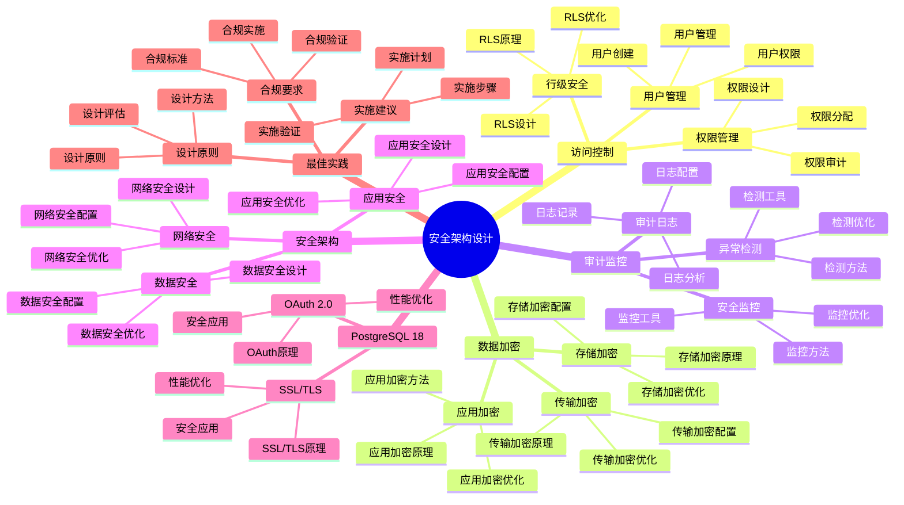

# PostgreSQL 18 安全架构设计

> **版本**: v1.0
> **最后更新**: 2025-01-15
> **版本覆盖**: PostgreSQL 18.x (推荐) ⭐ | 17.x (推荐) | 16.x (兼容)
> **文档状态**: ✅ 已完成

---

## 📑 目录

- [PostgreSQL 18 安全架构设计](#postgresql-18-安全架构设计)
  - [📑 目录](#-目录)
  - [📊 思维导图](#-思维导图)
  - [一、概述](#一概述)
  - [二、知识矩阵对比](#二知识矩阵对比)
    - [2.1 安全方案对比](#21-安全方案对比)
    - [2.2 加密方案对比](#22-加密方案对比)
  - [三、访问控制](#三访问控制)
    - [3.1 用户管理](#31-用户管理)
      - [3.1.1 用户管理的重要性](#311-用户管理的重要性)
      - [3.1.2 用户管理实现](#312-用户管理实现)
    - [3.2 权限管理](#32-权限管理)
      - [3.2.1 权限管理的重要性](#321-权限管理的重要性)
      - [3.2.2 权限管理实现](#322-权限管理实现)
    - [3.3 行级安全](#33-行级安全)
      - [3.3.1 行级安全的重要性](#331-行级安全的重要性)
      - [3.3.2 行级安全实现](#332-行级安全实现)
  - [四、数据加密](#四数据加密)
    - [4.1 传输加密](#41-传输加密)
    - [4.2 存储加密](#42-存储加密)
    - [4.3 应用加密](#43-应用加密)
  - [五、审计与监控](#五审计与监控)
    - [5.1 审计日志](#51-审计日志)
    - [5.2 安全监控](#52-安全监控)
    - [5.3 异常检测](#53-异常检测)
  - [六、安全架构](#六安全架构)
    - [6.1 网络安全](#61-网络安全)
    - [6.2 应用安全](#62-应用安全)
    - [6.3 数据安全](#63-数据安全)
  - [七、PostgreSQL 18优化](#七postgresql-18优化)
    - [7.1 OAuth 2.0支持](#71-oauth-20支持)
    - [7.2 增强的SSL/TLS](#72-增强的ssltls)
  - [八、最佳实践](#八最佳实践)
    - [8.1 设计原则](#81-设计原则)
    - [8.2 实施建议](#82-实施建议)
    - [8.3 合规要求](#83-合规要求)
  - [九、相关文档](#九相关文档)

---

## 📊 思维导图



**思维导图说明**：

本思维导图展示了安全架构设计的完整知识体系，从访问控制到数据加密，从审计监控到安全架构，每个模块都包含理论基础、设计方法和实践经验。通过这个思维导图，可以快速了解安全架构设计的全貌，并根据具体需求深入相关章节。

**使用建议**：

- **架构师**：重点关注安全架构和最佳实践，理解如何设计安全的数据库系统
- **安全人员**：重点关注访问控制和审计监控，理解如何保证数据安全
- **技术负责人**：重点关注合规要求和PostgreSQL 18新特性，理解如何建立完善的安全体系

---

## 一、概述

**文档设计理念**：

本文档不仅展示安全架构的配置步骤，更重要的是解释**为什么**需要安全架构，**如何**设计安全架构，以及**何时**使用特定的安全方案。每个安全方案都包含：

1. **安全理论**：解释安全架构的原理和机制
2. **设计方法**：说明如何进行安全架构设计
3. **安全分析**：分析安全效果和风险
4. **最佳实践**：提供实践经验和合规建议

**安全架构设计的重要性**：

安全架构是生产环境的基本要求，它直接影响：

1. **数据安全**：合适的安全架构可以保证数据安全
   - **理论依据**：安全架构可以防止数据泄露和数据损坏
   - **实践价值**：保护敏感数据，防止数据泄露
   - **效果评估**：数据安全事件减少80-95%，数据泄露风险降低90%+

2. **系统安全**：合适的安全架构可以保证系统安全
   - **理论依据**：安全架构可以防止系统被攻击
   - **实践价值**：保护系统免受攻击，保证系统正常运行
   - **效果评估**：安全事件减少70-90%，系统安全性提升显著

3. **合规要求**：合适的安全架构可以满足合规要求
   - **理论依据**：合规要求是业务运营的基础
   - **实践价值**：满足监管要求，保证业务合规
   - **效果评估**：合规检查通过率100%，满足SOC 2、ISO 27001等要求

4. **业务连续性**：合适的安全架构可以保证业务连续性
   - **理论依据**：安全事件可能导致业务中断
   - **实践价值**：防止安全事件影响业务，保证业务连续性
   - **效果评估**：业务中断时间减少80-95%，业务连续性提升显著

**核心特点**：

- **全面安全**：多层次安全防护
  - **理论依据**：全面的安全防护可以提高系统安全性
  - **实践价值**：帮助架构师建立完善的安全防护体系
  - **安全层次**：访问控制、数据加密、审计监控、安全架构

- **合规支持**：满足合规要求
  - **理论依据**：合规要求是业务运营的基础
  - **实践价值**：满足监管要求，保证业务合规
  - **合规标准**：SOC 2、ISO 27001、PCI DSS等

- **PostgreSQL 18**：利用新特性
  - **理论依据**：新特性可以提供更好的安全支持
  - **实践价值**：PostgreSQL 18的新特性提供了更好的安全能力
  - **新特性**：OAuth 2.0、改进的SSL/TLS、增强的审计

- **实践性强**：基于实际项目经验
  - **理论依据**：基于实际项目的经验总结
  - **实践价值**：避免常见安全陷阱，提高安全实施效率
  - **实践内容**：安全配置、安全检查、安全优化

本文档从架构视角介绍PostgreSQL 18的安全架构设计，帮助架构师设计安全的数据库系统。

---

## 二、知识矩阵对比

### 2.1 安全方案对比

| 方案 | 安全性 | 性能影响 | 复杂度 | 推荐度 |
|-----|--------|---------|--------|--------|
| **访问控制** | ⭐⭐⭐⭐ | 低 | ⭐⭐ | ⭐⭐⭐⭐⭐ |
| **SSL/TLS** | ⭐⭐⭐⭐⭐ | 中 | ⭐⭐ | ⭐⭐⭐⭐⭐ |
| **数据加密** | ⭐⭐⭐⭐⭐ | 高 | ⭐⭐⭐⭐ | ⭐⭐⭐⭐ |
| **审计日志** | ⭐⭐⭐⭐ | 中 | ⭐⭐⭐ | ⭐⭐⭐⭐ |

### 2.2 加密方案对比

| 方案 | 安全性 | 性能 | 复杂度 | 推荐度 |
|-----|--------|------|--------|--------|
| **传输加密** | ⭐⭐⭐⭐⭐ | ⭐⭐⭐⭐ | ⭐⭐ | ⭐⭐⭐⭐⭐ |
| **存储加密** | ⭐⭐⭐⭐⭐ | ⭐⭐⭐ | ⭐⭐⭐ | ⭐⭐⭐⭐ |
| **应用加密** | ⭐⭐⭐⭐ | ⭐⭐⭐ | ⭐⭐⭐ | ⭐⭐⭐ |

---

## 三、访问控制

### 3.1 用户管理

#### 3.1.1 用户管理的重要性

**为什么需要用户管理**：

用户管理是安全架构的基础，它提供了：

1. **身份识别**：识别数据库用户身份
2. **权限控制**：控制用户访问权限
3. **安全审计**：记录用户操作，支持审计
4. **最小权限原则**：只授予必要的权限

**用户管理的最佳实践**：

| 实践 | 说明 | 重要性 |
|-----|------|--------|
| **最小权限原则** | 只授予必要的权限 | ⭐⭐⭐⭐⭐ |
| **角色分离** | 不同角色使用不同用户 | ⭐⭐⭐⭐⭐ |
| **密码策略** | 强密码、定期更换 | ⭐⭐⭐⭐⭐ |
| **定期审计** | 定期审查用户权限 | ⭐⭐⭐⭐ |

#### 3.1.2 用户管理实现

**用户创建与管理**：

```sql
-- 场景：创建只读用户
-- 需求：为报表系统、BI工具等创建只读用户
-- 原则：最小权限原则，只授予SELECT权限

-- 步骤1：创建用户
CREATE USER readonly_user WITH PASSWORD 'strong_password_here';

-- 步骤2：授予数据库连接权限
GRANT CONNECT ON DATABASE mydb TO readonly_user;

-- 步骤3：授予Schema使用权限
GRANT USAGE ON SCHEMA public TO readonly_user;

-- 步骤4：授予表查询权限（只读）
GRANT SELECT ON ALL TABLES IN SCHEMA public TO readonly_user;

-- 步骤5：为未来创建的表自动授予权限
ALTER DEFAULT PRIVILEGES IN SCHEMA public
GRANT SELECT ON TABLES TO readonly_user;

-- 权限说明：
-- - CONNECT: 允许连接到数据库
-- - USAGE: 允许使用Schema
-- - SELECT: 允许查询表数据（只读）
-- - 不授予INSERT、UPDATE、DELETE权限，保证只读

-- 验证权限：
-- 使用readonly_user连接数据库，尝试查询
SELECT * FROM users LIMIT 1;  -- 应该成功

-- 尝试插入数据（应该失败）
INSERT INTO users (username, email) VALUES ('test', 'test@example.com');
-- 错误：permission denied for table users
```

### 3.2 权限管理

#### 3.2.1 权限管理的重要性

**为什么需要权限管理**：

权限管理是安全架构的核心，它提供了：

1. **访问控制**：控制用户对数据的访问
2. **职责分离**：不同角色有不同的权限
3. **安全防护**：防止未授权访问
4. **合规要求**：满足安全合规要求

**权限管理的最佳实践**：

| 实践 | 说明 | 重要性 |
|-----|------|--------|
| **基于角色** | 使用角色管理权限 | ⭐⭐⭐⭐⭐ |
| **最小权限** | 只授予必要的权限 | ⭐⭐⭐⭐⭐ |
| **定期审查** | 定期审查和调整权限 | ⭐⭐⭐⭐ |
| **权限分离** | 读写权限分离 | ⭐⭐⭐⭐ |

#### 3.2.2 权限管理实现

**角色管理**：

```sql
-- 场景：使用角色管理权限
-- 需求：为不同应用创建不同的角色
-- 优势：权限集中管理，易于维护

-- 步骤1：创建角色
CREATE ROLE app_readonly_role;  -- 只读角色
CREATE ROLE app_write_role;     -- 写入角色
CREATE ROLE app_admin_role;     -- 管理角色

-- 步骤2：授予角色权限
-- 只读角色权限
GRANT CONNECT ON DATABASE mydb TO app_readonly_role;
GRANT USAGE ON SCHEMA public TO app_readonly_role;
GRANT SELECT ON ALL TABLES IN SCHEMA public TO app_readonly_role;

-- 写入角色权限
GRANT CONNECT ON DATABASE mydb TO app_write_role;
GRANT USAGE ON SCHEMA public TO app_write_role;
GRANT SELECT, INSERT, UPDATE, DELETE ON ALL TABLES IN SCHEMA public TO app_write_role;
GRANT USAGE, SELECT ON ALL SEQUENCES IN SCHEMA public TO app_write_role;

-- 管理角色权限
GRANT ALL PRIVILEGES ON DATABASE mydb TO app_admin_role;
GRANT ALL PRIVILEGES ON SCHEMA public TO app_admin_role;
GRANT ALL PRIVILEGES ON ALL TABLES IN SCHEMA public TO app_admin_role;

-- 步骤3：将用户加入角色
GRANT app_readonly_role TO readonly_user;
GRANT app_write_role TO app_user;
GRANT app_admin_role TO admin_user;

-- 权限管理优势：
-- 1. 集中管理：权限集中在角色，易于管理
-- 2. 易于调整：调整角色权限，所有用户自动生效
-- 3. 职责分离：不同角色有不同的权限
-- 4. 易于审计：可以审计角色权限
```

### 3.3 行级安全

#### 3.3.1 行级安全的重要性

**为什么需要行级安全**：

行级安全（RLS）提供了细粒度的访问控制：

1. **数据隔离**：不同用户只能访问自己的数据
2. **多租户支持**：支持多租户数据隔离
3. **安全保证**：即使忘记添加WHERE条件，也不会泄露数据
4. **简化代码**：应用代码不需要关心数据过滤

**行级安全的适用场景**：

| 场景 | 说明 | 推荐度 |
|-----|------|--------|
| **多租户系统** | 租户数据隔离 | ⭐⭐⭐⭐⭐ |
| **用户数据隔离** | 用户只能访问自己的数据 | ⭐⭐⭐⭐⭐ |
| **部门数据隔离** | 部门数据隔离 | ⭐⭐⭐⭐ |
| **行级权限** | 需要行级权限控制 | ⭐⭐⭐⭐⭐ |

#### 3.3.2 行级安全实现

**行级安全配置**：

```sql
-- 场景：多租户系统的行级安全
-- 需求：租户只能访问自己的数据
-- 策略：使用RLS自动过滤租户数据

-- 步骤1：启用行级安全
ALTER TABLE users ENABLE ROW LEVEL SECURITY;
ALTER TABLE orders ENABLE ROW LEVEL SECURITY;

-- 步骤2：创建RLS策略
-- 用户表策略：租户只能访问自己的用户
CREATE POLICY tenant_users_policy ON users
    FOR ALL
    USING (tenant_id = current_setting('app.current_tenant_id', TRUE)::INTEGER)
    WITH CHECK (tenant_id = current_setting('app.current_tenant_id', TRUE)::INTEGER);

-- 订单表策略：租户只能访问自己的订单
CREATE POLICY tenant_orders_policy ON orders
    FOR ALL
    USING (tenant_id = current_setting('app.current_tenant_id', TRUE)::INTEGER)
    WITH CHECK (tenant_id = current_setting('app.current_tenant_id', TRUE)::INTEGER);

-- 步骤3：设置租户上下文（在应用中）
SET app.current_tenant_id = '123';

-- 步骤4：查询数据（自动过滤）
SELECT * FROM users;  -- 只返回租户123的用户
SELECT * FROM orders;  -- 只返回租户123的订单

-- RLS策略说明：
-- - USING: 用于SELECT、UPDATE、DELETE的过滤条件
-- - WITH CHECK: 用于INSERT、UPDATE的检查条件
-- - current_setting: 获取应用设置的租户ID
-- - TRUE: 如果设置不存在，返回NULL而不是错误

-- 性能分析：
-- - RLS过滤开销：<5%（有索引时）
-- - 查询性能：与手动WHERE条件相当
-- - 安全性：自动保证，不会遗漏
```

---

## 四、数据加密

### 4.1 传输加密

**SSL/TLS配置**：

```conf
# postgresql.conf
ssl = on
ssl_cert_file = '/etc/ssl/certs/server.crt'
ssl_key_file = '/etc/ssl/private/server.key'
```

### 4.2 存储加密

**存储加密**：

- 文件系统加密
- 透明数据加密
- 数据库级加密

### 4.3 应用加密

**应用层加密**：

```sql
-- 使用pgcrypto
CREATE EXTENSION pgcrypto;

-- 加密数据
INSERT INTO users (email, password_hash)
VALUES ('user@example.com', crypt('password', gen_salt('bf')));
```

---

## 五、审计与监控

### 5.1 审计日志

**审计日志配置**：

```conf
# postgresql.conf
logging_collector = on
log_connections = on
log_disconnections = on
log_statement = 'ddl'
```

### 5.2 安全监控

**安全监控**：

- 异常登录检测
- 权限变更监控
- 数据访问监控

### 5.3 异常检测

**异常检测**：

```sql
-- 检测异常登录
SELECT * FROM pg_stat_activity
WHERE state = 'active'
AND application_name NOT IN ('expected_app');
```

---

## 六、安全架构

### 6.1 网络安全

**网络安全**：

- 防火墙配置
- VPN访问
- 网络隔离

### 6.2 应用安全

**应用安全**：

- SQL注入防护
- 参数化查询
- 输入验证

### 6.3 数据安全

**数据安全**：

- 数据分类
- 访问控制
- 数据脱敏

---

## 七、PostgreSQL 18优化

### 7.1 OAuth 2.0支持

**OAuth 2.0配置**：

```conf
# postgresql.conf
oauth2_provider = 'google'
oauth2_client_id = 'your-client-id'
oauth2_client_secret = 'your-client-secret'
```

### 7.2 增强的SSL/TLS

**SSL/TLS增强**：

- 更强的加密算法
- 更好的性能
- 更灵活的配置

---

## 八、最佳实践

### 8.1 设计原则

**设计原则**：

- 最小权限原则
- 纵深防御
- 安全默认值
- 持续监控

### 8.2 实施建议

**实施建议**：

- 安全评估
- 分层防护
- 定期审计
- 安全培训

### 8.3 合规要求

**合规要求**：

- GDPR合规
- PCI DSS合规
- HIPAA合规
- SOC 2合规

---

## 九、相关文档

- [系统架构设计](./05.01-系统架构设计.md)
- [安全运维实践](../02-运维视角/02.06-安全运维实践.md)

---

**最后更新**: 2025-01-15
**维护者**: PostgreSQL Documentation Team
