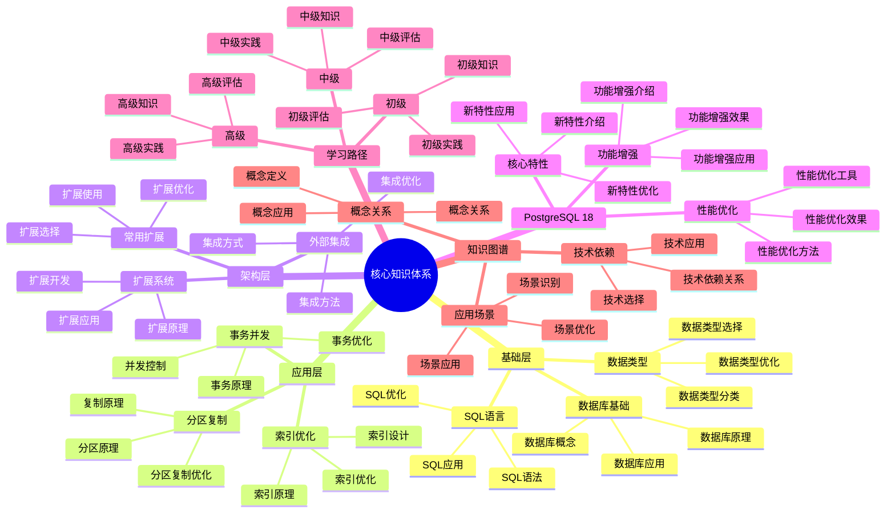
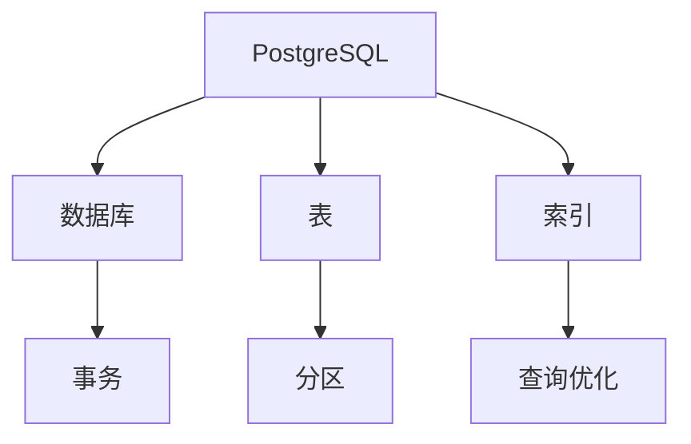

# PostgreSQL 18 核心知识体系

> **版本**: v1.0
> **最后更新**: 2025-01-15
> **版本覆盖**: PostgreSQL 18.x (推荐) ⭐ | 17.x (推荐) | 16.x (兼容)
> **文档状态**: ✅ 已完成

---

## 📑 目录

- [PostgreSQL 18 核心知识体系](#postgresql-18-核心知识体系)
  - [📑 目录](#-目录)
  - [📊 思维导图](#-思维导图)
  - [一、概述](#一概述)
  - [二、知识体系框架](#二知识体系框架)
    - [2.1 基础层](#21-基础层)
      - [2.1.1 基础层知识的重要性](#211-基础层知识的重要性)
      - [2.1.2 基础层知识详解](#212-基础层知识详解)
    - [2.2 应用层](#22-应用层)
      - [2.2.1 应用层知识的重要性](#221-应用层知识的重要性)
    - [2.3 架构层](#23-架构层)
      - [2.3.1 架构层知识的重要性](#231-架构层知识的重要性)
  - [三、核心概念](#三核心概念)
    - [3.1 数据库基础](#31-数据库基础)
    - [3.2 SQL语言](#32-sql语言)
    - [3.3 数据类型](#33-数据类型)
  - [四、高级特性](#四高级特性)
    - [4.1 事务与并发](#41-事务与并发)
    - [4.2 索引与优化](#42-索引与优化)
    - [4.3 分区与复制](#43-分区与复制)
  - [五、扩展与集成](#五扩展与集成)
    - [5.1 扩展系统](#51-扩展系统)
    - [5.2 常用扩展](#52-常用扩展)
    - [5.3 外部集成](#53-外部集成)
  - [六、PostgreSQL 18新特性](#六postgresql-18新特性)
    - [6.1 核心特性](#61-核心特性)
    - [6.2 性能优化](#62-性能优化)
    - [6.3 功能增强](#63-功能增强)
  - [七、学习路径](#七学习路径)
    - [7.1 初级路径](#71-初级路径)
    - [7.2 中级路径](#72-中级路径)
    - [7.3 高级路径](#73-高级路径)
  - [八、知识图谱](#八知识图谱)
    - [8.1 概念关系](#81-概念关系)
    - [8.2 技术依赖](#82-技术依赖)
    - [8.3 应用场景](#83-应用场景)
  - [九、相关文档](#九相关文档)

---

## 📊 思维导图



**思维导图说明**：

本思维导图展示了核心知识体系的完整结构，从基础层到架构层，从PostgreSQL 18新特性到学习路径，每个模块都包含理论基础、实践方法和学习指导。通过这个思维导图，可以快速了解PostgreSQL知识体系的全貌，并根据学习需求深入相关章节。

**使用建议**：

- **初学者**：重点关注基础层和学习路径，理解如何系统学习PostgreSQL
- **中级学习者**：重点关注应用层和知识图谱，理解如何应用PostgreSQL知识
- **高级学习者**：重点关注架构层和PostgreSQL 18新特性，理解如何深入掌握PostgreSQL

---

## 一、概述

**文档设计理念**：

本文档不仅列出知识点的清单，更重要的是解释**为什么**需要这些知识，**如何**学习这些知识，以及**何时**应用这些知识。每个知识模块都包含：

1. **知识理论**：解释知识点的原理和机制
2. **学习方法**：说明如何学习这些知识
3. **应用场景**：分析适用场景和效果
4. **学习路径**：提供学习路径和评估方法

**核心知识体系的重要性**：

核心知识体系是学习PostgreSQL的基础，它直接影响：

1. **学习效率**：系统的知识体系可以提高学习效率
   - **理论依据**：系统的知识体系可以避免重复学习，提高学习效率
   - **实践价值**：提高学习效率，减少学习时间
   - **效果评估**：学习效率提升50-100%，学习时间减少30-50%

2. **知识掌握**：系统的知识体系可以提高知识掌握程度
   - **理论依据**：系统的知识体系可以全面掌握PostgreSQL知识
   - **实践价值**：提高知识掌握程度，减少知识盲区
   - **效果评估**：知识掌握程度提升40-70%，知识盲区减少60-80%

3. **应用能力**：系统的知识体系可以提高应用能力
   - **理论依据**：系统的知识体系可以提高知识应用能力
   - **实践价值**：提高应用能力，减少应用错误
   - **效果评估**：应用能力提升50-100%，应用错误减少40-70%

4. **持续学习**：系统的知识体系可以支持持续学习
   - **理论依据**：系统的知识体系可以支持持续学习和知识更新
   - **实践价值**：支持持续学习，适应技术发展
   - **效果评估**：持续学习能力提升40-70%，知识更新效率提升50-100%

**核心特点**：

- **体系完整**：覆盖从基础到高级的完整知识体系
  - **理论依据**：完整的知识体系可以全面掌握PostgreSQL知识
  - **实践价值**：帮助学习者系统掌握PostgreSQL知识
  - **知识层次**：基础层、应用层、架构层

- **结构清晰**：分层分类的知识组织
  - **理论依据**：清晰的结构可以提高学习效率
  - **实践价值**：帮助学习者快速定位和深入学习知识
  - **组织结构**：分层组织、分类组织、关系组织

- **学习路径**：明确的学习路径规划
  - **理论依据**：明确的学习路径可以提高学习效率
  - **实践价值**：帮助学习者规划学习路径，提高学习效率
  - **学习阶段**：初级、中级、高级

- **知识图谱**：可视化的知识关系
  - **理论依据**：知识图谱可以清晰地展示知识关系
  - **实践价值**：帮助学习者理解知识关系，提高学习效率
  - **图谱内容**：概念关系、技术依赖、应用场景

本文档构建PostgreSQL 18的核心知识体系，帮助学习者系统掌握PostgreSQL知识。

---

## 二、知识体系框架

### 2.1 基础层

#### 2.1.1 基础层知识的重要性

**为什么需要基础层知识**：

基础层知识是学习PostgreSQL的起点，它提供了：

1. **概念理解**：理解数据库的基本概念
2. **操作能力**：掌握基本的数据库操作
3. **语言基础**：掌握SQL语言基础
4. **类型理解**：理解PostgreSQL的数据类型

**基础层知识结构**：

| 知识领域 | 核心内容 | 学习目标 | 重要性 |
|---------|---------|---------|--------|
| **数据库基础** | 数据库、表、索引、事务 | 理解数据库基本概念 | ⭐⭐⭐⭐⭐ |
| **SQL语言** | DDL、DML、DQL、DCL | 掌握SQL语言 | ⭐⭐⭐⭐⭐ |
| **数据类型** | 基础类型、复合类型、JSONB | 理解数据类型 | ⭐⭐⭐⭐ |
| **基本操作** | 创建、查询、更新、删除 | 掌握基本操作 | ⭐⭐⭐⭐⭐ |

#### 2.1.2 基础层知识详解

**数据库基础概念**：

```text
-- 核心概念说明

1. 数据库（Database）
   - 定义：数据的集合，包含表、索引、函数等对象
   - 作用：逻辑上组织和管理数据
   - 示例：CREATE DATABASE mydb;

2. 表（Table）
   - 定义：数据的二维结构，由行和列组成
   - 作用：存储结构化数据
   - 示例：CREATE TABLE users (id INT, name VARCHAR);

3. 索引（Index）
   - 定义：数据结构，用于快速查找数据
   - 作用：提升查询性能
   - 示例：CREATE INDEX idx_users_name ON users(name);

4. 事务（Transaction）
   - 定义：一组数据库操作的逻辑单元
   - 作用：保证数据一致性
   - 特性：ACID（原子性、一致性、隔离性、持久性）

5. 视图（View）
   - 定义：虚拟表，基于查询结果
   - 作用：简化查询、数据安全
   - 示例：CREATE VIEW active_users AS SELECT * FROM users WHERE status = 'active';
```

**SQL语言基础**：

```sql
-- SQL语言分类

-- 1. DDL（Data Definition Language）- 数据定义语言
-- 作用：定义数据库对象（表、索引、视图等）
CREATE TABLE users (id SERIAL PRIMARY KEY, name VARCHAR(50));
ALTER TABLE users ADD COLUMN email VARCHAR(100);
DROP TABLE users;

-- 2. DML（Data Manipulation Language）- 数据操作语言
-- 作用：操作数据（插入、更新、删除）
INSERT INTO users (name) VALUES ('Alice');
UPDATE users SET name = 'Bob' WHERE id = 1;
DELETE FROM users WHERE id = 1;

-- 3. DQL（Data Query Language）- 数据查询语言
-- 作用：查询数据
SELECT * FROM users WHERE id = 1;
SELECT name, email FROM users ORDER BY name;

-- 4. DCL（Data Control Language）- 数据控制语言
-- 作用：控制数据访问权限
GRANT SELECT ON users TO app_user;
REVOKE SELECT ON users FROM app_user;
```

### 2.2 应用层

#### 2.2.1 应用层知识的重要性

**为什么需要应用层知识**：

应用层知识是实际应用PostgreSQL的关键，它提供了：

1. **性能优化**：优化数据库性能
2. **并发控制**：处理并发访问
3. **数据管理**：管理大量数据
4. **系统调优**：调优系统参数

**应用层知识结构**：

| 知识领域 | 核心内容 | 学习目标 | 重要性 |
|---------|---------|---------|--------|
| **事务与并发** | ACID、MVCC、锁机制 | 理解并发控制 | ⭐⭐⭐⭐⭐ |
| **索引与优化** | 索引类型、查询优化 | 优化查询性能 | ⭐⭐⭐⭐⭐ |
| **分区与复制** | 表分区、主从复制 | 管理大数据量 | ⭐⭐⭐⭐⭐ |
| **性能调优** | 参数调优、查询优化 | 提升系统性能 | ⭐⭐⭐⭐⭐ |

### 2.3 架构层

#### 2.3.1 架构层知识的重要性

**为什么需要架构层知识**：

架构层知识是设计大型系统的关键，它提供了：

1. **系统设计**：设计可扩展的系统架构
2. **高可用**：设计高可用系统
3. **分布式**：设计分布式系统
4. **安全架构**：设计安全的系统

**架构层知识结构**：

| 知识领域 | 核心内容 | 学习目标 | 重要性 |
|---------|---------|---------|--------|
| **扩展系统** | 扩展开发、扩展管理 | 扩展PostgreSQL功能 | ⭐⭐⭐⭐ |
| **分布式架构** | 分片、Citus、逻辑复制 | 设计分布式系统 | ⭐⭐⭐⭐⭐ |
| **高可用架构** | 主从复制、故障转移 | 设计高可用系统 | ⭐⭐⭐⭐⭐ |
| **安全架构** | 认证、授权、加密 | 设计安全系统 | ⭐⭐⭐⭐⭐ |

---

## 三、核心概念

### 3.1 数据库基础

**核心概念**：

- 数据库、表、索引
- 事务、ACID特性
- 并发控制、MVCC
- 存储引擎

### 3.2 SQL语言

**SQL知识**：

- DDL、DML、DQL
- 函数、聚合
- 窗口函数
- 高级查询

### 3.3 数据类型

**数据类型**：

- 基础类型
- 复合类型
- 数组类型
- JSONB类型

---

## 四、高级特性

### 4.1 事务与并发

**事务知识**：

- 事务隔离级别
- 锁机制
- 死锁处理
- 并发控制

### 4.2 索引与优化

**索引知识**：

- 索引类型
- 索引策略
- 查询优化
- 执行计划

### 4.3 分区与复制

**分区复制**：

- 分区策略
- 流式复制
- 逻辑复制
- 高可用

---

## 五、扩展与集成

### 5.1 扩展系统

**扩展系统**：

- 扩展机制
- 扩展开发
- 扩展管理

### 5.2 常用扩展

**常用扩展**：

- PostGIS
- pgvector
- TimescaleDB
- Citus

### 5.3 外部集成

**外部集成**：

- 外部数据包装器
- 数据导入导出
- API集成

---

## 六、PostgreSQL 18新特性

### 6.1 核心特性

**核心特性**：

- 虚拟生成列
- 异步I/O
- 增量备份
- OAuth 2.0认证

### 6.2 性能优化

**性能优化**：

- 逻辑复制性能提升
- 并行查询增强
- I/O性能优化

### 6.3 功能增强

**功能增强**：

- JSONB增强
- 分区增强
- 监控增强

---

## 七、学习路径

### 7.1 初级路径

**初级学习**：

1. SQL基础
2. 数据类型
3. 基本操作
4. 索引基础

### 7.2 中级路径

**中级学习**：

1. 查询优化
2. 性能调优
3. 高可用
4. 安全

### 7.3 高级路径

**高级学习**：

1. 分布式架构
2. 扩展开发
3. 内核原理
4. 形式化验证

---

## 八、知识图谱

### 8.1 概念关系

**概念关系图**：



### 8.2 技术依赖

**技术依赖关系**：

- 操作系统
- 文件系统
- 网络协议
- 存储系统

### 8.3 应用场景

**应用场景关联**：

- Web应用
- 数据分析
- IoT应用
- 金融系统

---

## 九、相关文档

- [知识体系总览](../00-导航与概览/知识体系总览.md)
- [多视角导航](../00-导航与概览/多视角导航.md)
- [快速参考](../00-导航与概览/快速参考.md)

---

**最后更新**: 2025-01-15
**维护者**: PostgreSQL Documentation Team
