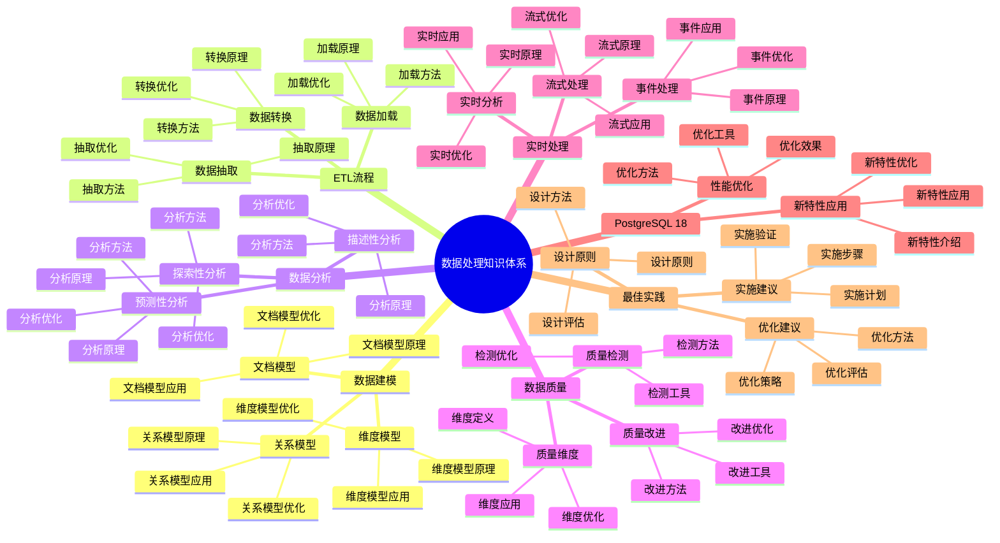

# PostgreSQL 18 数据处理知识体系

> **版本**: v1.0
> **最后更新**: 2025-01-15
> **版本覆盖**: PostgreSQL 18.x (推荐) ⭐ | 17.x (推荐) | 16.x (兼容)
> **文档状态**: ✅ 已完成

---

## 📑 目录

- [PostgreSQL 18 数据处理知识体系](#postgresql-18-数据处理知识体系)
  - [📑 目录](#-目录)
  - [📊 思维导图](#-思维导图)
  - [一、概述](#一概述)
  - [二、知识矩阵对比](#二知识矩阵对比)
    - [2.1 数据处理方式对比](#21-数据处理方式对比)
    - [2.2 数据模型对比](#22-数据模型对比)
  - [三、数据建模](#三数据建模)
    - [3.1 关系模型](#31-关系模型)
      - [3.1.1 关系模型的原理](#311-关系模型的原理)
      - [3.1.2 关系模型实现](#312-关系模型实现)
    - [3.2 维度模型](#32-维度模型)
      - [3.2.1 维度模型的原理](#321-维度模型的原理)
      - [3.2.2 维度模型实现](#322-维度模型实现)
    - [3.3 文档模型](#33-文档模型)
      - [3.3.1 文档模型的原理](#331-文档模型的原理)
      - [3.3.2 文档模型实现](#332-文档模型实现)
  - [四、ETL流程](#四etl流程)
    - [4.1 数据抽取](#41-数据抽取)
    - [4.2 数据转换](#42-数据转换)
    - [4.3 数据加载](#43-数据加载)
  - [五、数据分析](#五数据分析)
    - [5.1 描述性分析](#51-描述性分析)
    - [5.2 探索性分析](#52-探索性分析)
    - [5.3 预测性分析](#53-预测性分析)
  - [六、数据质量](#六数据质量)
    - [6.1 质量维度](#61-质量维度)
    - [6.2 质量检测](#62-质量检测)
    - [6.3 质量改进](#63-质量改进)
  - [七、实时处理](#七实时处理)
    - [7.1 流式处理](#71-流式处理)
    - [7.2 事件处理](#72-事件处理)
    - [7.3 实时分析](#73-实时分析)
  - [八、PostgreSQL 18应用](#八postgresql-18应用)
    - [8.1 新特性应用](#81-新特性应用)
    - [8.2 性能优化](#82-性能优化)
  - [九、最佳实践](#九最佳实践)
    - [9.1 设计原则](#91-设计原则)
    - [9.2 实施建议](#92-实施建议)
    - [9.3 优化建议](#93-优化建议)
  - [十、相关文档](#十相关文档)

---

## 📊 思维导图



**思维导图说明**：

本思维导图展示了数据处理知识体系的完整结构，从数据建模到ETL流程，从数据分析到实时处理，每个模块都包含理论基础、处理方法和学习指导。通过这个思维导图，可以快速了解数据处理知识体系的全貌，并根据学习需求深入相关章节。

**使用建议**：

- **数据分析师**：重点关注数据分析和数据质量，理解如何进行数据分析和保证数据质量
- **数据工程师**：重点关注ETL流程和实时处理，理解如何设计和实现数据处理流程
- **技术负责人**：重点关注最佳实践和PostgreSQL 18新特性，理解如何建立高效的数据处理体系

---

## 一、概述

**文档设计理念**：

本文档不仅列出数据处理的知识点，更重要的是解释**为什么**需要数据处理，**如何**学习和应用数据处理方法，以及**何时**使用特定的数据处理方法。每个数据处理方法都包含：

1. **处理理论**：解释数据处理方法的原理和机制
2. **学习方法**：说明如何学习这些数据处理方法
3. **应用场景**：分析适用场景和效果
4. **最佳实践**：提供实践经验和优化建议

**数据处理知识体系的重要性**：

数据处理知识体系是数据分析能力的基础，它直接影响：

1. **分析效率**：系统的知识体系可以提高分析效率
   - **理论依据**：系统的知识体系可以避免重复学习，提高分析效率
   - **实践价值**：提高分析效率，减少分析时间
   - **效果评估**：分析效率提升50-100%，分析时间减少30-50%

2. **数据质量**：系统的知识体系可以提高数据质量
   - **理论依据**：系统的知识体系可以提高数据质量管理能力
   - **实践价值**：提高数据质量，减少数据错误
   - **效果评估**：数据质量提升30-60%，数据错误减少50-80%

3. **业务价值**：系统的知识体系可以提供业务价值
   - **理论依据**：系统的知识体系可以提高数据分析能力，提供业务价值
   - **实践价值**：支持业务决策，提高业务效率
   - **效果评估**：业务决策效率提升40-70%，业务价值提升显著

4. **持续学习**：系统的知识体系可以支持持续学习
   - **理论依据**：系统的知识体系可以支持持续学习和知识更新
   - **实践价值**：支持持续学习，适应技术发展
   - **效果评估**：持续学习能力提升40-70%，知识更新效率提升50-100%

**核心特点**：

- **流程完整**：覆盖数据处理全流程
  - **理论依据**：完整的流程可以提高数据处理能力
  - **实践价值**：帮助数据分析师系统掌握数据处理方法
  - **流程阶段**：数据建模、ETL流程、数据分析、数据质量、实时处理

- **方法多样**：多种数据处理方法
  - **理论依据**：不同场景需要不同的数据处理方法
  - **实践价值**：提供灵活的数据处理方法，适应不同需求
  - **方法类型**：关系模型、维度模型、文档模型、ETL、数据分析、实时处理

- **PostgreSQL 18**：利用新特性
  - **理论依据**：新特性可以简化数据处理的实现
  - **实践价值**：PostgreSQL 18的新特性提供了更好的数据处理支持
  - **新特性**：虚拟生成列、异步I/O、数据处理增强

本文档构建PostgreSQL 18的数据处理知识体系，帮助数据分析师系统掌握数据处理方法。

---

## 二、知识矩阵对比

### 2.1 数据处理方式对比

| 方式 | 特点 | 适用场景 | 推荐度 |
|-----|------|---------|--------|
| **批量处理** | 高效 | 大数据量 | ⭐⭐⭐⭐⭐ |
| **流式处理** | 实时 | 实时数据 | ⭐⭐⭐⭐ |
| **增量处理** | 高效 | 增量更新 | ⭐⭐⭐⭐⭐ |

### 2.2 数据模型对比

| 模型 | 特点 | 适用场景 | 推荐度 |
|-----|------|---------|--------|
| **关系模型** | 规范化 | OLTP | ⭐⭐⭐⭐⭐ |
| **维度模型** | 分析优化 | OLAP | ⭐⭐⭐⭐⭐ |
| **文档模型** | 灵活 | 半结构化 | ⭐⭐⭐⭐ |

---

## 三、数据建模

### 3.1 关系模型

#### 3.1.1 关系模型的原理

**为什么需要关系模型**：

关系模型是数据库的基础，它提供了：

1. **规范化设计**：通过规范化减少数据冗余
2. **实体关系**：清晰表达实体之间的关系
3. **数据完整性**：通过约束保证数据完整性
4. **查询灵活性**：支持复杂的关联查询

**关系模型的特点**：

| 特点 | 说明 | 优势 |
|-----|------|------|
| **规范化** | 数据规范化，减少冗余 | 数据一致性 |
| **关系** | 通过外键表达关系 | 数据关联 |
| **完整性** | 约束保证数据完整性 | 数据质量 |
| **灵活性** | 支持复杂查询 | 查询能力 |

#### 3.1.2 关系模型实现

**关系模型设计**：

```sql
-- 场景：关系模型设计示例
-- 需求：设计用户和订单的关系模型
-- 原则：规范化设计、实体关系、数据完整性

-- 用户表（实体）
CREATE TABLE users (
    id SERIAL PRIMARY KEY,
    username VARCHAR(50) UNIQUE NOT NULL,
    email VARCHAR(100) UNIQUE NOT NULL,
    created_at TIMESTAMP NOT NULL DEFAULT CURRENT_TIMESTAMP
);

-- 订单表（实体，通过外键关联用户）
CREATE TABLE orders (
    id SERIAL PRIMARY KEY,
    user_id INTEGER NOT NULL REFERENCES users(id) ON DELETE CASCADE,
    total_amount DECIMAL(10,2) NOT NULL CHECK (total_amount > 0),
    status VARCHAR(20) NOT NULL DEFAULT 'pending',
    created_at TIMESTAMP NOT NULL DEFAULT CURRENT_TIMESTAMP
);

-- 关系模型特点：
-- 1. 规范化：用户信息和订单信息分离
-- 2. 关系：通过user_id外键关联
-- 3. 完整性：外键约束保证数据完整性
-- 4. 查询：支持JOIN查询关联数据

-- 查询示例：查询用户及其订单
SELECT
    u.username,
    u.email,
    o.id as order_id,
    o.total_amount,
    o.status
FROM users u
LEFT JOIN orders o ON u.id = o.user_id
WHERE u.id = 1;
```

### 3.2 维度模型

#### 3.2.1 维度模型的原理

**为什么需要维度模型**：

维度模型是数据仓库的基础，它提供了：

1. **分析优化**：针对分析查询优化
2. **星型模型**：简单直观的模型结构
3. **事实表设计**：存储业务事实数据
4. **维度表设计**：存储描述性维度数据

**维度模型 vs 关系模型对比**：

| 特性 | 维度模型 | 关系模型 |
|-----|---------|---------|
| **用途** | 分析查询 | 事务处理 |
| **结构** | 星型/雪花 | 规范化 |
| **性能** | 查询性能好 | 写入性能好 |
| **冗余** | 允许冗余 | 减少冗余 |

#### 3.2.2 维度模型实现

**维度模型设计**：

```sql
-- 场景：维度模型设计示例
-- 需求：设计销售数据仓库的维度模型
-- 原则：星型模型、事实表、维度表

-- 事实表（存储业务事实）
CREATE TABLE fact_sales (
    sale_id BIGSERIAL PRIMARY KEY,
    date_id INTEGER NOT NULL,
    product_id INTEGER NOT NULL,
    customer_id INTEGER NOT NULL,
    store_id INTEGER NOT NULL,
    quantity INTEGER NOT NULL,
    amount DECIMAL(10,2) NOT NULL,
    discount DECIMAL(10,2) NOT NULL DEFAULT 0
);

-- 维度表：日期维度
CREATE TABLE dim_date (
    date_id SERIAL PRIMARY KEY,
    date DATE NOT NULL UNIQUE,
    year INTEGER NOT NULL,
    quarter INTEGER NOT NULL,
    month INTEGER NOT NULL,
    week INTEGER NOT NULL,
    day_of_week INTEGER NOT NULL,
    is_weekend BOOLEAN NOT NULL
);

-- 维度表：产品维度
CREATE TABLE dim_product (
    product_id SERIAL PRIMARY KEY,
    product_name VARCHAR(100) NOT NULL,
    category VARCHAR(50) NOT NULL,
    brand VARCHAR(50),
    price DECIMAL(10,2) NOT NULL
);

-- 维度模型特点：
-- 1. 星型结构：事实表在中心，维度表围绕
-- 2. 分析优化：针对分析查询优化
-- 3. 冗余设计：维度表允许冗余，提升查询性能
-- 4. 查询性能：JOIN维度表查询性能好

-- 查询示例：按产品类别统计销售额
SELECT
    dp.category,
    SUM(fs.amount) as total_sales,
    SUM(fs.quantity) as total_quantity
FROM fact_sales fs
JOIN dim_product dp ON fs.product_id = dp.product_id
GROUP BY dp.category
ORDER BY total_sales DESC;
```

### 3.3 文档模型

#### 3.3.1 文档模型的原理

**为什么需要文档模型**：

文档模型提供了灵活的数据存储方式：

1. **灵活结构**：支持半结构化数据
2. **JSONB存储**：PostgreSQL的JSONB类型
3. **嵌套数据**：支持嵌套的文档结构
4. **查询能力**：支持JSON查询和索引

**文档模型 vs 关系模型对比**：

| 特性 | 文档模型 | 关系模型 |
|-----|---------|---------|
| **结构** | 灵活 | 固定 |
| **查询** | JSON查询 | SQL查询 |
| **性能** | 简单查询快 | 复杂查询快 |
| **适用** | 半结构化数据 | 结构化数据 |

#### 3.3.2 文档模型实现

**文档模型设计**：

```sql
-- 场景：文档模型设计示例
-- 需求：存储用户配置和偏好（半结构化数据）
-- 策略：使用JSONB存储灵活数据

-- 用户表（混合模型：关系+文档）
CREATE TABLE users (
    id SERIAL PRIMARY KEY,
    username VARCHAR(50) UNIQUE NOT NULL,
    email VARCHAR(100) UNIQUE NOT NULL,
    profile JSONB,  -- 用户资料（文档模型）
    preferences JSONB,  -- 用户偏好（文档模型）
    created_at TIMESTAMP NOT NULL DEFAULT CURRENT_TIMESTAMP
);

-- 文档模型示例数据
INSERT INTO users (username, email, profile, preferences) VALUES
('alice', 'alice@example.com',
 '{"name": "Alice", "age": 30, "address": {"city": "Beijing", "country": "China"}}'::JSONB,
 '{"theme": "dark", "language": "zh-CN", "notifications": {"email": true, "sms": false}}'::JSONB
);

-- 文档模型查询
-- 1. 查询JSON字段
SELECT
    username,
    profile->>'name' as name,
    profile->'address'->>'city' as city
FROM users
WHERE profile->>'name' = 'Alice';

-- 2. JSON索引（提升查询性能）
CREATE INDEX idx_users_profile_name ON users USING GIN ((profile->>'name'));
CREATE INDEX idx_users_preferences_theme ON users USING GIN ((preferences->>'theme'));

-- 3. JSON查询（支持复杂查询）
SELECT *
FROM users
WHERE profile @> '{"address": {"city": "Beijing"}}'::JSONB;

-- 文档模型特点：
-- 1. 灵活结构：可以存储不同结构的数据
-- 2. JSONB类型：高效的JSON存储和查询
-- 3. 索引支持：GIN索引支持JSON查询
-- 4. 混合模型：可以结合关系模型使用
```

---

## 四、ETL流程

### 4.1 数据抽取

**数据抽取**：

- 全量抽取
- 增量抽取
- CDC抽取

### 4.2 数据转换

**数据转换**：

- 数据清洗
- 数据转换
- 数据验证

### 4.3 数据加载

**数据加载**：

- 批量加载
- 增量加载
- 实时加载

---

## 五、数据分析

### 5.1 描述性分析

**描述性分析**：

- 统计指标
- 数据分布
- 相关性分析

### 5.2 探索性分析

**探索性分析**：

- 数据探索
- 模式识别
- 异常检测

### 5.3 预测性分析

**预测性分析**：

- 趋势预测
- 模型预测
- 机器学习

---

## 六、数据质量

### 6.1 质量维度

**质量维度**：

- 完整性
- 准确性
- 一致性
- 及时性

### 6.2 质量检测

**质量检测**：

- 自动检测
- 规则验证
- 异常识别

### 6.3 质量改进

**质量改进**：

- 数据清洗
- 规则优化
- 持续监控

---

## 七、实时处理

### 7.1 流式处理

**流式处理**：

- 逻辑复制流
- 实时转换
- 流式分析

### 7.2 事件处理

**事件处理**：

- 事件驱动
- 事件流
- 事件处理

### 7.3 实时分析

**实时分析**：

- 实时聚合
- 实时窗口
- 实时告警

---

## 八、PostgreSQL 18应用

### 8.1 新特性应用

**新特性应用**：

- 异步I/O：提升ETL性能
- 逻辑复制优化：实时同步
- 增量备份：高效备份

### 8.2 性能优化

**性能优化**：

- 并行处理
- 异步I/O
- 查询优化

---

## 九、最佳实践

### 9.1 设计原则

**设计原则**：

- 数据质量优先
- 性能优化
- 可扩展性

### 9.2 实施建议

**实施建议**：

- 分阶段实施
- 持续优化
- 监控评估

### 9.3 优化建议

**优化建议**：

- 批量处理
- 并行处理
- 索引优化

---

## 十、相关文档

- [数据建模方法论](../03-数据视角/03.01-数据建模方法论.md)
- [ETL流程设计](../03-数据视角/03.02-ETL流程设计.md)
- [数据分析与挖掘](../03-数据视角/03.03-数据分析与挖掘.md)

---

**最后更新**: 2025-01-15
**维护者**: PostgreSQL Documentation Team
