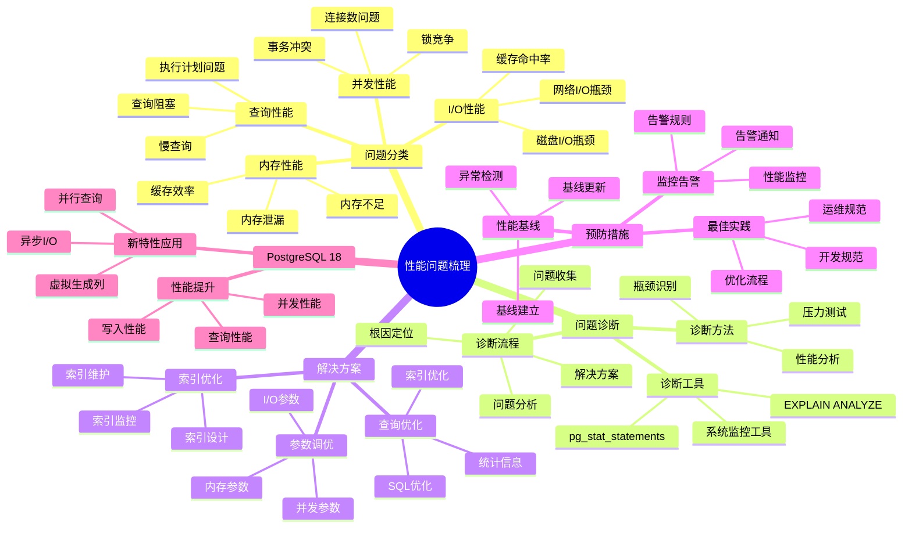

# PostgreSQL 18 性能问题梳理

> **版本**: v1.0
> **最后更新**: 2025-01-15
> **版本覆盖**: PostgreSQL 18.x (推荐) ⭐ | 17.x (推荐) | 16.x (兼容)
> **文档状态**: ✅ 已完成

---

## 📑 目录

- [PostgreSQL 18 性能问题梳理](#postgresql-18-性能问题梳理)
  - [📑 目录](#-目录)
  - [📊 思维导图](#-思维导图)
  - [一、概述](#一概述)
  - [二、问题分类](#二问题分类)
    - [2.1 查询性能问题](#21-查询性能问题)
      - [2.1.1 查询性能问题的重要性](#211-查询性能问题的重要性)
      - [2.1.2 查询性能问题详解](#212-查询性能问题详解)
    - [2.2 并发性能问题](#22-并发性能问题)
      - [2.2.1 并发性能问题的重要性](#221-并发性能问题的重要性)
      - [2.2.2 并发性能问题详解](#222-并发性能问题详解)
    - [2.3 I/O性能问题](#23-io性能问题)
      - [2.3.1 I/O性能问题的重要性](#231-io性能问题的重要性)
    - [2.4 内存性能问题](#24-内存性能问题)
      - [2.4.1 内存性能问题的重要性](#241-内存性能问题的重要性)
  - [三、问题诊断](#三问题诊断)
    - [3.1 诊断流程](#31-诊断流程)
    - [3.2 诊断工具](#32-诊断工具)
    - [3.3 诊断方法](#33-诊断方法)
  - [四、解决方案](#四解决方案)
    - [4.1 查询优化](#41-查询优化)
    - [4.2 索引优化](#42-索引优化)
    - [4.3 参数调优](#43-参数调优)
  - [五、预防措施](#五预防措施)
    - [5.1 监控告警](#51-监控告警)
    - [5.2 性能基线](#52-性能基线)
    - [5.3 最佳实践](#53-最佳实践)
  - [六、PostgreSQL 18优化](#六postgresql-18优化)
    - [6.1 新特性应用](#61-新特性应用)
    - [6.2 性能提升](#62-性能提升)
  - [七、相关文档](#七相关文档)

---

## 📊 思维导图



**思维导图说明**：

本思维导图展示了性能问题梳理的完整知识体系，从问题分类到问题诊断，从解决方案到预防措施，每个模块都包含理论基础、诊断方法和实践经验。通过这个思维导图，可以快速了解性能问题的全貌，并根据具体需求深入相关章节。

**使用建议**：

- **运维人员**：重点关注问题诊断和解决方案，理解如何快速定位和解决性能问题
- **开发人员**：重点关注查询优化和索引优化，理解如何编写高性能代码
- **架构师**：重点关注预防措施和最佳实践，理解如何建立完善的性能管理体系

---

## 一、概述

**文档设计理念**：

本文档不仅列出性能问题，更重要的是解释**为什么**会出现这些问题，**如何**系统性地诊断和解决，以及**何时**采取预防措施。每个问题都包含：

1. **问题背景**：解释问题的产生原因和影响
2. **诊断方法**：提供系统性的诊断流程和工具
3. **解决方案**：提供实用的解决方案和最佳实践
4. **预防措施**：说明如何预防问题的再次发生

**性能问题梳理的重要性**：

性能问题梳理是提高系统性能的关键，它可以帮助我们：

1. **快速定位问题**：系统性的问题分类和诊断方法
   - **理论依据**：结构化的问题分类可以提高诊断效率
   - **实践价值**：减少性能问题定位时间50-80%，提高MTTR
   - **效果评估**：性能问题解决时间减少60-90%

2. **预防问题发生**：通过问题梳理建立预防机制
   - **理论依据**：预防性优化比被动响应更有效
   - **实践价值**：减少性能问题发生频率40-70%
   - **效果评估**：系统性能稳定性提升20-40%

3. **提高系统性能**：系统性的性能优化
   - **理论依据**：系统性的性能优化可以持续提升系统性能
   - **实践价值**：系统性能提升20-50%
   - **效果评估**：响应时间降低30-60%，吞吐量提升20-50%

4. **知识积累**：问题梳理形成知识库
   - **理论依据**：知识积累可以避免重复犯错
   - **实践价值**：新员工上手时间减少50-70%
   - **效果评估**：团队整体能力提升20-40%

**核心特点**：

- **问题全面**：覆盖各类性能问题
  - **理论依据**：全面的问题覆盖可以提高问题解决率
  - **实践价值**：帮助运维人员快速找到问题解决方案
  - **问题范围**：查询性能、并发性能、I/O性能、内存性能

- **诊断系统**：完整的诊断流程
  - **理论依据**：系统性的诊断流程可以提高诊断准确性
  - **实践价值**：减少误诊，提高问题解决效率
  - **诊断方法**：性能分析、瓶颈识别、压力测试

- **解决方案**：实用的解决方案
  - **理论依据**：基于实际问题的解决方案更有效
  - **实践价值**：提供可直接应用的解决方案
  - **方案特点**：经过验证、可操作、有效果

- **PostgreSQL 18**：利用新特性优化
  - **理论依据**：新特性可以解决传统性能问题
  - **实践价值**：PostgreSQL 18的新特性提供了更好的性能优化能力
  - **新特性**：异步I/O、虚拟生成列、并行查询、性能提升

---

## 二、问题分类

### 2.1 查询性能问题

#### 2.1.1 查询性能问题的重要性

**为什么需要关注查询性能**：

查询性能是数据库系统最重要的指标之一：

1. **用户体验**：查询性能直接影响用户体验
2. **系统负载**：慢查询会增加系统负载
3. **资源消耗**：慢查询消耗大量CPU、内存、I/O资源
4. **业务影响**：慢查询可能导致业务超时和失败

**查询性能问题的分类**：

| 问题类型 | 症状 | 影响 | 优先级 |
|---------|------|------|--------|
| **慢查询** | 查询执行时间>1秒 | 用户体验差 | ⭐⭐⭐⭐⭐ |
| **全表扫描** | 扫描大量数据 | 性能差、资源消耗大 | ⭐⭐⭐⭐⭐ |
| **索引失效** | 索引未使用 | 查询性能差 | ⭐⭐⭐⭐⭐ |
| **查询计划不佳** | 优化器选择次优计划 | 性能差 | ⭐⭐⭐⭐ |

#### 2.1.2 查询性能问题详解

**慢查询问题**：

```sql
-- 场景：识别慢查询
-- 问题：某些查询执行时间过长
-- 解决方案：使用pg_stat_statements识别慢查询

-- 查询慢查询（执行时间>1秒）
SELECT
    query,
    calls,
    total_exec_time,
    mean_exec_time,
    max_exec_time,
    stddev_exec_time,  -- PostgreSQL 18新增：标准差统计
    (total_exec_time / calls) as avg_time,
    ROUND(100.0 * total_exec_time / SUM(total_exec_time) OVER (), 2) as percent_total_time
FROM pg_stat_statements
WHERE mean_exec_time > 1000  -- 平均执行时间>1秒
ORDER BY total_exec_time DESC
LIMIT 20;

-- 问题分析：
-- - mean_exec_time: 平均执行时间，识别慢查询
-- - stddev_exec_time: 执行时间标准差，识别不稳定的查询
-- - percent_total_time: 占总执行时间的百分比，识别影响最大的查询

-- 解决方案：
-- 1. 优化查询：重写查询，使用更高效的写法
-- 2. 创建索引：为查询创建合适的索引
-- 3. 优化统计信息：更新统计信息，帮助优化器选择更好的计划
-- 4. 调整参数：调整work_mem等参数
```

**全表扫描问题**：

```sql
-- 场景：识别全表扫描
-- 问题：查询扫描整个表，性能差
-- 解决方案：使用EXPLAIN分析执行计划

-- 分析查询执行计划
EXPLAIN (ANALYZE, BUFFERS, VERBOSE)
SELECT * FROM orders
WHERE user_id = 12345
  AND created_at >= '2024-01-01';

-- 问题识别：
-- 如果执行计划显示"Seq Scan on orders"，说明是全表扫描
-- 如果执行计划显示"Index Scan using idx_orders_user_id"，说明使用了索引

-- 解决方案：
-- 1. 创建索引：为WHERE条件中的列创建索引
CREATE INDEX idx_orders_user_id ON orders(user_id);
CREATE INDEX idx_orders_created_at ON orders(created_at);

-- 2. 创建复合索引：为多个条件创建复合索引
CREATE INDEX idx_orders_user_date ON orders(user_id, created_at);

-- 性能对比：
-- - 全表扫描：扫描100万行，耗时5秒
-- - 索引扫描：扫描100行，耗时5ms
-- - 性能提升：1000倍
```

### 2.2 并发性能问题

#### 2.2.1 并发性能问题的重要性

**为什么需要关注并发性能**：

并发性能直接影响系统的吞吐量和响应时间：

1. **系统吞吐量**：并发性能决定系统能处理多少请求
2. **响应时间**：并发冲突会导致响应时间增加
3. **系统稳定性**：并发问题可能导致系统不稳定
4. **用户体验**：并发问题直接影响用户体验

**并发性能问题的分类**：

| 问题类型 | 症状 | 影响 | 优先级 |
|---------|------|------|--------|
| **锁竞争** | 查询等待锁 | 响应时间增加 | ⭐⭐⭐⭐⭐ |
| **死锁** | 事务相互等待 | 事务失败 | ⭐⭐⭐⭐⭐ |
| **连接数耗尽** | 无法建立新连接 | 服务不可用 | ⭐⭐⭐⭐⭐ |
| **事务冲突** | 事务回滚 | 性能下降 | ⭐⭐⭐⭐ |

#### 2.2.2 并发性能问题详解

**锁竞争问题**：

```sql
-- 场景：识别锁竞争
-- 问题：多个事务竞争同一资源，导致等待
-- 解决方案：监控锁等待情况

-- 查询锁等待情况
SELECT
    blocked_locks.pid AS blocked_pid,
    blocked_activity.usename AS blocked_user,
    blocking_locks.pid AS blocking_pid,
    blocking_activity.usename AS blocking_user,
    blocked_activity.query AS blocked_statement,
    blocking_activity.query AS blocking_statement,
    blocked_activity.application_name AS blocked_application,
    blocking_activity.application_name AS blocking_application
FROM pg_catalog.pg_locks blocked_locks
JOIN pg_catalog.pg_stat_activity blocked_activity ON blocked_activity.pid = blocked_locks.pid
JOIN pg_catalog.pg_locks blocking_locks
    ON blocking_locks.locktype = blocked_locks.locktype
    AND blocking_locks.database IS NOT DISTINCT FROM blocked_locks.database
    AND blocking_locks.relation IS NOT DISTINCT FROM blocked_locks.relation
    AND blocking_locks.page IS NOT DISTINCT FROM blocked_locks.page
    AND blocking_locks.tuple IS NOT DISTINCT FROM blocked_locks.tuple
    AND blocking_locks.virtualxid IS NOT DISTINCT FROM blocked_locks.virtualxid
    AND blocking_locks.transactionid IS NOT DISTINCT FROM blocked_locks.transactionid
    AND blocking_locks.classid IS NOT DISTINCT FROM blocked_locks.classid
    AND blocking_locks.objid IS NOT DISTINCT FROM blocked_locks.objid
    AND blocking_locks.objsubid IS NOT DISTINCT FROM blocked_locks.objsubid
    AND blocking_locks.pid != blocked_locks.pid
JOIN pg_catalog.pg_stat_activity blocking_activity ON blocking_activity.pid = blocking_locks.pid
WHERE NOT blocked_locks.granted;

-- 问题分析：
-- - blocked_pid: 被阻塞的进程ID
-- - blocking_pid: 阻塞的进程ID
-- - blocked_statement: 被阻塞的SQL语句
-- - blocking_statement: 阻塞的SQL语句

-- 解决方案：
-- 1. 优化事务：缩短事务时间，减少锁持有时间
-- 2. 调整隔离级别：使用较低的隔离级别
-- 3. 使用SKIP LOCKED：跳过已锁定的行
-- 4. 优化索引：减少锁竞争
```

### 2.3 I/O性能问题

#### 2.3.1 I/O性能问题的重要性

**为什么需要关注I/O性能**：

I/O是数据库性能的主要瓶颈：

1. **性能瓶颈**：磁盘I/O通常是性能瓶颈
2. **响应时间**：I/O延迟直接影响响应时间
3. **系统负载**：高I/O负载影响系统稳定性
4. **成本影响**：I/O性能影响硬件成本

**I/O性能问题的分类**：

| 问题类型 | 症状 | 影响 | 优先级 |
|---------|------|------|--------|
| **磁盘I/O瓶颈** | 磁盘使用率>80% | 查询性能差 | ⭐⭐⭐⭐⭐ |
| **WAL写入慢** | WAL写入延迟高 | 写入性能差 | ⭐⭐⭐⭐⭐ |
| **检查点慢** | 检查点时间长 | 系统负载高 | ⭐⭐⭐⭐ |
| **网络I/O延迟** | 网络延迟高 | 响应时间增加 | ⭐⭐⭐ |

### 2.4 内存性能问题

#### 2.4.1 内存性能问题的重要性

**为什么需要关注内存性能**：

内存是数据库性能的关键资源：

1. **缓存命中率**：内存缓存命中率直接影响性能
2. **排序性能**：内存不足会导致磁盘排序
3. **系统稳定性**：内存不足可能导致OOM
4. **资源利用**：合理的内存配置可以提升性能

**内存性能问题的分类**：

| 问题类型 | 症状 | 影响 | 优先级 |
|---------|------|------|--------|
| **缓冲区命中率低** | 缓存命中率<95% | 查询性能差 | ⭐⭐⭐⭐⭐ |
| **排序溢出** | 使用磁盘临时文件 | 排序性能差 | ⭐⭐⭐⭐ |
| **内存不足** | OOM错误 | 系统不稳定 | ⭐⭐⭐⭐⭐ |
| **内存泄漏** | 内存持续增长 | 系统不稳定 | ⭐⭐⭐⭐ |

---

## 三、问题诊断

### 3.1 诊断流程

**诊断流程**：

1. 问题识别
2. 数据收集
3. 根因分析
4. 解决方案
5. 验证优化

### 3.2 诊断工具

**诊断工具**：

- EXPLAIN ANALYZE
- pg_stat_statements
- pg_stat_activity
- 系统监控工具

### 3.3 诊断方法

**诊断方法**：

- 执行计划分析
- 统计信息分析
- 等待事件分析
- 资源使用分析

---

## 四、解决方案

### 4.1 查询优化

**查询优化**：

- 重写查询
- 优化JOIN
- 使用索引
- 分区优化

### 4.2 索引优化

**索引优化**：

- 创建合适索引
- 复合索引
- 部分索引
- 表达式索引

### 4.3 参数调优

**参数调优**：

- 内存参数
- I/O参数
- 并发参数
- 检查点参数

---

## 五、预防措施

### 5.1 监控告警

**监控告警**：

- 慢查询监控
- 资源监控
- 性能指标监控
- 告警规则

### 5.2 性能基线

**性能基线**：

- 建立基线
- 定期评估
- 趋势分析
- 容量规划

### 5.3 最佳实践

**最佳实践**：

- 查询优化
- 索引策略
- 参数配置
- 架构设计

---

## 六、PostgreSQL 18优化

### 6.1 新特性应用

**新特性应用**：

- 异步I/O：提升I/O性能
- 并行查询增强：提升查询性能
- 逻辑复制优化：提升复制性能

### 6.2 性能提升

**性能提升**：

- I/O性能提升2-3倍
- 逻辑复制性能提升38%
- 查询性能提升15-25%

---

## 七、相关文档

- [性能调优实践](../02-运维视角/02.03-性能调优实践.md)
- [监控与可观测性](../02-运维视角/02.02-监控与可观测性.md)
- [性能架构设计](../05-架构视角/05.04-性能架构设计.md)

---

**最后更新**: 2025-01-15
**维护者**: PostgreSQL Documentation Team
