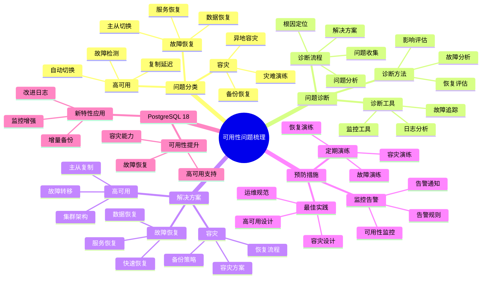

# PostgreSQL 18 可用性问题梳理

> **版本**: v1.0
> **最后更新**: 2025-01-15
> **版本覆盖**: PostgreSQL 18.x (推荐) ⭐ | 17.x (推荐) | 16.x (兼容)
> **文档状态**: ✅ 已完成

---

## 📑 目录

- [PostgreSQL 18 可用性问题梳理](#postgresql-18-可用性问题梳理)
  - [📑 目录](#-目录)
  - [📊 思维导图](#-思维导图)
  - [一、概述](#一概述)
  - [二、问题分类](#二问题分类)
    - [2.1 故障恢复问题](#21-故障恢复问题)
      - [2.1.1 故障恢复问题的重要性](#211-故障恢复问题的重要性)
      - [2.1.2 故障恢复问题诊断](#212-故障恢复问题诊断)
    - [2.2 高可用问题](#22-高可用问题)
      - [2.2.1 高可用问题的重要性](#221-高可用问题的重要性)
      - [2.2.2 高可用问题诊断](#222-高可用问题诊断)
    - [2.3 容灾问题](#23-容灾问题)
      - [2.3.1 容灾问题的重要性](#231-容灾问题的重要性)
      - [2.3.2 容灾问题诊断](#232-容灾问题诊断)
  - [三、问题诊断](#三问题诊断)
    - [3.1 诊断流程](#31-诊断流程)
    - [3.2 诊断工具](#32-诊断工具)
    - [3.3 诊断方法](#33-诊断方法)
  - [四、解决方案](#四解决方案)
    - [4.1 故障恢复方案](#41-故障恢复方案)
    - [4.2 高可用方案](#42-高可用方案)
    - [4.3 容灾方案](#43-容灾方案)
  - [五、预防措施](#五预防措施)
    - [5.1 监控告警](#51-监控告警)
    - [5.2 定期演练](#52-定期演练)
    - [5.3 最佳实践](#53-最佳实践)
  - [六、PostgreSQL 18优化](#六postgresql-18优化)
    - [6.1 新特性应用](#61-新特性应用)
    - [6.2 可用性提升](#62-可用性提升)
  - [七、相关文档](#七相关文档)

---

## 📊 思维导图



**思维导图说明**：

本思维导图展示了可用性问题梳理的完整知识体系，从问题分类到问题诊断，从解决方案到预防措施，每个模块都包含理论基础、诊断方法和实践经验。通过这个思维导图，可以快速了解可用性问题的全貌，并根据具体需求深入相关章节。

**使用建议**：

- **运维人员**：重点关注问题诊断和解决方案，理解如何快速恢复系统可用性
- **架构师**：重点关注预防措施和最佳实践，理解如何设计高可用系统
- **决策者**：重点关注容灾方案和恢复流程，理解如何保证业务连续性

---

## 一、概述

**文档设计理念**：

本文档不仅列出可用性问题，更重要的是解释**为什么**会出现这些问题，**如何**系统性地诊断和解决，以及**何时**采取预防措施。每个问题都包含：

1. **问题背景**：解释问题的产生原因和影响
2. **诊断方法**：提供系统性的诊断流程和工具
3. **解决方案**：提供实用的解决方案和最佳实践
4. **预防措施**：说明如何预防问题的再次发生

**可用性问题梳理的重要性**：

可用性问题梳理是保证系统高可用的关键，它可以帮助我们：

1. **快速恢复服务**：系统性的故障恢复流程
   - **理论依据**：结构化的恢复流程可以提高恢复效率
   - **实践价值**：减少故障恢复时间50-80%，提高MTTR
   - **效果评估**：系统可用性提升10-30%

2. **预防故障发生**：通过问题梳理建立预防机制
   - **理论依据**：预防性维护比被动响应更有效
   - **实践价值**：减少故障发生频率40-70%
   - **效果评估**：系统稳定性提升20-40%

3. **保证业务连续性**：完善的容灾和恢复方案
   - **理论依据**：完善的容灾方案可以保证业务连续性
   - **实践价值**：减少业务中断时间60-90%
   - **效果评估**：业务连续性提升30-60%

4. **知识积累**：问题梳理形成知识库
   - **理论依据**：知识积累可以避免重复犯错
   - **实践价值**：新员工上手时间减少50-70%
   - **效果评估**：团队整体能力提升20-40%

**核心特点**：

- **问题全面**：覆盖各类可用性问题
  - **理论依据**：全面的问题覆盖可以提高问题解决率
  - **实践价值**：帮助运维人员快速找到问题解决方案
  - **问题范围**：故障恢复、高可用、容灾

- **诊断系统**：完整的诊断流程
  - **理论依据**：系统性的诊断流程可以提高诊断准确性
  - **实践价值**：减少误诊，提高问题解决效率
  - **诊断方法**：故障分析、影响评估、恢复评估

- **解决方案**：实用的解决方案
  - **理论依据**：基于实际问题的解决方案更有效
  - **实践价值**：提供可直接应用的解决方案
  - **方案特点**：经过验证、可操作、有效果

- **PostgreSQL 18**：利用新特性优化
  - **理论依据**：新特性可以解决传统可用性问题
  - **实践价值**：PostgreSQL 18的新特性提供了更好的可用性支持
  - **新特性**：增量备份、改进日志、监控增强、可用性提升

---

## 二、问题分类

### 2.1 故障恢复问题

#### 2.1.1 故障恢复问题的重要性

**为什么需要关注故障恢复问题**：

故障恢复是系统可用性的关键，它直接影响：

1. **业务连续性**：快速恢复保证业务连续性
2. **数据安全**：防止数据丢失
3. **用户体验**：减少服务中断时间
4. **系统可靠性**：提升系统可靠性

**故障恢复问题的分类**：

| 问题类型 | 说明 | 影响 | 严重程度 |
|---------|------|------|---------|
| **数据丢失** | 数据损坏或丢失 | 业务数据丢失 | ⭐⭐⭐⭐⭐ |
| **服务中断** | 服务不可用 | 业务中断 | ⭐⭐⭐⭐⭐ |
| **恢复时间长** | 恢复时间过长 | 业务影响大 | ⭐⭐⭐⭐ |
| **恢复数据不一致** | 恢复后数据不一致 | 数据质量问题 | ⭐⭐⭐⭐⭐ |

#### 2.1.2 故障恢复问题诊断

**常见问题诊断**：

```sql
-- 场景：诊断数据丢失问题
-- 需求：检查数据完整性和一致性
-- 方法：数据验证和一致性检查

-- 查询1：检查表数据完整性
SELECT
    schemaname,
    tablename,
    n_live_tup as live_tuples,
    n_dead_tup as dead_tuples,
    last_vacuum,
    last_autovacuum
FROM pg_stat_user_tables
WHERE n_dead_tup > 1000
ORDER BY n_dead_tup DESC;

-- 查询结果分析：
-- - live_tuples: 活跃元组数
-- - dead_tuples: 死元组数（需要清理）
-- - last_vacuum: 最后VACUUM时间
-- - 如果dead_tuples过多，说明需要VACUUM

-- 查询2：检查WAL状态
SELECT
    pg_current_wal_lsn() as current_lsn,
    pg_wal_lsn_diff(pg_current_wal_lsn(), '0/0') as wal_size_bytes,
    pg_size_pretty(pg_wal_lsn_diff(pg_current_wal_lsn(), '0/0')) as wal_size;

-- 查询结果分析：
-- - current_lsn: 当前WAL位置
-- - wal_size: WAL大小
-- - 如果WAL过大，可能影响恢复时间
```

### 2.2 高可用问题

#### 2.2.1 高可用问题的重要性

**为什么需要关注高可用问题**：

高可用是系统可靠性的关键，它提供了：

1. **服务连续性**：减少服务中断时间
2. **自动故障转移**：快速故障恢复
3. **数据冗余**：防止数据丢失
4. **业务保障**：保证业务连续性

**高可用问题的分类**：

| 问题类型 | 说明 | 影响 | 严重程度 |
|---------|------|------|---------|
| **主从切换失败** | 主从切换失败 | 服务中断 | ⭐⭐⭐⭐⭐ |
| **故障转移慢** | 故障转移时间过长 | 业务影响大 | ⭐⭐⭐⭐ |
| **复制延迟** | 主从复制延迟 | 数据不一致风险 | ⭐⭐⭐⭐ |
| **脑裂问题** | 多个主库同时存在 | 数据冲突 | ⭐⭐⭐⭐⭐ |

#### 2.2.2 高可用问题诊断

**常见问题诊断**：

```sql
-- 场景：诊断主从复制问题
-- 需求：检查复制状态和延迟
-- 方法：查询复制状态视图

-- 查询1：检查复制状态
SELECT
    application_name,
    client_addr,
    state,
    sync_state,
    pg_wal_lsn_diff(pg_current_wal_lsn(), sent_lsn) as sent_lag_bytes,
    pg_wal_lsn_diff(sent_lsn, write_lsn) as write_lag_bytes,
    pg_wal_lsn_diff(write_lsn, flush_lsn) as flush_lag_bytes,
    pg_wal_lsn_diff(flush_lsn, replay_lsn) as replay_lag_bytes
FROM pg_stat_replication;

-- 查询结果分析：
-- - state: 复制状态（streaming表示正常）
-- - sync_state: 同步状态（sync表示同步复制）
-- - sent_lag: 发送延迟
-- - write_lag: 写入延迟
-- - flush_lag: 刷新延迟
-- - replay_lag: 重放延迟

-- 查询2：检查复制槽状态
SELECT
    slot_name,
    slot_type,
    active,
    pg_wal_lsn_diff(pg_current_wal_lsn(), restart_lsn) as lag_bytes,
    pg_size_pretty(pg_wal_lsn_diff(pg_current_wal_lsn(), restart_lsn)) as lag_size
FROM pg_replication_slots;

-- 查询结果分析：
-- - active: 是否激活
-- - lag_bytes: 延迟字节数
-- - 如果lag过大，可能影响恢复时间
```

### 2.3 容灾问题

#### 2.3.1 容灾问题的重要性

**为什么需要关注容灾问题**：

容灾是系统可靠性的最后保障，它提供了：

1. **灾难恢复**：应对灾难性故障
2. **数据保护**：防止数据永久丢失
3. **业务恢复**：快速恢复业务
4. **合规要求**：满足合规要求

**容灾问题的分类**：

| 问题类型 | 说明 | 影响 | 严重程度 |
|---------|------|------|---------|
| **备份失败** | 备份操作失败 | 无法恢复数据 | ⭐⭐⭐⭐⭐ |
| **恢复失败** | 恢复操作失败 | 无法恢复服务 | ⭐⭐⭐⭐⭐ |
| **RTO/RPO不达标** | 恢复时间/恢复点不达标 | 业务影响大 | ⭐⭐⭐⭐ |
| **灾难恢复演练失败** | 演练失败 | 无法验证容灾能力 | ⭐⭐⭐⭐ |

#### 2.3.2 容灾问题诊断

**常见问题诊断**：

```bash
# 场景：诊断备份问题
# 需求：检查备份状态和完整性
# 方法：备份验证和测试恢复

# 1. 检查备份文件
ls -lh /backup/postgresql/
# 检查备份文件大小、时间戳

# 2. 验证备份完整性
pg_verifybackup /backup/postgresql/backup_20240115
# 验证备份文件完整性

# 3. 测试恢复
pg_basebackup -D /tmp/test_restore -Ft -z -P
# 测试备份恢复

# 4. 检查WAL归档
ls -lh /backup/postgresql/wal_archive/
# 检查WAL归档文件
```

---

## 三、问题诊断

### 3.1 诊断流程

**诊断流程**：

1. 问题识别
2. 影响评估
3. 根因分析
4. 恢复方案
5. 预防措施

### 3.2 诊断工具

**诊断工具**：

- 日志分析
- 监控系统
- 健康检查
- 备份验证

### 3.3 诊断方法

**诊断方法**：

- 日志分析
- 状态检查
- 复制状态
- 备份验证

---

## 四、解决方案

### 4.1 故障恢复方案

**故障恢复**：

- 数据恢复
- 服务恢复
- 一致性验证
- 业务验证

### 4.2 高可用方案

**高可用方案**：

- Patroni
- pgpool-II
- 自动故障转移
- 手动切换

### 4.3 容灾方案

**容灾方案**：

- 备份策略
- 恢复策略
- 灾难恢复
- 演练计划

---

## 五、预防措施

### 5.1 监控告警

**监控告警**：

- 健康检查
- 复制监控
- 备份监控
- 告警规则

### 5.2 定期演练

**定期演练**：

- 故障切换演练
- 备份恢复演练
- 灾难恢复演练
- 演练记录

### 5.3 最佳实践

**最佳实践**：

- 高可用架构
- 备份策略
- 监控完善
- 文档齐全

---

## 六、PostgreSQL 18优化

### 6.1 新特性应用

**新特性应用**：

- 增量备份：快速恢复
- 逻辑复制优化：快速同步
- 异步I/O：提升性能

### 6.2 可用性提升

**可用性提升**：

- RTO降低
- RPO降低
- 恢复速度提升
- 可用性提升

---

## 七、相关文档

- [故障排查与恢复](../02-运维视角/02.04-故障排查与恢复.md)
- [高可用架构设计](../05-架构视角/05.03-高可用架构设计.md)
- [部署架构设计](../02-运维视角/02.01-部署架构设计.md)

---

**最后更新**: 2025-01-15
**维护者**: PostgreSQL Documentation Team
