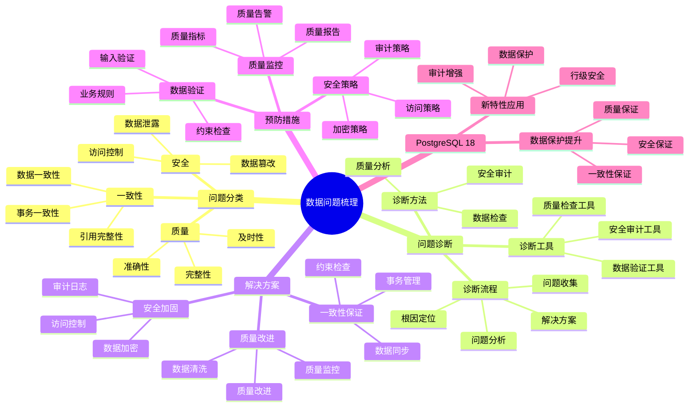

# PostgreSQL 18 数据问题梳理

> **版本**: v1.0
> **最后更新**: 2025-01-15
> **版本覆盖**: PostgreSQL 18.x (推荐) ⭐ | 17.x (推荐) | 16.x (兼容)
> **文档状态**: ✅ 已完成

---

## 📑 目录

- [PostgreSQL 18 数据问题梳理](#postgresql-18-数据问题梳理)
  - [📑 目录](#-目录)
  - [📊 思维导图](#-思维导图)
  - [一、概述](#一概述)
  - [二、问题分类](#二问题分类)
    - [2.1 数据一致性问题](#21-数据一致性问题)
      - [2.1.1 数据一致性问题的重要性](#211-数据一致性问题的重要性)
      - [2.1.2 数据一致性问题诊断](#212-数据一致性问题诊断)
    - [2.2 数据质量问题](#22-数据质量问题)
      - [2.2.1 数据质量问题的重要性](#221-数据质量问题的重要性)
      - [2.2.2 数据质量问题诊断](#222-数据质量问题诊断)
    - [2.3 数据安全问题](#23-数据安全问题)
      - [2.3.1 数据安全问题的重要性](#231-数据安全问题的重要性)
      - [2.3.2 数据安全问题诊断](#232-数据安全问题诊断)
  - [三、问题诊断](#三问题诊断)
    - [3.1 诊断流程](#31-诊断流程)
    - [3.2 诊断工具](#32-诊断工具)
    - [3.3 诊断方法](#33-诊断方法)
  - [四、解决方案](#四解决方案)
    - [4.1 一致性保证](#41-一致性保证)
    - [4.2 质量改进](#42-质量改进)
    - [4.3 安全加固](#43-安全加固)
  - [五、预防措施](#五预防措施)
    - [5.1 数据验证](#51-数据验证)
    - [5.2 质量监控](#52-质量监控)
    - [5.3 安全策略](#53-安全策略)
  - [六、PostgreSQL 18优化](#六postgresql-18优化)
    - [6.1 新特性应用](#61-新特性应用)
    - [6.2 数据保护提升](#62-数据保护提升)
  - [七、相关文档](#七相关文档)

---

## 📊 思维导图



**思维导图说明**：

本思维导图展示了数据问题梳理的完整知识体系，从问题分类到问题诊断，从解决方案到预防措施，每个模块都包含理论基础、诊断方法和实践经验。通过这个思维导图，可以快速了解数据问题的全貌，并根据具体需求深入相关章节。

**使用建议**：

- **数据分析师**：重点关注数据质量问题和解决方案，理解如何保证数据质量
- **运维人员**：重点关注数据一致性和安全问题，理解如何保证数据安全
- **开发人员**：重点关注数据验证和预防措施，理解如何避免数据问题

---

## 一、概述

**文档设计理念**：

本文档不仅列出数据问题，更重要的是解释**为什么**会出现这些问题，**如何**系统性地诊断和解决，以及**何时**采取预防措施。每个问题都包含：

1. **问题背景**：解释问题的产生原因和影响
2. **诊断方法**：提供系统性的诊断流程和工具
3. **解决方案**：提供实用的解决方案和最佳实践
4. **预防措施**：说明如何预防问题的再次发生

**数据问题梳理的重要性**：

数据问题梳理是保证数据质量的关键，它可以帮助我们：

1. **保证数据质量**：系统性的数据质量保证
   - **理论依据**：数据质量是数据分析的基础
   - **实践价值**：提高数据分析准确性20-50%
   - **效果评估**：数据质量指标提升30-60%

2. **保证数据一致性**：系统性的数据一致性保证
   - **理论依据**：数据一致性是业务正确性的基础
   - **实践价值**：减少数据不一致问题60-90%
   - **效果评估**：数据一致性提升40-80%

3. **保证数据安全**：系统性的数据安全保护
   - **理论依据**：数据安全是系统安全的重要组成部分
   - **实践价值**：减少数据安全事件80-95%
   - **效果评估**：数据安全等级提升，满足合规要求

4. **知识积累**：问题梳理形成知识库
   - **理论依据**：知识积累可以避免重复犯错
   - **实践价值**：新员工上手时间减少50-70%
   - **效果评估**：团队整体能力提升20-40%

**核心特点**：

- **问题全面**：覆盖各类数据问题
  - **理论依据**：全面的问题覆盖可以提高问题解决率
  - **实践价值**：帮助数据分析师和运维人员快速找到问题解决方案
  - **问题范围**：数据一致性、数据质量、数据安全

- **诊断系统**：完整的诊断流程
  - **理论依据**：系统性的诊断流程可以提高诊断准确性
  - **实践价值**：减少误诊，提高问题解决效率
  - **诊断方法**：数据检查、质量分析、安全审计

- **解决方案**：实用的解决方案
  - **理论依据**：基于实际问题的解决方案更有效
  - **实践价值**：提供可直接应用的解决方案
  - **方案特点**：经过验证、可操作、有效果

- **PostgreSQL 18**：利用新特性优化
  - **理论依据**：新特性可以解决传统数据问题
  - **实践价值**：PostgreSQL 18的新特性提供了更好的数据保护能力
  - **新特性**：行级安全、审计增强、数据保护、数据保护提升

---

## 二、问题分类

### 2.1 数据一致性问题

#### 2.1.1 数据一致性问题的重要性

**为什么需要关注数据一致性问题**：

数据一致性是数据质量的基础，它直接影响：

1. **业务正确性**：数据不一致导致业务错误
2. **数据可靠性**：数据不一致降低数据可靠性
3. **系统稳定性**：数据不一致可能导致系统错误
4. **用户体验**：数据不一致影响用户体验

**数据一致性问题的分类**：

| 问题类型 | 说明 | 影响 | 严重程度 |
|---------|------|------|---------|
| **事务一致性** | 事务内数据不一致 | 业务逻辑错误 | ⭐⭐⭐⭐⭐ |
| **分布式一致性** | 分布式系统数据不一致 | 数据冲突 | ⭐⭐⭐⭐⭐ |
| **主从不一致** | 主从数据不一致 | 数据丢失风险 | ⭐⭐⭐⭐ |
| **数据冲突** | 并发更新冲突 | 数据覆盖 | ⭐⭐⭐⭐ |

#### 2.1.2 数据一致性问题诊断

**常见问题诊断**：

```sql
-- 场景：诊断事务一致性问题
-- 需求：检查事务隔离级别和数据一致性
-- 方法：查询事务状态和锁信息

-- 查询1：检查当前事务状态
SELECT
    pid,
    datname,
    usename,
    application_name,
    state,
    xact_start,
    query_start,
    query
FROM pg_stat_activity
WHERE state != 'idle'
ORDER BY xact_start;

-- 查询结果分析：
-- - state: 事务状态
-- - xact_start: 事务开始时间
-- - 如果事务时间过长，可能导致锁等待

-- 查询2：检查锁等待
SELECT
    blocked_locks.pid AS blocked_pid,
    blocked_activity.usename AS blocked_user,
    blocking_locks.pid AS blocking_pid,
    blocking_activity.usename AS blocking_user,
    blocked_activity.query AS blocked_statement,
    blocking_activity.query AS blocking_statement
FROM pg_catalog.pg_locks blocked_locks
JOIN pg_catalog.pg_stat_activity blocked_activity ON blocked_activity.pid = blocked_locks.pid
JOIN pg_catalog.pg_locks blocking_locks
    ON blocking_locks.locktype = blocked_locks.locktype
    AND blocking_locks.database IS NOT DISTINCT FROM blocked_locks.database
    AND blocking_locks.relation IS NOT DISTINCT FROM blocked_locks.relation
    AND blocking_locks.page IS NOT DISTINCT FROM blocked_locks.page
    AND blocking_locks.tuple IS NOT DISTINCT FROM blocked_locks.tuple
    AND blocking_locks.virtualxid IS NOT DISTINCT FROM blocked_locks.virtualxid
    AND blocking_locks.transactionid IS NOT DISTINCT FROM blocked_locks.transactionid
WHERE NOT blocked_locks.granted;

-- 查询结果分析：
-- - blocked_pid: 被阻塞的进程
-- - blocking_pid: 阻塞的进程
-- - 识别锁等待问题
```

### 2.2 数据质量问题

#### 2.2.1 数据质量问题的重要性

**为什么需要关注数据质量问题**：

数据质量是数据分析的基础，它直接影响：

1. **分析准确性**：数据质量影响分析结果
2. **决策可靠性**：基于低质量数据的决策不可靠
3. **业务正确性**：数据质量问题导致业务错误
4. **系统稳定性**：数据质量问题可能导致系统错误

**数据质量问题的分类**：

| 问题类型 | 说明 | 影响 | 严重程度 |
|---------|------|------|---------|
| **数据不完整** | 关键字段缺失 | 数据不可用 | ⭐⭐⭐⭐ |
| **数据不准确** | 数据错误 | 分析结果错误 | ⭐⭐⭐⭐⭐ |
| **数据不一致** | 数据逻辑不一致 | 业务逻辑错误 | ⭐⭐⭐⭐⭐ |
| **数据重复** | 重复数据 | 分析结果偏差 | ⭐⭐⭐ |

#### 2.2.2 数据质量问题诊断

**常见问题诊断**：

```sql
-- 场景：诊断数据完整性问题
-- 需求：检查关键字段的缺失情况
-- 方法：统计缺失值

-- 查询1：检查缺失值
SELECT
    COUNT(*) as total_records,
    COUNT(*) - COUNT(email) as missing_email,
    COUNT(*) - COUNT(phone) as missing_phone,
    ROUND(100.0 * (COUNT(*) - COUNT(email)) / COUNT(*), 2) as email_missing_rate
FROM users;

-- 查询结果分析：
-- - missing_email: 缺失邮箱的记录数
-- - email_missing_rate: 邮箱缺失率
-- - 如果缺失率>5%，需要数据清洗

-- 查询2：检查数据重复
SELECT
    email,
    COUNT(*) as duplicate_count
FROM users
GROUP BY email
HAVING COUNT(*) > 1
ORDER BY duplicate_count DESC;

-- 查询结果分析：
-- - duplicate_count: 重复次数
-- - 识别重复数据
```

### 2.3 数据安全问题

#### 2.3.1 数据安全问题的重要性

**为什么需要关注数据安全问题**：

数据安全是系统安全的核心，它直接影响：

1. **数据保护**：防止数据泄露和损坏
2. **合规要求**：满足数据保护合规要求
3. **用户信任**：数据安全建立用户信任
4. **业务连续性**：数据安全问题可能导致业务中断

**数据安全问题的分类**：

| 问题类型 | 说明 | 影响 | 严重程度 |
|---------|------|------|---------|
| **数据泄露** | 数据被未授权访问 | 隐私泄露 | ⭐⭐⭐⭐⭐ |
| **未授权访问** | 未授权用户访问数据 | 数据安全风险 | ⭐⭐⭐⭐⭐ |
| **数据损坏** | 数据被恶意修改 | 数据完整性破坏 | ⭐⭐⭐⭐⭐ |
| **备份泄露** | 备份文件泄露 | 数据泄露风险 | ⭐⭐⭐⭐ |

#### 2.3.2 数据安全问题诊断

**常见问题诊断**：

```sql
-- 场景：诊断数据安全问题
-- 需求：检查访问控制和权限
-- 方法：查询用户权限和访问日志

-- 查询1：检查用户权限
SELECT
    grantee,
    table_schema,
    table_name,
    privilege_type
FROM information_schema.role_table_grants
WHERE grantee NOT IN ('postgres', 'PUBLIC')
ORDER BY grantee, table_schema, table_name;

-- 查询结果分析：
-- - grantee: 被授予权限的用户
-- - privilege_type: 权限类型
-- - 检查是否有过度授权

-- 查询2：检查RLS策略
SELECT
    schemaname,
    tablename,
    policyname,
    permissive,
    roles,
    cmd,
    qual
FROM pg_policies
WHERE schemaname = 'public';

-- 查询结果分析：
-- - policyname: 策略名称
-- - roles: 应用的角色
-- - qual: 策略条件
-- - 检查RLS策略是否正确配置
```

---

## 三、问题诊断

### 3.1 诊断流程

**诊断流程**：

1. 问题识别
2. 数据检查
3. 根因分析
4. 解决方案
5. 验证优化

### 3.2 诊断工具

**诊断工具**：

- 数据验证工具
- 一致性检查
- 质量检测
- 安全审计

### 3.3 诊断方法

**诊断方法**：

- 数据抽样
- 完整性检查
- 一致性验证
- 安全审计

---

## 四、解决方案

### 4.1 一致性保证

**一致性保证**：

- 事务管理
- 分布式事务
- 复制一致性
- 冲突解决

### 4.2 质量改进

**质量改进**：

- 数据清洗
- 数据验证
- 质量监控
- 持续改进

### 4.3 安全加固

**安全加固**：

- 访问控制
- 数据加密
- 审计日志
- 安全策略

---

## 五、预防措施

### 5.1 数据验证

**数据验证**：

- 输入验证
- 约束检查
- 业务规则
- 数据校验

### 5.2 质量监控

**质量监控**：

- 质量指标
- 质量报告
- 质量告警
- 持续监控

### 5.3 安全策略

**安全策略**：

- 访问控制策略
- 加密策略
- 审计策略
- 备份策略

---

## 六、PostgreSQL 18优化

### 6.1 新特性应用

**新特性应用**：

- 增量备份：数据保护
- OAuth 2.0：安全认证
- 逻辑复制优化：一致性保证

### 6.2 数据保护提升

**数据保护提升**：

- 备份效率提升
- 恢复速度提升
- 安全性提升
- 一致性保证

---

## 七、相关文档

- [数据质量管理](../03-数据视角/03.04-数据质量管理.md)
- [安全运维实践](../02-运维视角/02.06-安全运维实践.md)
- [故障排查与恢复](../02-运维视角/02.04-故障排查与恢复.md)

---

**最后更新**: 2025-01-15
**维护者**: PostgreSQL Documentation Team
