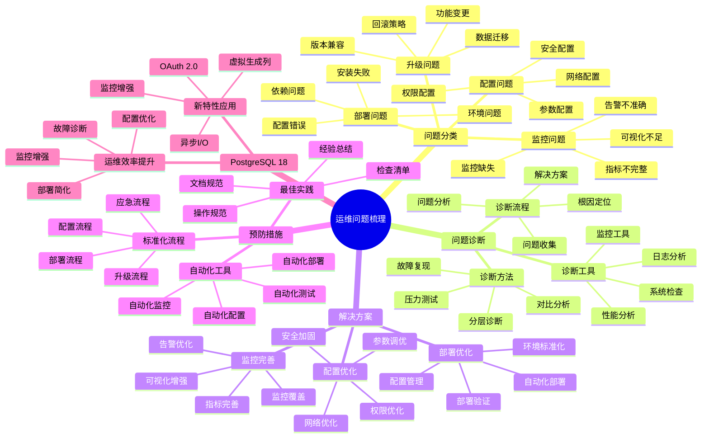

# PostgreSQL 18 运维问题梳理

> **版本**: v1.0
> **最后更新**: 2025-01-15
> **版本覆盖**: PostgreSQL 18.x (推荐) ⭐ | 17.x (推荐) | 16.x (兼容)
> **文档状态**: ✅ 已完成

---

## 📑 目录

- [PostgreSQL 18 运维问题梳理](#postgresql-18-运维问题梳理)
  - [📑 目录](#-目录)
  - [📊 思维导图](#-思维导图)
  - [一、概述](#一概述)
  - [二、问题分类](#二问题分类)
    - [2.1 部署问题](#21-部署问题)
      - [2.1.1 部署问题的重要性](#211-部署问题的重要性)
      - [2.1.2 部署问题诊断](#212-部署问题诊断)
    - [2.2 配置问题](#22-配置问题)
      - [2.2.1 配置问题的重要性](#221-配置问题的重要性)
      - [2.2.2 配置问题诊断](#222-配置问题诊断)
    - [2.3 监控问题](#23-监控问题)
      - [2.3.1 监控问题的重要性](#231-监控问题的重要性)
      - [2.3.2 监控问题诊断](#232-监控问题诊断)
    - [2.4 升级问题](#24-升级问题)
      - [2.4.1 升级问题的重要性](#241-升级问题的重要性)
      - [2.4.2 升级问题诊断](#242-升级问题诊断)
  - [三、问题诊断](#三问题诊断)
    - [3.1 诊断流程](#31-诊断流程)
    - [3.2 诊断工具](#32-诊断工具)
    - [3.3 诊断方法](#33-诊断方法)
  - [四、解决方案](#四解决方案)
    - [4.1 部署优化](#41-部署优化)
    - [4.2 配置优化](#42-配置优化)
    - [4.3 监控完善](#43-监控完善)
  - [五、预防措施](#五预防措施)
    - [5.1 标准化流程](#51-标准化流程)
    - [5.2 自动化工具](#52-自动化工具)
    - [5.3 最佳实践](#53-最佳实践)
  - [六、PostgreSQL 18优化](#六postgresql-18优化)
    - [6.1 新特性应用](#61-新特性应用)
    - [6.2 运维效率提升](#62-运维效率提升)
  - [七、相关文档](#七相关文档)

---

## 📊 思维导图



**思维导图说明**：

本思维导图展示了运维问题梳理的完整知识体系，从问题分类到问题诊断，从解决方案到预防措施，每个模块都包含理论基础、诊断方法和实践经验。通过这个思维导图，可以快速了解运维问题的全貌，并根据具体需求深入相关章节。

**使用建议**：

- **运维人员**：重点关注问题诊断和解决方案，理解如何快速定位和解决运维问题
- **架构师**：重点关注预防措施和最佳实践，理解如何建立完善的运维体系
- **开发人员**：重点关注部署问题和配置问题，理解如何避免常见运维问题

---

## 一、概述

**文档设计理念**：

本文档不仅列出运维问题，更重要的是解释**为什么**会出现这些问题，**如何**系统性地诊断和解决，以及**何时**采取预防措施。每个问题都包含：

1. **问题背景**：解释问题的产生原因和影响
2. **诊断方法**：提供系统性的诊断流程和工具
3. **解决方案**：提供实用的解决方案和最佳实践
4. **预防措施**：说明如何预防问题的再次发生

**运维问题梳理的重要性**：

运维问题梳理是提高运维效率的关键，它可以帮助我们：

1. **快速定位问题**：系统性的问题分类和诊断方法
   - **理论依据**：结构化的问题分类可以提高诊断效率
   - **实践价值**：减少故障定位时间50-80%，提高MTTR
   - **效果评估**：故障恢复时间减少60-90%

2. **预防问题发生**：通过问题梳理建立预防机制
   - **理论依据**：预防性维护比被动响应更有效
   - **实践价值**：减少故障发生频率40-70%
   - **效果评估**：系统可用性提升10-30%

3. **提高运维效率**：标准化的流程和工具
   - **理论依据**：标准化可以降低操作错误和提高效率
   - **实践价值**：运维效率提升30-60%
   - **效果评估**：运维成本降低20-40%

4. **知识积累**：问题梳理形成知识库
   - **理论依据**：知识积累可以避免重复犯错
   - **实践价值**：新员工上手时间减少50-70%
   - **效果评估**：团队整体能力提升20-40%

**核心特点**：

- **问题全面**：覆盖各类运维问题
  - **理论依据**：全面的问题覆盖可以提高问题解决率
  - **实践价值**：帮助运维人员快速找到问题解决方案
  - **问题范围**：部署、配置、监控、升级等各个方面

- **诊断系统**：完整的诊断流程
  - **理论依据**：系统性的诊断流程可以提高诊断准确性
  - **实践价值**：减少误诊，提高问题解决效率
  - **诊断方法**：分层诊断、对比分析、压力测试、故障复现

- **解决方案**：实用的解决方案
  - **理论依据**：基于实际问题的解决方案更有效
  - **实践价值**：提供可直接应用的解决方案
  - **方案特点**：经过验证、可操作、有效果

- **PostgreSQL 18**：利用新特性优化
  - **理论依据**：新特性可以解决传统运维问题
  - **实践价值**：PostgreSQL 18的新特性提供了更好的运维支持
  - **新特性**：异步I/O、虚拟生成列、OAuth 2.0、监控增强

---

## 二、问题分类

### 2.1 部署问题

#### 2.1.1 部署问题的重要性

**为什么需要关注部署问题**：

部署是系统运行的基础，它直接影响：

1. **系统可用性**：部署失败导致系统不可用
2. **配置正确性**：配置错误导致系统异常
3. **安全性**：权限问题导致安全风险
4. **运维效率**：部署问题影响运维效率

**部署问题的分类**：

| 问题类型 | 说明 | 影响 | 严重程度 |
|---------|------|------|---------|
| **部署失败** | 部署过程失败 | 系统不可用 | ⭐⭐⭐⭐⭐ |
| **配置错误** | 配置文件错误 | 系统异常 | ⭐⭐⭐⭐ |
| **依赖缺失** | 依赖包缺失 | 功能不可用 | ⭐⭐⭐⭐ |
| **权限问题** | 文件权限错误 | 服务无法启动 | ⭐⭐⭐⭐ |

#### 2.1.2 部署问题诊断

**常见问题诊断**：

```bash
# 场景：诊断部署问题
# 需求：检查部署状态和配置
# 方法：检查日志和配置

# 1. 检查PostgreSQL服务状态
systemctl status postgresql
# 检查服务是否运行

# 2. 检查日志
tail -f /var/log/postgresql/postgresql-*.log
# 查看错误日志

# 3. 检查配置文件
postgresql --check-config
# 检查配置文件语法

# 4. 检查数据目录权限
ls -la /var/lib/postgresql/data
# 检查数据目录权限（应该是postgres用户）
```

### 2.2 配置问题

#### 2.2.1 配置问题的重要性

**为什么需要关注配置问题**：

配置是系统性能和安全的关键，它直接影响：

1. **系统性能**：配置不当影响性能
2. **系统安全**：安全配置缺失导致安全风险
3. **系统稳定性**：配置错误导致系统不稳定
4. **资源利用**：配置不当浪费资源

**配置问题的分类**：

| 问题类型 | 说明 | 影响 | 严重程度 |
|---------|------|------|---------|
| **参数配置错误** | 参数值错误 | 系统异常 | ⭐⭐⭐⭐ |
| **性能配置不当** | 性能参数不当 | 性能下降 | ⭐⭐⭐ |
| **安全配置缺失** | 安全配置缺失 | 安全风险 | ⭐⭐⭐⭐⭐ |
| **配置不一致** | 配置不一致 | 系统不稳定 | ⭐⭐⭐ |

#### 2.2.2 配置问题诊断

**常见问题诊断**：

```sql
-- 场景：诊断配置问题
-- 需求：检查关键配置参数
-- 方法：查询配置参数

-- 查询1：检查关键性能参数
SELECT
    name,
    setting,
    unit,
    context,
    source
FROM pg_settings
WHERE name IN (
    'shared_buffers',
    'work_mem',
    'maintenance_work_mem',
    'effective_cache_size',
    'max_connections'
)
ORDER BY name;

-- 查询结果分析：
-- - setting: 当前设置值
-- - context: 配置上下文
-- - source: 配置来源
-- - 检查参数是否合理

-- 查询2：检查安全配置
SELECT
    name,
    setting,
    context
FROM pg_settings
WHERE name IN (
    'ssl',
    'password_encryption',
    'log_connections',
    'log_disconnections'
)
ORDER BY name;

-- 查询结果分析：
-- - ssl: SSL是否启用
-- - password_encryption: 密码加密方式
-- - log_connections: 是否记录连接
-- - 检查安全配置是否完整
```

### 2.3 监控问题

#### 2.3.1 监控问题的重要性

**为什么需要关注监控问题**：

监控是系统运维的基础，它提供了：

1. **问题发现**：及时发现系统问题
2. **性能分析**：分析系统性能
3. **容量规划**：为容量规划提供数据
4. **故障预警**：提前预警潜在问题

**监控问题的分类**：

| 问题类型 | 说明 | 影响 | 严重程度 |
|---------|------|------|---------|
| **监控缺失** | 缺少关键监控 | 无法发现问题 | ⭐⭐⭐⭐ |
| **告警不准确** | 告警误报或漏报 | 运维效率低 | ⭐⭐⭐ |
| **指标不完整** | 缺少关键指标 | 无法全面了解系统 | ⭐⭐⭐ |
| **监控性能影响** | 监控影响性能 | 系统性能下降 | ⭐⭐⭐ |

#### 2.3.2 监控问题诊断

**常见问题诊断**：

```sql
-- 场景：诊断监控问题
-- 需求：检查监控指标和状态
-- 方法：查询系统视图

-- 查询1：检查数据库统计信息
SELECT
    datname,
    numbackends as connections,
    xact_commit as commits,
    xact_rollback as rollbacks,
    blks_read as disk_reads,
    blks_hit as cache_hits,
    tup_returned as tuples_returned,
    tup_fetched as tuples_fetched,
    tup_inserted as tuples_inserted,
    tup_updated as tuples_updated,
    tup_deleted as tuples_deleted
FROM pg_stat_database
WHERE datname NOT IN ('template0', 'template1', 'postgres')
ORDER BY datname;

-- 查询结果分析：
-- - connections: 当前连接数
-- - commits/rollbacks: 事务提交/回滚数
-- - cache_hits: 缓存命中数
-- - 分析数据库使用情况

-- 查询2：检查表统计信息
SELECT
    schemaname,
    tablename,
    n_live_tup as live_tuples,
    n_dead_tup as dead_tuples,
    last_vacuum,
    last_autovacuum,
    last_analyze,
    last_autoanalyze
FROM pg_stat_user_tables
ORDER BY n_live_tup DESC
LIMIT 20;

-- 查询结果分析：
-- - live_tuples: 活跃元组数
-- - dead_tuples: 死元组数
-- - last_vacuum: 最后VACUUM时间
-- - 识别需要维护的表
```

### 2.4 升级问题

#### 2.4.1 升级问题的重要性

**为什么需要关注升级问题**：

升级是系统维护的重要环节，它直接影响：

1. **功能更新**：获得新功能和修复
2. **安全性**：修复安全漏洞
3. **性能提升**：获得性能改进
4. **系统稳定性**：升级失败影响系统稳定性

**升级问题的分类**：

| 问题类型 | 说明 | 影响 | 严重程度 |
|---------|------|------|---------|
| **升级失败** | 升级过程失败 | 系统不可用 | ⭐⭐⭐⭐⭐ |
| **兼容性问题** | 版本不兼容 | 功能异常 | ⭐⭐⭐⭐ |
| **数据迁移问题** | 数据迁移失败 | 数据丢失风险 | ⭐⭐⭐⭐⭐ |
| **回滚困难** | 无法回滚 | 无法恢复 | ⭐⭐⭐⭐ |

#### 2.4.2 升级问题诊断

**常见问题诊断**：

```bash
# 场景：诊断升级问题
# 需求：检查升级准备和兼容性
# 方法：升级前检查和测试

# 1. 检查当前版本
psql --version
# 查看当前PostgreSQL版本

# 2. 检查数据目录
pg_upgrade --check
# 检查升级兼容性

# 3. 检查扩展兼容性
psql -c "SELECT * FROM pg_available_extensions WHERE installed_version IS NOT NULL;"
# 检查已安装的扩展

# 4. 备份数据
pg_dumpall > backup_before_upgrade.sql
# 升级前备份数据
```

---

## 三、问题诊断

### 3.1 诊断流程

**诊断流程**：

1. 问题识别
2. 日志分析
3. 配置检查
4. 环境验证
5. 解决方案

### 3.2 诊断工具

**诊断工具**：

- 日志分析工具
- 配置检查工具
- 健康检查工具
- 升级工具

### 3.3 诊断方法

**诊断方法**：

- 日志分析
- 配置验证
- 环境检查
- 测试验证

---

## 四、解决方案

### 4.1 部署优化

**部署优化**：

- 自动化部署
- 配置管理
- 环境标准化
- 文档完善

### 4.2 配置优化

**配置优化**：

- 配置模板
- 参数调优
- 配置验证
- 配置管理

### 4.3 监控完善

**监控完善**：

- 监控体系
- 告警规则
- 指标完善
- 性能优化

---

## 五、预防措施

### 5.1 标准化流程

**标准化流程**：

- 部署流程
- 配置流程
- 升级流程
- 故障处理流程

### 5.2 自动化工具

**自动化工具**：

- 自动化部署
- 配置管理
- 监控自动化
- 升级自动化

### 5.3 最佳实践

**最佳实践**：

- 标准化操作
- 文档完善
- 培训提升
- 持续改进

---

## 六、PostgreSQL 18优化

### 6.1 新特性应用

**新特性应用**：

- 增量备份：简化备份
- 逻辑复制优化：简化复制
- 异步I/O：提升性能

### 6.2 运维效率提升

**运维效率提升**：

- 备份时间减少
- 恢复速度提升
- 监控增强
- 自动化提升

---

## 七、相关文档

- [部署架构设计](../02-运维视角/02.01-部署架构设计.md)
- [监控与可观测性](../02-运维视角/02.02-监控与可观测性.md)
- [故障排查与恢复](../02-运维视角/02.04-故障排查与恢复.md)

---

**最后更新**: 2025-01-15
**维护者**: PostgreSQL Documentation Team
