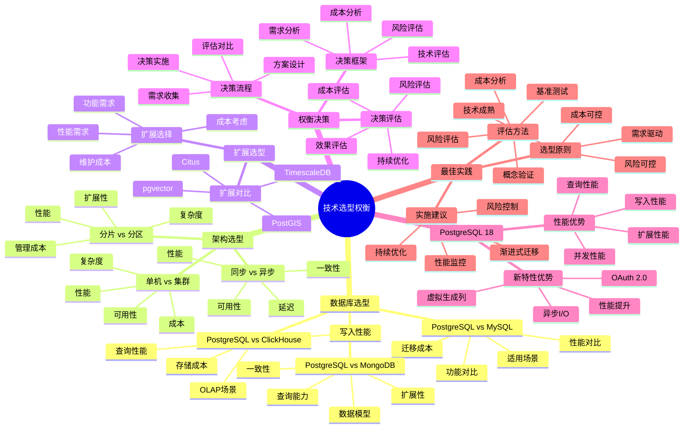

# PostgreSQL 18 技术选型权衡

> **版本**: v1.0
> **最后更新**: 2025-01-15
> **版本覆盖**: PostgreSQL 18.x (推荐) ⭐ | 17.x (推荐) | 16.x (兼容)
> **文档状态**: ✅ 已完成

---

## 📑 目录

- [PostgreSQL 18 技术选型权衡](#postgresql-18-技术选型权衡)
  - [📑 目录](#-目录)
  - [📊 思维导图](#-思维导图)
  - [一、概述](#一概述)
  - [二、知识矩阵对比](#二知识矩阵对比)
    - [2.1 数据库选型对比](#21-数据库选型对比)
    - [2.2 架构选型对比](#22-架构选型对比)
  - [三、数据库选型](#三数据库选型)
    - [3.1 PostgreSQL vs MySQL](#31-postgresql-vs-mysql)
      - [3.1.1 选型对比分析](#311-选型对比分析)
      - [3.1.2 实际案例对比](#312-实际案例对比)
    - [3.2 PostgreSQL vs MongoDB](#32-postgresql-vs-mongodb)
      - [3.2.2 选型对比分析](#322-选型对比分析)
    - [3.3 PostgreSQL vs ClickHouse](#33-postgresql-vs-clickhouse)
      - [3.3.1 选型对比分析](#331-选型对比分析)
  - [四、架构选型](#四架构选型)
    - [4.1 单机 vs 集群](#41-单机-vs-集群)
    - [4.2 同步复制 vs 异步复制](#42-同步复制-vs-异步复制)
    - [4.3 分片 vs 分区](#43-分片-vs-分区)
  - [五、扩展选型](#五扩展选型)
    - [5.1 扩展对比](#51-扩展对比)
    - [5.2 扩展选择](#52-扩展选择)
  - [六、权衡决策](#六权衡决策)
    - [6.1 决策框架](#61-决策框架)
    - [6.2 决策流程](#62-决策流程)
    - [6.3 决策评估](#63-决策评估)
  - [七、PostgreSQL 18优势](#七postgresql-18优势)
    - [7.1 新特性优势](#71-新特性优势)
    - [7.2 性能优势](#72-性能优势)
  - [八、最佳实践](#八最佳实践)
    - [8.1 选型原则](#81-选型原则)
    - [8.2 评估方法](#82-评估方法)
    - [8.3 实施建议](#83-实施建议)
  - [九、相关文档](#九相关文档)

---

## 📊 思维导图



**思维导图说明**：

本思维导图展示了技术选型权衡的完整知识体系，从数据库选型到架构选型，从扩展选型到权衡决策，每个模块都包含理论基础、对比分析和决策方法。通过这个思维导图，可以快速了解技术选型的全貌，并根据具体需求深入相关章节。

**使用建议**：

- **架构师**：重点关注权衡决策和最佳实践，理解技术选型的决策框架
- **技术负责人**：重点关注数据库选型和架构选型，理解不同方案的优劣
- **开发人员**：重点关注扩展选型，理解如何选择合适的扩展

---

## 一、概述

**文档设计理念**：

本文档不仅展示技术选型的对比表格，更重要的是解释**为什么**需要权衡，**如何**进行技术选型，以及**何时**选择特定技术方案。每个选型决策都包含：

1. **需求分析**：解释业务需求和技术需求
2. **技术对比**：分析不同技术方案的优劣
3. **权衡分析**：说明选型的权衡考虑
4. **决策支持**：提供决策框架和评估方法

**技术选型的重要性**：

技术选型是系统架构设计的关键环节，它直接影响：

1. **系统性能**：技术选型直接影响系统性能
   - **理论依据**：不同技术有不同的性能特征和适用场景
   - **实践价值**：正确的技术选型可以提升系统性能20-50%
   - **影响范围**：影响系统的可扩展性、可维护性和成本

2. **开发效率**：技术选型影响开发效率
   - **理论依据**：成熟的技术栈可以提升开发效率
   - **实践价值**：合适的选型可以提升开发效率30-60%
   - **影响范围**：影响开发周期、代码质量和维护成本

3. **系统成本**：技术选型影响系统总成本
   - **理论依据**：不同技术的许可成本、运维成本、开发成本不同
   - **实践价值**：合理的选型可以降低系统总成本20-40%
   - **影响范围**：影响硬件成本、软件成本、人力成本

4. **系统风险**：技术选型影响系统风险
   - **理论依据**：技术成熟度、社区支持、厂商支持影响系统风险
   - **实践价值**：降低技术风险，提高系统稳定性
   - **影响范围**：影响系统可用性、数据安全性和业务连续性

**核心特点**：

- **对比全面**：多维度技术对比
  - **理论依据**：多维度对比可以提供更全面的技术评估
  - **实践价值**：帮助架构师做出更准确的技术选型决策
  - **对比维度**：功能、性能、成本、风险、可维护性

- **权衡分析**：详细的权衡分析
  - **理论依据**：技术选型需要在多个因素之间权衡
  - **实践价值**：帮助理解不同方案的优劣和适用场景
  - **分析内容**：性能权衡、成本权衡、复杂度权衡、风险权衡

- **决策支持**：决策框架和流程
  - **理论依据**：结构化的决策流程可以提高决策质量
  - **实践价值**：提供可操作的决策方法和工具
  - **决策工具**：需求分析框架、技术评估矩阵、成本分析模型

- **PostgreSQL 18**：突出新特性优势
  - **理论依据**：新特性可以解决传统技术选型的痛点
  - **实践价值**：PostgreSQL 18的新特性提供了更多选型优势
  - **新特性**：异步I/O、虚拟生成列、OAuth 2.0、性能提升

---

## 二、知识矩阵对比

### 2.1 数据库选型对比

| 数据库 | 特点 | 适用场景 | 推荐度 |
|-----|------|---------|--------|
| **PostgreSQL** | 功能强大 | 通用 | ⭐⭐⭐⭐⭐ |
| **MySQL** | 简单易用 | Web应用 | ⭐⭐⭐⭐ |
| **MongoDB** | 文档数据库 | 半结构化 | ⭐⭐⭐⭐ |
| **ClickHouse** | 列式存储 | OLAP | ⭐⭐⭐⭐ |

### 2.2 架构选型对比

| 架构 | 特点 | 适用场景 | 推荐度 |
|-----|------|---------|--------|
| **单机** | 简单 | 小规模 | ⭐⭐⭐ |
| **主从** | 高可用 | 中规模 | ⭐⭐⭐⭐ |
| **集群** | 可扩展 | 大规模 | ⭐⭐⭐⭐ |

---

## 三、数据库选型

### 3.1 PostgreSQL vs MySQL

#### 3.1.1 选型对比分析

**为什么需要对比分析**：

数据库选型是系统设计的关键决策，需要全面对比：

1. **功能对比**：对比功能特性，选择满足需求的数据库
2. **性能对比**：对比性能表现，选择性能更好的数据库
3. **成本对比**：对比总体成本，选择性价比更高的数据库
4. **生态对比**：对比生态系统，选择生态更完善的数据库

**PostgreSQL vs MySQL 详细对比**：

| 维度 | PostgreSQL | MySQL | 说明 | 推荐场景 |
|-----|-----------|-------|------|---------|
| **功能完整性** | ⭐⭐⭐⭐⭐ | ⭐⭐⭐⭐ | PostgreSQL功能更全面 | 复杂业务 |
| **SQL标准** | ⭐⭐⭐⭐⭐ | ⭐⭐⭐ | PostgreSQL更符合SQL标准 | 标准要求高 |
| **数据类型** | ⭐⭐⭐⭐⭐ | ⭐⭐⭐⭐ | PostgreSQL类型更丰富 | 复杂数据类型 |
| **JSON支持** | ⭐⭐⭐⭐⭐ | ⭐⭐⭐⭐ | PostgreSQL JSONB性能更好 | JSON数据 |
| **全文搜索** | ⭐⭐⭐⭐⭐ | ⭐⭐⭐ | PostgreSQL全文搜索更强大 | 全文搜索 |
| **扩展性** | ⭐⭐⭐⭐⭐ | ⭐⭐⭐ | PostgreSQL扩展更丰富 | 特殊需求 |
| **性能（OLTP）** | ⭐⭐⭐⭐ | ⭐⭐⭐⭐⭐ | MySQL在简单查询上略快 | 简单查询 |
| **性能（OLAP）** | ⭐⭐⭐⭐⭐ | ⭐⭐⭐ | PostgreSQL分析能力更强 | 数据分析 |
| **并发控制** | ⭐⭐⭐⭐⭐ | ⭐⭐⭐⭐ | PostgreSQL MVCC更先进 | 高并发 |
| **事务支持** | ⭐⭐⭐⭐⭐ | ⭐⭐⭐⭐ | PostgreSQL事务更强大 | 复杂事务 |
| **学习曲线** | ⭐⭐⭐ | ⭐⭐⭐⭐ | MySQL更易学习 | 新手 |
| **社区支持** | ⭐⭐⭐⭐⭐ | ⭐⭐⭐⭐⭐ | 两者都有强大社区 | - |
| **商业支持** | ⭐⭐⭐⭐ | ⭐⭐⭐⭐⭐ | MySQL商业支持更多 | 企业级 |

**选型建议**：

```text
选择PostgreSQL的场景：
1. 复杂业务逻辑：需要复杂查询、存储过程、触发器
2. 数据类型丰富：需要JSONB、数组、自定义类型
3. 数据分析：需要强大的分析功能
4. 标准要求：需要符合SQL标准
5. 扩展需求：需要丰富的扩展生态

选择MySQL的场景：
1. 简单Web应用：简单的CRUD操作
2. 学习成本：团队更熟悉MySQL
3. 商业支持：需要商业支持
4. 简单查询：主要是简单查询
5. 已有系统：已有MySQL系统
```

#### 3.1.2 实际案例对比

**案例：电商系统数据库选型**：

```text
需求分析：
- 复杂查询：需要复杂的商品搜索、订单查询
- JSON数据：商品属性使用JSON存储
- 数据分析：需要销售数据分析
- 高并发：需要支持高并发访问

PostgreSQL优势：
1. JSONB支持：商品属性使用JSONB，查询性能好
2. 全文搜索：商品搜索使用全文搜索，性能好
3. 复杂查询：支持复杂的分析查询
4. 扩展性：可以扩展PostGIS支持地理位置

MySQL优势：
1. 简单易用：团队更熟悉MySQL
2. 性能：简单查询性能略好

选型决策：PostgreSQL
理由：
1. JSONB支持满足商品属性需求
2. 全文搜索满足商品搜索需求
3. 复杂查询满足数据分析需求
4. 扩展性满足未来扩展需求
```

### 3.2 PostgreSQL vs MongoDB

#### 3.2.2 选型对比分析

**PostgreSQL vs MongoDB 详细对比**：

| 维度 | PostgreSQL | MongoDB | 说明 | 推荐场景 |
|-----|-----------|---------|------|---------|
| **数据模型** | 关系型 | 文档型 | 不同的数据模型 | - |
| **事务支持** | ⭐⭐⭐⭐⭐ | ⭐⭐⭐ | PostgreSQL事务更强大 | 需要强事务 |
| **查询语言** | SQL | 查询语言 | SQL更标准 | SQL熟悉 |
| **JSON支持** | ⭐⭐⭐⭐⭐ | ⭐⭐⭐⭐⭐ | 两者都支持JSON | JSON数据 |
| **水平扩展** | ⭐⭐⭐ | ⭐⭐⭐⭐⭐ | MongoDB扩展更容易 | 超大规模 |
| **一致性** | ⭐⭐⭐⭐⭐ | ⭐⭐⭐ | PostgreSQL一致性更强 | 强一致性 |
| **性能（写入）** | ⭐⭐⭐⭐ | ⭐⭐⭐⭐⭐ | MongoDB写入性能更好 | 高写入 |
| **性能（查询）** | ⭐⭐⭐⭐⭐ | ⭐⭐⭐⭐ | PostgreSQL查询性能更好 | 复杂查询 |
| **学习曲线** | ⭐⭐⭐ | ⭐⭐⭐⭐ | MongoDB更易学习 | 新手 |

**选型建议**：

```text
选择PostgreSQL的场景：
1. 需要强事务：金融、支付等需要ACID保证
2. 复杂查询：需要复杂的JOIN、聚合查询
3. 关系数据：数据之间有明确的关系
4. SQL熟悉：团队熟悉SQL
5. 一致性要求：需要强一致性

选择MongoDB的场景：
1. 文档数据：数据是文档结构，关系不明确
2. 高写入：需要极高的写入性能
3. 水平扩展：需要大规模水平扩展
4. 灵活模式：数据模式经常变化
5. 简单查询：主要是简单的文档查询
```

### 3.3 PostgreSQL vs ClickHouse

#### 3.3.1 选型对比分析

**PostgreSQL vs ClickHouse 详细对比**：

| 维度 | PostgreSQL | ClickHouse | 说明 | 推荐场景 |
|-----|-----------|------------|------|---------|
| **应用场景** | OLTP | OLAP | 不同的应用场景 | - |
| **写入性能** | ⭐⭐⭐⭐⭐ | ⭐⭐⭐ | PostgreSQL写入性能更好 | 实时写入 |
| **查询性能** | ⭐⭐⭐⭐ | ⭐⭐⭐⭐⭐ | ClickHouse查询性能更好 | 分析查询 |
| **数据模型** | 行式存储 | 列式存储 | 不同的存储模型 | - |
| **实时性** | ⭐⭐⭐⭐⭐ | ⭐⭐⭐ | PostgreSQL实时性更好 | 实时查询 |
| **数据量** | ⭐⭐⭐⭐ | ⭐⭐⭐⭐⭐ | ClickHouse支持更大数据量 | 超大数据量 |
| **功能完整性** | ⭐⭐⭐⭐⭐ | ⭐⭐⭐ | PostgreSQL功能更完整 | 复杂业务 |

**选型建议**：

```text
选择PostgreSQL的场景：
1. OLTP场景：在线事务处理
2. 实时查询：需要实时查询数据
3. 复杂业务：需要复杂业务逻辑
4. 事务支持：需要事务支持
5. 功能完整：需要完整的功能

选择ClickHouse的场景：
1. OLAP场景：在线分析处理
2. 大数据量：数据量非常大（TB+）
3. 分析查询：主要是分析查询
4. 批量写入：批量写入数据
5. 列式存储：适合列式存储的场景
```

**混合使用方案**：

```text
-- 场景：同时使用PostgreSQL和ClickHouse
-- 架构：PostgreSQL处理OLTP，ClickHouse处理OLAP

架构设计：
1. PostgreSQL：处理实时业务（订单、支付等）
2. ClickHouse：处理分析查询（报表、分析等）
3. 数据同步：使用逻辑复制或ETL同步数据

优势：
1. 各取所长：PostgreSQL处理事务，ClickHouse处理分析
2. 性能最优：每个数据库发挥最大性能
3. 资源隔离：OLTP和OLAP资源隔离

挑战：
1. 数据同步：需要保证数据一致性
2. 复杂度：系统复杂度增加
3. 成本：需要维护两套系统
```

---

## 四、架构选型

### 4.1 单机 vs 集群

**权衡分析**：

- **单机**：简单、成本低、扩展有限
- **集群**：复杂、成本高、扩展性强

### 4.2 同步复制 vs 异步复制

**权衡分析**：

- **同步复制**：强一致性、性能影响
- **异步复制**：最终一致性、性能好

### 4.3 分片 vs 分区

**权衡分析**：

- **分片**：跨节点、复杂、扩展性强
- **分区**：单节点、简单、扩展有限

---

## 五、扩展选型

### 5.1 扩展对比

**扩展对比**：

- PostGIS：地理空间
- pgvector：向量搜索
- TimescaleDB：时序数据
- Citus：分布式

### 5.2 扩展选择

**扩展选择原则**：

- 业务需求
- 性能要求
- 维护成本
- 社区支持

---

## 六、权衡决策

### 6.1 决策框架

**决策框架**：

- 需求分析
- 技术评估
- 成本分析
- 风险评估

### 6.2 决策流程

**决策流程**：

1. 需求收集
2. 技术调研
3. 对比分析
4. 决策制定
5. 验证评估

### 6.3 决策评估

**决策评估**：

- 功能满足度
- 性能满足度
- 成本合理性
- 风险可控性

---

## 七、PostgreSQL 18优势

### 7.1 新特性优势

**新特性优势**：

- 虚拟生成列
- 异步I/O
- 增量备份
- OAuth 2.0

### 7.2 性能优势

**性能优势**：

- I/O性能提升
- 逻辑复制优化
- 查询性能提升

---

## 八、最佳实践

### 8.1 选型原则

**选型原则**：

- 需求驱动
- 技术成熟
- 成本合理
- 可扩展性

### 8.2 评估方法

**评估方法**：

- POC验证
- 性能测试
- 成本分析
- 风险评估

### 8.3 实施建议

**实施建议**：

- 渐进式实施
- 充分测试
- 文档完善
- 持续优化

---

## 九、相关文档

- [系统架构设计](../05-架构视角/05.01-系统架构设计.md)
- [分布式架构设计](../05-架构视角/05.02-分布式架构设计.md)
- [性能架构设计](../05-架构视角/05.04-性能架构设计.md)

---

**最后更新**: 2025-01-15
**维护者**: PostgreSQL Documentation Team
