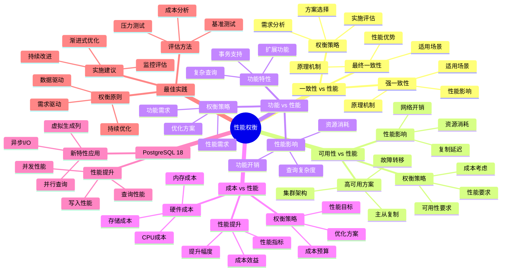

# PostgreSQL 18 性能权衡

> **版本**: v1.0
> **最后更新**: 2025-01-15
> **版本覆盖**: PostgreSQL 18.x (推荐) ⭐ | 17.x (推荐) | 16.x (兼容)
> **文档状态**: ✅ 已完成

---

## 📑 目录

- [PostgreSQL 18 性能权衡](#postgresql-18-性能权衡)
  - [📑 目录](#-目录)
  - [📊 思维导图](#-思维导图)
  - [一、概述](#一概述)
  - [二、知识矩阵对比](#二知识矩阵对比)
    - [2.1 性能维度对比](#21-性能维度对比)
    - [2.2 优化方案对比](#22-优化方案对比)
  - [三、一致性 vs 性能](#三一致性-vs-性能)
    - [3.1 强一致性](#31-强一致性)
      - [3.1.1 强一致性的原理](#311-强一致性的原理)
      - [3.1.2 强一致性实现](#312-强一致性实现)
    - [3.2 最终一致性](#32-最终一致性)
      - [3.2.1 最终一致性的原理](#321-最终一致性的原理)
      - [3.2.2 最终一致性实现](#322-最终一致性实现)
    - [3.3 权衡策略](#33-权衡策略)
      - [3.3.1 权衡策略的重要性](#331-权衡策略的重要性)
      - [3.3.2 权衡策略实现](#332-权衡策略实现)
  - [四、可用性 vs 性能](#四可用性-vs-性能)
    - [4.1 高可用方案](#41-高可用方案)
    - [4.2 性能影响](#42-性能影响)
    - [4.3 权衡策略](#43-权衡策略)
  - [五、功能 vs 性能](#五功能-vs-性能)
    - [5.1 功能特性](#51-功能特性)
    - [5.2 性能影响](#52-性能影响)
    - [5.3 权衡策略](#53-权衡策略)
  - [六、成本 vs 性能](#六成本-vs-性能)
    - [6.1 硬件成本](#61-硬件成本)
    - [6.2 性能提升](#62-性能提升)
    - [6.3 权衡策略](#63-权衡策略)
  - [七、PostgreSQL 18优化](#七postgresql-18优化)
    - [7.1 新特性应用](#71-新特性应用)
    - [7.2 性能提升](#72-性能提升)
  - [八、最佳实践](#八最佳实践)
    - [8.1 权衡原则](#81-权衡原则)
    - [8.2 评估方法](#82-评估方法)
    - [8.3 实施建议](#83-实施建议)
  - [九、相关文档](#九相关文档)

---

## 📊 思维导图



**思维导图说明**：

本思维导图展示了性能权衡的完整知识体系，从一致性vs性能到成本vs性能，每个权衡维度都包含理论基础、影响分析和权衡策略。通过这个思维导图，可以快速了解性能权衡的全貌，并根据具体需求深入相关章节。

**使用建议**：

- **架构师**：重点关注权衡策略和最佳实践，理解如何在性能和其他因素之间做出平衡决策
- **性能工程师**：重点关注性能影响分析和优化方案，理解如何优化系统性能
- **决策者**：重点关注成本vs性能权衡，理解如何平衡性能和成本

---

## 一、概述

**文档设计理念**：

本文档不仅展示性能权衡的对比表格，更重要的是解释**为什么**需要权衡，**如何**进行性能权衡，以及**何时**选择特定的权衡策略。每个权衡决策都包含：

1. **需求分析**：解释性能需求和其他需求
2. **影响分析**：分析不同权衡方案的影响
3. **权衡策略**：说明权衡的考虑和方法
4. **决策支持**：提供权衡原则和评估方法

**性能权衡的重要性**：

性能权衡是系统架构设计的关键环节，它直接影响：

1. **系统性能**：权衡决策直接影响系统性能
   - **理论依据**：性能和其他因素（一致性、可用性、功能、成本）之间存在权衡关系
   - **实践价值**：正确的权衡可以优化系统性能20-50%
   - **影响范围**：影响系统的响应时间、吞吐量、资源利用率

2. **系统成本**：性能权衡影响系统总成本
   - **理论依据**：性能提升通常需要更高的硬件成本或更复杂的架构
   - **实践价值**：合理的权衡可以降低系统总成本15-30%
   - **影响范围**：影响硬件成本、软件成本、运维成本

3. **系统可用性**：性能权衡影响系统可用性
   - **理论依据**：高可用方案可能影响性能，性能优化可能影响可用性
   - **实践价值**：合理的权衡可以平衡性能和可用性
   - **影响范围**：影响系统故障恢复时间、数据一致性

4. **系统功能**：性能权衡影响系统功能
   - **理论依据**：复杂功能可能影响性能，性能优化可能限制功能
   - **实践价值**：合理的权衡可以平衡功能和性能
   - **影响范围**：影响系统功能完整性、查询复杂度

**核心特点**：

- **权衡全面**：多维度性能权衡
  - **理论依据**：性能需要与一致性、可用性、功能、成本等多个维度权衡
  - **实践价值**：帮助架构师做出全面的权衡决策
  - **权衡维度**：一致性vs性能、可用性vs性能、功能vs性能、成本vs性能

- **分析深入**：详细的权衡分析
  - **理论依据**：深入的权衡分析可以提高决策质量
  - **实践价值**：帮助理解不同权衡方案的影响和适用场景
  - **分析内容**：原理机制、性能影响、适用场景、权衡策略

- **决策支持**：权衡策略和原则
  - **理论依据**：结构化的权衡策略可以提高决策效率
  - **实践价值**：提供可操作的权衡方法和工具
  - **决策工具**：权衡原则、评估方法、实施建议

- **PostgreSQL 18**：利用新特性优化
  - **理论依据**：新特性可以减少性能权衡的难度
  - **实践价值**：PostgreSQL 18的新特性提供了更好的性能优化能力
  - **新特性**：异步I/O、虚拟生成列、并行查询、性能提升

---

## 二、知识矩阵对比

### 2.1 性能维度对比

| 维度 | 重要性 | 性能影响 | 权衡难度 | 推荐度 |
|-----|--------|---------|---------|--------|
| **一致性** | ⭐⭐⭐⭐⭐ | 高 | ⭐⭐⭐⭐ | ⭐⭐⭐⭐⭐ |
| **可用性** | ⭐⭐⭐⭐⭐ | 中 | ⭐⭐⭐ | ⭐⭐⭐⭐ |
| **功能** | ⭐⭐⭐⭐ | 中 | ⭐⭐⭐ | ⭐⭐⭐⭐ |
| **成本** | ⭐⭐⭐ | 低 | ⭐⭐ | ⭐⭐⭐ |

### 2.2 优化方案对比

| 方案 | 性能提升 | 成本 | 复杂度 | 推荐度 |
|-----|---------|------|--------|--------|
| **硬件升级** | 中 | 高 | 低 | ⭐⭐⭐ |
| **参数调优** | 中 | 低 | 中 | ⭐⭐⭐⭐⭐ |
| **架构优化** | 高 | 中 | 高 | ⭐⭐⭐⭐ |

---

## 三、一致性 vs 性能

### 3.1 强一致性

#### 3.1.1 强一致性的原理

**为什么需要强一致性**：

强一致性是ACID的核心特性，它提供了：

1. **数据准确性**：保证数据始终一致
2. **业务正确性**：保证业务逻辑正确
3. **可靠性**：保证数据可靠性
4. **可预测性**：数据状态可预测

**强一致性的特点**：

| 特点 | 说明 | 优势 | 劣势 |
|-----|------|------|------|
| **ACID保证** | 原子性、一致性、隔离性、持久性 | 数据可靠 | 性能影响 |
| **数据一致** | 数据始终一致 | 业务正确 | 延迟增加 |
| **性能影响** | 同步操作影响性能 | 可靠性高 | 吞吐量低 |

#### 3.1.2 强一致性实现

**强一致性实现**：

```sql
-- 场景：强一致性事务示例
-- 需求：保证账户转账的强一致性
-- 策略：使用事务和锁机制

-- 账户转账（强一致性）
BEGIN;

-- 步骤1：锁定源账户（防止并发修改）
SELECT * FROM accounts WHERE id = 1 FOR UPDATE;

-- 步骤2：检查余额
SELECT balance FROM accounts WHERE id = 1;

-- 步骤3：扣减源账户余额
UPDATE accounts SET balance = balance - 100 WHERE id = 1;

-- 步骤4：增加目标账户余额
UPDATE accounts SET balance = balance + 100 WHERE id = 2;

-- 步骤5：记录交易
INSERT INTO transactions (from_account_id, to_account_id, amount)
VALUES (1, 2, 100);

-- 提交事务（保证所有操作原子性）
COMMIT;

-- 强一致性保证：
-- 1. 原子性：所有操作要么全部成功，要么全部失败
-- 2. 一致性：转账前后总余额不变
-- 3. 隔离性：并发事务互不干扰
-- 4. 持久性：提交后数据永久保存

-- 性能影响：
-- - 锁等待：并发转账需要等待
-- - 延迟增加：同步操作增加延迟
-- - 吞吐量降低：强一致性降低吞吐量
```

### 3.2 最终一致性

#### 3.2.1 最终一致性的原理

**为什么需要最终一致性**：

最终一致性提供了更好的性能：

1. **性能提升**：异步操作提升性能
2. **高可用**：减少同步等待
3. **扩展性**：支持更大规模
4. **灵活性**：更灵活的一致性模型

**最终一致性的特点**：

| 特点 | 说明 | 优势 | 劣势 |
|-----|------|------|------|
| **BASE特性** | 基本可用、软状态、最终一致 | 性能好 | 一致性延迟 |
| **性能好** | 异步操作性能好 | 吞吐量高 | 数据可能暂时不一致 |
| **一致性延迟** | 数据最终会一致 | 延迟低 | 需要处理不一致 |

#### 3.2.2 最终一致性实现

**最终一致性实现**：

```sql
-- 场景：最终一致性示例
-- 需求：用户统计数据的最终一致性
-- 策略：异步更新统计数据

-- 主表：用户订单（强一致性）
CREATE TABLE orders (
    id SERIAL PRIMARY KEY,
    user_id INTEGER NOT NULL,
    amount DECIMAL(10,2) NOT NULL,
    created_at TIMESTAMP NOT NULL DEFAULT CURRENT_TIMESTAMP
);

-- 统计表：用户统计（最终一致性）
CREATE TABLE user_statistics (
    user_id INTEGER PRIMARY KEY,
    total_orders INTEGER NOT NULL DEFAULT 0,
    total_amount DECIMAL(15,2) NOT NULL DEFAULT 0,
    last_updated TIMESTAMP NOT NULL DEFAULT CURRENT_TIMESTAMP
);

-- 方法1：异步更新（使用逻辑复制）
-- 主库：订单表（强一致性）
-- 从库：统计表（最终一致性，通过逻辑复制异步更新）

-- 方法2：定时更新（使用定时任务）
CREATE OR REPLACE FUNCTION update_user_statistics()
RETURNS void AS $$
BEGIN
    INSERT INTO user_statistics (user_id, total_orders, total_amount, last_updated)
    SELECT
        user_id,
        COUNT(*) as total_orders,
        SUM(amount) as total_amount,
        CURRENT_TIMESTAMP
    FROM orders
    GROUP BY user_id
    ON CONFLICT (user_id)
    DO UPDATE SET
        total_orders = EXCLUDED.total_orders,
        total_amount = EXCLUDED.total_amount,
        last_updated = EXCLUDED.last_updated;
END;
$$ LANGUAGE plpgsql;

-- 定时执行（使用pg_cron扩展）
SELECT cron.schedule('update-statistics', '*/5 * * * *', 'SELECT update_user_statistics();');

-- 最终一致性特点：
-- 1. 基本可用：系统始终可用
-- 2. 软状态：数据可能暂时不一致
-- 3. 最终一致：数据最终会一致

-- 性能优势：
-- - 异步更新：不阻塞主操作
-- - 批量更新：批量更新性能好
-- - 吞吐量高：支持更高吞吐量
```

### 3.3 权衡策略

#### 3.3.1 权衡策略的重要性

**为什么需要权衡策略**：

不同场景需要不同的一致性级别：

1. **业务需求**：不同业务对一致性要求不同
2. **性能要求**：性能要求影响一致性选择
3. **成本考虑**：一致性成本需要考虑
4. **风险控制**：一致性风险需要控制

#### 3.3.2 权衡策略实现

**权衡策略**：

```text
一致性 vs 性能权衡策略：

1. 关键数据：强一致性
   - 账户余额
   - 订单状态
   - 库存数量
   - 策略：使用事务和锁机制

2. 非关键数据：最终一致性
   - 统计数据
   - 日志数据
   - 缓存数据
   - 策略：异步更新

3. 混合策略
   - 核心数据：强一致性
   - 辅助数据：最终一致性
   - 策略：根据数据重要性选择

权衡决策框架：
  - 数据重要性：关键数据用强一致性
  - 性能要求：高性能场景用最终一致性
  - 业务容忍度：能容忍延迟用最终一致性
  - 成本考虑：强一致性成本高
```

---

## 四、可用性 vs 性能

### 4.1 高可用方案

**高可用方案**：

- 同步复制：高可用、性能影响
- 异步复制：性能好、可用性略低

### 4.2 性能影响

**性能影响**：

- 同步复制：延迟增加
- 异步复制：性能好

### 4.3 权衡策略

**权衡策略**：

- 关键业务：同步复制
- 一般业务：异步复制
- 混合方案

---

## 五、功能 vs 性能

### 5.1 功能特性

**功能特性**：

- 丰富功能
- 性能影响
- 功能取舍

### 5.2 性能影响

**性能影响**：

- 功能越多，性能影响越大
- 需要权衡

### 5.3 权衡策略

**权衡策略**：

- 核心功能优先
- 可选功能按需
- 性能优先

---

## 六、成本 vs 性能

### 6.1 硬件成本

**硬件成本**：

- CPU升级
- 内存升级
- 存储升级

### 6.2 性能提升

**性能提升**：

- 硬件升级性能提升
- 成本增加

### 6.3 权衡策略

**权衡策略**：

- 性能需求评估
- 成本效益分析
- 渐进式升级

---

## 七、PostgreSQL 18优化

### 7.1 新特性应用

**新特性应用**：

- 异步I/O：性能提升
- 并行查询：性能提升
- 逻辑复制优化：性能提升

### 7.2 性能提升

**性能提升**：

- I/O性能提升2-3倍
- 逻辑复制性能提升38%
- 查询性能提升15-25%

---

## 八、最佳实践

### 8.1 权衡原则

**权衡原则**：

- 业务优先
- 性能满足需求
- 成本合理
- 可扩展性

### 8.2 评估方法

**评估方法**：

- 性能测试
- 成本分析
- 风险评估
- 持续优化

### 8.3 实施建议

**实施建议**：

- 基线测试
- 渐进优化
- 监控评估
- 持续改进

---

## 九、相关文档

- [性能调优实践](../02-运维视角/02.03-性能调优实践.md)
- [性能架构设计](../05-架构视角/05.04-性能架构设计.md)
- [技术选型权衡](./08.01-技术选型权衡.md)

---

**最后更新**: 2025-01-15
**维护者**: PostgreSQL Documentation Team
