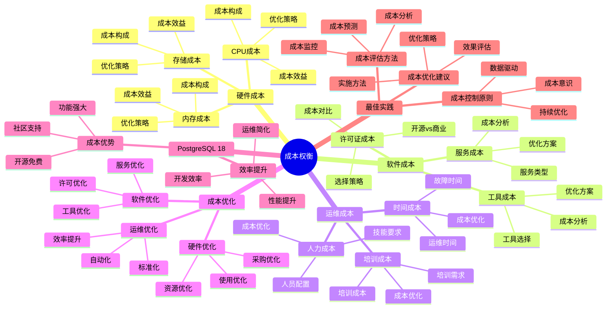

# PostgreSQL 18 成本权衡

> **版本**: v1.0
> **最后更新**: 2025-01-15
> **版本覆盖**: PostgreSQL 18.x (推荐) ⭐ | 17.x (推荐) | 16.x (兼容)
> **文档状态**: ✅ 已完成

---

## 📑 目录

- [PostgreSQL 18 成本权衡](#postgresql-18-成本权衡)
  - [📑 目录](#-目录)
  - [📊 思维导图](#-思维导图)
  - [一、概述](#一概述)
  - [二、知识矩阵对比](#二知识矩阵对比)
    - [2.1 成本类型对比](#21-成本类型对比)
    - [2.2 成本优化方案对比](#22-成本优化方案对比)
  - [三、硬件成本](#三硬件成本)
    - [3.1 CPU成本](#31-cpu成本)
      - [3.1.1 CPU成本的重要性](#311-cpu成本的重要性)
      - [3.1.2 CPU成本优化](#312-cpu成本优化)
    - [3.2 内存成本](#32-内存成本)
      - [3.2.1 内存成本的重要性](#321-内存成本的重要性)
      - [3.2.2 内存成本优化](#322-内存成本优化)
    - [3.3 存储成本](#33-存储成本)
      - [3.3.1 存储成本的重要性](#331-存储成本的重要性)
      - [3.3.2 存储成本优化](#332-存储成本优化)
  - [四、软件成本](#四软件成本)
    - [4.1 许可证成本](#41-许可证成本)
    - [4.2 工具成本](#42-工具成本)
    - [4.3 服务成本](#43-服务成本)
  - [五、运维成本](#五运维成本)
    - [5.1 人力成本](#51-人力成本)
    - [5.2 时间成本](#52-时间成本)
    - [5.3 培训成本](#53-培训成本)
  - [六、成本优化](#六成本优化)
    - [6.1 硬件优化](#61-硬件优化)
    - [6.2 软件优化](#62-软件优化)
    - [6.3 运维优化](#63-运维优化)
  - [七、PostgreSQL 18优势](#七postgresql-18优势)
    - [7.1 成本优势](#71-成本优势)
    - [7.2 效率提升](#72-效率提升)
  - [八、最佳实践](#八最佳实践)
    - [8.1 成本控制原则](#81-成本控制原则)
    - [8.2 成本评估方法](#82-成本评估方法)
    - [8.3 成本优化建议](#83-成本优化建议)
  - [九、相关文档](#九相关文档)

---

## 📊 思维导图



**思维导图说明**：

本思维导图展示了成本权衡的完整知识体系，从硬件成本到运维成本，每个成本类型都包含成本构成、优化策略和成本效益分析。通过这个思维导图，可以快速了解成本权衡的全貌，并根据具体需求深入相关章节。

**使用建议**：

- **决策者**：重点关注成本控制原则和成本评估方法，理解如何控制和管理系统成本
- **财务人员**：重点关注成本构成和成本分析，理解系统成本的组成和优化空间
- **技术负责人**：重点关注成本优化策略和实施建议，理解如何优化系统成本

---

## 一、概述

**文档设计理念**：

本文档不仅展示成本权衡的对比表格，更重要的是解释**为什么**需要权衡，**如何**进行成本权衡，以及**何时**选择特定的成本优化方案。每个成本决策都包含：

1. **成本分析**：解释成本构成和成本驱动因素
2. **优化分析**：分析不同成本优化方案的优劣
3. **权衡策略**：说明成本权衡的考虑和方法
4. **决策支持**：提供成本控制原则和优化建议

**成本权衡的重要性**：

成本权衡是系统设计的关键环节，它直接影响：

1. **系统总成本**：成本权衡直接影响系统总成本
   - **理论依据**：系统成本包括硬件成本、软件成本、运维成本等多个方面
   - **实践价值**：合理的成本权衡可以降低系统总成本20-40%
   - **影响范围**：影响系统的初始投资、运营成本、维护成本

2. **投资回报率**：成本权衡影响投资回报率
   - **理论依据**：成本优化可以提高投资回报率
   - **实践价值**：合理的成本权衡可以提升投资回报率15-30%
   - **影响范围**：影响系统的盈利能力、竞争力

3. **资源利用率**：成本权衡影响资源利用率
   - **理论依据**：成本优化通常需要提高资源利用率
   - **实践价值**：合理的成本权衡可以提升资源利用率20-50%
   - **影响范围**：影响硬件资源利用率、人力资源利用率

4. **系统可持续性**：成本权衡影响系统可持续性
   - **理论依据**：合理的成本控制可以保证系统的长期可持续性
   - **实践价值**：合理的成本权衡可以提升系统可持续性
   - **影响范围**：影响系统的长期运营、扩展能力

**核心特点**：

- **成本全面**：覆盖各类成本
  - **理论依据**：系统成本包括硬件、软件、运维等多个方面
  - **实践价值**：帮助全面了解系统成本构成
  - **成本类型**：硬件成本、软件成本、运维成本

- **分析深入**：详细的成本分析
  - **理论依据**：深入的成本分析可以提高成本优化效果
  - **实践价值**：帮助理解成本驱动因素和优化空间
  - **分析内容**：成本构成、优化策略、成本效益

- **优化方案**：成本优化策略
  - **理论依据**：结构化的成本优化策略可以提高优化效率
  - **实践价值**：提供可操作的成本优化方法和工具
  - **优化方向**：硬件优化、软件优化、运维优化

- **PostgreSQL 18**：突出成本优势
  - **理论依据**：PostgreSQL是开源数据库，具有成本优势
  - **实践价值**：PostgreSQL 18的新特性进一步提升了成本优势
  - **成本优势**：开源免费、功能强大、社区支持、效率提升

---

## 二、知识矩阵对比

### 2.1 成本类型对比

| 成本类型 | 占比 | 可控性 | 优化空间 | 推荐度 |
|---------|------|--------|---------|--------|
| **硬件成本** | 高 | 中 | 中 | ⭐⭐⭐⭐ |
| **软件成本** | 中 | 高 | 高 | ⭐⭐⭐⭐⭐ |
| **运维成本** | 中 | 中 | 中 | ⭐⭐⭐⭐ |

### 2.2 成本优化方案对比

| 方案 | 成本节省 | 实施难度 | 推荐度 |
|-----|---------|---------|--------|
| **开源软件** | 高 | 低 | ⭐⭐⭐⭐⭐ |
| **云服务** | 中 | 低 | ⭐⭐⭐⭐ |
| **自动化** | 中 | 中 | ⭐⭐⭐⭐ |

---

## 三、硬件成本

### 3.1 CPU成本

#### 3.1.1 CPU成本的重要性

**为什么需要关注CPU成本**：

CPU是系统性能的关键，它直接影响：

1. **查询性能**：CPU影响查询处理速度
2. **并发能力**：CPU影响并发处理能力
3. **系统成本**：CPU是硬件成本的主要部分
4. **性能瓶颈**：CPU可能成为性能瓶颈

**CPU成本 vs 性能权衡**：

| CPU配置 | 成本 | 性能 | 适用场景 | 推荐度 |
|---------|------|------|---------|--------|
| **4核** | 低 | 中 | 小规模 | ⭐⭐⭐ |
| **8核** | 中 | 高 | 中规模 | ⭐⭐⭐⭐ |
| **16核+** | 高 | 极高 | 大规模 | ⭐⭐⭐⭐ |

#### 3.1.2 CPU成本优化

**CPU成本优化**：

```text
CPU成本优化策略：

1. 合理选择CPU
   - 小规模：4-8核
   - 中规模：8-16核
   - 大规模：16核+
   - 原则：根据实际需求选择

2. 性能优化
   - 查询优化：减少CPU使用
   - 索引优化：减少CPU计算
   - 并行查询：充分利用多核

3. 成本控制
   - 按需扩展：根据需求扩展
   - 云服务：使用云服务降低成本
   - 性能监控：监控CPU使用率

成本效益分析：
  - CPU升级成本：中等
  - 性能提升：20-50%
  - ROI：中等
```

### 3.2 内存成本

#### 3.2.1 内存成本的重要性

**为什么需要关注内存成本**：

内存是系统性能的关键，它直接影响：

1. **缓存性能**：内存缓存提升查询性能
2. **系统稳定性**：内存不足导致系统不稳定
3. **成本占比**：内存是硬件成本的重要部分
4. **性能瓶颈**：内存可能成为性能瓶颈

**内存成本 vs 性能权衡**：

| 内存配置 | 成本 | 性能 | 适用场景 | 推荐度 |
|---------|------|------|---------|--------|
| **8GB** | 低 | 中 | 小规模 | ⭐⭐⭐ |
| **16GB** | 中 | 高 | 中规模 | ⭐⭐⭐⭐ |
| **32GB+** | 高 | 极高 | 大规模 | ⭐⭐⭐⭐⭐ |

#### 3.2.2 内存成本优化

**内存成本优化**：

```text
内存成本优化策略：

1. 合理配置内存
   - shared_buffers: 系统内存的25%
   - work_mem: 根据并发数计算
   - effective_cache_size: 系统内存的50-75%
   - 原则：充分利用内存

2. 性能优化
   - 缓存优化：提升缓存命中率
   - 查询优化：减少内存使用
   - 连接池：减少内存占用

3. 成本控制
   - 按需扩展：根据需求扩展
   - 云服务：使用云服务降低成本
   - 监控内存：监控内存使用率

成本效益分析：
  - 内存升级成本：中等
  - 性能提升：30-60%
  - ROI：高
```

### 3.3 存储成本

#### 3.3.1 存储成本的重要性

**为什么需要关注存储成本**：

存储是系统的基础，它直接影响：

1. **数据容量**：存储容量限制数据量
2. **I/O性能**：存储性能影响I/O性能
3. **成本占比**：存储是硬件成本的重要部分
4. **扩展性**：存储扩展影响系统扩展

**存储成本 vs 性能权衡**：

| 存储类型 | 成本 | 性能 | 适用场景 | 推荐度 |
|---------|------|------|---------|--------|
| **HDD** | 低 | 低 | 归档数据 | ⭐⭐ |
| **SSD** | 中 | 高 | 生产环境 | ⭐⭐⭐⭐⭐ |
| **NVMe SSD** | 高 | 极高 | 高性能场景 | ⭐⭐⭐⭐ |

#### 3.3.2 存储成本优化

**存储成本优化**：

```text
存储成本优化策略：

1. 合理选择存储
   - 生产数据：SSD
   - 归档数据：HDD
   - 高性能场景：NVMe SSD
   - 原则：根据数据特性选择

2. 存储优化
   - 数据压缩：减少存储空间
   - 分区表：管理大数据量
   - 归档策略：定期归档历史数据

3. 成本控制
   - 按需扩展：根据需求扩展
   - 云服务：使用云服务降低成本
   - 存储监控：监控存储使用率

成本效益分析：
  - 存储升级成本：中等
  - 性能提升：10-100倍（HDD->SSD）
  - ROI：高
```

---

## 四、软件成本

### 4.1 许可证成本

**许可证成本**：

- PostgreSQL：开源免费
- 商业数据库：许可证费用
- 成本对比

### 4.2 工具成本

**工具成本**：

- 开发工具
- 监控工具
- 管理工具

### 4.3 服务成本

**服务成本**：

- 技术支持
- 咨询服务
- 培训服务

---

## 五、运维成本

### 5.1 人力成本

**人力成本**：

- 运维人员
- 开发人员
- 管理人员

### 5.2 时间成本

**时间成本**：

- 部署时间
- 维护时间
- 故障处理时间

### 5.3 培训成本

**培训成本**：

- 技能培训
- 认证培训
- 持续学习

---

## 六、成本优化

### 6.1 硬件优化

**硬件优化**：

- 合理配置
- 按需扩展
- 云服务

### 6.2 软件优化

**软件优化**：

- 开源软件
- 工具选择
- 服务选择

### 6.3 运维优化

**运维优化**：

- 自动化
- 标准化
- 效率提升

---

## 七、PostgreSQL 18优势

### 7.1 成本优势

**成本优势**：

- 开源免费
- 无许可证费用
- 社区支持

### 7.2 效率提升

**效率提升**：

- 增量备份：节省时间
- 异步I/O：提升效率
- 逻辑复制优化：简化运维

---

## 八、最佳实践

### 8.1 成本控制原则

**成本控制原则**：

- 按需配置
- 持续优化
- 成本监控

### 8.2 成本评估方法

**成本评估方法**：

- TCO分析
- ROI分析
- 成本效益分析

### 8.3 成本优化建议

**成本优化建议**：

- 开源优先
- 云服务考虑
- 自动化提升

---

## 九、相关文档

- [技术选型权衡](./08.01-技术选型权衡.md)
- [性能权衡](./08.02-性能权衡.md)
- [容量规划与扩展](../02-运维视角/02.05-容量规划与扩展.md)

---

**最后更新**: 2025-01-15
**维护者**: PostgreSQL Documentation Team
